# Web Agent Workspace Architecture Authorization Review

**Document status:** `PROPOSED / IMPLEMENTATION NOT AUTHORIZED`
**Scope:** supplemental architecture and security contract only
**Repository:** `ForceMind/agentbox`
**Baseline:** `main` at `28924e823c379df36aaabca29726514cee54fe34`
**Branch:** `codex/web-agent-workspace-architecture`
**Review posture:** this document is a proposal for a future implementation review. It is not an Accepted ADR, does not amend an Accepted ADR, and does not authorize code, dependency, migration, service, or route changes.

## Final Decision

**PROPOSED / IMPLEMENTATION NOT AUTHORIZED**

The proposal is internally complete enough to request Owner Architecture/Security Review. Every security-sensitive behavior below is a closed proposed contract, with a test and an implementation gate. No implementation may begin until an Owner gives a separate, explicit authorization for an implementation Slice. `Slice 3.2b` remains unauthorized. The proposed interpretation of the existing Secret boundary for unclassified terminal transport is itself a hard Owner decision: if the Owner reads the existing rule as prohibiting any possible Secret-bearing byte from crossing the API process, this document must be changed to `BLOCKED` before implementation planning proceeds; no silent exception or plaintext fallback is allowed.

## Product Goal

After authenticating to AgentBox, an administrator can choose a formal `READY` Project and use either Claude Code or Codex CLI in a browser terminal. The terminal is a view and input surface for one exact, Runtime-owned, managed agent process. It is not a shell endpoint, a provider login page, a secret broker, or a general process manager.

The acceptance path is:

1. Sign in to AgentBox.
2. Open a formal `READY` Project.
3. Choose `Claude` or `Codex`.
4. Select `Start workspace` or `Connect workspace`.
5. Observe a real interactive terminal in the browser.
6. Type text and terminal control keys, paste bounded text, and resize the terminal.
7. See live output and a bounded reconnectable history.
8. Refresh or briefly lose the network and reconnect the same managed session.
9. Detach the browser without stopping the agent, or explicitly stop that exact managed session.

The following are product acceptance criteria for a future implementation. They are not claims about the current repository:

| ID | User-visible acceptance | Safety condition |
| --- | --- | --- |
| UX-01 | A Project selector shows only formal `READY` Projects. | Browser sends a Project ID, never a path. |
| UX-02 | Claude and Codex are distinct choices. | `AgentType` is a closed enum. |
| UX-03 | Start creates at most one managed workspace for a `(Project, AgentType)` pair. | Duplicate starts converge on one identity. |
| UX-04 | Connect shows the existing managed session, not an unmanaged tmux process. | Name and marker are checked by Runtime. |
| UX-05 | Text, Enter, arrows, Tab, Esc and Ctrl combinations work. | Bytes go only to the fixed agent PTY. |
| UX-06 | Output is streamed without a transcript endpoint. | Bounded volatile buffers; no persistence. |
| UX-07 | Resize works within server limits. | The server accepts only dimensions 8–240 columns by 1–200 rows; out-of-range values are rejected, never silently clamped. |
| UX-08 | Browser refresh and short network loss can reconnect. | A new scoped ticket and writer lease are required. |
| UX-09 | Closing a tab does not kill the managed process. | Attachment lifetime is separate from workspace lifetime. |
| UX-10 | `Detach` and `Stop` have visibly different effects. | Stop is an explicit, CSRF-protected lifecycle action. |
| UX-11 | Stop never deletes the Project or discards Git changes. | Project/Git fencing is enforced in Runtime and Control Plane. |
| UX-12 | Login or Workspace Trust requirements are shown as a blocked state. | No browser provider login and no automatic Trust acceptance. |
| UX-13 | A missing or exited process is shown as missing/exited. | The UI never infers liveness from a database row alone. |
| UX-14 | A second desktop or mobile writer receives a clear conflict. | One active writer lease is enforced server-side. |
| UX-15 | Mobile browsers can connect, view, input, reconnect, and stop. | Mobile keyboard and background suspension are tested. |
| UX-16 | The UI is Simplified Chinese by default. | Protocol fields and technical IDs remain English. |

## Current Repository Reality

The following inventory was read from the baseline listed above. It records current behavior and intentionally separates it from the proposed design.

### Control Plane and authentication

* `apps/api/src/agentbox_api/main.py` exposes FastAPI HTTP routes for auth, Projects, Claude, Codex, Jobs, and diagnostics. There is no WebSocket route. Its static frontend catch-all is registered after the current routers; a future WAW WebSocket route must be registered before that catch-all and match only the exact `scope['type'] == 'websocket'` path, with an explicit route-order test.
* `apps/api/src/agentbox_api/auth.py` uses the HttpOnly `agentbox_session` cookie, `SameSite=Strict`, production `Secure`, exact allowlisted `Origin` and `Host`, CSRF checks on mutations, and an authentication epoch. Current checks apply to HTTP requests; a future WebSocket scope must implement its own admission checks.
* `apps/api/src/agentbox_api/middleware.py` applies `Cache-Control: no-store` to API responses, request/body limits and security headers, and logs method/path/request completion rather than payloads. It bypasses non-HTTP ASGI scopes, so its current body limits, security headers, request IDs, and no-store wrapper must not be assumed to protect a future WebSocket; WAW needs a separate upgrade/ASGI admission gate and payload-free logging test.
* The API and Worker run as non-root `agentbox` identities and do not read the Runtime HOME, provider secret material, or arbitrary Project files. The API does not spawn Claude, Codex, tmux, or shell processes.

These facts implement the currently accepted SSE-first/frontend and privilege-separation decisions in `docs/adr/0006-frontend-stack.md`, `docs/adr/0002-privilege-separation.md`, and the Phase 11 supplemental ADRs. This file is a supplemental proposal for the deferred browser-terminal capability; it does not rewrite those decisions or mark a new ADR accepted.

### Existing Claude behavior

* `ClaudeSessionManager` is a Phase 6, Project-scoped Runtime-user tmux session.
* Its deterministic name is `agentbox-claude-{slug}-{sha256-prefix}` and its marker is versioned. The current managed command is `claude remote-control` in a detached tmux pane.
* The API can start, stop, inspect status, and request bounded recent output. The Runtime capture is limited to 200 lines and a 48 KiB subprocess read, then `sanitize_pane_output` removes ANSI/OSC/C0 controls and returns at most 24 KiB; the API returns it with `Cache-Control: no-store` and audits only the metadata action `claude_output_viewed`. It can display a local `tmux attach-session` command, but it does not provide browser input, PTY attachment, streaming, cursors, or reconnect. This legacy output endpoint is not a WAW transcript or reconnect source and remains a separate management capability.
* Trust preparation uses a fixed `claude --` invocation for a human local action and never automatically accepts Workspace Trust. Runtime restart can inspect a marked session, but in-memory initialization state is not a durable Web Workspace model.

### Existing Codex behavior

* `CodexManager` supports fixed `codex remote-control start`, `stop`, and `pair` operations plus public status probes.
* There is no Project-scoped Codex workspace, tmux session, interactive stdin, PTY, browser attachment, resize, or reconnect model. The current Codex Remote Control start action carries no Project identity, and the Runtime inspector only sees a host/user-level `codex remote-control start` process; it cannot prove same-Project ownership.
* Authentication evidence is public-command based and tri-state. Private Codex authentication/configuration files are not read.

### Runtime protocol and process substrate

* `/run/agentbox/runtime.sock` implements `RUNTIME_PROTOCOL_VERSION=1`, newline-delimited one-request/one-response JSON, a 64 KiB frame limit, request ID validation, and `SO_PEERCRED` UID/GID admission. Its legacy parser/action path is not the WAW RFC 8259 parser contract: JSON-extension inputs such as `NaN`/`Infinity` or unpaired surrogates must not be assumed to be rejected by legacy code. WAW control and ABWS parsers therefore have independent duplicate-key, UTF-8, RFC 8259, and trailing-byte gates.
* The v1 action set is closed and typed. It has no streaming frames, persistent connection, PTY, heartbeat, backpressure, cursor, or attachment ticket.
* `ControlledProcessRunner` uses `create_subprocess_exec` with no shell, an environment allowlist, executable identity checks, bounded input/output, and timeouts. It is not a terminal session supervisor.
* The existing tmux adapter checks exact names and markers, bounds capture to 200 lines/48 KiB before sanitizing, and kills only an exact marked session. It does not provide a browser-safe attach client.
* The current adapter does not pass `-S` or set `TMUX_TMPDIR`; its per-user tmux socket is subject to the Runtime service's private temporary namespace. The proposed WAW socket is therefore a new, explicit contract and is not implied by the current local attach command.

### Projects and Git

* A formal Project has an opaque `prj_*` ID and immutable server-side `relative_path`. Runtime canonicalizes the path beneath the configured Project root (production default `/srv/agentbox/projects`; development default `.agentbox-dev/projects`), rejects traversal and symlinks, and checks owner and mode.
* Git operations use fixed Runtime commands and currently fence some operations while an active legacy Claude session is running. There is no generic Web Workspace fencing contract.
* The legacy Claude recent-output endpoint is a Phase 6 management surface only and accepts only the legacy Project/session identity. An `aws_*` WAW ID is rejected there; WAW never routes through legacy capture as a transcript or reconnect endpoint.
* Some current read/reconcile routes materialize formal Project rows from legacy Runtime workspace keys. That legacy reconciliation is not WAW authority: a future WAW start must use an explicit authenticated Project Binding registration and may not adopt a row created from an unmanaged or legacy session.

### Web and deployment

* `apps/web/package.json` currently contains React/React DOM, React Router, and `lucide-react` (with Vite/Tailwind tooling); it has no `xterm`, `@xterm/*`, terminal emulator, or WAW WebSocket client dependency. It has `/codex`, `/claude`, `/projects`, and Project detail pages, but no `/workspace`.
* Browser state and terminal transcripts are not stored in `localStorage`, `sessionStorage`, or IndexedDB. Existing API data is no-store; current E2E uses a Fake Runtime with explicit screenshot/trace disablement (video and HAR are not configured and therefore remain default-off), and has no WAW terminal data. The future WAW gate explicitly disables screenshots, video, traces, HAR/network dumps, and console payload capture.
* The current `agentbox-api.service` is `User=agentbox`, `Group=agentbox`, with supplementary `agentbox-runtime-ipc`, `PrivateTmp=true`, `PrivateDevices=true`, `ProtectSystem=strict`, `ProtectHome=true`, `ProtectClock=true`, `ProtectHostname=true`, `ProtectKernelTunables/Modules/Logs=true`, `ProtectControlGroups=true`, `ProtectProc=invisible`, `ProcSubset=pid`, `RemoveIPC=true`, `RestrictNamespaces=true`, `RestrictRealtime=true`, `RestrictSUIDSGID=true`, `LockPersonality=true`, `MemoryDenyWriteExecute=true`, `SystemCallArchitectures=native`, `SystemCallFilter=@system-service` with `SystemCallErrorNumber=EPERM`, `RestrictAddressFamilies=AF_UNIX AF_INET AF_INET6`, `IPAddressDeny=any`, `IPAddressAllow=localhost`, and `ReadWritePaths=/var/lib/agentbox /var/log/agentbox`. The current `agentbox-worker.service` uses the same UID/GID and legacy supplementary group, the same hardening profile, `PrivateNetwork=true`, `PrivateTmp=true`, and AF_UNIX-only networking. Neither is a WAW authority identity.
* The current `agentbox-runtime.service` is `User=agentbox-runtime`, `Group=agentbox-runtime`, supplementary `agentbox-runtime-ipc`, `NoNewPrivileges=true`, empty `CapabilityBoundingSet`/`AmbientCapabilities`, `PrivateTmp=true`, `PrivateDevices=true`, `ProtectSystem=strict`, `ProtectHome=read-only`, `ProtectClock=true`, `ProtectHostname=true`, `ProtectKernelTunables/Modules/Logs=true`, `ProtectControlGroups=true`, `ProtectProc=invisible` (with no `ProcSubset` setting), `RemoveIPC=true`, `RestrictRealtime=true`, `RestrictSUIDSGID=true`, `LockPersonality=true`, `MemoryDenyWriteExecute=true`, `SystemCallArchitectures=native`, `KillMode=process`, AF_UNIX/AF_INET/AF_INET6 address families, and `ReadWritePaths=/run/agentbox /srv/agentbox/projects /home/agentbox-runtime`; unlike API/Worker it currently has no `SystemCallFilter`. The current runtime environment also puts `/home/agentbox-runtime/.local/bin` first in `PATH`, so it is not an eligible WAW executable path until a root-owned immutable manifest/path is installed. `/run/agentbox` is provisioned by tmpfiles as `root:agentbox-runtime-ipc`, mode `3770`; the legacy runtime socket is `0660` and one-shot. `PrivateDevices=true` means `/dev/ptmx`/devpts and PTY syscalls are not assumed available. No service currently declares a WAW control or streaming socket, WAW GID, or WebSocket route; the socket topology below is future architecture, not current behavior. A future PTY implementation must prove `PrivateDevices`/devpts, the exact `openpty`/`fork`/`setsid`/`ioctl(TIOCSCTTY)` primitive selected below, `ioctl(TIOCSWINSZ)`, `pidfd_open`, `openat2`, `prctl(PDEATHSIG)`, process-group operations, and any syscall/profile changes on the supported host matrix; failure is `BLOCKED`, not an implicit relaxation of the current unit.

### Current evidence limits

Current tests prove fixed command construction, path safety, marker checking, HTTP auth/CSRF, bounded output, and one-shot RPC behavior. They do not prove an interactive terminal, WebSocket admission, a streaming protocol, ticket replay resistance, writer leases, reconnect semantics, VT parser policy, or mobile behavior. The legacy response decoders are not WAW parsers: the future WAW control implementation must enforce exact response envelopes, trailing-byte rejection, and closed fields independently rather than assuming every legacy client path does so. Capability names such as `codex.active_writer.observe` are currently reported as unknown/public-contract-unqualified and must not be presented as implemented WAW support.

## Existing Claude/Codex Distinctions

The following concepts remain separate in the proposed architecture:

| Concept | Current or proposed meaning | May be reused as WAW identity? |
| --- | --- | --- |
| Existing Codex Remote Control | A fixed Runtime action/daemon (`codex remote-control start/stop/pair`). | No. It remains a sibling capability. |
| Existing Claude Remote session | Phase 6 marked tmux session running `claude remote-control`, with local TTY attach instructions. | No automatic adoption or migration. |
| Web Agent Workspace | New interactive `claude` or `codex` CLI process in a WAW-managed tmux/PTY substrate. | Yes, only through the new typed model. |
| Browser attachment | A short-lived authenticated connection and one writer lease. | Never the process identity. |
| Project | Formal `prj_*` metadata and immutable relative path. | The only source of workspace cwd. |
| Existing `RuntimeInstallation` | Provider-domain, per-runtime-type installation metadata used by the current Provider Manager. | Never a WAW identity, executable selector, or user-supplied path. |
| `RuntimeHostInstallation` | Proposed WAW-only host/runtime attestation with one identity for the Runtime host. | Never a Provider credential or Provider Manager row. |
| Control Plane Session | Authenticated administrator session with an `auth_epoch`. | Binds tickets and leases. |
| Official CLI authentication | Login state owned by Unix user `agentbox-runtime`. | Readiness is checked publicly, never copied/read. |
| Provider Binding | Phase 11 provider selection metadata. | Not coupled to terminal transport. |
| Provider Secret | Runtime-only secret authority. | Never an API/browser input or WAW field. |

Remote Control is not interactive Workspace. Pairing is not login. A browser attachment is not a provider credential. A running tmux pane is not proof that a browser is connected. The coexistence decision is explicit: legacy Claude and Codex Remote remain entirely independent, are never reused or migrated into WAW, and may coexist with WAW only when their closed conflict predicates are terminal/positively absent and the shared lifecycle fence permits it; an active or uncertain predicate blocks the relevant WAW scope as specified below.

## Non-Negotiable Boundaries

The existing privilege separation remains unchanged:

* Control Plane decides; Runtime executes; Root Helper performs only existing fixed privileged lifecycle actions.
* Browser, API, and Worker are non-root and never access Runtime HOME, Provider Secret stores/records, ciphertext/plaintext credential material, key-encryption material, or arbitrary Project files. The browser may display accidental Secret text that arrives as opaque `WorkspaceTerminalData`; API/Worker may relay only that unclassified bounded byte stream under the explicit A+C Owner gate and never treat it as a Provider Secret or credential route.
* Runtime is non-root, owns its HOME, official CLI login state, managed tmux/PTY processes, and the only Provider Secret authority.
* Root Helper is not in the Web Workspace path and gains no terminal, shell, filesystem, tmux, signal, or secret capability.
* There is no Browser → arbitrary command → Linux route. No caller supplies a path, executable, argv, environment, PID, signal, tmux target, file descriptor, or Unix socket destination.
* There is no intentional Web/API → plaintext `SecretMaterial` ingestion, credential-broker, or Provider Manager route. An accidental byte sequence typed into the fixed managed CLI remains opaque `WorkspaceTerminalData` and is an explicit residual of the A+C decision; it is not accepted as a credential field, Provider operation, or API custody. If that residual is outside the Owner's reading of the permanent Secret boundary, the proposal is `BLOCKED` and no implementation starts.
* Claude private authentication/config/trust files are never opened, copied, exported, or changed by Web/API/Worker or WAW code, and Workspace Trust is never auto-accepted. The manifest-selected official Claude CLI may read or update its own vendor state under the `agentbox-runtime` identity as part of its documented operation; that vendor behavior is not AgentBox custody and is independently gated below. If the prohibition is intended to include the official CLI itself, WAW is `BLOCKED` pending a supplemental product decision because the interactive CLI cannot run.

## Terminology

* **AgentType:** closed enum `claude | codex`; it is the only caller-visible tool choice.
* **WAW RuntimeType:** singleton enum `agentbox-runtime-linux-v1`; it identifies the Runtime execution authority and is never caller-selected. It is intentionally distinct from the existing provider adapter `RuntimeType={claude,codex}` and from `AgentType`.
* **AgentWorkspaceSession:** durable metadata identity for one managed interactive agent process.
* **Managed agent process:** the fixed, fingerprinted CLI launched by Runtime for one WAW row.
* **Runtime session:** the exact dedicated tmux session and pane holding that process.
* **BrowserAttachment:** a connection lease, separate from the durable workspace.
* **Writer:** the sole V1 attachment permitted to send input.
* **Ticket:** a single-use, short-lived bearer admission value, never persisted in plaintext.
* **Cursor:** a Runtime output sequence number, not a claim of exactly-once input.
* **Detach:** release the browser lease and leave the managed process running.
* **Stop:** an explicit typed lifecycle operation that terminates one exact managed workspace.
* **Official login:** authentication performed by the vendor CLI under `agentbox-runtime`; it is not AgentBox login.
* **Workspace Trust:** an agent CLI prompt requiring a local, explicit operator decision; it is not authentication.

## User Experience Contract

The browser flow is Project → AgentType → Start/Connect → Terminal. A Project that is `creating`, `error`, or `archived` cannot start or attach. The UI displays a distinct state for `checking`, `starting`, `connecting`, `connected`, `reconnecting`, `login_required`, `trust_required`, `exited`, `missing`, `collision`, `stopped`, `gap`, `input_uncertain`, and `unavailable`.

The UI must:

* require an explicit click for Start, Connect, Detach, and Stop;
* explain that Detach leaves the agent alive and Stop terminates only that exact managed agent;
* confirm that Stop does not delete the Project or discard Git changes;
* show a bounded output-gap notice rather than silently claiming complete history;
* show `login_required` and the exact local Unix identity needed for official login;
* show `trust_required` and disable automated acceptance;
* warn that terminal content may contain source, model output, prompts, or accidentally pasted sensitive data;
* state that input acknowledgement means delivery to the PTY, not consumption by the agent;
* never label Remote Control as an interactive Workspace or imply Provider configuration;
* offer no transcript download or recovery view.

## Domain Model

The proposal introduces an independent `AgentWorkspaceSession`; it does not alter current models in this documentation PR. A future migration requires a separately authorized implementation PR.

### `AgentWorkspaceSession` (future durable metadata)

Proposed fields are:

| Field | Contract |
| --- | --- |
| `id` | `aws_` followed by the first 32 lowercase hexadecimal characters of `SHA-256("agentbox-waw-v1" + NUL byte + project_id + NUL byte + agent_type)`; immutable and deterministic from Project ID and AgentType. |
| `project_id` | Exact formal `prj_*` foreign key. |
| `authorization_scope` | Server-derived bounded Project ownership/ACL scope; never supplied by the browser and never used as a filesystem path. In the current single-admin deployment it is the explicit single-admin scope. |
| `runtime_host_installation_id` | Exact `wri_[a-f0-9]{32}` WAW host identity, bound to the workspace and never caller-selected. It is deliberately distinct from existing Provider-domain `RuntimeInstallation` IDs. |
| `runtime_host_installation_revision` | Positive installation revision; a changed host/runtime invalidates old attachment capabilities and cursors. |
| `runtime_type` | Exact `agentbox-runtime-linux-v1`; no other Runtime type is accepted in WAW V1. |
| `agent_type` | Closed enum `claude` or `codex`. |
| `state` | Closed enum `STARTING`, `RUNNING`, `NEEDS_INTERACTION`, `TRUST_REQUIRED`, `LOGIN_REQUIRED`, `STOPPING`, `EXITED`, `STOPPED`, `MISSING`, `COLLISION`, `BROKEN`, or `UNKNOWN`; unknown values fail closed. |
| `runtime_session_name` | `agentbox-waw-{agent}-{sha256(project_id)[:16]}`; lower-case ASCII, `agent` is `claude` or `codex`, total length ≤80, never user input. |
| `runtime_marker` | `waw-v1:{runtime_host_installation_id}:{sha256("agentbox-waw-v1" + NUL byte + runtime_host_installation_id + NUL byte + runtime_host_installation_revision + NUL byte + project_id + NUL byte + agent_type + NUL byte + workspace_id + NUL byte + generation + NUL byte + binding_revision + NUL byte + binding_digest)[:32]}`; no secret, and an old installation, binding, or generation cannot satisfy a new marker check. |
| `executable_fingerprint` | Digest of Runtime-observed executable identity plus public installation/version ID; absolute path and inode details remain Runtime-volatile and are never stored in Control Plane metadata. |
| `generation` | Monotonic, non-zero fencing integer with an explicit allocation rule: the first durable workspace spawn allocates generation `1`; each later new process spawn (after `EXIT → START`, an authorized reconciliation/recovery, or a host-installation revision change) atomically allocates exactly `current+1` **once before** the spawn and consumes that value even if the spawn fails. There is no post-spawn increment, retry reuse, wrap, rollback, or reset. A Runtime restart does not allocate a generation by itself: the old row becomes `UNKNOWN`, all old leases/cursors are fenced, and any safe Stop/reconciliation request must carry the old exact generation and a separately verified durable attestation before a new generation can be allocated. |
| `created_at`, `updated_at`, `last_seen_at` | UTC timestamps. |
| `exit_code`, `failure_code` | Bounded normalized metadata only. |
| `reconciliation_state` | `authoritative`, `stopping`, `missing`, `collision`, `exited`, `reconciliation_required`, or `unknown`. |

Stop intent is stored in a separate generation-keyed durable `WorkspaceStopOperation` relation, not only in mutable columns on the workspace row. Its exact fields are `stop_operation_id` (`wso_` plus 32 lowercase hex), `workspace_id`, `project_id`, `agent_type`, `stop_requested_generation`, `binding_revision`, `binding_digest` (64 lowercase hex), `runtime_host_installation_id`, `runtime_host_installation_revision`, `created_at`, `updated_at`, `stop_result` (`PENDING`, `STOPPED`, `RECONCILIATION_REQUIRED`, or `TIMEOUT`), and a bounded normalized failure code.

It contains no terminal input/output, transcript, clipboard, ticket, password, token, provider secret, environment dump, cwd string supplied by a browser, or raw exception.

The durable row has a database uniqueness constraint on `(project_id, agent_type)`, foreign keys to the formal Project and the non-secret **WAW-only** `RuntimeHostInstallation` identity, and an immutable `authorization_scope` snapshot. It has no foreign key to the existing Provider-domain `runtime_installations` table. A row cannot be created for an archived/non-`READY` Project, and deleting or changing either parent is fenced while the workspace is not terminal. No Provider Binding or Provider Secret foreign key is allowed on this model. A future migration must define the host identity and its Project/AgentType-independent lifecycle explicitly; it may not overload a Provider row.

All deterministic formulas use NFC-validated UTF-8 component bytes, literal NUL separators, the exact lowercase AgentType spelling, and unsigned decimal revisions without leading zeroes. SHA-256 output is lowercase hexadecimal before truncation. These encoding rules are part of the identity contract and have fixed test vectors; no locale or filesystem display name participates.

### Runtime host installation identity

`RuntimeHostInstallation` is a new WAW-only, non-secret host identity. Its ID is `wri_` followed by 32 lowercase hexadecimal characters representing a 128-bit CSPRNG value. It is not the existing provider-domain `RuntimeInstallation` row, is not keyed by AgentType, and is not a `ProviderBinding` or Provider Secret reference. A single host identity therefore binds both Claude and Codex WAW rows without coupling them to Provider Manager state. The proposed durable WAW identity is stored in a root-owned, read-only installation manifest at `/var/lib/agentbox-waw/runtime-host-installation.json` (`root:agentbox-runtime`, mode `0440`); the parent directory is `root:agentbox-runtime`, mode `0750`, and API/Worker have neither that group nor a traversal grant. Thus Runtime can read the file through DAC while API/Worker cannot open or traverse it; the implementation must test access as each service identity rather than infer it from the file mode alone. The manifest contains the WAW host ID, a positive monotonic revision, the immutable binary/template digests, and no credentials. Runtime reads the manifest through a no-follow file descriptor, verifies parent/device/inode, owner, mode, immutable digest, and a second identical `fstat` before using any field; replacement or symlink races fail closed. A future implementation must create/validate a dedicated `RuntimeHostInstallation` model or an equivalently isolated non-Provider table and foreign key; reusing the existing per-AgentType `runtime_installations` table is prohibited.

`runtime_host_installation_revision` is a positive, non-wrapping value in that manifest. It starts at `1` and is advanced atomically for an executable/template/service-boundary change; overflow fails closed. A Runtime restart preserves both host ID/revision values, but a reinstall, host identity replacement, or other policy-defined trust-root change creates a new host ID. Any revision/ID rotation first fences new Start, tickets, and input, requires a controlled Runtime stop/restart that will choose a new `runtime_epoch`, clears volatile output rings/cursors, closes attachments, and has the Control Plane mark existing rows `UNKNOWN` in one WAW-host transaction; it never silently lets an old-generation process continue under the new identity. Runtime reads the manifest and returns the values in a typed attestation; the API never invents, accepts, or lets a browser select them. Missing, malformed, writable, or stale manifest data blocks Start and Attach with `RUNTIME_INSTALLATION_UNTRUSTED`. Old tmux sessions whose marker contains a different host identity are `COLLISION`/`UNKNOWN` and are never adopted. Upgrade/rollback tests must prove that no old attachment, cursor, or generation is admitted across a revision change.

`runtime_epoch` has one unambiguous lifecycle. Runtime allocates it from the Runtime-only `/var/lib/agentbox-waw/runtime-epoch-v1/epoch.json` counter at process start, atomically consumes the next positive `uint64` value with `fsync(file)`/`fsync(directory)`, and holds that value immutable for the entire process lifetime. The first bootstrap value is `1`; a missing, malformed, rolled-back, or exhausted counter is a terminal `RUNTIME_INSTALLATION_UNTRUSTED`/`SEQUENCE_EXHAUSTED` startup failure (a new host enrollment may initialize `1` only while the root installer has fenced all WAW rows). The counter is never wall-clock based, randomly repeated, reset, or changed in-process. A trust-root rotation or output-cursor exhaustion therefore requires a controlled, operator-authorized Runtime stop/restart; it does not rotate an epoch inside a live process or trigger a browser-visible automatic restart. The host manifest pins the `/var/lib/agentbox-waw/runtime-epoch-v1/` directory identity, owner/mode, and schema (the mutable `epoch.json` may be atomically replaced only inside that directory), while API stores the last bound epoch in its WAW host row. If a new bind comes from a new Runtime service pid/epoch, API atomically fences tickets, leases, input, and every non-terminal workspace row to `UNKNOWN`, marks host readiness degraded, and closes old streams before accepting the new epoch; it then completes the full binding registration. Until each affected workspace has an explicitly authorized durable-provenance reconciliation and a valid new-generation gate, only read-only `status`/`reconcile` are allowed—no Start, attachment ticket, Attach, redraw, or GAP. A bind from a new Runtime service that reuses an epoch at or below the API's last bound value, arrives while the previous Runtime peer is live, or cannot complete that transaction is rejected and leaves the prior trusted row unchanged. A new API authority process with the same proven Runtime peer and unchanged `runtime_epoch` is allowed to bind after the API singleton lock transfers; it fences only old API tickets/leases, not the already-running workspace rows. Runtime may report volatile state, but only the Control Plane writes durable `AgentWorkspaceSession` state. This restart/epoch transaction is required for API restarts, Runtime restarts, service-unit restarts, host reboot, trust-root rotation, and sequence exhaustion, and is covered by a crash/restart barrier test.

The host manifest and the project-root manifest are separate, cross-pinned trust records. The exact installation inventory is:

| Object | Required owner/mode and contents | Replacement/verification rule |
| --- | --- | --- |
| `/usr/share/agentbox/waw/` | `root:root`, mode `0755`, every ancestor root-owned and non-writable by Runtime/API; no symlink or mount substitution. | Installer validates the complete ancestor chain and mount identity before every host revision activation. |
| `/usr/share/agentbox/waw/project-root.v1` | `root:root`, mode `0444`, regular file, immutable digest. Its canonical JSON has exactly `schema_version="waw-project-root-v1"`, `manifest_revision`, the fixed absolute configured root (`/srv/agentbox/projects` in production or the separately installed development root), `root_device`, `root_mount_id`, `root_filesystem_id`, `root_uid`, `root_gid`, `root_mode`, the one-component `relative_key` grammar version, `binding_digest_algorithm="sha256-rfc8785"`, and the absolute root-owned `/bin/false` identity used by the tmux no-shell default. It contains no credentials, Project names, or terminal data. | The host manifest stores the SHA-256 of the whole canonical file. Runtime and bridge open an identity descriptor with `O_PATH + O_NOFOLLOW + O_CLOEXEC` and a separate content descriptor with `O_RDONLY + O_NOFOLLOW + O_CLOEXEC`; they compare `fstat` device/inode/owner/mode/type on both descriptors, read and digest only the content descriptor, then repeat both `fstat` checks before use. |
| `/usr/share/agentbox/waw/cgroup-delegation.v1` | `root:root`, mode `0444`, regular immutable non-secret policy file. Its canonical JSON has exactly `schema_version="waw-cgroup-delegation-v1"`, `service_unit="agentbox-runtime.service"`, `cgroup_mount_type="cgroup2"`, the qualified cgroup-v2 mount device/filesystem/schema identity, `delegate=true`, `delegate_subgroup="agentbox-runtime-supervisor"`, `protect_control_groups="private"`, `kill_mode="process"`, controller set `{cpu,memory,pids}`, `tasks_max=256`, `memory_max=536870912`, `memory_swap_max=0`, `cpu_quota_percent=400`, `cpu_quota_period_usec=100000`, and a policy/template digest; it contains no path supplied by a caller, credential, or terminal data. | The root installer writes and fsyncs it only together with the future unit/template and records its whole-file digest in the host manifest. Runtime verifies owner/mode, no-follow identity, canonical bytes, digest, and a second `fstat`, then compares every field to live systemd `Delegate`/`DelegateSubgroup`/`ProtectControlGroups`/`KillMode` and cgroup-controller read-back. A missing, replaced, writable, or mismatched sidecar is `WAW_CGROUP_UNTRUSTED`; this avoids unsupported user-defined xattrs on cgroupfs. |

| `/usr/share/agentbox/waw/api-host-anchor.v1` | `root:root`, mode `0444`, regular file, immutable non-secret anchor. Its canonical JSON has exactly `schema_version="waw-api-host-anchor-v1"`, the WAW host ID/revision, `enrollment_epoch`, `enrollment_state` (`bootstrap`, `steady`, or `rotation`), the whole host-manifest digest, and the whole project-root-manifest digest; it has no credential, key, path supplied by a caller, or terminal data. | The installer cross-pins it **one way** to the Runtime host manifest and writes both in a fenced transaction. API reads and verifies this public anchor with `O_NOFOLLOW` before its first bind; Worker has no WAW authority. A mismatch, replacement, or missing anchor blocks bootstrap and does not alter the existing host row. |
| `/var/lib/agentbox-waw/runtime-host-installation.json` | `root:agentbox-runtime`, mode `0440`, regular file, no symlink; API/Worker are not members of `agentbox-runtime` and cannot traverse the `0750` parent. Its canonical JSON has exactly the WAW host ID/revision, immutable `tmux`, bridge, Claude, Codex and attach-supervisor fingerprints, the project-root manifest path and digest, socket/config digests, `enrollment_epoch`, `enrollment_state` (`bootstrap`, `steady`, or `rotation`), and schema version; it has no secret or mutable caller field. It does **not** contain an anchor digest, avoiding a self/circular hash. | It is written only by the installer/recovery authority with same-directory temporary file, `fsync(file)` and `fsync(directory)` before `renameat`. Runtime reopens and verifies it; an ID/revision, enrollment epoch/state, or cross-pinned root-manifest change fences all old generations. The canonical whole-file SHA-256 is computed after serialization and is stored only in the API anchor. Installer tests must prove Runtime read success and API/Worker `EACCES`/`ENOENT` through fresh descriptors. |
| `/var/lib/agentbox-waw/runtime-epoch-v1/epoch.json` | The `runtime-epoch-v1/` directory is `agentbox-runtime:agentbox-runtime`, mode `0700`; `epoch.json` is a regular no-symlink file with the same owner, mode `0600`, containing exactly the last consumed positive decimal `uint64` epoch and schema `waw-runtime-epoch-v1`, with no terminal or credential data. API/Worker cannot traverse this subdirectory. | Runtime opens the directory and file with no-follow descriptors, verifies owner/mode/device/mount identity against the immutable host-manifest schema pin, atomically consumes the next value with file and directory `fsync` before serving, and never rewinds or reuses a value. The installer may initialize it only during a fenced `bootstrap` enrollment; a missing, malformed, replaced, or exhausted counter blocks Runtime startup. |
| `/var/lib/agentbox-waw/bindings-v1/` | `agentbox-runtime:agentbox-runtime`, mode `0700`, no symlink; exact per-Project records are described in `Project Binding`. | Runtime is the sole writer. A missing or rolled-back record never bootstraps a revision greater than `1`. |
| `/var/lib/agentbox-waw/workspace-attestations-v1/` | `agentbox-runtime:agentbox-runtime`, mode `0700`, no symlink; one exact per-`AgentWorkspaceSession` generation-floor/provenance record named `<workspace_id>.json`. | Runtime is the sole writer. A missing, rolled-back, or malformed floor never permits a newer generation or process adoption; it returns `RECONCILIATION_REQUIRED`. |
| `/var/lib/agentbox-waw/cgroup-attestations-v1/` | `agentbox-runtime:agentbox-runtime`, mode `0700`, no symlink; one exact per-workspace-generation dynamic cgroup record named `<workspace_hash>-g<generation>.json`. | Runtime is the sole writer. The record pins only the resolved dynamic subtree identities and limits; a missing, rolled-back, or malformed record never permits spawn, attach, or fenced destroy. |

The project-root manifest is the only root-path authority; the API, browser, Project row, environment, and bridge arguments cannot replace it. Installation creates the parent and file before enabling Runtime, validates them from a fresh descriptor, and records their digest in the host manifest. Upgrade, rollback, or repair uses a root-owned same-filesystem temporary file and atomic `renameat` only while all WAW rows are fenced; it increments the host revision (or creates a new host ID for a root change), requires an operator-authorized controlled Runtime stop/restart so the epoch counter advances, closes attachments, and has the Control Plane mark affected rows `UNKNOWN`. The old file is retained until the new descriptor, cross-pinned host manifest, epoch counter, and every binding have passed a second-open check; failed validation leaves the old trusted file and does not start WAW. No Runtime/API process may unlink, chmod, chown, or replace either manifest, and no partial activation may expose one new manifest with an old cross-pin. These file, permission, atomic-upgrade, rollback, symlink, mount-swap, epoch-counter, and second-`fstat` rules are a host-installation gate, not current behavior.

### API host-identity bootstrap

The API must have a non-secret, independently verifiable expected host identity before it can accept the first Runtime attestation. It may not create that identity from an unauthenticated response, a browser field, the existing Provider `runtime_installations` table, or a Runtime-supplied path. The installer therefore creates a second root-owned, immutable public anchor at `/usr/share/agentbox/waw/api-host-anchor.v1` (regular file, `root:root`, mode `0444`, no symlink). Its canonical JSON has exactly `schema_version="waw-api-host-anchor-v1"`, `runtime_host_installation_id`, `runtime_host_installation_revision`, `host_manifest_digest`, `project_root_manifest_digest`, and `enrollment_epoch` plus `enrollment_state` from the closed set `bootstrap|steady|rotation`; it contains no credential, key, path chosen by a caller, or terminal data. The Runtime host manifest contains the project-root digest and the same enrollment epoch, but never an anchor digest; the anchor contains the canonical whole-file SHA-256 of that host manifest and the project-root digest. This is a one-way cross-pin, so no file hashes itself through the other. The root installer stages both files, fsyncs each file and directory, then atomically renames them while WAW is fenced; readers require matching enrollment epoch and digests, so any interrupted replacement fails closed rather than exposing a mixed pair. The anchor is intentionally public non-secret metadata; API may read only this anchor, while API and Worker remain unable to read the Runtime host manifest or Project binding registry. The latter is enforced by the host manifest's `0750` parent and `0440` group read bit: API/Worker lack `agentbox-runtime`, and a fresh-identity access test is a hard bootstrap gate.

At API startup, before serving WAW routes, the sole authority opens the anchor with an identity descriptor (`O_PATH|O_NOFOLLOW|O_CLOEXEC`) and a separate `O_RDONLY|O_NOFOLLOW|O_CLOEXEC` content descriptor; it never attempts to read from the `O_PATH` descriptor. It verifies the root-owned ancestor chain, regular-file type, mode, device/inode, whole-file digest, canonical schema, and cross-pin with two `fstat` passes on both descriptors. It then performs `workspace.api_authority.bind` over the connected credential/provenance-checked WAW control socket. Runtime's response carries the exact same non-secret anchor fields plus `runtime_epoch`; API compares them byte-for-byte with the anchor. In one database transaction under the WAW host-row lock, an absent WAW-only `RuntimeHostInstallation` row may be inserted **only** when `enrollment_state=bootstrap`, the anchor and Runtime attestation match, and the `(anchor_digest,enrollment_epoch)` pair has not already been consumed; the unique row/epoch constraint consumes that enrollment exactly once. If a row already exists, only an exact ID/revision/digest/epoch match returns `BOUND`/`ALREADY_BOUND`. A changed ID, revision, host digest, root digest, or enrollment epoch is `RUNTIME_INSTALLATION_MISMATCH`/`RUNTIME_INSTALLATION_UNTRUSTED`; it never silently updates the row. Rotation requires the root installer to publish a new anchor with `enrollment_state=rotation` and `enrollment_epoch=current+1` while all WAW rows are fenced, then API and Runtime atomically install the new row, rotate epochs, close attachments, and mark rows `UNKNOWN`; an old or repeated rotation epoch is rejected. `enrollment_state=steady` permits only an exact existing row, never a first insert. A missing, malformed, stale, already-consumed, or mismatched anchor blocks all WAW Start/Attach and leaves the prior trusted row unchanged. Runtime restart reuses the same host ID/revision but still requires the bind handshake and complete live-binding registration; host reinstall or root-manifest change cannot be accepted by a bind alone. The API keeps its one nonce for the life of its authority epoch. Runtime stores only a constant-time-comparable digest of that nonce in the volatile authority record and accepts a repeated bind with the same nonce, same epoch, and same API pidfd as `ALREADY_BOUND` (needed for a lost response on a new control connection); it rejects a different nonce, peer pidfd, or epoch and never reuses a consumed nonce after authority transfer. The nonce is never logged, persisted, sent to a browser, or used as a user credential.

The bind response is therefore an attestation, not a trust root by itself: connected `SO_PEERCRED`/pidfd, Runtime-local unit provenance, root-owned socket identity, and the API-readable anchor all have to agree. The API never sends the anchor, host manifest, or any private material to a browser, and no Provider-domain row is involved. Bootstrap, duplicate bind, marker consumption, rotation, rollback, and first-install failure are mandatory implementation tests; until they pass, the WAW readiness endpoint reports `RUNTIME_INSTALLATION_UNTRUSTED` and no ticket or stream is available.

### `BrowserAttachment` (future volatile lease)

An attachment has random `att_` + 32 lowercase hexadecimal ID, a server-generated non-zero `lease_number` (an authority-local monotonic `uint64` seeded from a CSPRNG at API boot, never browser-selected), `api_authority_epoch` (a non-zero CSPRNG value identifying the sole in-memory ticket/lease authority process), workspace ID, authenticated Control Plane Session ID, `auth_epoch`, mode `writer`, workspace generation, issue/open/close timestamps, last heartbeat, and a bounded normalized close code. The `lease_number` and `api_authority_epoch` are included in the ticket claims and the exact `PREPARED`/`RUNTIME_HELLO`/`HELLO_ACK`/`STREAM_READY`/`STREAM_READY_ACK`/`ADMITTED` tuple; every heartbeat, detach, input, and control frame must match them. They are atomically allocated without reuse within one API attachment-authority epoch; reaching `2^64-1` fails closed with `SEQUENCE_EXHAUSTED`/`ATTACHMENT_TICKET_UNAVAILABLE` rather than wrapping. An API restart rotates `api_authority_epoch`, invalidates every old ID/lease/capability namespace, and permits no old lease to be accepted; global non-reuse across restarts is not claimed because the lease table is intentionally non-durable. The attachment lease is **memory-only and non-durable in V1**; API restart, process crash, or host reboot invalidates it. Only the metadata-only Audit event may be persisted. The bearer ticket and terminal bytes are also memory-only. A reconnect always creates a new attachment ID, lease number, and ticket; it retains the current `api_authority_epoch` while the same API authority process remains alive.

Attachment state is closed and lease-gated: `PENDING → ADMITTING → ACTIVE → DETACHING → DETACHED|CLOSED` or `ACTIVE → STALE|EXPIRED → DETACHING → DETACHED|CLOSED`, with `ADMITTING → CLOSED` on any handshake failure. `DETACHING` is an attachment/connection cleanup state, not a `AgentWorkspaceSession.state` value and not a claim that the workspace stopped; it remains fenced until the positive `DETACH_ACK` cleanup proof. `PENDING` expires or closes only through the authority-lock transition or its bounded sweeper; those are the sole linearization points for expiring a `PENDING` record. `PENDING` may receive no stream frame; `ADMITTING` accepts only the expected hello; `ACTIVE` accepts only the direction matrix below; `STALE`/`EXPIRED` accept only the internal cleanup transition or transport close (a typed browser `DETACH` is rejected without renewal), and no input, resize, or heartbeat renewal; terminal states are idempotently readable metadata only. A stale or closed attachment never reacquires a writer slot, and its underlying workspace remains untouched unless a separate exact Stop is requested.
Expiry/reclaim is an internal authority transition: at the stale, idle, absolute-lifetime, or 60-second grace deadline, the authority lock atomically marks the attachment `STALE` or `EXPIRED` and then advances it to `DETACHING`; it creates or resumes exactly one tuple-bound `detach_operation_id` and sends the internal `workspace.attach.detach` operation (or the same-stream `DETACH` when that stream is still trusted). `DETACHING` remains fenced until a positive Runtime `DETACH_ACK` proves `cleanup_state=ATTACH_PTY_CLOSED`. If the ACK is absent at 60 seconds, the record remains `DETACHING`/`RECONCILIATION_REQUIRED`, the writer slot is not released, and no new writer is admitted; only an exact retry or reconciliation can complete it. This sweeper path is not a browser request and never stops the underlying workspace.

### State machine

```mermaid
stateDiagram-v2
    [*] --> STARTING
    STARTING --> RUNNING: fixed process verified
    STARTING --> LOGIN_REQUIRED: public probe says unauthenticated
    STARTING --> UNKNOWN: public probe is unknown or infrastructure is unavailable
    STARTING --> TRUST_REQUIRED: local Trust needed
    STARTING --> COLLISION: name/marker conflict
    STARTING --> NEEDS_INTERACTION: bounded public readiness needs user action
    RUNNING --> EXITED: process exits
    RUNNING --> MISSING: managed process or dedicated server disappears
    RUNNING --> UNKNOWN: reconciliation cannot prove state
    RUNNING --> LOGIN_REQUIRED: public auth status changes
    RUNNING --> TRUST_REQUIRED: public trust status changes
    RUNNING --> NEEDS_INTERACTION: bounded readiness needs action
    RUNNING --> BROKEN: identity/resource/protocol fence
    NEEDS_INTERACTION --> LOGIN_REQUIRED: public status classifies login
    NEEDS_INTERACTION --> TRUST_REQUIRED: public status classifies trust
    NEEDS_INTERACTION --> BROKEN: fence or timeout
    LOGIN_REQUIRED --> UNKNOWN: probe unavailable
    TRUST_REQUIRED --> UNKNOWN: probe unavailable
    NEEDS_INTERACTION --> STOPPING: exact Stop fence
    LOGIN_REQUIRED --> STOPPING: exact Stop fence
    TRUST_REQUIRED --> STOPPING: exact Stop fence
    EXITED --> STOPPING: exact Stop fence / no-process attestation
    MISSING --> STOPPING: exact durable-attestation fenced destroy only
    COLLISION --> STOPPING: exact durable-attestation fenced destroy only
    STARTING --> STOPPING: exact Stop fence
    RUNNING --> STOPPING: exact Stop fence
    UNKNOWN --> STOPPING: durable-attestation fenced destroy only
    BROKEN --> STOPPING: durable-attestation fenced destroy only
    STOPPING --> STOPPED: exact destroy durably confirmed
    STOPPING --> UNKNOWN: destroy response/attestation uncertain
    TRUST_REQUIRED --> RUNNING: explicit local Trust completed
    NEEDS_INTERACTION --> RUNNING: explicit supported interaction completed
    LOGIN_REQUIRED --> STARTING: operator repairs official login
    EXITED --> STARTING: explicit Start after policy cooldown
    MISSING --> STARTING: explicit Start after reconciliation
    MISSING --> UNKNOWN: reconciliation incomplete
    STOPPED --> STARTING: explicit Start
    COLLISION --> STOPPING: exact no-process/target-resolution attestation
    UNKNOWN --> STARTING: authorized durable reconciliation and new generation
    BROKEN --> STARTING: authorized repair and new generation
```



Only Runtime evidence may move a row to `RUNNING`. A database row alone never does. A `COLLISION` row may enter `STOPPING` only after the exact durable no-process or target-resolution attestation proves that the recorded generation is absent or that the exact captured target can be fenced; “operator resolves” is not a state transition by itself. The normal `STOPPING → STOPPED` durable confirmation is still required, and an unresolved collision remains `COLLISION`/`RECONCILIATION_REQUIRED` with no signal. The deterministic session name is deliberately hash-only after the AgentType so that a Project path or display name is not disclosed. A dedicated socket uses `sha256(workspace_id)[:32]` as its sole variable component; neither path is accepted from a caller. During one Runtime process lifetime, the single provenance scheme is the pidfd plus the Runtime-observed process start time, the exact attested WAW cgroup subtree and its device/inode, the exact dedicated socket inode, immutable config digest, current host-installation identity, and exact marker/command fingerprint. The current Runtime service does not delegate cgroup creation; the future WAW unit must supply the narrowly delegated cgroup subtree specified below before this architecture can be implemented. A Runtime process restart invalidates that volatile provenance and marks every surviving WAW session `UNKNOWN`; it closes attachments and never auto-adopts a tmux session from a name/marker alone. Ordinary post-restart reconciliation may inspect and report evidence, but may not restore `RUNNING`, issue a ticket, or admit a stream. An explicit, separately authorized reconciliation operation may later add a root-owned supervisor attestation. Without that attestation, an `UNKNOWN` Stop is allowed only as a **fenced destroy**, never as adoption: Runtime must match the durable `(workspace_id, project_id, AgentType, generation, host ID/revision)` tuple, exact marker, socket device/inode, immutable config digest, exact WAW cgroup identity, and a fresh no-follow process attestation, then destroy only that exact target. If any one item is unavailable, `POST stop` returns `409 RECONCILIATION_REQUIRED`, leaves the row `UNKNOWN`, kills nothing, and shows a local Runtime-user cleanup instruction; it never kills by name, PID, or socket guess. Only a durable successful destroy permits `STOPPED` and allocation of a strictly newer generation. If any live provenance or identity check is unavailable, the process is `COLLISION`/`UNKNOWN` and the process is never adopted. A same-name/same-marker process without this provenance is never an adopted workspace. Exact Stop is a legal mutation from every non-terminal state, including `LOGIN_REQUIRED`, `TRUST_REQUIRED`, `NEEDS_INTERACTION`, `EXITED`, `MISSING`, and `COLLISION`: states with a live, proven target use the normal fenced destroy; `EXITED` uses a durable no-process attestation; `MISSING`, `COLLISION`, `UNKNOWN`, and `BROKEN` may transition to `STOPPING` only when the exact durable-attestation destroy gate proves the target, otherwise they remain unchanged and return `RECONCILIATION_REQUIRED` without a signal or name-based kill. A terminal `STOPPED` retry is idempotent and never allocates a new generation.

## Session Cardinality

MVP cardinality is exactly one managed `AgentWorkspaceSession` for each `(READY Project ID, AgentType)` pair. A database unique reservation, Runtime generation/idempotent start, and reconciliation state machine enforce this across the process boundary; retries return the existing identity or a normalized conflict, never a second process. A crash window may leave `STARTING` or `UNKNOWN`, but it may not create two processes or fabricate `RUNNING`.

There is one V1 writer attachment per workspace and no read-only viewer mode. A second desktop tab, mobile tab, or administrator session receives `WORKSPACE_WRITER_BUSY` until the current lease has completed the Runtime detach/close fence or the 60-second stale/grace cleanup proof. Multi-writer and viewer semantics require a supplemental review.

Workspace identity is deterministic; attachment identity is random and ephemeral. Project slug, display name, filesystem path, tmux name, and process ID are not public identity substitutes.

## Process Ownership

```text
S = systemd ControlGroup(agentbox-runtime.service)  # Delegate= cut-off; delegated service root
├─ .control/                                      # systemd lifecycle subgroup (reserved)
├─ agentbox-runtime-supervisor/                   # systemd-created DelegateSubgroup= child; sole Runtime manager process leaf
└─ waw/                                           # Runtime no-process domain
   └─ ws-<sha256(workspace_id)[:32]>-g<generation>/  # no-process domain
      ├─ workload/                                # tmux + bridge + CLI leaf
      └─ attachments/                             # no-process domain
         └─ att-<sha256(attachment_id)[:32]>/     # one writer attach leaf
```

Runtime owns the entire managed process tree, dedicated tmux server, bridge, and attachment clients **through one exact per-workspace cgroup-v2 subtree**. Control Plane owns durable intent, Project/AgentType binding, auth and lease metadata, and normalized state. Runtime evidence (the exact systemd/cgroup provenance, dedicated socket inode, server marker, bridge/agent command fingerprint, process-group identity, and Project fingerprint) is authoritative for liveness. When metadata and evidence disagree, the state is `UNKNOWN`, `MISSING`, or `COLLISION`; the system never adopts an arbitrary process or fabricates continuity.

The cgroup is the lifecycle containment boundary, not a caller-selectable process-management API. The future WAW-enabled `agentbox-runtime.service` is itself the systemd ownership boundary: systemd resolves the service cgroup `S` through its `ControlGroup`/`/proc/self/cgroup` identity, and no implementation hard-codes a `/sys/fs/cgroup/system.slice/...` path or creates a sibling at the cgroup-v2 mount root. `Delegate=cpu memory pids` makes `S` the delegation cut-off on the qualified systemd matrix (systemd 255 target); `DelegateSubgroup=agentbox-runtime-supervisor` only asks systemd to place the main `ExecStart` process in the named child, and the future unit freezes `ProtectControlGroups=private` so Runtime receives a private cgroup-v2 namespace limited to its delegated subtree. Thus `S` is the delegated root and the subgroup is an initial systemd-created leaf inside it, not a second trust root. Systemd keeps ownership of the service-unit attributes, parent resource files, and reserved `.control` subgroup. `.control` is systemd-owned and is never created, written, moved into, or included in Runtime cleanup. The subgroup contains the sole Runtime manager process and has no Runtime-created children. Runtime creates the no-process `waw` domain as a sibling of that systemd-created leaf under `S`, then creates a no-process `ws-<sha256(workspace_id)[:32]>-g<generation>` domain; beneath each workspace it creates one fixed `workload` leaf for tmux/bridge/CLI and one no-process `attachments` domain, with at most one fixed `att-<sha256(attachment_id)[:32]>` leaf beneath it for the V1 writer. This domain layout obeys cgroup-v2 no-internal-process rules: `S` has no direct task, `waw`, each workspace domain, and each `attachments` domain are no-process inner nodes, and the supervisor is a leaf by design (transient systemd tasks in `.control` are excluded). Runtime enables `+cpu +memory +pids` at `S` and its WAW descendants only after reading back that topology. All descendants remain under `S` so the service-wide `TasksMax=256`, `MemoryMax=512M`, `MemorySwapMax=0`, and `CPUQuota=400%` ceilings apply hierarchically. Runtime may write `S/cgroup.subtree_control` (the one delegated controller handoff) and descendant `cgroup.subtree_control` plus child controller files only inside `S` and the WAW descendants; it may not modify service-unit resource files, the systemd supervisor leaf, `.control`, an ancestor, a sibling, or an arbitrary path. The host gate must prove cgroup v2, the resolved `S` and subgroup mount ID/device/filesystem identity and owner/mode, `cgroup.procs`, `cgroup.events` (including `populated`), `cgroup.freeze`, `cgroup.subtree_control`, and the required controllers, plus exclusive membership and no writable ancestor or sibling. The immutable host manifest pins only the unit identity/template digest, expected delegation subgroup, cgroup-v2 mount/schema identity, the digest of the root-owned `cgroup-delegation.v1` policy sidecar, controller set, parent limits, and frozen `KillMode=process` setting; it does not pin a service-cgroup inode that may legitimately change on restart. Runtime records the current boot/invocation and both `S` and subgroup device/mount/inode identities in a volatile host attestation keyed by `runtime_epoch`; Runtime-owned per-workspace attestation records pin each dynamic relative node name, device/inode, generation, controller configuration digest, and cleanup state. Runtime resolves and verifies those records before spawn, attach, reconciliation, and Stop. `Delegate=`, `DelegateSubgroup`, and the writable `ProtectControlGroups`/syscall/device profile remain separately reviewed future unit changes. WAW freezes `KillMode=process` for the future unit: a service restart terminates only the Runtime manager process and leaves attested WAW descendants for explicit epoch reconciliation; `control-group` or `mixed` would terminate the managed agent during manager restart, while `none` would remove the required manager lifecycle fence and is not accepted. The implementation must read back `KillMode=process` before serving WAW. Runtime resolves host `S` and its mount/device identity through systemd `ControlGroup`/`/proc/self/cgroup` before entering that private namespace; inside the namespace `/` is the expected mapped view of `S`, never a host path, and the implementation proves the mapping with `fstat`/mount-ID read-back. The current `ProtectControlGroups=true` service is unchanged and is not treated as sufficient. If delegation, writable child controllers, freezing, recursive membership, or identity read-back is unavailable, WAW is `BLOCKED` on that host. The gate reads `cgroup.type` for `S`, the systemd-created supervisor leaf, `S/waw`, every `ws-*` and `attachments` domain, and every `workload`/`att-*` leaf and requires the exact value `domain` (the reserved `.control` subgroup is the only excluded node); `threaded`, `domain invalid`, a missing file, or an unexpected node is `WAW_CGROUP_UNTRUSTED`. It opens the root-owned, immutable `/usr/share/agentbox/waw/cgroup-delegation.v1` sidecar with `O_NOFOLLOW`, verifies its owner/mode, canonical schema, whole-file digest, and second `fstat`, and requires exact `delegate=true`, service unit, subgroup, `protect_control_groups=private`, `kill_mode=process`, cgroup-v2 mount identity, controller set, and parent-limit fields. It then reads `systemctl show agentbox-runtime.service -p ControlGroup,ControlPID,InvocationID,Delegate,DelegateSubgroup,ProtectControlGroups,KillMode,TasksMax,EffectiveTasksMax,MemoryMax,EffectiveMemoryMax,MemorySwapMax,CPUQuota,CPUQuotaPeriodUSec` and the resolved `S/cpu.max`, `S/memory.max`, `S/memory.swap.max`, `S/pids.max`, and `S/cgroup.subtree_control`. The expected parent values are `S/cpu.max=400000 100000`, `S/memory.max=536870912`, `S/memory.swap.max=0`, and `S/pids.max=256`; `CPUQuotaPeriodSec=100ms` must be read back as the matching 100000-microsecond period. A disposable stress child in each `workload` and `att-*` leaf must demonstrate that the hierarchical parent values bind descendants; the test counts TIDs (not just processes), memory, swap, and CPU usage and proves that a leaf cannot exceed `S`. Service reload/restart repeats the sidecar, topology, effective-limit, and dynamic-attestation checks before any new spawn.

The dedicated tmux server, bridge, manifest-selected CLI, all vendor-created descendants, and each attach client inherit only their exact workspace/attachment cgroup. Vendor descendants remain untrusted program behavior and are never individually selected, signalled by caller input, or adopted outside the attested subtree. A process that escapes the subtree, appears in an unapproved child node, or changes the cgroup identity is `COLLISION`/`RECONCILIATION_REQUIRED`; Runtime does not broaden the target to a UID or process group. The bridge's direct child remains exactly the manifest-selected CLI, while documented CLI descendants are contained by the cgroup rather than falsely rejected as a second bridge child.

For an exact Stop or bridge-failure cleanup, Runtime first commits the generation fence, freezes the exact workspace cgroup subtree, waits for `cgroup.events` to report `frozen 1`, recursively enumerates only its attested `cgroup.procs` files, and captures each member's PID, start time, PGID, and pidfd. It sends one `SIGTERM` through those captured pidfds, thaws only to let handlers exit, polls/reaps for at most 5 seconds, freezes again, re-enumerates only the same attested subtree, and sends one `SIGKILL` through pidfds whose start time still matches; polling/reaping ends at the 10-second Stop deadline. No `kill(2)` by PID/UID/group, `pkill`, caller-selected signal, or unscoped post-death discovery is permitted. A cgroup member that appears between the two frozen snapshots is still eligible only if it is inside the same attested workspace subtree and exact generation; any other membership is a collision and blocks completion. The subtree is removed only after `cgroup.events` reports `populated 0`, all captured pidfds have observed exit and are closed, direct Runtime children are reaped, and a durable no-member attestation is fsynced. Bridge-parent death uses this same cgroup-scoped sequence (including the exact tmux server and attachment children) and marks the generation `BROKEN`/`UNKNOWN`; it is not a broad Runtime-user kill. Browser disconnect still closes only its attach child and never invokes this workspace cleanup.

Process placement is verified at birth, not inferred from inheritance. Before any vendor code can fork, Runtime opens the pre-created `workload` or `attachments/att-<sha256(attachment_id)[:32]>` directory FD and uses `clone3(CLONE_INTO_CGROUP)` (or an equivalently tested single-thread launcher that writes its own PID to `cgroup.procs` before any `fork`/`exec`) so tmux, bridge, CLI, and attach supervisors are born in the exact leaf; a barrier test must prove there is no interval in an unapproved cgroup. The bridge, CLI, and attach supervisor then enter a private cgroup namespace with a read-only mount exposing only their exact leaf (or an equivalent kernel-enforced prohibition on writing `cgroup.procs`/moving to a sibling). The exact WBR socket is exposed through a read-only bind/mount view: children cannot unlink, replace, bind, chmod, or connect a second pathname at `/run/agentbox-waw/tmp/<workspace_hash>/resize.v1.sock`; if that no-unlink view cannot be proved, WAW is `WAW_CGROUP_UNTRUSTED`/blocked. They cannot move a same-UID process into another workspace, into the systemd supervisor leaf, or back to the Runtime manager. `RestrictNamespaces` and `ProtectControlGroups` settings must explicitly permit only this tested setup; a host that cannot prove placement and same-UID escape prevention is `BLOCKED`, not treated as safely contained by cgroup inheritance alone.

Because bridge, CLI, and attach processes intentionally run with the `agentbox-runtime` UID, DAC mode bits alone do not protect the manager's mutable records. Each such process therefore runs in a private mount namespace with `/var/lib/agentbox-waw`, its epoch/binding/attestation subdirectories, and the manager-only portions of `/run/agentbox-waw` masked or mounted read-only; only the immutable binaries, the exact Project directory, the exact derived tmux socket, and the exact WBR endpoint are exposed. No child receives a directory FD or mount that reaches another workspace, the Runtime manager, or a sibling's records. The host gate must prove namespace/mount setup before vendor code runs and must attempt writes/renames against epoch, binding, and cgroup-attestation files as the same UID; any success is `WAW_CGROUP_UNTRUSTED` and blocks WAW. If a qualified kernel/systemd matrix cannot provide this private namespace or an equivalent LSM/mount isolation, the Owner must review a separate manager-identity decision before implementation.
Runtime additionally materializes one per-generation `waw-launch-descriptor-v1` from the verified Project binding and workspace-attestation records at `/run/agentbox-waw/tmp/<workspace_hash>/launch.v1`; its canonical fields are exactly `workspace_id`, `project_id`, `agent_type`, `generation`, `runtime_host_installation_id`, `runtime_host_installation_revision`, `project_revision`, `binding_revision`, `binding_digest`, `path_fingerprint`, `bridge_fingerprint`, and `agent_fingerprint`; it has no path, command, environment, or terminal data. Before the bridge is born, Runtime bind-mounts this descriptor read-only at the fixed namespace-only path `/run/agentbox-waw/bridge/launch.v1`, masks the source and manager records, and verifies owner `agentbox-runtime`, mode `0440`, no symlink, whole-file digest, and a second `fstat`. The bridge opens only that fixed path with no-follow checks, compares the eight common identity fields with the argv arguments; `project_revision` is a Control Plane monotonic value covered by the Runtime binding revision/digest and is checked as an attested descriptor field, not recomputed from filesystem bytes. The bridge independently recomputes only `path_fingerprint`, `bridge_fingerprint`, and `agent_fingerprint` from the descriptor, manifest, and verified Project, and recomputes the marker and executable fingerprints; a mismatch blocks the pane. The view is removed only after exact generation cleanup and cannot be replaced, renamed, or remounted by the same-UID child.

The browser never connects directly to Runtime. API authenticates the user and relays typed frames between the browser WebSocket and the Runtime stream socket after admission. API cannot choose a destination or inspect terminal payloads under the plaintext contract below.

## tmux / PTY Decision

V1 selects **Runtime-owned dedicated tmux with an immutable PTY bridge and per-attachment PTY attach client**. The bridge is a required safety boundary around stock tmux: it makes the agent invocation direct, anchors the cwd by identity, and bounds producer output before tmux receives it. A plain `tmux new-session ... codex` or an ordinary shared tmux server is not a permitted implementation.

The fixed Claude/Codex process runs in one dedicated Runtime-owned tmux server/session. The pane runs one installer-delivered, root-owned, immutable executable, `agentbox-waw-bridge`, with a fixed metadata-only vector: `--waw-v1`, the eight server-generated identity arguments `workspace_id`, `project_id`, `agent_type`, `generation`, `runtime_host_installation_id`, `runtime_host_installation_revision`, positive `binding_revision`, and `binding_digest`. These arguments are generated by Runtime from the already verified row; neither a browser nor API request may supply a path, command, or replacement value. The bridge is a small fixed supervisor: it creates one child controlling PTY/session, the child directly `execve`s the manifest-selected CLI, and the parent proxies only opaque bytes between that child PTY and the tmux pane. The parent waits on the child with `pidfd`/`waitid`; it maps only the closed bridge result below to Runtime metadata and never uses a status pipe, inherited side-channel, shell, script, `env`, `script`, `expect`, or generic launcher. The bridge result is an internal exit status only: `0=CHILD_EXITED_ZERO`, `64=CHILD_EXITED_NONZERO`, `70=PROJECT_IDENTITY_CHANGED`, `71=OUTPUT_LIMIT`, `72=BRIDGE_PROTOCOL`, and `73=BRIDGE_INTERNAL`; these labels are never wire/public error codes or caller inputs. Any signal or other value is `UNKNOWN`. The child exit code is never copied into a log or payload. The browser/API can reach only the attach PTY; it cannot invoke bridge or tmux operations. The direct process-tree contract is `tmux pane → bridge supervisor → one CLI child`; a direct child other than the manifest-selected executable is unsupported. Vendor-documented descendants of that CLI are a residual agent boundary and are never adopted, targeted, or selected by a WAW caller.
The bridge I/O contract is also closed: tmux starts the bridge as the foreground pane process with its inherited pane master/slave descriptors. The bridge parent calls `openpty()` exactly once and then `fork()` exactly once; in the child it performs `setsid()`, `ioctl(TIOCSCTTY)` on the slave, `dup2`/close setup, applies the verified `fchdir` and exact child environment, and directly `execve`s the one manifest-selected CLI. (The implementation must not call `forkpty()` and then call `setsid()` a second time.) The parent owns the child PTY master and copies bytes bidirectionally between that master and the tmux pane descriptors, applying only the raw byte/line/rate accounting below; it does not decode terminal meaning or interpret an input byte as a command. There is no **untyped** pipe, Unix socket, inherited descriptor, shared-memory region, or other authority/status side channel for child completion: child completion is observed only through the parent-held pidfd/`waitid` status, and the closed bridge exit result is written to the pane's ordinary process exit status. The one exception is the separately specified fixed, typed resize record channel below; it carries no terminal bytes, process result, or caller-selected authority; its bridge endpoint remains alive for the CLI lifetime and only the forked CLI child closes inherited descriptors on `execve`. Parent/child setup, PTY allocation, or identity failure closes both ends before `RUNNING`. Before relay starts, the bridge and Runtime capture the direct CLI child PID, start time, process-group ID, and pidfd; the child sets `PR_SET_PDEATHSIG=SIGTERM` and verifies its parent identity. Documented CLI descendants are contained by the attested workspace cgroup, not treated as a caller-selectable process tree. If the bridge parent dies, the Runtime reaper applies the cgroup-scoped cleanup sequence below; no unscoped post-death discovery or broad signal is used. A child exit drains at most the bounded output budget before the parent exits. Exactly one direct child is permitted; a second bridge fork, a replacement direct executable, or a shell/interpreter in the direct-child slot is `BRIDGE_PROTOCOL`/`WORKSPACE_EXECUTABLE_UNSUPPORTED`. This process model is the proof that the bridge has no unreviewed authority-bearing side channel.
The bridge parent-death cleanup sequence is fixed and caller-independent, and is distinct from the user-requested Stop sequence below. A bridge-parent death is detected by the bridge pidfd; Runtime freezes the exact attested workspace cgroup subtree, waits for its frozen state, recursively enumerates only that subtree, and applies the same captured-member `pidfd_send_signal` sequence below to the bridge, CLI, documented descendants, tmux server, and attachment children. It sends one SIGTERM, thaws only for bounded handler exit, then freezes and re-enumerates the same subtree before one SIGKILL to still-matching pidfds; cleanup/polling is bounded at 10 seconds. This is cgroup-scoped reconciliation, not arbitrary post-death process discovery, and there is no process-group or UID-wide fallback. The host gate must prove cgroup-v2 freezing, recursive membership, `pidfd_open`, and `pidfd_send_signal`; a missing capability or changed cgroup identity is a bridge failure and leaves the generation `UNKNOWN`/`RECONCILIATION_REQUIRED` without a broad kill. No caller can select a signal, PID, group, cgroup path, or timeout.

The bridge has one fixed root authority: the root-owned, immutable WAW manifest at `/usr/share/agentbox/waw/project-root.v1`, whose digest is included in the Runtime host manifest. For every regular manifest or registry file, it opens an identity descriptor with `openat2(..., O_PATH|O_NOFOLLOW|O_CLOEXEC)` and a separate content descriptor with `openat2(..., O_RDONLY|O_NOFOLLOW|O_CLOEXEC)`; an `O_PATH` descriptor is never read. It compares the two descriptors' device/inode/owner/mode/type, reads and hashes only the content descriptor, and repeats both `fstat` checks before using any field. It then opens the configured Project root with an identity `O_PATH|O_DIRECTORY|O_NOFOLLOW|O_CLOEXEC` descriptor and a directory descriptor suitable for `fchdir`, compares `st_dev`, mount ID, filesystem identity, owner, mode, and type with the binding record, and keeps both descriptors across the spawn boundary. Runtime opens the Runtime-owned record at `/var/lib/agentbox-waw/bindings-v1/<project_id>.json` using the grammar-validated ID as the only pathname component, verifies its exact revision/digest/relative key/root identity, and resolves that one component with `openat2(root_fd, relative_key, RESOLVE_BENEATH|RESOLVE_NO_SYMLINKS|RESOLVE_NO_XDEV)` before materializing the fixed read-only launch descriptor. The bridge never opens the manager registry directly; it opens only `/run/agentbox-waw/bridge/launch.v1` in its private namespace and verifies the canonical descriptor against its argv. It computes the canonical Project binding fingerprint from this verified root/project pair, compares the fixed binding digest, `fchdir`s the resulting Project directory FD, and only then forks the CLI child and directly `execve`s the exact binary. A pathname replacement, symlink, mount swap, deleted cwd, malformed registry, or failed openat2 produces `PROJECT_IDENTITY_CHANGED`/`RECONCILIATION_REQUIRED` and no agent. Runtime also reopens and holds the verified Project FD while creating the tmux server and runs the `new-session` client from that FD with no `-c` pathname; a chdir or identity check failure aborts before a pane is exposed. The bridge repeats the root/project proof from the fixed launch descriptor because tmux stores a pathname and does not transfer the caller's directory FD to a later pane daemon. Runtime holds the Control Plane Project lifecycle lock across server creation and bridge admission, and observes the bridge/agent cwd inode and fingerprint before exposing `RUNNING`.

The bridge owns the child PTY and reads it continuously even when no browser is attached. Before bytes enter tmux it enforces a **32 KiB raw logical-line ceiling**, an **800 KiB raw retained-output budget** (a hard byte budget that includes the fixed truncation marker), and a token bucket of 1 MiB/s with a 2 MiB burst. A line that reaches 32 KiB is truncated through the next line boundary and counted; it does not by itself kill the agent. A token-bucket or retained-budget violation is measured in one-second windows: the first and second consecutive violating windows drop bytes and retain only the fixed non-secret truncation marker/counter; because those bytes never receive an output cursor, the Runtime records metadata-only `workspace.output_gap` with normalized reason `OUTPUT_BACKPRESSURE` (producer-overrun source) and sends no numeric ABWS `GAP`. The third consecutive violating window exits with the fixed `OUTPUT_LIMIT=71` bridge result. Runtime observes that exit through the bridge pidfd and normalizes it to `BROKEN`; no side-channel is required. A quiet one-second window resets the consecutive count. No in-memory counter is persisted or sent as a payload. The tmux pane sets `history-limit=25` as a scrollback-row setting; tmux's visible rows are additional and are **not** counted as part of this exported WAW window. WAW never uses tmux's default whole-pane capture. For a fresh redraw, the immutable capture helper computes the bottom visible row and requests an explicit 24-row range (`baseline_start=bottom-23` through `baseline_end=bottom`) with `-S`/`-E` (or an equivalent version-verified range), then performs a separate one-row sentinel request for `baseline_start-1`; it returns at most 24 baseline rows plus a boolean `has_more`. The helper verifies the index convention on every supported tmux build and rejects a build whose explicit range can return more than 24 rows or whose sentinel cannot be bounded. Thus the capture contract is 24 user rows plus one probe row, independent of pane height, while `history-limit=25` merely guarantees the required scrollback availability. The 800 KiB figure is the contract for raw bytes admitted to tmux, not a claim about tmux heap or encoded cell overhead; tmux/bridge process memory is bounded separately by the future Runtime cgroup (`MemoryMax=512M`, `MemorySwapMax=0`). The implementation must measure worst-case UTF-8, combining-cell, control-sequence, and long-no-newline behavior on every supported tmux version and refuse a build that exceeds the cgroup or parser budgets. Runtime separately keeps its 256 KiB reconnect ring. Long-line, ANSI-expansion, combining-character, explicit-range, sentinel, and detached-flood tests must prove these raw and host-level caps; no default whole-pane or line-count-only fallback is allowed.

Both bridge relay directions use non-blocking descriptors and a fixed **64 KiB byte queue per direction** (at most two 32 KiB chunks); the queue is accounted separately from the Runtime/API queues and is never implemented with an unbounded language-runtime stream buffer. The child-PTY→tmux direction is the producer path: when its queue is full, the bridge stops reading, drops only bytes that have not received a Runtime cursor, records the bounded producer-overrun marker, and follows the one-second/three-strike `OUTPUT_LIMIT` policy above; it never pauses the CLI by waiting on an unbounded write. The tmux→child-PTY direction is input: Runtime's 64 KiB per-attachment input queue rejects new bytes before the bridge queue can overflow; a partial non-blocking write is reported as `write_uncertain` with wire `reason_code=INPUT_WRITE_UNCERTAIN`, with no replay or payload record. A full relay queue never invokes a shell, creates a hidden reader, or spills to disk; inability to enforce these two 64 KiB queues blocks WAW on the qualified host. Tests fill each direction with a stalled peer, assert bounded RSS/FDs, verify no payload sink, and cover partial-write/child-exit races.

The dedicated server uses an immutable template at `/usr/share/agentbox/waw/tmux.conf.v1` (`root:root`, mode `0444`, manifest-digest pinned) and a socket at `/run/agentbox-waw/tmux/<sha256(workspace_id)[:32]>.sock` (Runtime mode `0600`, parent `agentbox-runtime:agentbox-runtime`, mode `0700`). Its session is `agentbox-waw-{claude|codex}-{sha256(project_id)[:16]}` (ASCII, ≤80). The server marker is the exact user option `@agentbox_waw_marker=waw-v1:wri_<32 lowercase hex>:<32 lowercase hex>`, whose digest includes host revision, Project, AgentType, workspace, generation, binding revision, and binding digest. Prefixes, every known command key table (`root`, `prefix`, `prefix2`, `copy-mode`, `copy-mode-vi`, `choose-tree`, `choose-buffer`, `edit`, `vi-edit`, `vi-copy`, `vi-choice`, `status`, and `prompt`), passthrough, clipboard, title/rename, mouse, status, update-environment, history files, save/load buffers, and capture-to-file behavior are disabled. Startup enumerates `list-keys -a` for the qualified tmux build and rejects any remaining binding that can run a command, open a pane/window, switch/attach a client, read/write a buffer, source a file, or change options; a missing table is tolerated only with `-q` and the post-start zero-dangerous-binding audit. `set-option -g exit-empty off` is in the immutable template so the empty server remains alive during marker setup; this is a server-start setting, not a claim that `-f` is reloaded for each operation.

The literal minimum template is:

```text
set-option -g exit-empty off
set-option -g prefix None
set-option -g prefix2 None
unbind-key -q -a -T root
unbind-key -q -a -T prefix
unbind-key -q -a -T prefix2
unbind-key -q -a -T copy-mode
unbind-key -q -a -T copy-mode-vi
unbind-key -q -a -T choose-tree
unbind-key -q -a -T choose-buffer
unbind-key -q -a -T edit
unbind-key -q -a -T vi-edit
unbind-key -q -a -T vi-copy
unbind-key -q -a -T vi-choice
unbind-key -q -a -T status
unbind-key -q -a -T prompt
set-option -g default-shell /bin/false
set-option -g default-command /bin/false
set-option -g allow-passthrough off
set-option -g set-clipboard off
set-option -g set-titles off
set-window-option -g allow-rename off
set-window-option -g mouse off
set-option -g status off
set-option -g update-environment ""
set-option -g history-limit 25
set-window-option -g remain-on-exit on
```

Runtime reopens the verified Project FD, starts the server, sets and reads the marker, and then runs the `new-session` client with that FD as its current directory (no `-c` argument) before creating one pane whose command is the bridge. The fixed vectors are:

```text
["tmux","-S",<derived_socket>,"-f",<immutable_config>,"start-server"]
["tmux","-S",<derived_socket>,"-f",<immutable_config>,"set-option","-g","@agentbox_waw_marker",<derived_marker>]
["tmux","-S",<derived_socket>,"-f",<immutable_config>,"show-options","-gqv","@agentbox_waw_marker"]
["tmux","-S",<derived_socket>,"-f",<immutable_config>,"new-session","-d","-s",<exact_session>,"-n","agent","-x","120","-y","32",<manifest_bridge_path>,"--waw-v1",<workspace_id>,<project_id>,<agent_type>,<generation>,<runtime_host_installation_id>,<runtime_host_installation_revision>,<binding_revision>,<binding_digest>]
```

The bridge vector has eight fixed metadata arguments, so a qualified tmux version's direct-argv path is required; a single-argument `$SHELL -c` path is forbidden. Claude's child argv is exactly `<claude_absolute_path>, "--"`; Codex's child argv is exactly `<codex_absolute_path>, "--"` (the independent version probe must verify the option terminator before that AgentType is enabled). The immutable template also sets `default-shell=/bin/false` and `default-command=/bin/false`; the root-owned `/bin/false` identity is included in the host manifest and both options are read back. Thus an omitted-command pane fails closed rather than opening a shell. `update-environment` is an array option: the implementation must apply the qualified tmux syntax that clears the array, then read it back as an empty array **and** clear any inherited server environment entries before the first pane. A non-empty read-back or a version whose empty-array syntax is unsupported is `WORKSPACE_EXECUTABLE_UNSUPPORTED`; the literal line above is the template vector, not permission to skip the read-back. No semicolon, shell metacharacter, `-c`, `-e`, `-L`, caller command, path, environment, PID, signal, or tmux target is accepted. The process-tree gate must observe only the immutable bridge supervisor, one direct PTY child, and the exact vendor CLI executable; any documented CLI descendants must remain inside the exact workspace cgroup and are verified as descendants only through that cgroup, never selected by a caller. A direct shell/interpreter replacement, a process outside the attested cgroup, or a cgroup escape is unsupported and blocked.
In every vector above, the first `execve` argument is the manifest's verified absolute tmux path; the literal `"tmux"` at `argv[0]` is only the fixed process label. Runtime never performs `PATH` lookup for tmux and never accepts a caller replacement for either value. The same rule applies to the bridge and vendor CLI executable paths.

An attachment uses the same reviewed `openpty()` + one `fork()` + child `setsid()`/`ioctl(TIOCSCTTY)` primitive only for the fixed `tmux attach-session` client. The only attach invocation is this direct `execve` vector (the placeholders are server-derived values, never request fields):

```text
execve(
  <manifest_tmux_absolute_path>,
  ["tmux", "-S", <derived_socket>, "-f", <immutable_config>,
   "attach-session", "-t", "=<exact_session>"],
  <fixed_attach_environment>
)
```

The attach child calls `execve` directly: there is no shell, `-c`, command-string interpolation, caller-selected environment, or alternate tmux target. Runtime reads back the child argv and executable fingerprint before the attachment becomes active; any rewrite, extra argument, or shell descendant is `WORKSPACE_EXECUTABLE_UNSUPPORTED` and closes the attachment.

The resize path is closed and has a Runtime-to-bridge completion proof. It does **not** assume that a tmux daemon preserves an arbitrary Runtime-client file descriptor. Define `workspace_hash` once as the first 32 lowercase hexadecimal characters of SHA-256 over the canonical ASCII `aws_` Workspace ID; the same formula is used for every WBR pathname and cgroup relative name. Before spawning the tmux pane, Runtime creates one `SOCK_SEQPACKET` listener at the fixed derived path `/run/agentbox-waw/tmp/<workspace_hash>/resize.v1.sock`, owner/group `agentbox-runtime:agentbox-runtime`, mode `0600`, under the already attested mode-`0700` per-workspace directory. The bridge derives that same path from its fixed workspace ID and immutable root constant; it accepts no path argument. Runtime binds only this exact internal endpoint with `listen(backlog=1)`, requests `SO_RCVBUF=SO_SNDBUF=2 KiB`, and requires the kernel-reported effective buffer on every listener/accepted endpoint to be at most 4 KiB per direction. It accepts exactly one bridge connection, verifies its connected `SO_PEERCRED`, pidfd, executable fingerprint, start time, and exact workspace cgroup membership before the first WBR packet, and closes the listener FD immediately after that accepted endpoint is verified; no second connection is admitted. The bridge verifies the connected Runtime UID/GID, pidfd, service-cgroup provenance, and endpoint device/inode before sending its one hello. A stale endpoint, unexpected peer, second connection, changed inode, or mismatch is `RESIZE_FAILED`/`RECONCILIATION_REQUIRED` before `RUNNING`. The listener during the bounded accept window and the accepted endpoint are never exposed to API/browser, passed via `SCM_RIGHTS`, or used as a generic byte channel. They are removed only after exact generation cleanup and an unchanged endpoint inode; Runtime never unlinks a foreign socket. The bridge parent retains its accepted endpoint for the CLI lifetime; only the forked CLI child explicitly closes inherited WBR descriptors and also has `FD_CLOEXEC`, so the CLI receives none. This fixed typed endpoint is the sole internal resize channel and replaces the rejected arbitrary-FD-through-tmux design.

`WBR v1` has its own closed packet grammar; it is not an ABWS frame and has no length prefix or line delimiter. One `SOCK_SEQPACKET` packet contains exactly one strict RFC 8259 UTF-8 JSON object of at most 1,024 bytes. `MSG_TRUNC`, trailing bytes, duplicate keys at any depth, NaN/Infinity, unpaired surrogates, non-UTF-8, unknown/extra keys, or a packet after terminal close are rejected. `protocol_version` is JSON Number `1`; every generation/revision/epoch/lease/request sequence is a quoted positive unsigned-decimal `uint64` string (`[1-9][0-9]{0,19}`, numeric value at most `2^64-1`, no leading zeroes); `columns`/`rows` are JSON Numbers in `8..240`/`1..200`. `WbrWorkspaceTuple` is exactly `{workspace_id,project_id,agent_type,generation,binding_revision,binding_digest,runtime_host_installation_id,runtime_host_installation_revision}` with the Domain Model grammars, and `WbrAttachmentTuple` adds exactly `{attachment_id,lease_number,runtime_epoch,mode}`. None contains terminal bytes, path, argv, executable, environment, PID, signal, tmux target, or a file descriptor.

| WBR packet/direction | Exact keys and result pairing |
| --- | --- |
| `HELLO` bridge→Runtime | Exactly `{protocol_version:1,type:"HELLO"}` plus every `WbrWorkspaceTuple` field. It is sent once after connected-peer verification and has no request sequence. |
| `HELLO_ACK` Runtime→bridge | Exactly `{protocol_version:1,type:"HELLO_ACK",runtime_epoch,result,reason_code}` plus every `WbrWorkspaceTuple` field. `result="accepted"` requires `reason_code=null`; `result="rejected"` requires one of `WBR_PROTOCOL_INVALID`, `WBR_IDENTITY_MISMATCH`, `WBR_WORKSPACE_STOPPING`, or `WBR_RUNTIME_UNAVAILABLE`. A rejected result closes the endpoint. |
| `RESIZE_REQUEST` Runtime→bridge | Exactly `{protocol_version:1,type:"RESIZE_REQUEST",request_sequence,columns,rows}` plus every `WbrWorkspaceTuple` and `WbrAttachmentTuple` field, including `mode=writer`. The tuple/epoch must equal the admitted workspace and current Runtime attachment lease. |
| `RESIZE_RESULT` bridge→Runtime | Exactly `{protocol_version:1,type:"RESIZE_RESULT",request_sequence,result,requested_columns,requested_rows,effective_columns,effective_rows,reason_code}` plus every `WbrWorkspaceTuple` and `WbrAttachmentTuple` field, including `mode=writer`. `request_sequence` and requested dimensions exactly echo the sole outstanding request. `result="applied"` requires `reason_code=null` and effective dimensions equal to the requested values; `result="rejected"` requires effective dimensions both JSON `null` and one of `WBR_PROTOCOL_INVALID`, `WBR_IDENTITY_MISMATCH`, `WBR_WORKSPACE_STOPPING`, `WBR_CHILD_EXITED`, `WBR_SIZE_MISMATCH`, or `WBR_TIMEOUT`. The WBR reasons map only to public `RESIZE_FAILED`/`ATTACHMENT_STALE` and never expose internal paths or process data. |

The hello exchange has a one-second monotonic deadline inside the 30-second process-start budget. Runtime sends at most one resize request at a time, with `request_sequence` starting at `"1"` per channel and incrementing contiguously without wrap. A resize result has a one-second deadline inside the two-second control-operation budget. Duplicate, out-of-order, altered, late, unknown, or oversized packets close the channel and fence only the matching attachment; there is no replay, coalescing, or retry with a new sequence. Channel loss while a resize is outstanding is `RESIZE_FAILED` and never produces an applied ACK. No WBR packet can stop a workspace, admit a browser, carry a terminal byte, or change a Project binding.

Under the Runtime attachment lock, Runtime first verifies tuple/lease/process/cgroup, applies the requested dimensions to the exact attach-client PTY, reads them back, and obtains the exact pane dimensions from the marked WAW tmux session. It sends `RESIZE_REQUEST` only when those read-backs match the requested values. The bridge verifies its tuple, marker, direct child PID/start time/PGID/cgroup, and pane `TIOCGWINSZ`; under its own attachment lock it applies `TIOCSWINSZ` to the child PTY master and immediately reads `TIOCGWINSZ` back. The kernel delivers `SIGWINCH` to the child foreground process group; the bridge's signal handler only sets an async-signal-safe pending bit and never changes size without the current typed request. Runtime emits `RESIZE_ACK result=applied` only after the exact correlated `RESIZE_RESULT`, attach-PTY, pane, and child read-backs agree under the same lease/state fence. Signal delivery or CLI consumption is never claimed by that ACK. A process-exit, delayed pane propagation, read-back mismatch, or lease/epoch race yields `RESIZE_FAILED`/`ATTACHMENT_STALE` and fences the attachment. Barrier tests cover the whole chain, endpoint spoof/second connection, parent endpoint alive after CLI exec, no WBR descriptor in the CLI, packet fuzzing, duplicate/late result, and concurrent child exit.

The attach client has a controlling PTY, dedicated process group, `120×32` initial size, fixed termios, `PR_SET_PDEATHSIG`, pidfd, and a ten-second bounded cleanup. The bridge's child PTY uses the same fixed profile. Immediately after `TIOCSCTTY` and before `execve`, the child sets `c_iflag=0` (including `IXON`/`IXOFF` off), `c_oflag=0` (`OPOST` off), `c_lflag=0` (`ICANON`, `ECHO`, `ISIG`, `IEXTEN`, and `TOSTOP` off), `c_cflag=CS8|CREAD|HUPCL`, `VMIN=1`, `VTIME=0`, and `VINTR`, `VQUIT`, `VSUSP`, `VEOF`, and `VSTART`/`VSTOP` to `_POSIX_VDISABLE`; it then reads the attributes back and fails closed if any required bit differs. The qualified tmux client may enter its own documented raw mode only if those signal/echo/flow-control invariants remain disabled and it restores the slave on exit; the implementation must read back before and after attach. Browser disconnect kills only this attach client; the bridge, tmux server, and agent continue. The attach client never translates bytes into signals and never receives a caller-selected target. `Ctrl-C`, `Ctrl-Z`, `Ctrl-\\`, and `Ctrl-D` therefore arrive as opaque bytes at the fixed CLI PTY rather than kernel-generated signals or canonical input. A stopped attach client is detached; a stopped agent is reported as `NEEDS_INTERACTION`/`UNKNOWN` and is never auto-resumed. The termios fixture covers control bytes, EOF, resize, child signal state, and restoration after disconnect; a tmux version that changes the required profile is unsupported.

Runtime verifies the immutable config digest and the server option read-back on every lifecycle operation; it does not pretend that `-f` reloads after server creation. It verifies socket parent ownership, socket inode, marker, bridge/agent executable fingerprints, process group/cgroup provenance, cwd fingerprint, and generation before `RUNNING`, attach, or Stop. A fresh dedicated server is mandatory. Same-name or same-socket collisions are `COLLISION` and are never adopted or killed by name. A Runtime restart invalidates volatile provenance and marks the row `UNKNOWN`; the persisted WAW registry (defined below) permits reconciliation of metadata but never silent process adoption. The standalone PTY/session supervisor was rejected for V1 because it would require a second durable process authority; the immutable bridge keeps the tested tmux persistence while closing the three stock-tmux gaps. If a host cannot install the bridge/config or enforce the stated bounds, WAW is blocked rather than falling back to a normal tmux attach.

## Fixed Executable and Argv Contract

WAW never reuses Remote Control as an interactive terminal. The proposed fixed commands are:

| Process | Executable | Exact argv after executable | Purpose |
| --- | --- | --- | --- |
| WAW bridge | One installation-manifest absolute `agentbox-waw-bridge` binary | `(--waw-v1, <workspace_id>, <project_id>, <agent_type>, <generation>, <runtime_host_installation_id>, <runtime_host_installation_revision>, <binding_revision>, <binding_digest>)` | Immutable PTY/output guard and child supervisor; direct child launcher, never a shell. |
| `claude` child | One installation-manifest absolute `claude` binary | `("--",)` | Interactive Claude Code, with option parsing terminated. |
| `codex` child | One installation-manifest absolute `codex` binary | `("--",)` | Interactive Codex CLI, with option parsing terminated. |

The Runtime must first run public, non-secret capability probes for the immutable bridge and each selected CLI, including a version-bound check that `claude --` or `codex --` is accepted as the option terminator. If a version rejects the fixed form, start returns `WORKSPACE_EXECUTABLE_UNSUPPORTED`; it does not alter argv or fall back to `claude remote-control`, `codex remote-control`, `bash`, `sh`, `env`, `script`, `expect`, or any other shell.

Executable resolution is from a server-side allowlist in the installation manifest. WAW requires a root-owned, read-only installation path (or an equivalently immutable verified mount); a Runtime-writable executable path is not accepted. The manifest names one absolute `tmux` binary, one absolute immutable `agentbox-waw-bridge` binary, and one absolute binary for each AgentType. Each selected binary must be a root-owned immutable ELF (or an explicitly reviewed fixed interpreter plus an immutable, fully fingerprinted script/dependency closure); a mutable shebang, shell wrapper, `env` launcher, symlink escape, or Runtime-writable script is rejected as `WORKSPACE_EXECUTABLE_UNSUPPORTED`. The PTY attach supervisor is the Runtime's immutable, versioned standard-library implementation using the exact `openpty` + `fork` + `setsid` + `ioctl(TIOCSCTTY)` sequence specified above, not an external `script`, `socat`, `expect`, shell, or Runtime-writable helper; the bridge is a separate immutable executable with its own source/package digest, and both identities are included in the manifest digest. All external binaries and the Runtime package receive identity checks: regular-file/package type, owner `root`, mode with no group/other write, non-writable parent directories, device/inode and immutable digest, and supported version. Immediately before spawn and attach, Runtime rechecks those identities and the root-owned tmux-template digest. Cwd is derived from formal Project metadata and re-canonicalized. The agent child receives only this exact WAW environment: `HOME` (Runtime HOME), an installation-manifest `PATH` containing only root-owned, non-writable, immutable executable directories (never Runtime-owned user-bin directories), `LANG=C.UTF-8`, `LC_CTYPE=C.UTF-8`, `TERM=xterm-256color`, `TMPDIR=/run/agentbox-waw/tmp/<workspace_hash>` (a Runtime-owned `0700` directory with a 64 MiB quota, created before spawn and removed only after exact stop), `XDG_CONFIG_HOME=/home/agentbox-runtime/.config`, `XDG_CACHE_HOME=/home/agentbox-runtime/.cache`, `XDG_DATA_HOME=/home/agentbox-runtime/.local/share`, and `XDG_STATE_HOME=/home/agentbox-runtime/.local/state` (development equivalents are fixed by installation, never caller-selected). The separate tmux attach supervisor receives only `TERM`, the immutable `PATH` needed for the manifest-selected tmux binary, and fixed locale values; it receives no `HOME`, `TMPDIR`, XDG, credential, proxy, or vendor variables. The bridge receives only its fixed sentinel and the eight server-generated identity arguments above, plus the exact child environment it constructs; it does not inherit caller variables. Runtime must fail closed if any PATH directory or ancestor is writable by Runtime/group/other, if the `C.UTF-8` locale or any XDG directory is unavailable, non-canonical, or not mode `0700`, or if the per-workspace temp directory cannot be quota-limited and no-follow validated. Vendor-owned state under the Runtime HOME may be written by the official CLI; it is not a Control Plane transcript, but its path, retention, history/log behavior, and core/swap exposure must be verified in the real-host gate. `COLORTERM` and `LC_MESSAGES` are omitted. `ANTHROPIC_*`, `OPENAI_*`, API-key, token, proxy-credential, caller-provided, and every other inherited variable are rejected. If a vendor CLI can read Project `.env` files, implicit credential files, or mutable user-bin/config fallback and the implementation cannot disable and test that behavior, that AgentType is `WORKSPACE_AUTH_STATUS_UNKNOWN`/blocked; an environment allowlist is not claimed to prevent CLI-internal credential ingestion.

The browser can send opaque terminal bytes to this one fixed process. The API and Runtime never parse those bytes as a Linux command request. The only Runtime write target reachable from an admitted `INPUT` frame is the PTY belonging to the exact `(workspace_id, generation)` mapping; the frame has no command/path/argv/env/PID/signal field and cannot reach an `exec` or shell action. The CLI may, according to its documented agent behavior, offer its own tools (including its own Git tools); that process behavior is a residual agent-policy boundary, not a generic Browser → shell gateway. AgentBox Git-operation fencing protects concurrent AgentBox operations and path/branch identity, but cannot claim to disable tools implemented inside the CLI. No endpoint accepts a command string or shell escape. If the permanent boundary is interpreted to prohibit even a fixed Claude/Codex process from executing a command on its own documented behalf, this product cannot satisfy the user-visible goal and the Final Decision is `BLOCKED` pending a supplemental sandbox/CLI-policy decision; this proposal does not hide that condition behind the word “residual”.

WAW-1 is Claude because it has the strongest Project-scoped **test and behavior evidence** (a marked legacy substrate, bounded output surface, and local Trust-preparation flow); that legacy process/session is never reused, adopted, or treated as the WAW process. The same new bridge/substrate is used for Codex in WAW-2; current Codex Remote Control is not reused. Claude's login/Trust ambiguity remains a hard acceptance gate; this ordering does not treat the legacy `claude remote-control` process as interactive WAW. WAW-2 adds Codex only after a public interactive CLI and authentication proof. Existing Codex Remote Control remains separate and is never automatically stopped or adopted.

## Project Binding

Start and attach require a formal, non-archived `Project` in `READY` state. The browser submits only `project_id`; it never submits a path. Because Runtime cannot read the API's SQLite database, the Control Plane resolves the ID in an authenticated transaction and sends a narrow typed **Project Binding** over a WAW control socket. The exact message schema is the closed `workspace.project_binding.register` row in the Runtime Protocol section (including `binding_revision`, predecessor revision/digest, host-installation identity, and schema version); this paragraph is only a high-level summary. It contains the exact `project_id`, immutable one-component `relative_key`, monotonic Project revision, binding revision chain, expected host-installation identity, and binding schema version. It does not contain a path fingerprint, directory contents, branch data, or any API-side claim about a Runtime-owned `0700` directory. Runtime computes the non-secret canonical-path fingerprint and binding digest under its own configured Project-root authority, stores/refreshes the result in its own registry only through that typed action, and rejects an unknown or stale revision with `RECONCILIATION_REQUIRED`.

The path fingerprint is a non-secret identity digest over the configured root identity and the Project directory's no-follow `st_dev`, `st_ino`, file type, `st_uid`, `st_gid`, `st_mode`, and mount identity (mount ID plus filesystem identity). Its canonical value is an RFC 8785 object with exactly `{root_device,project_device,project_inode,file_type,uid,gid,mode,mount_id,filesystem_id}`: `root_device`, `project_device`, `project_inode`, `uid`, `gid`, `mode`, and `mount_id` are unsigned decimal strings with no leading zeroes (except `"0"`), `file_type` is exactly `"directory"`, and `filesystem_id` is exactly 64 lowercase hexadecimal characters. No field is nullable, locale-dependent, or represented as a floating-point number. The digest is SHA-256 over those canonical UTF-8 bytes; an independent vector test fixes both the object bytes and digest. It deliberately excludes directory content, branch state, mtime, and size, which may legitimately change while an agent works. If the kernel/filesystem cannot provide a trustworthy mount identity, the operation fails closed. Runtime returns the fingerprint only inside a typed non-secret binding attestation; the API verifies the attestation and stores the resulting digest in the short-lived ticket metadata.

The Runtime binding registry is fixed durable **Project-scoped** metadata, not a second Project database. It lives at `/var/lib/agentbox-waw/bindings-v1/<project_id>.json`, in an installer-created `agentbox-runtime:agentbox-runtime` directory mode `0700`; one record is shared by the `claude` and `codex` WAW rows for that Project and has exactly `project_id`, `relative_key`, `project_revision`, `binding_revision`, `binding_digest`, `path_fingerprint`, `root_device`, `root_mount_id`, `root_filesystem_id`, `runtime_host_installation_id`, `runtime_host_installation_revision`, and `schema_version`. It has no `agent_type` or generation floor. `root_device`, `root_mount_id`, and `root_filesystem_id` are the non-secret identity values of the fixed manifest root and are included in the canonical binding verification; they are not caller-selected paths. The record contains no terminal bytes or credentials. Runtime writes it with `O_NOFOLLOW|O_CREAT|O_EXCL` in a private temporary file, `fsync`s file and directory, and atomically renames only after the complete record has been validated; malformed, duplicate, replaced, or non-regular files make that Project binding `RECONCILIATION_REQUIRED` and are never deleted by a recovery guess. At startup Runtime loads at most 256 Project records and fails closed for a malformed record rather than silently rebuilding it.

Generation fencing is a separate per-workspace durable record at `/var/lib/agentbox-waw/workspace-attestations-v1/<workspace_id>.json`, never a shared Project binding field. Its exact keys are `schema_version="waw-workspace-attestation-v1"`, `workspace_id`, `project_id`, `agent_type`, `min_generation`, `last_binding_revision`, `last_binding_digest`, `runtime_host_installation_id`, and `runtime_host_installation_revision`; `min_generation` is the last consumed generation and may be `0` only before the first allocation, then is a non-wrapping unsigned 64-bit value. Runtime atomically writes this record before every new spawn and never lowers or reuses the floor. A missing, rolled-back, cross-AgentType, or malformed workspace attestation blocks Start/Attach with `RECONCILIATION_REQUIRED`; it cannot be reconstructed from `alembic_version`, a Project binding, a tmux name, or a browser claim. The record is metadata-only, is fsynced with its parent directory, and is retained through `UNKNOWN`/Stop until the exact generation outcome is durable.

Dynamic cgroup identity is recorded separately at `/var/lib/agentbox-waw/cgroup-attestations-v1/<workspace_hash>-g<generation>.json`, in the Runtime-only `0700` directory created by the installer. Its canonical keys are exactly `schema_version="waw-cgroup-attestation-v1"`, `workspace_id`, `project_id`, `agent_type`, `generation`, `runtime_epoch`, `service_unit`, `service_invocation_id`, `service_cgroup_device`, `service_cgroup_inode`, `service_cgroup_mount_id`, `delegated_subgroup`, `delegate_subgroup_device`, `delegate_subgroup_inode`, `delegate_subgroup_mount_id`, `cgroup_mount_id`, `cgroup_filesystem_id`, `workspace_relative_path`, `workspace_device`, `workspace_inode`, `workload_relative_path`, `workload_device`, `workload_inode`, `attachment_leaves`, `controller_configuration_digest`, `workspace_limits`, `workload_limits`, `attachment_limits`, `last_frozen`, `last_populated`, and `cleanup_state`. `attachment_leaves` is a sorted array of at most one object in V1, each object exactly `{attachment_id,relative_path,device,inode,lease_number,cleanup_state}`; `workspace_limits`, `workload_limits`, and `attachment_limits` echo the exact numeric controller values in Resource Limits. `last_frozen` is the string `"0"` or `"1"`, `last_populated` is the string `"0"` or `"1"`, and `cleanup_state` is exactly `LIVE`, `FENCED`, or `EMPTY_DURABLE`. Runtime writes and fsyncs this record before exposing a generation, updates it under the workspace lock for every attachment/cleanup transition, and only records `EMPTY_DURABLE` after `cgroup.events` reports `populated 0`, all captured pidfds have observed exit and are closed, direct Runtime children are reaped, and the no-member proof is durable. A missing, stale, cross-generation, or inode/device/mount mismatch (including a changed `S` or DelegateSubgroup identity) blocks Start/Attach/Stop reconciliation with `RECONCILIATION_REQUIRED`; no DB row, pathname, tmux marker, or host manifest may substitute for this dynamic attestation.

The Control Plane allocates `binding_revision=1` for the first registration. Every later registration carries `previous_binding_revision` and `previous_binding_digest`; Runtime accepts only the exact current revision/digest or `current+1` with a matching predecessor, under one Project lock, and persists the new record before returning `REGISTERED`. A missing record may accept only revision `1`; a request with revision greater than `1` returns `BINDING_BOOTSTRAP_REQUIRED` and performs no filesystem or process action. The installer/recovery procedure may seed a missing record only from a separately reviewed, root-owned, authenticated snapshot; ordinary API or browser input cannot bootstrap or skip revisions. Runtime and API restart therefore preserve the monotonic rule, while loss or rollback of the registry has one deterministic, safe failure instead of an ambiguous cold-start acceptance. Registration is retried idempotently only when every field and recomputed fingerprint is identical.

Runtime proves that the supplied one-component `relative_key` resolves safely beneath its configured Project root, but it cannot independently prove that a compromised Control Plane selected the intended database Project-to-key mapping. That is an explicit Control Plane compromise residual: the API's authenticated Project row, authorization scope, and immutable revision are the authority for the tuple, while Runtime prevents traversal, symlink, mount, and path substitution after registration. If the Owner requires Runtime-independent cryptographic binding of Project metadata, a signed root-owned Project registry is a separate supplemental decision; WAW does not invent one here.

For every start and attach Runtime then:

1. verifies the binding digest and exact workspace/Project/AgentType tuple;
2. canonicalizes `root/relative_key` beneath the configured Project root;
3. opens and verifies the directory with a file-descriptor-based no-follow operation (`openat2` with `RESOLVE_BENEATH|RESOLVE_NO_SYMLINKS|RESOLVE_NO_XDEV` where supported, or an equivalent parent-fd `openat(..., O_NOFOLLOW)` plus `fstat` and mount-ID check); unsupported kernels/filesystems fail closed rather than falling back to a string-only `realpath` check;
4. rejects traversal, symlinks, mount/path swaps, foreign ownership, and group/other writable directories;
5. recomputes and compares the path fingerprint before spawn and attach;
6. binds the verified path and Project revision to the workspace generation.

The verified `relative_key` is first encoded as one unique NFC UTF-8 `os.fsencode` component; encoding failure, a non-UTF-8 directory entry, or an NFC/casefold-equivalent sibling collision is rejected as `PROJECT_PATH_UNSUPPORTED`. Runtime opens exactly those bytes with the verified parent FD; it never resolves a display-string alias. The verified directory file descriptor remains held through the spawn boundary. The child setup uses an fd-based `fchdir`/equivalent (or an implementation-proven private mount namespace) and rechecks the fd identity immediately after exec; converting the check back to an unchecked string `cwd` is not allowed. A rename/symlink/mount swap between resolution and spawn therefore fails closed, and the race is covered by a barrier test. Runtime repeats the no-follow `fstat`/mount-ID/path-fingerprint check on every workspace heartbeat and immediately before every AgentBox-managed Project/Git mutation; a changed identity is `PROJECT_IDENTITY_CHANGED`, pauses input, and moves the workspace to `BROKEN`/`RECONCILIATION_REQUIRED` without mutating the tree.

If the Control Plane is unavailable, the binding is unknown/expired, or the fingerprint changes, Runtime returns `RECONCILIATION_REQUIRED` and does not guess from a database row or accept a caller path. A formal Project whose legacy relative key does not satisfy Runtime's one-component grammar cannot start a WAW and is reported as `PROJECT_PATH_UNSUPPORTED`.

Project archive, branch switch, Pull, clone replacement/recovery, path repair, delete, upgrade, rollback, and uninstall are fenced while a WAW or legacy Claude session for that Project is active or uncertain, and while any host-level Codex Remote Control session is active or uncertain because it cannot be bound to a Project. The current Codex Remote Control has no Project binding, so its conflict predicate is host-global until a separately reviewed binding exists. Read-only status may proceed. Stop does not discard changes. Uninstall preserves Projects and Runtime-user official login state; backups never include terminal history.

Phase 6 Claude sessions and Codex Remote Control remain separate legacy models. A live or uncertain legacy Claude session for the same Project blocks **any** WAW start for that Project with `PROJECT_RUNTIME_ACTIVE`. Because the current Codex Remote Control API and inspector have no Project binding, **any** live or uncertain host-level Codex Remote Control process blocks **all** WAW starts (all Projects and AgentTypes) with `CODEX_REMOTE_CONFLICT` until a separately reviewed Project-binding mechanism exists. The closed legacy conflict predicate is: Claude `STARTING`, `RUNNING`, `NEEDS_INTERACTION`, `LOGIN_REQUIRED`, `TRUST_REQUIRED`, `BROKEN`, or `UNKNOWN` is conflict for its Project; a missing/timeout/error probe is treated as `UNKNOWN`; Codex Remote `RUNNING`, `STARTING`, `NEEDS_INTERACTION`, `BROKEN`, or `UNKNOWN`, and any inspector/probe error, is host-global conflict. Terminal `STOPPED`, `EXITED`, or a positively verified absent process is not conflict. If multiple predicates race, the shared lifecycle lock linearizes them and returns Claude `PROJECT_RUNTIME_ACTIVE` before host-global Codex `CODEX_REMOTE_CONFLICT`. There is no implicit reuse, migration, adoption, stopping, or silent co-run; WAW never stops either legacy capability.

The gate is bidirectional. Before a legacy Claude start or a Codex Remote start/replace action is accepted, its caller must acquire the same Project lifecycle lock (Claude) or host WAW lifecycle lock (Codex), recheck WAW rows in `STARTING`, `RUNNING`, `NEEDS_INTERACTION`, `LOGIN_REQUIRED`, `TRUST_REQUIRED`, `BROKEN`, or `UNKNOWN`, and return the fixed `PROJECT_RUNTIME_ACTIVE`/`CODEX_REMOTE_CONFLICT` result without spawning. The current legacy endpoints do not yet perform this check; that is an implementation prerequisite, not current behavior. A WAW Start racing either legacy action is serialized by the same lock, and a failed/unknown lock or probe is conservative conflict. Legacy Stop/Detach never clears a WAW row unless its own exact identity is proven.

## Runtime Protocol

The WAW topology deliberately has three Unix sockets. Existing `/run/agentbox/runtime.sock` v1 remains unchanged and carries only the already-accepted legacy one-shot action set. WAW control actions use a separate one-shot listener, and terminal frames use a separate long-lived binary listener. The two WAW sockets live beneath a dedicated root-owned, non-writable parent and are pre-created by a future systemd socket-activation/install step; Runtime never creates, replaces, or unlinks their pathnames. This is required because a Runtime-writable parent would let a same-UID process plant a false socket.

```text
/run/agentbox/runtime.sock
  owner: agentbox-runtime:agentbox-runtime-ipc
  mode: 0660
  protocol: legacy newline JSON v1; no WAW actions

/run/agentbox-waw/workspace-control.sock
  owner: agentbox-runtime:agentbox-waw-ipc
  mode: 0660
  parent: /run/agentbox-waw (root:root, mode 0755, non-writable by Runtime/API)
  activation: root/systemd pre-created descriptor; no Runtime pathname replacement
  transport: AF_UNIX only; bounded one-request/one-response JSON

/run/agentbox-waw/workspace-stream.sock
  owner: agentbox-runtime:agentbox-waw-ipc
  mode: 0660
  parent: /run/agentbox-waw (root:root, mode 0755, non-writable by Runtime/API)
  activation: root/systemd pre-created descriptor; no Runtime pathname replacement
  transport: AF_UNIX only; long-lived binary ABWS frames; no TCP listener
```

The future socket-activation contract is exact and uses **two socket units**, because one systemd socket unit assigns one `FileDescriptorName` to all of its descriptors. `agentbox-waw-control.socket` owns only `ListenStream=/run/agentbox-waw/workspace-control.sock` with `FileDescriptorName=agentbox-waw-control`, `ListenBacklog=16`, and an explicit `Service=agentbox-runtime.service`; `agentbox-waw-stream.socket` owns only `ListenStream=/run/agentbox-waw/workspace-stream.sock` with `FileDescriptorName=agentbox-waw-stream`, `ListenBacklog=64`, and the same explicit `Service=agentbox-runtime.service` linkage. Both have `Accept=no`, `SocketUser=agentbox-runtime`, `SocketGroup=agentbox-waw-ipc`, and `SocketMode=0660`. The requested/effective backlog slots are part of the corresponding 16-control/64-stream pending-connection caps, including unaccepted kernel-queue entries; the host gate measures queue occupancy and rejects any configuration whose effective backlog exceeds those caps. They are started only through the root-owned `agentbox-waw.target`, whose one activation transaction has `Requires=agentbox-waw-control.socket agentbox-waw-stream.socket agentbox-runtime.service` and `After=agentbox-waw-control.socket agentbox-waw-stream.socket`; each socket has `Before=agentbox-runtime.service`, `BindsTo=agentbox-runtime.service`, and `PartOf=agentbox-waw.target`. The target is the sole enabled unit; direct/manual activation of an individual socket is unsupported. If systemd nevertheless attempts `agentbox-runtime.service` from one socket, Runtime must observe that the target transaction is absent or that the descriptor set is incomplete, return the stable terminal result `WAW_SOCKET_SET_INCOMPLETE`, close every inherited descriptor before serving, and set `Restart=no` for that failure; it must not accept a WAW request or start a workspace. The target transaction retries only after both socket units and the service have stopped, with no descriptor reuse. A swapped path, duplicate descriptor name, duplicate inode, missing descriptor, or more/less than the exact path↔name map is the stable terminal result `WAW_SOCKET_PROVENANCE_INVALID`; it never falls back to the legacy socket. This makes a one-socket start fail closed rather than silently provide a partial service, while the normal target starts both sockets before Runtime serves. The application imposes lower pending-admission caps of 128 API-side HTTP/WebSocket handshakes and 64 Runtime stream connections, plus 16 connected Runtime control sockets; API-side pending handshakes do not allocate Runtime control-socket buffers or a stream PTY until the exact ticket/tuple gate succeeds. Runtime sets and verifies each endpoint's `SO_RCVBUF` and `SO_SNDBUF` request at 32 KiB and requires a kernel-reported effective value no larger than 64 KiB per direction. The bounded kernel-buffer budget is explicit and separate from application queues: at most 64 connected stream plus 16 connected control connections × 2 directions × 64 KiB = 10 MiB, plus an equal 10 MiB reservation for the bounded unaccepted backlog slots and a 2 MiB accounting reserve, for a 22 MiB ceiling. It is charged before accepting or allocating a connection; a new connection or backlog slot is rejected if the ceiling would be exceeded. It checks each inherited descriptor's AF_UNIX type, `getsockname()` pathname, device/inode, owner/group/mode, and activation provenance before serving. `LISTEN_PID`, `LISTEN_FDS`, and `LISTEN_FDNAMES` (including the configured `FileDescriptorName`) are consistency hints only, never trust roots; a forged environment or descriptor handoff is rejected. Runtime never calls `bind`, `listen`, `unlink`, or pathname replacement for either WAW socket. CSPRNG failure while creating any WAW identity, epoch, ticket, capability, lease, or operation ID is fail-closed and produces no allocation. The current service has no socket activation; these settings are future installer/systemd requirements and must be tested for target activation, one-socket partial activation, two service starts, swapped descriptors, restart/stop ordering, backlog/buffer exhaustion, ancillary-data rejection, WBR endpoint handoff, and the exact terminal results on the qualified host matrix.

The descriptor map is closed and positional identity is never inferred from descriptor order:

| `FileDescriptorName` | `getsockname()` path | Allowed listener | Failure if absent/swapped |
| --- | --- | --- | --- |
| `agentbox-waw-control` | `/run/agentbox-waw/workspace-control.sock` | one `SOCK_STREAM` control listener | `WAW_SOCKET_PROVENANCE_INVALID` |
| `agentbox-waw-stream` | `/run/agentbox-waw/workspace-stream.sock` | one `SOCK_STREAM` stream listener | `WAW_SOCKET_PROVENANCE_INVALID` |

Runtime requires both rows, exactly once, in one startup transaction and records the boot ID, service-unit identity, descriptor device/inode, and configured name in volatile provenance. A process started with only one row is terminal `WAW_SOCKET_SET_INCOMPLETE`; a process started twice against the same inode or with a descriptor inherited from another unit is terminal `WAW_SOCKET_PROVENANCE_INVALID`. Neither result is retried in a loop. The target manager must stop the failed service, close both descriptors, and start a fresh all-or-nothing transaction; a unit restart that changes either inode fences every WAW epoch and marks sessions `UNKNOWN` before any new admission.

Peer authentication is deliberately explicit on the **connected** sockets, not on a listening descriptor. Immediately after `connect()` (API side) or `accept4()` (Runtime side), each endpoint calls `getsockopt(SO_PEERCRED)` and requires the exact peer tuple: Runtime requires `uid=agentbox` and effective `gid=agentbox-waw-ipc`; API requires `uid=agentbox-runtime` and effective `gid=agentbox-runtime`. The returned peer PID is captured in a pidfd with `pidfd_open` before the first WAW byte is accepted; the pidfd is polled for liveness and is never replaced by a later PID lookup, so PID reuse cannot turn a closed peer into an authenticated one. Runtime additionally performs a **local** service-provenance self-check before accepting either listener: its own PID must resolve through the host's systemd/cgroup API to the exact `agentbox-runtime.service` unit and expected cgroup, and the inherited descriptor set must match the root/systemd-precreated inode map below. This is not a peer-supplied wire claim and is never accepted by API as a trust root. If `SO_PEERCRED`, pidfd, socket inode, or Runtime-local unit check cannot be observed, the connection is rejected before any WAW frame; API relies on connected credentials, the root-owned socket inode/path, and the typed host-installation attestation only after those checks. The listening descriptor's peer value is never used as identity. `SO_PASSCRED` is not a trust mechanism in V1; all ancillary data, including `SCM_RIGHTS`, `SCM_CREDENTIALS`, `SCM_SECURITY`, and unknown types, is rejected on both sockets. A same-UID process that has obtained the Runtime service's accepted descriptor or service identity is an explicit Runtime-compromise residual; it is never treated as a browser capability.

There is a strict one-to-one stream invariant in V1: **one BrowserAttachment ↔ one API↔Runtime stream connection ↔ one attach PTY client**. A stream connection is never multiplexed across attachments, workspaces, AgentTypes, or PTYs, and bytes from two attachments are never interleaved on one connection. The control socket may carry sequential lifecycle requests, but it never carries terminal bytes. Any future multiplexing or shared PTY requires a supplemental protocol and security review.

`workspace-control.sock` is `WAW_CONTROL_PROTOCOL_VERSION=1`: the outer line reader rejects any request or response over 16 KiB before JSON parsing, while a valid WAW envelope is at most 4 KiB including its single LF. One RFC 8259 JSON object (NaN, Infinity, duplicate keys, unpaired surrogates, and non-UTF-8 are rejected) is terminated by exactly one LF, one response object is terminated by exactly one LF, and a payload over 4 KiB but no more than 16 KiB is parsed only to return normalized `PROTOCOL_INVALID` before any action. The 2-second monotonic request deadline, duplicate-key rejection at every depth, `extra=forbid`, bounded `request_id`, no trailing bytes, no concatenated requests, and close after the response are mandatory. Every request and response envelope has the literal `protocol_version=1` key; omission, another value, or a non-integer is `PROTOCOL_INVALID`. Every integer field in a control request/response is an unsigned 64-bit integer in `1..2^64-1` unless the schema explicitly permits zero (for example `resume_cursor`); decimal encodings have no leading zeroes and overflow fails closed. Control JSON has maximum nesting depth 16, maximum 64 object keys, and a 5 ms decode/validation CPU budget. A malformed or late request is rejected without a partial action. The socket is a root/systemd-precreated descriptor beneath `/run/agentbox-waw`; Runtime verifies the inherited descriptor's type, owner/group/mode, device/inode, and activation identity and never unlinks a stale pathname. Its closed action schemas are:

| Action | Exact request keys | Exact response contract |
| --- | --- | --- |
| `workspace.api_authority.bind` | `protocol_version=1`, `request_id`, `action`, one server-generated `api_authority_epoch` uint64 `1..2^64-1`, and one server-generated `authority_nonce` exactly 32 lowercase hex; no browser/path/process fields | Success is exactly `{protocol_version=1,request_id,status∈{BOUND,ALREADY_BOUND},api_authority_epoch,runtime_epoch,runtime_host_installation_id,runtime_host_installation_revision,host_manifest_digest,project_root_manifest_digest,enrollment_epoch,enrollment_state}`; failure is exactly `{protocol_version=1,request_id,status="ERROR",error_code,retryable}`. Runtime accepts it only from the provenance-verified sole API authority peer. The first bind for an epoch consumes the nonce; a duplicate with the same connected peer, epoch, and nonce returns `ALREADY_BOUND` without rotating or purging anything, while a different nonce/epoch or peer is rejected and cannot reset the authority. Runtime atomically fences any prior epoch only after that peer has closed, and never treats the value as a user credential. The returned non-secret host attestation is required for the API bootstrap gate below. |
| `workspace.project_binding.register` | `protocol_version=1`, `request_id` matching `wreq_[a-f0-9]{32}`, `action`, `project_id` matching `prj_[a-f0-9]{32}`, `relative_key` each NFC, 1–80 Unicode characters, trimmed, not `.`/`..`, not leading `.`, containing no `/`, `\`, C0/C1 control, or other Unicode category `C`, and using only Unicode alphanumerics plus `-`, `_`, `.`, and space; positive `project_revision`, positive `binding_revision` allocated by the Control Plane, `previous_binding_revision` and `previous_binding_digest` (both `null` exactly when `binding_revision=1`, otherwise positive/64 lowercase hex), `schema_version="waw-project-binding-v1"`, and expected `runtime_host_installation_id`/`runtime_host_installation_revision` | Success is exactly `{protocol_version=1,request_id,status∈{REGISTERED,ALREADY_CURRENT},project_id,binding_revision,binding_digest,runtime_host_installation_id,runtime_host_installation_revision}`; failure is exactly `{protocol_version=1,request_id,status="ERROR",error_code,retryable}`. The Control Plane is the sole binding-revision allocator: first registration is `1`, a same-revision/same-attestation retry is idempotent, and Runtime accepts only the current revision or the next exact revision with a matching predecessor under its atomic Project lock. An older, skipped, missing-predecessor, or installation-mismatched revision is rejected. Runtime computes the fingerprint/digest. |
| `workspace.workspace.start` | `protocol_version=1`, `request_id`, `action`, `workspace_id` matching `aws_[a-f0-9]{32}`, `project_id` matching `prj_[a-f0-9]{32}`, `agent_type`, positive `generation`, positive `binding_revision`, `binding_digest` (64 lowercase hex), and expected `runtime_host_installation_id`/`runtime_host_installation_revision` | Success is exactly `{protocol_version=1,request_id,status∈{STARTED,ALREADY_RUNNING,START_IN_PROGRESS},workspace_id,project_id,agent_type,generation,state,runtime_host_installation_id,runtime_host_installation_revision}`; failure is exactly `{protocol_version=1,request_id,status="ERROR",error_code,retryable}`. Runtime derives executable, argv, cwd, environment, socket, and tmux flags. |
| `workspace.workspace.stop` | `protocol_version=1`, `request_id`, `action`, `workspace_id` matching `aws_[a-f0-9]{32}`, `project_id` matching `prj_[a-f0-9]{32}`, `agent_type`, positive `generation`, positive `binding_revision`, `binding_digest` (64 lowercase hex), and expected `runtime_host_installation_id`/`runtime_host_installation_revision` | Success is exactly `{protocol_version=1,request_id,status∈{STOPPED,ALREADY_STOPPED,STOP_IN_PROGRESS},workspace_id,project_id,agent_type,generation,state}`; failure is exactly `{protocol_version=1,request_id,status="ERROR",error_code,retryable}`. Runtime recomputes the marker from the complete generation-plus-binding tuple; the request never accepts a marker, PID, signal, path, command, or tmux target. |
| `workspace.workspace.status` | `protocol_version=1`, `request_id`, `action`, exact `workspace_id`, `project_id`, `agent_type`, positive `generation`, positive `binding_revision`, `binding_digest`, and expected WAW host installation ID/revision | Success is exactly `{protocol_version=1,request_id,status="STATUS",workspace_id,project_id,agent_type,generation,binding_revision,binding_digest,state,reconciliation_state,runtime_epoch,process_state,exit_code,attachment_capacity}`; failure is the closed `{protocol_version=1,request_id,status="ERROR",error_code,retryable}` shape. It is read-only, never adopts or starts/stops a process, and omits PID/path/output. |
| `workspace.workspace.reconcile` | `protocol_version=1`, `request_id`, `action`, exact `workspace_id`, `project_id`, `agent_type`, positive `generation`, positive `binding_revision`, `binding_digest`, and expected WAW host installation ID/revision | Success is exactly `{protocol_version=1,request_id,status∈{RECONCILED,MISSING,COLLISION,UNKNOWN,RECONCILIATION_REQUIRED},workspace_id,project_id,agent_type,generation,binding_revision,binding_digest,state,reconciliation_state,runtime_epoch}`; failure is the closed `{protocol_version=1,request_id,status="ERROR",error_code,retryable}` shape. It inspects only the exact durable tuple and returns no adoption unless the root-owned provenance gate is present; absent provenance is `UNKNOWN`/`RECONCILIATION_REQUIRED`. |
| `workspace.attach.prepare` | `protocol_version=1`, `request_id`, `action`, `workspace_id` matching `aws_[a-f0-9]{32}`, `project_id` matching `prj_[a-f0-9]{32}`, `agent_type`, `attachment_id` matching `att_[a-f0-9]{32}`, `mode="writer"`, server-issued `lease_number` uint64 `1..2^64-1`, positive `generation`, positive `binding_revision`, `binding_digest` (64 lowercase hex), `auth_epoch` positive integer, `api_authority_epoch` positive uint64, `runtime_host_installation_id` matching `wri_[a-f0-9]{32}`, `runtime_host_installation_revision` positive integer, and `ReplayHints={resume_cursor,previous_runtime_epoch}` using the exact nullable cursor/epoch grammar below | `PREPARED` is exactly `{protocol_version=1,request_id,status,workspace_id,project_id,agent_type,attachment_id,mode,lease_number,generation,binding_revision,binding_digest,auth_epoch,api_authority_epoch,runtime_host_installation_id,runtime_host_installation_revision,resume_cursor,previous_runtime_epoch,capability}`; `RECONCILIATION_REQUIRED`, `WORKSPACE_WRITER_BUSY`, and `WORKSPACE_NOT_RUNNING` have exactly the same tuple and ReplayHints without `capability`; `ERROR` has exactly `{protocol_version=1,request_id,status="ERROR",error_code,retryable}`. No vendor error or additional field is allowed. |
| `workspace.attach.detach` | `protocol_version=1`, `request_id` matching `wreq_[a-f0-9]{32}`, `action`, exact `workspace_id` matching `aws_[a-f0-9]{32}`, `project_id` matching `prj_[a-f0-9]{32}`, `agent_type`, `attachment_id` matching `att_[a-f0-9]{32}`, `mode="writer"`, positive `lease_number`, positive `generation`, positive `binding_revision`, `binding_digest` (64 lowercase hex), positive `auth_epoch`, positive `api_authority_epoch`, exact WAW `runtime_host_installation_id` matching `wri_[a-f0-9]{32}`, positive `runtime_host_installation_revision`, and current `runtime_epoch` as a positive uint64 decimal string | Success is exactly `{protocol_version=1,request_id,status∈{DETACHED,ALREADY_DETACHED,DETACH_IN_PROGRESS,REJECTED},workspace_id,project_id,agent_type,attachment_id,mode,lease_number,generation,binding_revision,binding_digest,auth_epoch,api_authority_epoch,runtime_host_installation_id,runtime_host_installation_revision,runtime_epoch,cleanup_state,reason_code}`. `DETACHED`/`ALREADY_DETACHED` require `cleanup_state=ATTACH_PTY_CLOSED` and `reason_code=null`; `DETACH_IN_PROGRESS` requires `cleanup_state=ATTACH_PTY_CLOSE_UNCERTAIN` and `reason_code∈{DETACH_IN_PROGRESS,RECONCILIATION_REQUIRED}`; `REJECTED` requires `cleanup_state=ATTACH_PTY_CLOSE_UNCERTAIN` and `reason_code∈{DETACH_FAILED,RECONCILIATION_REQUIRED}`. The action closes the exact attach PTY and its queued input only; it never stops the workspace or accepts a path, command, PID, signal, tmux target, or terminal bytes. A retry is idempotent only with the same `request_id` and complete tuple, including the same current `runtime_epoch`, within the five-minute Runtime operation record; no other duplicate is accepted. Failure is exactly `{protocol_version=1,request_id,status="ERROR",error_code,retryable}`. |

The `workspace.workspace.status` response fields are closed and typed: `state` uses the `AgentWorkspaceSession.state` enum in the Domain Model; `reconciliation_state` is one of `authoritative`, `stopping`, `missing`, `collision`, `exited`, `reconciliation_required`, or `unknown`; `process_state` is one of `NOT_STARTED`, `STARTING`, `RUNNING`, `LOGIN_REQUIRED`, `TRUST_REQUIRED`, `NEEDS_INTERACTION`, `EXITED`, `STOPPING`, `STOPPED`, `MISSING`, `COLLISION`, `BROKEN`, or `UNKNOWN`; `exit_code` is JSON `null` or a signed JSON Number in `[-128,255]`; and `attachment_capacity` is exactly `{admitted,pending,limit}`, with each value a quoted unsigned-decimal `uint64` string. `limit` is the fixed value `32`; `admitted` and `pending` are server-derived counts and satisfy `admitted + pending <= 64`. No status response may add a process name, PID, path, command, environment, output, or vendor text.

In the response notation below, `status∈{...}` denotes a closed set of string values, never a literal string containing `|`. Every action rejects unknown keys and caller-selected `path`, `cwd`, `argv`, `executable`, `environment`, `PID`, `signal`, `tmux` flag, or socket destination. WAW `request_id` values are generated by the API/Runtime authority from a CSPRNG and match exactly `wreq_[a-f0-9]{32}`; this is the one canonical correlation grammar for every control response/error; a browser-supplied HTTP `X-Request-ID` is never copied into a WAW request, capability, ticket, Audit record, or error detail. `request_id` is correlation metadata, not authority. The Runtime atomically fences generation before `start`/`stop`, and the control listener closes after each response; no control request can carry terminal bytes. The API compares each attested WAW host installation ID/revision with its durable `RuntimeHostInstallation` metadata in the same authorization transaction; a mismatch is `RUNTIME_INSTALLATION_MISMATCH`, not an automatic metadata update.

`binding_revision` is allocated by the Control Plane from `1` for the first verified **Project-scoped** binding, persisted with the WAW metadata, and advanced (without wrap; overflow fails closed) whenever the Project revision, no-follow path fingerprint, or trusted host-installation revision changes. Runtime keeps only a bounded copy and rejects an older revision; API or Runtime restart requires re-registration and an exact fresh attestation before Start/Attach. `generation` is the process fence described in the domain model and is never reset by a restart. Runtime retains the per-workspace monotonic `min_generation` floor in the durable `workspace-attestations-v1/<workspace_id>.json` record defined above; a tuple below that floor is rejected even after an idempotency record expires or Runtime restarts. The one Project binding record is referenced by both AgentType rows but never supplies their generation floor. `runtime_epoch` is Runtime-process scoped and changes on restart or trust-root rotation; it fences cursors and stream capabilities but does not make a stale generation adoptable. `api_authority_epoch` is carried through every attachment prepare/hello tuple and is registered by the closed `workspace.api_authority.bind` action only after Runtime verifies the sole API peer; API restart atomically revokes the prior epoch and all pending capabilities before accepting a new one. A delayed old-API hello is therefore `ATTACHMENT_STALE` even when its capability has not reached its five-second deadline.

Control response-loss behavior is closed. A repeated `workspace.project_binding.register` with the same Project revision reopens the verified directory and recomputes its fingerprint; it returns the same attestation only when the fingerprint/digest and host-installation identity are unchanged, otherwise it returns `RECONCILIATION_REQUIRED` and never reuses the old digest. A repeated `workspace.workspace.start` with the same workspace/generation revalidates marker, command, path fingerprint, socket/config identity, and live provenance before returning the existing bounded state; any drift returns `COLLISION`/`UNKNOWN`/`RECONCILIATION_REQUIRED` and never treats a stale row as `RUNNING`. The first `workspace.attach.prepare` stores the exact `ReplayHints` (`resume_cursor` and `previous_runtime_epoch`) in the pending record. A repeated prepare for the same attachment/generation and byte-identical hints returns the same still-unconsumed capability and server-issued `lease_number` until its five-second deadline; it does not mint a second capability. A changed hint, changed tuple, or changed current `runtime_epoch` returns `ATTACHMENT_PREPARE_REPLAY`/`ATTACHMENT_STALE` and requires a new attachment ID and ticket rather than reusing the reservation. On the first `RUNTIME_HELLO` attempt, Runtime atomically burns the capability before checking the tuple, including when the tuple is invalid; a mismatch returns a generic `PROTOCOL_INVALID`/`ATTACHMENT_STALE` result and cannot be used as a probe. A capability mismatch, timeout, or Runtime peer disconnect atomically releases the pending attachment-record reservation for that exact attachment (and never evicts an existing writer); API performs the same bounded cleanup on its side. Once a capability is consumed, expired, or fenced, a retry returns `ATTACHMENT_PREPARE_REPLAY`/`ATTACHMENT_STALE` and requires a new attachment ID and ticket. A repeated Stop returns the already-fenced terminal result after exact reconciliation. A repeated HTTP Detach is looked up by the authenticated complete attachment tuple and the in-memory `detach_operation_id`/stable internal `request_id`; a response loss cannot mint a new operation, and after the five-minute Runtime idempotency window or an API authority restart the old lease is stale and a new ticket is required. Runtime's idempotency key is action-specific and never fills absent fields with `null`: `workspace.api_authority.bind` uses `(action, api_authority_epoch, connected-peer-pidfd-identity, authority_nonce_digest)`; `workspace.project_binding.register` uses `(action, project_id, project_revision, binding_revision, runtime_host_installation_id, runtime_host_installation_revision)`; `workspace.workspace.start`, `workspace.workspace.stop`, `workspace.workspace.status`, and `workspace.workspace.reconcile` use `(action, workspace_id, project_id, agent_type, generation, binding_revision, binding_digest, runtime_host_installation_id, runtime_host_installation_revision)`; `workspace.attach.prepare` uses the complete `AdmissionTuple` plus the exact `ReplayHints` and current `runtime_epoch`; and `workspace.attach.detach` uses the complete `AdmissionTuple` plus current `runtime_epoch` for both stream-bound and control-socket operations. A record is never evicted while its operation is non-terminal, even though ordinary terminal records have a five-minute bound. These idempotency rules are atomic in Runtime and are tested with lost-response, path-replacement, marker-drift, capability-mismatch, changed-hints, reservation-release, peer-disconnect, asynchronous completion, and old-generation Stop/Start race seams.

Start and Stop use an explicit two-phase side-effect contract. The Control Plane first commits the durable intent (`STARTING` or the stop tombstone/`STOPPING`) under the Project/workspace lock, then invokes the exact Runtime operation with `(workspace_id, generation, binding_revision, binding_digest, host-installation identity)`. The normal control-socket request deadline is 2 seconds: a Start that needs the 30-second process/readiness window returns `START_IN_PROGRESS` after durable intent and bounded dispatch, and a Stop returns `STOP_IN_PROGRESS` after the durable fence and bounded dispatch. Runtime completes the exact side effect asynchronously within the 30-second Start or 10-second Stop operation window; status/reconcile reads the same idempotency record and never starts a second worker or destroys a newer generation. A Runtime success followed by a lost response is reconciled by repeating the same tuple; it never spawns or destroys a second target. A Runtime failure before a side effect leaves the committed intent with a normalized failure and no process; an uncertain side effect leaves `STARTING`, `STOPPING`, or `UNKNOWN` and requires reconciliation. The API never rolls back a durable fence to make a response look successful, and never marks `RUNNING`/`STOPPED` from an HTTP status alone. Tests cover the 2-second dispatch deadline, asynchronous completion, response loss, duplicate retries, and Stop-versus-new-Start generation races.

The API invokes only future closed WAW control actions over `workspace-control.sock`: `workspace.api_authority.bind` at authority startup, `workspace.project_binding.register` (when a binding revision changes), `workspace.workspace.start`, `workspace.workspace.stop`, `workspace.workspace.status`, `workspace.workspace.reconcile`, `workspace.attach.prepare`, and the narrow `workspace.attach.detach`; admission commit is an internal ABWS stream frame, not a control-socket action. `status` is read-only; `reconcile` is an exact-tuple evidence check and never an unmanaged-process adoption operation. No WAW action is added to the legacy socket allowlist. `workspace.project_binding.register` carries only the API-resolved immutable relative key, Project revision, binding revision, and exact predecessor revision/digest; Runtime computes the path fingerprint and binding digest under its own Project-root authority; it is not a generic path operation and is accepted only for a formal Project tuple. The binding digest is `SHA-256` over RFC 8785 canonical UTF-8 JSON with exactly `{project_id, relative_key, project_revision, path_fingerprint, schema_version}` keys and no additional fields; `schema_version` is the literal `waw-project-binding-v1`. Runtime returns a typed non-secret attestation containing only `{binding_revision, binding_digest, runtime_host_installation_id, runtime_host_installation_revision}`; the API stores/echoes that digest for the subsequent attach check. `workspace.attach.prepare` carries exact workspace ID, Project ID, AgentType, attachment ID, mode, binding revision/digest, `auth_epoch`, and generation. Its response is one of `PREPARED` (with a 32-byte random capability held only in Runtime memory), `RECONCILIATION_REQUIRED`, `WORKSPACE_WRITER_BUSY`, `WORKSPACE_NOT_RUNNING`, or a closed normalized error; the capability is valid for five seconds and is atomically burned on the first `RUNTIME_HELLO` attempt, including a tuple mismatch. A duplicate prepare for the same attachment/generation never creates a second capability. `workspace.attach.detach` is the only control-socket fallback when the browser stream is unavailable: API sends the exact complete tuple plus the current `runtime_epoch` and the same attachment ID under the authenticated Runtime control peer, Runtime performs the same locked PTY/queued-input cleanup as stream `DETACH`, and the response uses the exact conditional `cleanup_state`/`reason_code` grammar in the action table. It is not a generic control tunnel and cannot target the workspace process, tmux server, or any other attachment. The API opens the stream connection and sends an internal typed `RUNTIME_HELLO` containing the capability plus the exact tuple; the browser-facing `WS_HELLO` never contains the capability. Runtime verifies the registered binding, marker/provenance/process/writer generation, and capability/tuple, then returns `HELLO_ACK` with `state="RUNNING"` only while the process is still ready. API durably records the prepared metadata, sends `STREAM_READY`, waits for positive `STREAM_READY_ACK`, sends and completes `ADMISSION_COMMIT`/`ADMISSION_COMMIT_ACK`, and only then emits `ADMITTED` to the browser. A negative state or timeout closes the prepared stream with no browser admission. The stream handshake repeats the tuple and must match it exactly. No generic byte tunnel is permitted.

The binding registration order is closed across restarts. After the API has verified the public host anchor and completed `workspace.api_authority.bind`, it takes the WAW host lock, enumerates **every distinct non-terminal WAW Project binding** (including Projects with no currently running workspace) in deterministic `project_id` order, and sends one exact `workspace.project_binding.register` per Project at its persisted `binding_revision` with its persisted predecessor revision/digest. The same Project record is then referenced by its Claude and Codex workspace rows; it is never registered once per AgentType. Runtime validates and persists each record before returning `REGISTERED` or `ALREADY_CURRENT`; it never accepts a skipped revision or reconstructs a missing revision greater than `1`. Only after the complete unique-Project enumeration has returned successfully and every Runtime attestation matches the API host row does the API mark the **host/binding layer** `READY`. That global host readiness permits read-only `status`/`reconcile` checks only; each workspace action still applies its row state gate. In particular, a workspace row in `UNKNOWN`, `MISSING`, `COLLISION`, `BROKEN`, or `RECONCILIATION_REQUIRED` cannot receive a ticket, attach, or ordinary Start merely because the host is `READY`; `status` may report it, and `reconcile` may inspect it, but an explicitly authorized durable-provenance reconciliation must first produce the required state transition and newer generation. A single failure, timeout, missing predecessor, host mismatch, or malformed response leaves all prior rows unchanged, marks affected workspaces `UNKNOWN`/`RECONCILIATION_REQUIRED`, and fences **all** WAW Start/Attach rather than partially enabling the set. A Runtime restart advances the durable epoch counter, closes streams, and triggers this same bind→attestation→complete-registration sequence; the Control Plane marks every surviving workspace row `UNKNOWN` in the epoch-change transaction before host readiness can be reported. An API restart performs it after its new authority epoch is bound. A binding revision change is registered under the Project lock before either AgentType workspace can start or attach, but does not bypass the full startup enumeration. Registration is metadata-only and never proves that a tmux process is alive.

The WAW control and stream sockets are API-only. The future API service retains UID `agentbox` for database ownership, uses primary/effective GID `agentbox-waw-ipc`, and retains supplementary groups `agentbox` (for the existing `/var/lib/agentbox` database/WAL ownership) and `agentbox-runtime-ipc` (for the unchanged legacy socket). The Worker retains primary/effective GID `agentbox` and is not a member of `agentbox-waw-ipc`. Runtime's future systemd unit uses UID `agentbox-runtime`, primary/effective GID `agentbox-runtime`, and supplementary group `agentbox-waw-ipc` for socket file ownership plus its legacy `agentbox-runtime-ipc` group. Runtime accepts only the exact connected-peer `SO_PEERCRED` tuple `(uid=agentbox, effective gid=agentbox-waw-ipc)` from API clients, while the API accepts only `(uid=agentbox-runtime, effective gid=agentbox-runtime)` from Runtime and separately verifies the socket inode group `agentbox-waw-ipc`. Because Linux `SO_PEERCRED` reports the peer's effective GID rather than the socket file's group, the implementation gate must set and test these service identities explicitly; a supplementary group alone is not sufficient. To preserve existing API calls over the unchanged legacy socket, the future legacy `AGENTBOX_RUNTIME_ALLOWED_GIDS` allowlist must explicitly include both `agentbox` and `agentbox-waw-ipc`, while its action set remains unchanged and contains no WAW action; the Worker remains limited to its current legacy identity. All WAW socket descriptors are `FD_CLOEXEC`; the API authority process must not fork a Worker with a WAW descriptor, pass one via ancillary data, or share it with another replica, and startup fails if that invariant cannot be observed. Socket ACLs, connected-peer credentials, the root-owned inode, and the Runtime-local systemd/cgroup self-check are the authority for distinguishing the API/Runtime services; an implementation that cannot enforce this unit/group separation fails closed. `NoNewPrivileges=true`, an empty capability bounding set, and `RestrictSUIDSGID=true` remain required; the Worker cannot use `setgid` or `CAP_SETGID` to impersonate the API. A same-UID process that lacks the WAW primary GID is rejected even if it can reach the parent directory; a process that has obtained the API identity is an explicit residual Control Plane compromise, not an allowed Worker path. This is a separately reviewed future systemd/service-boundary and legacy-allowlist change; this architecture PR makes no such change and never claims that the current shared UID is sufficient. The implementation must include a database/WAL permission test after the GID transition and prove that the WAW GID does not grant the Worker access to the database or WAW sockets.

At API authority startup or an explicit authority-epoch transfer, before accepting any binding, start, stop, status, reconcile, or attach request, the sole API authority sends `workspace.api_authority.bind` once with its fresh `api_authority_epoch` and nonce. Subsequent requests use that bound epoch; they do not perform a new bind per request. A rebind occurs only after API authority restart or an explicitly serialized epoch transfer. Runtime authenticates the connected API peer with `SO_PEERCRED`, the WAW effective GID, the pidfd captured before the first byte, the socket inode, its Runtime-local service-unit check, and the closed request schema; it records exactly one current epoch. A second epoch is accepted only after the prior API peer's pidfd is closed and all old capabilities/reservations are purged. API verifies the connected Runtime `SO_PEERCRED`, pidfd liveness, socket inode, and typed host-installation attestation before accepting the response; it does not accept a peer-supplied unit string as evidence. A delayed old connection, overlapping authority, missing bind, or epoch change without a transferred singleton lock is `ATTACHMENT_STALE`/`RUNTIME_PEER_FORBIDDEN` and performs no WAW action.

The API and Runtime use the accepted stale-socket checks on every WAW connection: `lstat` the root-owned parent and socket, require the expected AF_UNIX type, owner, exact group, and `0660` mode, probe-connect, re-`lstat` device/inode, and verify the inherited descriptor against the closed name↔path map. WAW never unlinks or replaces a pathname; an active, missing, or ambiguous descriptor fails closed. The legacy socket may retain its existing bounded stale cleanup procedure, but that procedure is not reused for WAW. The stream listener validates the same peer gate before `RUNTIME_HELLO` and accepts binary `ABWS` messages only. WebSocket text messages, ambiguous data-fragment reassembly, `permessage-deflate`, and all payload compression are rejected; a data message may be delivered in network fragments only when the selected stack reassembles one complete message under the 64 KiB/100 ms accumulator contract, while WebSocket control-frame fragmentation is always rejected. Legacy `runtime.sock` remains newline JSON v1. API restart first invalidates volatile tickets/leases; after Runtime health and binding registration succeed, a reconnect obtains a fresh ticket and runs the complete `WS_HELLO` → `RUNTIME_HELLO` → `HELLO_ACK` → `STREAM_READY` → `STREAM_READY_ACK` → `ADMISSION_COMMIT` → `ADMISSION_COMMIT_ACK` → `ADMITTED` sequence again. Runtime restart may inspect and re-register a non-secret binding, but it marks surviving workspaces `UNKNOWN` and admits no attachment until the separately authorized durable-provenance reconciliation gate succeeds; a stale capability is never admitted.

The API performs the same no-symlink `lstat`/parent-owner/group/mode/device/inode check before connecting to either WAW socket, then calls `SO_PEERCRED` and captures a pidfd on the connected endpoint before accepting the first typed Runtime attestation/response. It never uses a listening descriptor's peer value as Runtime identity because systemd created that listener; the connected peer credential and root-owned socket inode are the API-side authority, while the typed host-installation attestation is checked only after that peer gate. API does not trust a peer-supplied unit string or `LISTEN_*` value. If `SO_PEERCRED`, pidfd, inode, or the Runtime-local provenance check cannot be established, the API returns `RUNTIME_UNAVAILABLE` and sends no binding, ticket capability, or terminal frame; a same-UID process is never trusted merely because it can connect. Ancillary data is rejected. A socket that changes identity between the pre-connect and post-connect checks, returns an unexpected peer, or answers with an unknown action/version is treated the same way. This closes the early-runtime/false-socket race on both client and server sides.

Because the ticket and writer tables are memory-only, V1 runs exactly one API attachment-authority process and one event loop/worker per host. A root-owned/systemd singleton lock and a startup `pidfd`/unit-provenance check are mandatory: the new authority must prove that the prior authority has exited and released the lock before it accepts traffic. If two authority epochs overlap, startup stays fenced and no ticket, lease, or input is accepted. The service startup gate rejects `WEB_CONCURRENCY`, Uvicorn/Gunicorn worker counts, replicas, or an authority instance count other than `1`; a deployment manifest and health check expose only the bounded instance number, not payload. Multiple API workers or replicas are unsupported until a separately reviewed shared atomic authority is provided; independently maintained ticket tables would violate single-use and one-writer guarantees. A Runtime crash closes orphaned per-attachment PTY clients through `PR_SET_PDEATHSIG`, a pidfd, and a dedicated process group. An API crash is handled by the Runtime stream peer-disconnect watcher, which closes only the matching attach client; `PR_SET_PDEATHSIG` is not claimed to detect an unrelated API process failure. Both paths leave the underlying managed tmux session alive. The in-memory authority epoch itself is a non-zero CSPRNG value and is included in internal lease/ticket provenance; CSPRNG or singleton-lock failure is fail closed.

## Streaming Frames

WAW stream protocol is `ABWS` version `1`, binary and closed. Every frame has this 24-byte big-endian header:

| Offset | Size | Field | Contract |
| ---: | ---: | --- | --- |
| 0 | 4 | magic | ASCII `ABWS` |
| 4 | 1 | version | `1` only |
| 5 | 1 | type | One of the closed types below |
| 6 | 2 | flags | Must be zero in V1 |
| 8 | 4 | payload length | Unsigned; max payload 65,512 bytes |
| 12 | 8 | sequence | Unsigned monotonic, type-specific sequence; it never wraps |
| 20 | 4 | reserved | Must be zero |

Maximum full frame is 64 KiB. The ABWS JSON payload limit is 4 KiB **excluding** the 24-byte header (and has no line delimiter); the WAW control-socket line limit above includes its single LF. A truncated frame, an invalid length that leaves extra bytes in a control record, unknown types, non-zero reserved/flags, overflow, invalid UTF-8 in control JSON, NaN/Infinity, unpaired surrogates, and sequence violations fail closed. The Runtime UDS stream is a byte stream and may carry multiple complete frames back-to-back; its parser consumes exactly the declared length for each frame and rejects a partial/trailing frame only at the connection deadline. On the browser RFC 6455 leg, **one binary WebSocket message contains exactly one complete ABWS frame**; a message containing two concatenated frames, trailing bytes, or a frame split in a way the selected stack cannot validate is rejected with `4400`. Only control JSON is UTF-8 and parsed; `INPUT` and `OUTPUT` are opaque bytes and are forwarded without decoding or content inspection. The browser renderer processes `OUTPUT` bytes through a bounded byte-level VT/OSC tokenizer with a coupled UTF-8 DFA: at a UTF-8 code-point boundary it recognizes `ESC`, standalone raw C1 bytes, and C0 controls; for a valid lead byte it first consumes and validates the complete bounded UTF-8 sequence (including continuation bytes `0x80–0xBF`) before scalar classification. A continuation byte in a valid sequence is never mistaken for raw C1. A decoded scalar in U+0080–U+009F is nevertheless classified as a denied C1 control, while a malformed sequence produces one visible U+FFFD marker and resynchronizes at the next boundary. Only ordinary text runs left by that tokenizer are rendered, never HTML/URL/script. Parser work is bounded per frame and the API never decodes terminal bytes. This ordering is normative and preserves valid non-ASCII text while denying both raw and UTF-8-encoded C1 controls. On the RFC 6455 leg, the server accepts only binary messages, requires client masking, rejects unmasked client data, rejects WebSocket control frames with payloads over 125 bytes or fragmentation, rejects RSV1/RSV2/RSV3 and all extensions, and enforces the 64 KiB aggregate message/fragment deadline. A close handshake is bounded by the one-second drain deadline; ping/pong control frames are hop-local and never carry terminal bytes.

Output cursor arithmetic reserves the unsigned value `18446744073709551615` (`2^64-1`) as an exclusive gap endpoint, never as an observed `OUTPUT` cursor, `baseline_cursor`, or `resume_cursor`. Usable Runtime output cursors are `1..18446744073709551614` (`2^64-2`); a real `GAP` may have `to_cursor="18446744073709551615"` only as the exclusive end of `[from_cursor,to_cursor)`, while `from_cursor` remains at most `2^64-2`. When the next output cursor would be the reserved value, Runtime fences the attachment, enters terminal `SEQUENCE_EXHAUSTED`, and blocks further output/attachment work. Only an operator-authorized controlled Runtime stop/restart may then advance the durable epoch counter; it is never automatic, browser-triggered, or hidden behind a retry. Runtime assigns no max cursor and emits no unrepresentable cross-epoch gap. Other control/input sequence namespaces retain the full unsigned `1..2^64-1` domain.

The header's `sequence` maps to a closed namespace by frame type: `INPUT` uses `input_sequence`, `OUTPUT` uses an output cursor in `1..2^64-2` (with `2^64-1` reserved as an exclusive GAP endpoint), and every other frame uses a per-leg/per-connection `control_sequence`; `ACK` uses a control sequence while referencing (without consuming) an input sequence. Browser→API and API→Runtime counters are separate, and output cursors are shared only for one `(workspace_id, generation, runtime_epoch)`. Each newly allocated sequence starts at `1`; `resume_cursor=0` is the sole empty-history sentinel. No counter is compared across types, legs, connections, or runtime epochs.

Closed frame types and payload rules (there is no key-agreement frame in the selected A+C contract) are numbered as follows. The **numeric summary table is descriptive**; the exact schema table immediately below is normative. The ABWS header `version=1` is the version gate for **every** frame. Every frame except `INPUT` and `OUTPUT` carries one strict RFC 8259 UTF-8 JSON object (duplicate keys, NaN/Infinity, unpaired surrogates, and extra fields are rejected); every such JSON control payload additionally carries the literal `protocol_version=1`. `INPUT` and `OUTPUT` are the only non-JSON payloads. The per-direction control sequence starts at `1` for the first frame on that leg (`WS_HELLO`/`RUNTIME_HELLO`), increments contiguously for each accepted or syntactically valid rejected frame (including a quota, schema, or current-state rejection), and is independently restarted for a new connection. Malformed, unknown, duplicate, and out-of-order frames are not admitted and do not consume a sequence. In the normal admission sequence, `RUNTIME_HELLO` is API→Runtime control sequence `1`, `STREAM_READY` is API→Runtime sequence `2`, `HELLO_ACK` is Runtime→API sequence `1`, `STREAM_READY_ACK` is Runtime→API sequence `2`, `ADMISSION_COMMIT` is API→Runtime sequence `3`, `ADMISSION_COMMIT_ACK` is Runtime→API sequence `3`, `ADMITTED` is API→browser sequence `1`, and subsequent control frames continue from those values. No **typed ABWS application frame** may be inserted between the required handshake frames on either direction. Native RFC 6455 control frames (PING, PONG, and CLOSE) may interleave at the transport layer and are governed by their independent native-control budget and validation rules; they do not consume an ABWS sequence or alter the handshake order. Runtime may append output to its bounded ring and pre-admission queue during this interval, but it MUST NOT put normal/live `OUTPUT`, `GAP`, `EXIT`, or `STATE` frames on the Runtime→API wire before the positive `ADMISSION_COMMIT_ACK`; only the admission-failure `STATE`/`ERROR`/`CLOSE` profile explicitly defined below may cross that wire before commit, and those complete frames remain in the fixed Runtime-side queue. After the commit ACK, API may receive the queued frames but holds them until the browser-side `ADMITTED` queue release, so `ADMITTED` precedes every browser `OUTPUT`/`GAP`/`EXIT` frame. The opposite-direction `HELLO_ACK` necessarily occurs between API's `RUNTIME_HELLO` and `STREAM_READY`, and `STREAM_READY_ACK` necessarily occurs after `STREAM_READY`. A skipped, duplicated, or concatenated browser message is rejected.

| Numeric type | Type | Direction | Payload |
| ---: | --- | --- | --- |
| 1 | `WS_HELLO` | browser → API | Strict JSON (duplicate keys rejected, UTF-8, payload ≤4 KiB): complete one-time `ticket` value (`wat_...`), attachment ID, workspace ID, Project ID, AgentType, WAW host installation ID `wri_[a-f0-9]{32}`, `runtime_host_installation_revision`, `auth_epoch`, `api_authority_epoch`, `lease_number`, mode, protocol version, workspace generation, binding revision/digest, `resume_cursor` (nullable output cursor in `0..2^64-2`), and `previous_runtime_epoch` (nullable positive 64-bit value). These fields request bounded output replay only; they are not a lease-resume proof. API compares every echoed field with the ticket and URL before consuming it. |
| 2 | `RUNTIME_HELLO` | API → Runtime | Strict JSON (payload ≤4 KiB): one-time prepare `capability` (exactly 64 lowercase hex), attachment ID, workspace ID, Project ID, AgentType, WAW host installation ID `wri_[a-f0-9]{32}`, `runtime_host_installation_revision`, `auth_epoch`, `api_authority_epoch`, `lease_number`, mode, protocol version, workspace generation, binding revision/digest, `resume_cursor` nullable output cursor in `0..2^64-2`, and `previous_runtime_epoch` nullable positive uint64. The API synthesizes this frame; it never forwards `WS_HELLO` or the bearer ticket to Runtime. Runtime atomically consumes the capability and removes the object from its table; physical memory zeroization is not claimed. |
| 3 | `HELLO_ACK` | Runtime → API | Typed exact-tuple confirmation including `auth_epoch`, `api_authority_epoch`, `lease_number`, current `runtime_epoch`, and protocol limits; no terminal bytes. |
| 4 | `ADMITTED` | API → browser | Typed exact tuple including `auth_epoch`, `api_authority_epoch`, `lease_number`, host installation, binding, `mode`, and `protocol_version`; `state` is exactly `RUNNING`, with current `runtime_epoch` and initial output cursor. |
| 5 | `INPUT` | browser→API, then API→Runtime | Opaque bounded terminal bytes, **1 byte–16 KiB**; an empty input is not a frame. API validates the browser lease, rewrites the header sequence, and sends only to the exact Runtime PTY mapping; there is no direct browser→Runtime connection. |
| 6 | `OUTPUT` | Runtime→API, then API→browser | Opaque bounded terminal bytes, **1 byte–32 KiB**; an empty output is not a frame. API forwards only from the exact admitted Runtime stream and preserves the Runtime output cursor; there is no direct Runtime→browser connection. |
| 7 | `RESIZE` | browser/API → Runtime | Strict JSON object `{protocol_version=1,attachment_id,lease_number,columns,rows}`; columns 8–240, rows 1–200. |
| 8 | `HEARTBEAT` | browser → API; API ↔ Runtime | Strict JSON lease-bound control payload with `protocol_version=1`; API never translates a heartbeat to the browser. |
| 9 | `PING` | browser → API; either peer on API ↔ Runtime | Strict JSON nonce control payload with `protocol_version=1`; the browser leg never permits an API-originated typed `PING`, and no `PING` renews a lease. |
| 10 | `PONG` | API → browser as a response; either peer on API ↔ Runtime | Strict JSON echo of one outstanding `PING` with `protocol_version=1`; it does not renew a lease. |
| 11 | `DETACH` | browser/API → Runtime | Strict JSON lease-bound control payload with `protocol_version=1`; starts cleanup for that attachment. Only a terminal Runtime `DETACH_ACK` with positive `ATTACH_PTY_CLOSED` proof releases the writer slot; an API may close its own local queue but cannot attest to the Runtime PTY. |
| 12 | `EXIT` | Runtime → API; API → browser (translated) | Bounded exit state/code metadata. |
| 13 | `GAP` | Runtime → API; API → browser (translated) | Lost output-cursor range and bounded reason; it never carries or claims to recover bytes that left the ring. |
| 14 | `ACK` | Runtime → API; API → browser (translated) | A bounded, monotonic delivery state for one input sequence; never consumed. |
| 15 | `ERROR` | Runtime → API; API → browser (translated) | Exactly one normalized error code and retryability bit, no raw exception. A browser cannot originate an authoritative `ERROR`. |
| 16 | `CLOSE` | Runtime → API; API → browser (translated); API → Runtime (internal fence/shutdown only) | Closed `close_code` and `workspace_state_at_close`; attachment closure never implies that the underlying workspace stopped. A browser requests closure only with `DETACH` or transport close; it cannot originate an authoritative `CLOSE`. |
| 17 | `STATE` | Runtime → API; API → browser (translated) | Exact bounded workspace state/reason metadata; no terminal bytes. It communicates `NEEDS_INTERACTION`, `TRUST_REQUIRED`, `LOGIN_REQUIRED`, `BROKEN`, `UNKNOWN`, or a later `RUNNING`/`EXITED` transition without letting a browser set state. |
| 18 | `STREAM_READY` | API → Runtime (internal only) | Strict JSON control payload (≤4 KiB) with `protocol_version=1`, every field of `AdmissionTuple` plus current `runtime_epoch`, and no terminal bytes. API sends it only after `HELLO_ACK` and the durable `workspace.attachment_prepared` Audit; Runtime atomically rechecks the still-`RUNNING` state and suppresses `OUTPUT` until this fence is validated. |
| 19 | `STREAM_READY_ACK` | Runtime → API (internal only) | Strict JSON control payload (≤4 KiB) with `protocol_version=1`, every field of `AdmissionTuple`, current `runtime_epoch`, `state="RUNNING"`, `output_cursor`, and one Runtime-generated `admission_fence` exactly 64 lowercase hex. The fence is internal, single-use/idempotent for the exact tuple, never sent to the browser or logs, and is required by `ADMISSION_COMMIT`; it is emitted only after the `STREAM_READY` state fence succeeds. A state change instead emits a typed `STATE`/`ERROR` and no browser admission. |
| 20 | `RESIZE_ACK` | Runtime → API; API → browser | Strict JSON result for one lease-bound `RESIZE`, reporting the requested/effective dimensions and `applied` or `rejected`; it never carries terminal bytes. |
| 21 | `ADMISSION_COMMIT` | API → Runtime (internal only) | Strict JSON reference to the exact prepared tuple, current `runtime_epoch`, and Runtime-generated `admission_fence`; it contains no terminal bytes and is accepted only on the one bound stream. |
| 22 | `ADMISSION_COMMIT_ACK` | Runtime → API (internal only) | Strict JSON (abbreviated here; the normative schema below requires `protocol_version=1`, every `AdmissionTuple` field, `runtime_epoch`, `result∈{committed,rejected}`, and `reason_code`); it is context-bound and never exposed to the browser. |
| 23 | `DETACH_ACK` | Runtime → API; API → browser (translated) | Strict JSON cleanup completion for one exact `DETACH`; it reports the matching tuple, the acknowledged request sequence, and `result∈{detached,already_detached,rejected}`. The writer slot is released only after a positive completion/proof, never on a transport write. |

`STOP` is deliberately absent from the stream. Stop is a separate authenticated, CSRF-protected HTTP mutation followed by exact Runtime lifecycle fencing. Control JSON uses strict schemas (`extra=forbid`) and is at most 4 KiB. The API may inspect only header, frame type, identity metadata, length and rate; it does not decode terminal payloads. Runtime holds normal `OUTPUT`, `GAP`, and live process-state frames after `HELLO_ACK` until the internal `ADMISSION_COMMIT` receives a positive `ADMISSION_COMMIT_ACK`; only the explicitly defined admission-failure profile may cross the wire earlier: in the provisional pre-`HELLO_ACK` phase it is `ERROR` followed by transport close, and after a trusted context it is `STATE`/`ERROR`/`CLOSE` as specified below. After `HELLO_ACK` validation, API first durably records `workspace.attachment_prepared`, writes `STREAM_READY` on the exact ordered UDS connection, and waits for the positive `STREAM_READY_ACK` (not merely a successful socket write). Runtime handles that frame under the same attachment/state lock, rechecks the exact tuple, current `runtime_epoch`, writer lease, and process state, enters an `ADMITTING` fence, and emits `STREAM_READY_ACK {state="RUNNING",admission_fence}` only while the CLI is still safely running. The fence prevents a concurrent exit/state transition from being published as a successful admission and binds the subsequent `ADMISSION_COMMIT` to this one stream. API builds the complete browser `ADMITTED` frame in a quarantined, non-readable outbound slot; it is not visible to the transport. API then sends the exact internal `ADMISSION_COMMIT` frame with the fence. Runtime rechecks the process/PTY/pane, lease, epoch, and stream context under the same lock and returns an idempotent `ADMISSION_COMMIT_ACK`. Only a positive `committed` ACK permits API to write `workspace.attachment_admitted` and atomically release the quarantined `ADMITTED` frame into the browser queue under the authority lock; the server-side admission linearization point is that release, not a socket write return or browser receipt. If either metadata write fails, the `STREAM_READY_ACK`/commit is absent or rejected, the process/state recheck fails, or that queue release cannot be completed, API never exposes an active writer: while holding the authority lock it fences/closes the prepared Runtime stream with internal `CLOSE code=INTERNAL_BOUNDED`, drops only this attachment's opaque queue, releases the exact reservation, and writes a synchronous metadata-only `workspace.attachment_detached` record with `reason_code=ADMITTED_DELIVERY_FAILED`; because no browser frame is safely enqueueable, the WebSocket transport closes with `1013` and no ABWS payload. If the Runtime close or durable failure record cannot be proven, the attachment/workspace is `UNKNOWN`/`RECONCILIATION_REQUIRED` and no retry is admitted. If the frame was accepted into the browser queue and the transport then dies, the admitted Audit is not rolled back and no browser receipt is claimed; the lease follows the existing grace/stale policy, and a fresh ticket waits for release. If the process has exited or entered `LOGIN_REQUIRED`, `TRUST_REQUIRED`, `BROKEN`, or `UNKNOWN`, Runtime emits one allowed typed `STATE`/`ERROR` failure frame followed by `CLOSE`, and API never sends `ADMITTED`. The browser input gate remains closed until both the Runtime ACK and the successful browser-queue admission complete; an input arriving in that interval is rejected with an internal metadata-only `ATTACHMENT_NOT_READY` result, receives no browser `ACK`, is not admitted into the input sequence namespace, and is never retained or forwarded. The connection then closes under the pre-admission state machine. Runtime processes `STREAM_READY` before any later `INPUT` on the same ordered stream. Output released after `STREAM_READY` is held only in the 64 KiB encoded pre-admission queue described in the replay contract and is sent after browser `ADMITTED`; Runtime never splits or silently drops a selected frame. If the deterministic crop/GAP calculation or a newly produced complete frame cannot fit, the attachment fails with `OUTPUT_BACKPRESSURE` before browser admission, the reservation is released, and the workspace continues. After the queue linearizes `ADMITTED`, the separate API queue applies its own exact cursor-derived GAP/drop policy. Thus `ADMITTED` is ordered before all `OUTPUT` on the browser WebSocket; actual browser receipt is not claimed from a send return value. Immediate input after `ADMITTED`, state-change before/at/after `STREAM_READY`, commit response loss, commit rejection, queue-insertion/release failure, and pre-ready output are mandatory race tests.

Direction is enforced as a closed matrix, not merely documented metadata. Browser→API accepts `WS_HELLO` only in `NEW`, then `INPUT`, `RESIZE`, `HEARTBEAT`, `PING`, and `DETACH` in `ACTIVE`; it cannot send `RUNTIME_HELLO`, `HELLO_ACK`, `ADMITTED`, `STREAM_READY`, `STREAM_READY_ACK`, `ADMISSION_COMMIT`, `ADMISSION_COMMIT_ACK`, `DETACH_ACK`, `RESIZE_ACK`, `OUTPUT`, `EXIT`, `GAP`, `ACK`, `STATE`, `ERROR`, or `CLOSE` as authority. API→Runtime accepts `RUNTIME_HELLO`, `STREAM_READY`, `ADMISSION_COMMIT`, `INPUT`, `RESIZE`, `HEARTBEAT`, `PING`, `PONG`, `DETACH`, and an internally generated `CLOSE` during fencing/shutdown. Runtime→API accepts `HELLO_ACK`, `STREAM_READY_ACK`, `ADMISSION_COMMIT_ACK`, `DETACH_ACK`, `RESIZE_ACK`, `OUTPUT`, `HEARTBEAT`, `PING`, `PONG`, `EXIT`, `GAP`, `ACK`, `STATE`, `ERROR`, and `CLOSE`. API→browser emits `ADMITTED`, `DETACH_ACK`, `RESIZE_ACK`, `OUTPUT`, `PONG`, `EXIT`, `GAP`, `ACK`, `STATE`, `ERROR`, and `CLOSE`; API never originates a typed browser-leg `PING` or `HEARTBEAT`. A frame in any other direction is `PROTOCOL_INVALID`; browser-supplied `ERROR`/`STATE`/`CLOSE` cannot set state or Audit and the browser may close only by transport close or typed `DETACH`. A `STALE` attachment accepts neither a typed `DETACH` nor a heartbeat; the transport close path performs bounded idempotent cleanup only.

`HEARTBEAT`, `PING`, and `PONG` are hop-local control frames, never transparent relays. Browser↔API and API↔Runtime have independent control sequences, nonce tables, outstanding-ping limits, rate buckets, and monotonic deadlines. A valid, in-budget browser heartbeat renews only the API attachment lease. API schedules at most one API→Runtime health heartbeat per five-second interval while the stream is admitted, independently of whether a browser heartbeat arrived; a browser heartbeat never adds a wire frame or a field to the closed Runtime heartbeat schema. Runtime emits at most one Runtime→API health heartbeat per five-second interval; API consumes it for stream health and never forwards any heartbeat to the browser. The browser leg has no API-originated typed heartbeat. On the browser↔API leg the browser originates `PING` and API answers with `PONG`; the browser never originates a typed `PONG` because API never originates a typed browser-leg `PING`. On the API↔Runtime leg either peer may originate `PING` and the other answers with `PONG`. Nonce or tick values are never copied across legs, and none of these frames renews the HTTP Session or recent-auth marker. Each admitted API↔Runtime leg has an independent heartbeat receive deadline: if two consecutive five-second Runtime heartbeat intervals elapse without a valid heartbeat (a 10-second monotonic deadline), the receiving peer marks that leg `RUNTIME_UNAVAILABLE`, fences the attachment, and closes it; a successful typed `PONG` can satisfy only its outstanding ping and does not reset this heartbeat deadline. The browser lease has its separate 30-second stale deadline. A failed leg heartbeat fences that leg and closes the attachment; it cannot be used to manufacture liveness on another leg. The exact heartbeat and ping/pong rate, burst, outstanding, five-second-window, reset, and over-limit behavior is in `Resource Limits`; an over-limit frame never renews a lease or creates unbounded lock/DB work.

Sequence namespaces are defined below and cannot wrap; they are not one cross-type counter. `ACK` references the input sequence it acknowledges. Duplicates and out-of-order frames within each namespace are rejected, except for the explicitly defined monotonic ACK state chain, the narrowly idempotent `ADMISSION_COMMIT` retry, and one internal Runtime-leg `DETACH` retry described below. A browser `DETACH` is accepted once in `ACTIVE` and immediately moves that browser leg to `DETACHING`; a browser duplicate is therefore rejected. The API may retry the already-issued internal Runtime-leg `DETACH` only on the same ordered Runtime stream, with the same Runtime control sequence and byte-identical payload, at most once within the five-second cleanup cache; it consumes no new sequence, changes no state, and returns only the cached `DETACH_ACK`. Any altered, cross-stream, late, or additional duplicate remains `PROTOCOL_INVALID`/`ATTACHMENT_STALE`. Unknown frame types fail closed. Half-close, timeout, and close behavior are explicit for a trusted context: either direction closing sends a typed `CLOSE`, permits a bounded 1-second close-drain and WebSocket close-handshake deadline, and starts the detach cleanup fence; the lease/slot is released only after Runtime acknowledges cleanup with a terminal `DETACH_ACK` whose positive `ATTACH_PTY_CLOSED` proof is authoritative; API may close only its local queue and cannot attest to the Runtime PTY. A connection that has not established trusted context uses transport close only as specified below. No unbounded drain or half-open connection is retained. For a trusted attachment, an internally generated API→Runtime `CLOSE` is a typed fence request on the same ordered stream: API reserves the next expected API→Runtime `control_sequence` under the stream lock, sends exactly `{protocol_version=1,code,workspace_state_at_close}` with the authenticated context out of band, and never sends it from the browser. Runtime accepts it only in `ACTIVE`, `ADMITTING`, or an already-fenced cleanup state, atomically enters the close fence, and returns one context-bound Runtime→API `CLOSE` on its next expected control sequence with the same closed `code`/state snapshot; it then completes the normal attachment cleanup and `DETACH_ACK` proof. The response is not a workspace Stop and does not release the writer slot. A lost response may retry that same byte-identical request once on the same ordered stream and sequence within the five-second close cache; Runtime returns the cached response without repeating the fence. An altered, cross-stream, late, or additional duplicate is `PROTOCOL_INVALID`/`ATTACHMENT_STALE`. If the stream is gone, API does not replay `CLOSE` on a new stream: the authenticated `workspace.attach.detach` control action reconciles the exact tuple and operation record. A `CLOSE` during pre-admission is never sent on the Runtime stream; the provisional path is transport close only. `runtime_epoch` is the positive `uint64` allocated from the durable Runtime-only epoch counter at process start and remains immutable until that process exits; it is never wall-clock based, randomly repeated, or changed in-process. A Runtime restart therefore invalidates old cursors and capabilities even if a tmux process survives; the Control Plane marks the old rows `UNKNOWN` in the epoch-change transaction and no cursor can be admitted until the new bind, complete registration, and per-workspace reconciliation gate. Before assigning any next value when a non-output namespace is at `2^64-1`, the sender fails closed with `SEQUENCE_EXHAUSTED` and sends no wrapped zero. The output namespace reserves `2^64-1` as the exclusive GAP endpoint: when its next value would be that reserved value, Runtime fails closed with `SEQUENCE_EXHAUSTED` and blocks output. Only an operator-authorized controlled Runtime stop/restart may advance the durable epoch counter; it does not rotate an epoch in-process, reset a counter, or emit a max cursor/cross-epoch GAP, and it is never automatic or browser-triggered. Sequence exhaustion is never handled by truncation or counter reset.

The browser↔API and API↔Runtime legs have separate sequence namespaces. A browser `INPUT` header sequence is the `browser_input_sequence`, starting at `1` per attachment. After the per-frame auth/lease check, API copies the opaque bytes and rewrites only the header with a fresh `runtime_input_sequence`, starting at `1` on that Runtime stream; it keeps a bounded (maximum 256 entries) map until a terminal `written_to_pty`, `rejected`, or `write_uncertain` ACK, or until the documented uncertainty deadline/attachment close. An `accepted` ACK is an intermediate state and never deletes the map. `accepted` is emitted only after Runtime has admitted the bytes into its bounded per-attachment write queue; an API-local enqueue is never reported as accepted. Runtime may then emit exactly one terminal `written_to_pty` or `write_uncertain` ACK for that input; `rejected` is terminal and has no later ACK. Runtime ACKs refer to `runtime_input_sequence`; API maps them back to the browser sequence when emitting the browser ACK. A missing map caused by a trusted response loss yields `write_uncertain`/`input_uncertain` and never triggers replay. An exact duplicate of a terminal ACK may be replayed once on the same bound stream within the five-second ACK cache; an altered, unsolicited, late, or unknown Runtime ACK is `PROTOCOL_INVALID`, fences the stream, and never synthesizes a browser ACK. Control-frame sequences are terminated and re-numbered independently on each leg. Runtime `output_cursor` values are preserved as the bounded workspace ring cursor, while API transport/control sequences are never exposed as cursors. A reconnect therefore cannot reuse an old input sequence or forge an output cursor. API is the lease authority: it compares a browser frame's current `lease_number`/generation/auth epoch using its own monotonic clock, then sends a newly sequenced Runtime frame; Runtime uses its own receipt deadline and exact tuple and never compares a browser-supplied monotonic tick. If the two legs disagree, the stricter fence wins and no frame is forwarded.

For `INPUT` and control namespaces, the receiver requires the next expected contiguous value for that leg/connection (apart from the documented ACK state transition, the exact byte-identical `ADMISSION_COMMIT` retry exception, and the exact same-stream byte-identical **internal Runtime-leg** `DETACH` retry exception); a skipped or duplicate value is `PROTOCOL_INVALID`, not silently reordered. A syntactically valid `INPUT` in `ACTIVE` that exceeds the byte/rate/queue quota consumes its contiguous sequence and is admitted to the input-sequence namespace but not to the PTY; it receives the terminal `ACK {result:"rejected",reason_code:"INPUT_RATE_LIMITED"}`. Malformed, duplicate, or out-of-order frames were never admitted to that namespace, receive no ACK, and close the attachment. Before `ADMITTED`, even a syntactically valid input receives no ACK and closes as specified above. `ATTACHMENT_NOT_READY` in the Runtime ACK schema is reserved for a trusted internal race-defense response; API never translates it to a browser ACK because pre-admission input is rejected without ACK. A syntactically valid `RESIZE` in `ACTIVE` is serialized with input and Stop under the exact attachment lock and is applied only to that attachment's PTY: Runtime calls `ioctl(TIOCSWINSZ)` on the attach client's PTY, reads back `TIOCGWINSZ`, and lets the fixed tmux client propagate the resulting `SIGWINCH` to the exact managed pane. Runtime never accepts a tmux target or issues a caller-shaped tmux command. Resize operations are strictly serial per attachment: at most one `RESIZE` may be outstanding, the next request is not sent until the matching `RESIZE_ACK` or the five-second operation deadline, and there is no silent coalescing or parallel queue. A second syntactically valid browser `RESIZE` while one is outstanding consumes its contiguous browser control sequence, returns a metadata-only browser `ERROR` with `CONTROL_RATE_LIMITED`, and is never queued or forwarded. Out-of-range dimensions consume their sequence and return `PROTOCOL_INVALID` before any Runtime action. A lease/state fence discovered by API before forwarding emits only the normal typed browser `ERROR`/`CLOSE` and no resize ACK; Runtime emits a `RESIZE_ACK` only for a request it actually received. The Runtime ACK's `acknowledged_control_sequence` is the Runtime-leg header sequence of that exact request; API maps it to the original browser-leg sequence and rejects any late, duplicate, or context-mismatched ACK without forwarding it. After the attach-PTY `TIOCGWINSZ` succeeds, Runtime uses one fixed internally derived tmux metadata query for the exact marked session/pane, reads back the pane columns/rows, and rechecks the process marker and lease under the same lock. It emits `RESIZE_ACK result=applied` with those effective pane dimensions and `reason_code=null` only when both PTY and pane read-backs agree and the CLI is still running; a bounded ioctl/read-back failure, pane-size mismatch, process exit race, stale lease, stopped workspace, or quota rejection emits `RESIZE_ACK result=rejected` with the requested dimensions and a non-null closed reason. The fixed query is server-generated and is not a caller-selectable tmux target or command. If the operation deadline or response is lost, API makes no success claim, marks a local `resize_uncertain` state, fences and closes that attachment, and does not accept another resize under that lease; the browser must obtain a fresh ticket before trying again. It never retries an old frame automatically or claims exactly-once application. A resize arriving after a lease/state fence is rejected before `ioctl`. Malformed or out-of-order control frames close without a state mutation. Other control frames that exceed their quota consume their control sequence and receive a metadata-only `ERROR` with the exact normalized code. `OUTPUT` cursors are generated contiguously by Runtime but a reconnect may observe a forward gap only when the bounded ring has dropped the intervening range; Runtime then sends the typed `GAP` and never invents missing values. `ACK` state is monotonic per input sequence and may acknowledge only a syntactically valid sequence admitted to the input namespace; a terminal quota-rejected frame may be acknowledged as `rejected`, but malformed, unknown, duplicate, or out-of-order input may never receive an ACK. These rules are independent on each hop, so an API translation always allocates a fresh control sequence and never forwards a browser sequence verbatim.

The exact control schemas are closed (all use `extra=forbid`; omitted fields are not defaulted). Every control JSON object has maximum nesting depth 16, maximum 64 object keys, and a 5 ms decode/validation CPU budget in addition to its 4 KiB payload limit; an over-limit object is `PROTOCOL_INVALID` before any state mutation. **JSON integer encoding is normative:** every WAW HTTP, WAW control-socket, and ABWS JSON field described as `uint64`, `positive integer`, `generation`, `revision`, `epoch`, `lease_number`, `cursor`, or JSON `sequence` is an ASCII decimal **string**, matching `0|[1-9][0-9]{0,19}` and then range-checked as an unsigned 64-bit value; a JSON Number is rejected for those fields. This avoids JavaScript `Number` precision loss. `protocol_version` is the JSON Number literal `1`; `columns`, `rows`, bounded rates/limits, and the signed `exit_code` are JSON Numbers with the bounds stated in their schemas; the ABWS header length and sequence remain binary unsigned integers. Implementations may parse the decimal strings into native unsigned integers, but must never round, wrap, or stringify a different representation. Fixed HTTP examples therefore quote values such as `generation`, `lease_number`, and `runtime_host_installation_revision`. The canonical **AdmissionTuple** is exactly:

```text
{
  attachment_id: att_[a-f0-9]{32},
  workspace_id: aws_[a-f0-9]{32},
  project_id: prj_[a-f0-9]{32},
  agent_type: "claude" | "codex",
  runtime_host_installation_id: wri_[a-f0-9]{32},
  runtime_host_installation_revision: uint64 1..2^64-1,
  auth_epoch: uint64 1..2^64-1,
  api_authority_epoch: uint64 1..2^64-1,
  lease_number: uint64 1..2^64-1,
  mode: "writer",
  generation: uint64 1..2^64-1,
  binding_revision: uint64 1..2^64-1,
  binding_digest: [a-f0-9]{64}
}
```

`ticket` and `capability` are admission bearers and are **not** members of `AdmissionTuple`; `resume_cursor` and `previous_runtime_epoch` are `ReplayHints` used only to request bounded redraw and are never authorization claims; `protocol_version=1` is a required JSON envelope field but is not a mutable tuple value. `runtime_epoch`, `output_cursor` (whose usable domain ends at `2^64-2`), `lease_expires_at`, state, and protocol limits are Runtime/API-issued current values, not prepared-tuple echoes. A frame that says “exact tuple” means exactly the fields and grammars above, with no omitted or extra field.

The authenticated Control Plane context is a separate API-only record, never a substitute for or an extension of the wire tuple:

```text
{
  admin_user_id,
  control_plane_session_id,
  authorization_scope,
  auth_epoch
}
```

The API obtains this context from the live HttpOnly Session and its database-backed recent-auth/auth-epoch checks. It binds the context to the ticket and local `BrowserAttachment`, checks it on every browser request, and retains it only in the authority's bounded in-memory record. The API does not send `control_plane_session_id`, `admin_user_id`, or `authorization_scope` to Runtime in WAW frames; Runtime authenticates the exact `AdmissionTuple` over the credential-checked UDS connection, while API remains responsible for Control Plane Session authorization. Any phrase below that says **authenticated attachment context** means `AdmissionTuple` plus this API-only context; any phrase that says **AdmissionTuple** means only the canonical fields above.

After parsing `RUNTIME_HELLO`, Runtime stores a provisional out-of-band context containing the verified `AdmissionTuple`, capability-consumption result, and the ordered connection identity; `runtime_epoch` is still uncommitted at that point. Only a `HELLO_ACK` with the current process-scoped `runtime_epoch` allocated once from the durable epoch counter at Runtime process start finalizes the `AttachmentContext`; that value cannot change while the process is alive. The Runtime then checks that same finalized context for `STREAM_READY` and `STREAM_READY_ACK`; an epoch change or tuple drift aborts admission. This context is authenticated by the ordered UDS connection and is **not** an omitted caller field: it is deliberately not serialized in every small metadata frame. Internal Runtime→API frames are checked against it before sequence or payload handling. API→browser frames are a separate translated profile generated by API; browser input can never provide or alter the internal context. The following table is normative; where the same numeric type has two profiles, the direction-specific rows are distinct closed schemas.

| Frame/profile | Exact JSON keys and value bounds |
| --- | --- |
| `WS_HELLO` (browser→API) | `ticket` string matching `wat_[a-f0-9]{32}`, every field of `AdmissionTuple` with its exact grammar, `protocol_version=1`, `resume_cursor` nullable output-cursor string `0..18446744073709551614` (the reserved max value is rejected), and `previous_runtime_epoch` either JSON `null` or a positive uint64 decimal string `1..2^64-1` (zero is rejected). These cursor fields request bounded output replay only and are not a lease-resume proof. API compares every echoed tuple field with the ticket and URL; the browser cannot choose or change `lease_number`. |
| `RUNTIME_HELLO` (API→Runtime) | `capability` exactly 64 lowercase hex, every field of `AdmissionTuple` with its exact grammar, `protocol_version=1`, `resume_cursor` nullable output-cursor string `0..18446744073709551614` (the reserved max value is rejected), and `previous_runtime_epoch` either JSON `null` or a positive uint64 decimal string `1..2^64-1` (zero is rejected). The API synthesizes this schema and never exposes the capability or bearer ticket to the browser. |
| `HELLO_ACK` (Runtime→API) | `protocol_version=1`, every field of `AdmissionTuple` with exact grammar, current `runtime_epoch` uint64 decimal string `1..2^64-1`, `state="RUNNING"`, fixed `input_limit=16384`, fixed `output_limit=32768`, and `output_cursor` output-cursor string `0..18446744073709551614` (`"0"` is the empty-history sentinel; the reserved max value is never emitted). Every AdmissionTuple field is an exact echo. Runtime chooses the epoch and establishes the attach `baseline_cursor` under the ring lock; output generated after that point receives cursors greater than the baseline. |
| `ADMITTED` (API→browser) | `protocol_version=1`, every field of `AdmissionTuple` with exact grammar, `state="RUNNING"`, `runtime_epoch` exactly equal to `HELLO_ACK.runtime_epoch` and `STREAM_READY_ACK.runtime_epoch` (uint64 decimal string `1..2^64-1`), `output_cursor` exactly equal to the `STREAM_READY_ACK.output_cursor` baseline (output-cursor string `0..18446744073709551614`; the reserved max value is never emitted), and `lease_expires_at` in canonical UTC RFC3339Z form `YYYY-MM-DDTHH:MM:SS.ffffffZ` (exactly six fractional digits). API emits it only after a positive `ADMISSION_COMMIT_ACK` and the admitted Audit. |
| `RESIZE` (browser→API) | Exactly `protocol_version=1`, `attachment_id`, `lease_number` uint64 decimal string `1..2^64-1`, `columns` JSON Number 8–240, and `rows` JSON Number 1–200. The ABWS header sequence is the browser-leg control sequence for this request. Dimensions outside these bounds are rejected; they are never silently clamped. |
| `RESIZE` (API→Runtime) | Exactly `protocol_version=1`, `attachment_id`, `lease_number` as a quoted uint64 string `1..2^64-1`, `columns` JSON Number `8..240`, and `rows` JSON Number `1..200`; the authenticated AdmissionTuple is bound out-of-band and every tuple field is checked under the attachment lock. The ABWS header sequence is freshly allocated in the API→Runtime control namespace; API never forwards the browser sequence verbatim and accepts no extra key. |
| `RESIZE_ACK` (Runtime→API) | Exactly `protocol_version=1`, `attachment_id`, `lease_number` uint64 decimal string `1..2^64-1`, `acknowledged_control_sequence` equal to the Runtime-leg header sequence of the corresponding `RESIZE`, `requested_columns` and `requested_rows` JSON Numbers 8–240/1–200, `effective_columns` and `effective_rows` JSON Numbers 8–240/1–200 or JSON `null`, `result` from `applied,rejected`, and `reason_code` from `CONTROL_RATE_LIMITED,ATTACHMENT_STALE,WORKSPACE_NOT_RUNNING,WORKSPACE_EXITED,WORKSPACE_STOPPED,RESIZE_FAILED` or JSON null. `result=applied` requires `reason_code=null`, non-null effective dimensions equal to the requested dimensions; `result=rejected` requires a non-null reason, null effective dimensions, and echoes the requested dimensions; no clamping is hidden. `applied` is emitted only after `ioctl(TIOCSWINSZ)`, bounded `TIOCGWINSZ` read-back on the exact attach PTY, and the fixed exact-pane dimensions read-back succeed under the current lease/state lock; `effective_columns`/`effective_rows` then report the effective pane dimensions. |
| `RESIZE_ACK` (API→browser) | Exactly {protocol_version=1,attachment_id,lease_number,acknowledged_control_sequence,requested_columns,requested_rows,effective_columns,effective_rows,result,reason_code} with the same closed result/reason grammar; requested dimensions are 8–240/1–200 and effective dimensions are 8–240/1–200 or JSON `null`; `acknowledged_control_sequence` is the original browser-leg `RESIZE` header sequence after API mapping. `result=applied` has `reason_code=null` and non-null effective dimensions equal to the requested values; `result=rejected` has a non-null reason, requested dimensions, and null effective dimensions. API emits it only from a context-validated Runtime result and never treats a socket write or browser receipt as proof of application. |
| `HEARTBEAT` (browser→API) | Exactly `protocol_version=1`, `attachment_id`, `lease_number` uint64 decimal string `1..2^64-1`, and `sent_at_monotonic_tick` uint64 decimal string `1..2^64-1`. Only a valid current browser lease heartbeat renews the API lease; the tick is diagnostic and never compared as wall time. |
| `HEARTBEAT` (API→Runtime / Runtime→API) | Exactly `protocol_version=1`, `attachment_id`, `lease_number` as a quoted uint64 string `1..2^64-1`, and `sent_at_monotonic_tick` as a quoted uint64 string `1..2^64-1`; the complete authenticated AdmissionTuple is bound out-of-band and no extra key is accepted. Each leg has a fresh control sequence. It is an internal health/lease check; it never renews the HTTP Session and is never translated to the browser. |
| `PING` | Exactly `protocol_version=1`, `nonce` 16 lowercase hex characters, and `sent_at_monotonic_tick` uint64 decimal string `1..2^64-1`. On the browser↔API leg only the browser may originate this frame and API answers with `PONG`; on the API↔Runtime leg either peer may originate it. Each leg has at most 2 outstanding pings and a 5-second monotonic timeout. |
| `PONG` | Exactly `protocol_version=1`, `nonce` 16 lowercase hex characters, and `echoed_sent_at_monotonic_tick` uint64 decimal string `1..2^64-1`; the nonce must match one outstanding `PING` on that same leg and `echoed_sent_at_monotonic_tick` must equal the stored tick byte-for-byte; an altered tick, duplicate, unknown, or late nonce is rejected and cannot renew a lease. |
| `DETACH` (browser→API) | Exactly `protocol_version=1`, `attachment_id`, and `lease_number` uint64 decimal string `1..2^64-1`; both must match the current writer lease. API consumes the browser control sequence and starts the exact internal detach fence; it maps the request to one fresh internal `DETACH` sequence, and the slot is not reusable until a terminal Runtime `DETACH_ACK` with positive `ATTACH_PTY_CLOSED` cleanup proof. |
| `DETACH` (API→Runtime) | Exactly `protocol_version=1`, `attachment_id`, and `lease_number` as a quoted uint64 string `1..2^64-1`; the complete authenticated AdmissionTuple is bound out-of-band, no extra key is accepted, and the API→Runtime control sequence is fresh. Runtime starts cleanup only for that exact writer lease and emits `DETACH_ACK` after the bounded cleanup attempt. |
| `EXIT` (Runtime→API) | Exactly `protocol_version=1`, `state` from `EXITED, STOPPED, MISSING, COLLISION, BROKEN, UNKNOWN`, and `exit_code` bounded signed JSON Number `-128..255` or JSON null; no stderr/output field. It is accepted only with the stored `AttachmentContext`; a process exit while `STARTING`/`RUNNING` is normalized to `EXITED`. |
| `EXIT` (API→browser) | Exactly `protocol_version=1`, `state` from `EXITED,STOPPED,MISSING,COLLISION,BROKEN,UNKNOWN`, and `exit_code` as a signed JSON Number `-128..255` or JSON `null`; no context, stderr, or output. API creates this translation only from a context-validated Runtime `EXIT`; the browser cannot originate it and it is emitted at most once per workspace generation. |
| `GAP` (Runtime→API) | Exactly `protocol_version=1`, `from_cursor` is a positive output-cursor string `1..18446744073709551614` and `to_cursor` is an exclusive-end string `2..18446744073709551615`, with `to_cursor>from_cursor`, and `reason` is from `ring_overflow, cursor_expired, slow_client`; the reserved maximum is allowed only as the exclusive endpoint. The sole exception is `reason=baseline_redraw`, which requires both cursors exactly `"0"` and is the only zero-cursor marker. Runtime never emits a numeric or zero-cursor `GAP` merely because `runtime_epoch` changed: restart/epoch change first fences the stream and requires durable-provenance reconciliation. |
| `GAP` (API→browser) | Exactly `{protocol_version=1,from_cursor,to_cursor,reason}`: numeric loss ranges use `from_cursor` as a quoted positive output-cursor string `1..18446744073709551614`, `to_cursor` as a quoted exclusive-end string `2..18446744073709551615`, `to_cursor>from_cursor`, and `reason∈{ring_overflow,cursor_expired,slow_client}`; only `reason=baseline_redraw` permits both cursors exactly `"0"`. API forwards only a context-validated Runtime gap, **or** synthesizes `reason=slow_client` solely from complete cursor-bearing Runtime `OUTPUT` frames that the API itself dropped from the one attachment queue; it derives the exact half-open interval and never guesses a range. Cursor values remain bound to the `runtime_epoch` in the attachment context, which the browser receives in `ADMITTED`. |
| `ACK` (Runtime→API) | Exactly `protocol_version=1`, `input_sequence` (the Runtime-side `runtime_input_sequence`) uint64 decimal string `1..2^64-1`, `result` from `accepted, written_to_pty, write_uncertain, rejected`, and `reason_code` from `INPUT_RATE_LIMITED, ATTACHMENT_STALE, ATTACHMENT_NOT_READY, WORKSPACE_NOT_RUNNING, WORKSPACE_EXITED, WORKSPACE_STOPPED, INPUT_WRITE_UNCERTAIN` or JSON null. The result/reason pairing is closed: `accepted` and `written_to_pty` require `reason_code=null`; `write_uncertain` requires `INPUT_WRITE_UNCERTAIN`; `rejected` requires one of `INPUT_RATE_LIMITED, ATTACHMENT_STALE, ATTACHMENT_NOT_READY, WORKSPACE_NOT_RUNNING, WORKSPACE_EXITED, WORKSPACE_STOPPED`. An exit fence that wins before PTY admission returns terminal `rejected/WORKSPACE_EXITED`; a partial PTY write remains `write_uncertain/INPUT_WRITE_UNCERTAIN`. Protocol/parser failures receive no ACK. |
| `ACK` (API→browser) | Exactly `{protocol_version=1,input_sequence,result,reason_code}` with the same closed result/reason pairing as the Runtime profile, except `input_sequence` is the API-mapped `browser_input_sequence` (uint64 decimal string); API rewrites the field and allocates a fresh browser-leg control sequence. It never exposes `runtime_input_sequence` or terminal bytes. For a syntactically valid input rejected by an API-local quota before Runtime forwarding, API consumes the browser input sequence and synthesizes the terminal `rejected/INPUT_RATE_LIMITED` ACK without allocating a Runtime sequence. |
| `ERROR` (internal or translated) | Exactly `protocol_version=1`, `code` from the normalized error registry, `retryable` boolean, and `request_id` either a server-generated string matching `wreq_[a-f0-9]{32}` or JSON null **only** for a pre-admission parser failure before a trusted context/correlation ID exists. Post-`RUNTIME_HELLO` errors always use a fresh server-generated ID. No raw detail. |
| `CLOSE` (internal or translated) | Exactly `protocol_version=1`, `code` from the closed close-code registry, and `workspace_state_at_close` from the closed workspace state set; the exact `AttachmentContext` is bound out-of-band on an admitted/internal connection. It is a metadata snapshot, not a claim that the process stopped; no payload or exception. |
| `STATE` (Runtime→API) | Exactly `protocol_version=1`, `workspace_id`, `project_id`, `agent_type`, `generation` uint64 decimal string `1..2^64-1`, `state` from the closed workspace state set, `reason_code` from the normalized error registry or JSON null, and `runtime_epoch` uint64 decimal string `1..2^64-1`; it must match the stored `AttachmentContext`. |
| `STATE` (API→browser) | Exactly `protocol_version=1`, `workspace_id`, `project_id`, `agent_type`, `generation` uint64 decimal string `1..2^64-1`, `state` from the closed workspace state set, and `reason_code` from the normalized error registry or JSON null; API supplies the authenticated context and never accepts this profile from the browser. |
| `STREAM_READY` (API→Runtime) | Strict JSON object with exactly `protocol_version=1`, every field of `AdmissionTuple` with exact grammar, and `runtime_epoch` equal to the `HELLO_ACK.runtime_epoch` uint64 decimal string. It has no `ticket`, `capability`, replay hint, `output_cursor`, or terminal bytes. API sends it only after `workspace.attachment_prepared`; its ABWS payload is not zero-length. |
| `STREAM_READY_ACK` (Runtime→API) | Strict JSON object with exactly `protocol_version=1`, every field of `AdmissionTuple`, `runtime_epoch` equal to both `HELLO_ACK.runtime_epoch` and `STREAM_READY.runtime_epoch`, `state="RUNNING"`, `output_cursor` equal to the `HELLO_ACK.output_cursor` baseline (all uint64 values are decimal strings), and `admission_fence` exactly 64 lowercase hex. The fence is internal and is never sent to the browser, persisted, logged, or accepted from a caller. It is emitted only after the Runtime state fence succeeds. |
| `ADMISSION_COMMIT` (API→Runtime) | Strict JSON object with exactly `protocol_version=1`, every field of `AdmissionTuple`, `runtime_epoch` equal to the `STREAM_READY_ACK` epoch, and `admission_fence` exactly 64 lowercase hex. It has no ticket, capability, replay hint, output cursor, or terminal bytes; API sends it only on the same ordered stream after the quarantined browser `ADMITTED` frame is prepared. |
| `ADMISSION_COMMIT_ACK` (Runtime→API) | Strict JSON object with exactly `protocol_version=1`, every field of `AdmissionTuple`, `runtime_epoch`, `result` from `committed,rejected`, and `reason_code` null exactly for `committed` or one of `ATTACHMENT_STALE,WORKSPACE_NOT_RUNNING,WORKSPACE_EXITED,WORKSPACE_STOPPED,RECONCILIATION_REQUIRED` for `rejected`; `INTERNAL_BOUNDED` is handled only by the API internal fence after a queue failure and is never a Runtime commit result. It is emitted only on the bound stream and never carries terminal bytes. |
| `DETACH_ACK` (Runtime→API) | Strict JSON object with exactly `protocol_version=1`, every field of `AdmissionTuple`, `runtime_epoch`, `acknowledged_control_sequence` equal to the Runtime-leg header sequence of the corresponding `DETACH` and encoded as a uint64 decimal string `1..2^64-1`, `result` from `detached,already_detached,rejected`, `cleanup_state` from `ATTACH_PTY_CLOSED,ATTACH_PTY_CLOSE_UNCERTAIN`, and `reason_code` from `ATTACHMENT_STALE,WORKSPACE_NOT_RUNNING,WORKSPACE_EXITED,WORKSPACE_STOPPED,DETACH_FAILED,RECONCILIATION_REQUIRED` or JSON `null`, with this exact conditional grammar: `result∈{detached,already_detached}` requires `cleanup_state=ATTACH_PTY_CLOSED` and `reason_code=null`; `result=rejected` requires `cleanup_state=ATTACH_PTY_CLOSE_UNCERTAIN` and `reason_code∈{ATTACHMENT_STALE,WORKSPACE_NOT_RUNNING,WORKSPACE_EXITED,WORKSPACE_STOPPED,DETACH_FAILED,RECONCILIATION_REQUIRED}`. Runtime emits this acknowledgment only after the bounded cleanup attempt reaches a terminal result; an operation that is still in flight at the API deadline is reported through the control/HTTP operation as `DETACH_IN_PROGRESS`, while the eventual stream acknowledgment is `rejected/RECONCILIATION_REQUIRED` or a positive completion. A positive result is emitted only after the attach PTY and its bounded input queue are closed under the Runtime attachment lock; it is the cleanup linearization proof and carries no terminal bytes. A `rejected` or `ATTACH_PTY_CLOSE_UNCERTAIN` result never releases the slot. |
| `DETACH_ACK` (API→browser) | Exactly `{protocol_version=1,attachment_id,lease_number,acknowledged_control_sequence,result,cleanup_state,reason_code}` where `result∈{detached,already_detached,rejected}`, `cleanup_state∈{ATTACH_PTY_CLOSED,ATTACH_PTY_CLOSE_UNCERTAIN}`, and `reason_code` is one of `ATTACHMENT_STALE,WORKSPACE_NOT_RUNNING,WORKSPACE_EXITED,WORKSPACE_STOPPED,DETACH_FAILED,RECONCILIATION_REQUIRED` or JSON `null`; `detached`/`already_detached` require `ATTACH_PTY_CLOSED` plus null, while `rejected` requires `ATTACH_PTY_CLOSE_UNCERTAIN` plus a non-null reason in that closed set. `acknowledged_control_sequence` is the original browser-leg `DETACH` sequence after API mapping and is a uint64 decimal string `1..2^64-1`. API emits it only from a context-validated terminal Runtime result, then emits the context-bound `CLOSE`; it releases the browser-side slot only after a positive result and cleanup proof. `DETACH_IN_PROGRESS` is an HTTP/control-operation status and is never sent as a browser `DETACH_ACK` reason. |

For every two-hop profile that is actually relayed, the browser-leg header sequence, API-leg header sequence, and Runtime-leg header sequence are independent: API allocates a new sequence on the next leg and retains only a bounded opaque mapping until the corresponding terminal result. This applies to `INPUT`, `RESIZE`, and `DETACH`; browser-originated `HEARTBEAT` is **API-local lease renewal** and is never mapped to a Runtime sequence or forwarded as a Runtime frame. No browser sequence is ever used as a Runtime sequence. API does not forward a Runtime heartbeat, `PING`, or `PONG` as a browser heartbeat/control frame except the explicitly defined browser-leg `PONG` response to a browser-originated `PING` (and API never originates that `PING`).

During `WAIT_HELLO_ACK`, Runtime may return either the success `HELLO_ACK` profile or exactly one admission-failure `ERROR` profile on response control sequence `"1"`; it may not send `OUTPUT`, `STATE`, or `CLOSE` in this phase. The capability and tuple are still held only in a provisional context and `runtime_epoch` has not been finalized, so every failure in this phase ends with **transport close only** after the optional `ERROR`; no ABWS `CLOSE` is valid before `HELLO_ACK` establishes the trusted context. During `WAIT_STREAM_READY_ACK`, Runtime may return either success `STREAM_READY_ACK` on response control sequence `"2"` or exactly one context-bound `STATE`/`ERROR` profile on `"2"`, followed by `CLOSE` on `"3"`; during `WAIT_ADMISSION_COMMIT_ACK`, it may return `ADMISSION_COMMIT_ACK` on response control sequence `"3"` or exactly one context-bound `STATE`/`ERROR` profile on `"3"`, followed by `CLOSE` on `"4"`; no failure profile can lead to browser `ADMITTED`. The API accepts only these explicitly allowed negative profiles, maps them to bounded browser metadata, and releases the exact reservation. Before a trusted context exists, a parser, capability, origin, or ticket failure may send only browser-leg `ERROR {request_id:null}` at `"1"` when a WebSocket response is still possible, followed by **transport close only**; it sends no ABWS `CLOSE` because the close schema requires a trusted workspace context. If the transport is rejected during the HTTP upgrade, no WebSocket frame is sent. A state/epoch/tuple mismatch in a nominal success frame is a protocol failure, not a new successful epoch. When a trusted Runtime failure is translated before browser admission, API sends exactly one browser-leg `ERROR` or `STATE` at control sequence `"1"` (never both for the same failure), then one context-bound browser-leg `CLOSE` at control sequence `"2"`; the browser receives no `ADMITTED`, `INPUT`, or `OUTPUT`. These failure sequences are consumed only on the browser leg and cannot be mistaken for a successful admission.

For internal `EXIT`, `GAP`, `ACK`, `ERROR`, `CLOSE`, and `STATE` frames, the `AttachmentContext` above is an authenticated out-of-band binding, not an omitted authorization check. A frame copied from another connection, epoch, workspace, or generation is rejected as `PROTOCOL_INVALID`/`ATTACHMENT_STALE` before any payload handling. API's translated browser profiles are generated from that context and carry no bearer/capability. Runtime-originated `ERROR` frames always receive a fresh Runtime-generated correlation ID after admission; API maps it to a fresh browser-leg ID and never copies a caller ID. These context bindings and generated-ID rules are mandatory cross-connection replay and schema tests.

Every attachment tuple above carries the literal `api_authority_epoch` as a positive `uint64`: in `WS_HELLO` it is echoed from the ticket, in `RUNTIME_HELLO` and `STREAM_READY` it is supplied by the sole API authority, and in `HELLO_ACK`/`STREAM_READY_ACK`/`ADMITTED` it is echoed exactly. Runtime registers a new epoch only from the provenance-verified current API PID after the prior PID has exited and the singleton lock has transferred; the first prepare then atomically purges pending capabilities, pending attachment records, any acquired writer reservations, and non-terminal stream handshakes from the old epoch. An epoch change on a still-live prior peer is rejected, not treated as a reset. A delayed hello from an exited API process is therefore rejected as `ATTACHMENT_STALE`, never admitted by a matching workspace/generation alone. Runtime-originated `STATE`, `EXIT`, `ERROR`, and `CLOSE` are bound to the stored epoch internally even when their browser translation omits it from the minimal public payload.

`STATE` is metadata for the current exact attachment context, not a durable mutation request: Runtime includes the bound generation, host/binding identity, and current `runtime_epoch` in its internal context, and API drops a stale or cross-attachment state frame before translating it. Legal transitions are the state-machine edges above; a late `RUNNING` cannot overwrite `UNKNOWN`, `BROKEN`, or `STOPPING`, and `EXITED` is emitted at most once per generation before any `CLOSE`. At the state fence, API atomically stops forwarding new input and output, drops any queued output after the fence (without inspecting it), sends `STATE` first, and sends a typed `CLOSE` within the one-second drain deadline when the stream cannot remain active. A transition to `LOGIN_REQUIRED`, `TRUST_REQUIRED`, `UNKNOWN`, `BROKEN`, or `STOPPING` therefore cannot be followed by stale output or input. On process exit, Runtime takes the same lock, fences input, records the final bounded cursor, emits one `EXIT`, then emits `CLOSE`; no `OUTPUT` is emitted after `EXIT`, and any already queued bytes are dropped without being copied to metadata. Repeated identical `STATE`/`EXIT` metadata is idempotent; a regressing or conflicting state is `PROTOCOL_INVALID`/`RECONCILIATION_REQUIRED` and never reopens a process. Concurrent output/state/exit ordering is a mandatory barrier test.

The ABWS `CLOSE.code` registry is the following closed string enum (distinct from the WebSocket transport close number): `DETACHED`, `LEASE_STALE`, `SESSION_REVOKED`, `AUTH_EPOCH_CHANGED`, `ADMISSION_TIMEOUT`, `ATTACHMENT_STALE`, `PROTOCOL_INVALID`, `SEQUENCE_EXHAUSTED`, `RUNTIME_RESTART`, `SERVICE_SHUTDOWN`, `RUNTIME_UNAVAILABLE`, `WORKSPACE_EXITED`, `WORKSPACE_STOPPED`, `OUTPUT_BACKPRESSURE`, `TERMINAL_PARSE_LIMIT`, `CONTROL_RATE_LIMITED`, and `INTERNAL_BOUNDED`. The origin matrix is closed: Runtime may originate `ADMISSION_TIMEOUT`, `ATTACHMENT_STALE`, `PROTOCOL_INVALID`, `SEQUENCE_EXHAUSTED`, `RUNTIME_RESTART`, `RUNTIME_UNAVAILABLE`, `WORKSPACE_EXITED`, `WORKSPACE_STOPPED`, `OUTPUT_BACKPRESSURE`, `TERMINAL_PARSE_LIMIT`, and `CONTROL_RATE_LIMITED` on a trusted internal stream; API may translate those codes to the browser and may originate browser-leg `DETACHED`, `LEASE_STALE`, `SESSION_REVOKED`, `AUTH_EPOCH_CHANGED`, `ADMISSION_TIMEOUT`, `ATTACHMENT_STALE`, `PROTOCOL_INVALID`, `SERVICE_SHUTDOWN`, `RUNTIME_UNAVAILABLE`, `OUTPUT_BACKPRESSURE`, and `TERMINAL_PARSE_LIMIT` only from a server-side state/transport decision. API may send `DETACHED`, `LEASE_STALE`, `SESSION_REVOKED`, `AUTH_EPOCH_CHANGED`, `ADMISSION_TIMEOUT`, `ATTACHMENT_STALE`, `SERVICE_SHUTDOWN`, `RUNTIME_UNAVAILABLE`, `OUTPUT_BACKPRESSURE`, `TERMINAL_PARSE_LIMIT`, `CONTROL_RATE_LIMITED`, or `PROTOCOL_INVALID` to Runtime only as a server-generated authenticated internal fence (normally using `ATTACHMENT_STALE` for lease/revocation fencing); `INTERNAL_BOUNDED` is permitted **only** on that API→Runtime internal fence when a bounded ADMITTED-queue linearization fails. `INTERNAL_BOUNDED` is never browser-originated, Runtime-originated, or exposed as a caller-selected code. A pre-admission queue failure sends transport `1013` with no ABWS `CLOSE` payload; a post-admission slow-client fence may send the API-originated `CLOSE OUTPUT_BACKPRESSURE` before transport close. A parser/origin/ticket failure before trusted context uses the error-then-transport-close path above and never sends an ABWS `CLOSE`; all pre-context close numbers below are WebSocket transport close numbers, not `CLOSE.code` values. A browser-originated transport close or typed `DETACH` is never treated as an authoritative lifecycle `CLOSE`. Each trusted-context `CLOSE` has exactly one workspace state snapshot and no payload. Attachment close (`DETACHED`, `LEASE_STALE`, or similar) does not stop a `RUNNING` workspace. Close/error/state transitions are tested for every direction and pre/post-admission state.

`INPUT` and `OUTPUT` have no JSON content: their payload is opaque binary data. Sequence namespaces are closed and do not compare across kinds: an `INPUT` header sequence is an `input_sequence` that starts at `1` per attachment; an `OUTPUT` header sequence is an `output_cursor` in `1..2^64-2` that starts at `1` per `(workspace_id, generation, runtime_epoch)` and is shared by all attachments; every control frame has an independent monotonic `control_sequence` per direction and connection. Header sequence `0` is invalid for every frame; only hello `resume_cursor` and the empty-history `GAP`/cursor metadata may use zero under their explicit schema. Negative, overflow, or wrapped values are invalid. `ACK` uses its own control sequence and references, but does not consume, the input sequence. This makes a reconnect cursor valid for the shared ring while keeping input delivery private to the old attachment. The Runtime UDS stream parser accepts frame bytes split across `recv` calls with one bounded 64 KiB partial-frame buffer and the admission/idle deadlines; a partial frame at timeout or an over-limit length fails closed. A control payload is consumed exactly to its declared frame length, so an extra JSON byte is invalid. On the browser WebSocket leg, each application binary message must contain exactly one complete `ABWS` frame and no trailing bytes; a message containing multiple concatenated frames is rejected with private close code `4400`. If the selected WebSocket stack reassembles network fragments before the application callback, it must enforce the 64 KiB aggregate message limit and 100 ms deadline but must not claim to inspect invisible fragment boundaries. A message above 64 KiB closes with `1009`. Text messages are rejected, and compression is disabled. `resume_cursor` means the last output cursor rendered by the browser; a null/zero cursor requests the bounded baseline policy, a cursor greater than the current head is `PROTOCOL_INVALID` and closes the attachment without skipping output or inventing a loss interval, and a retained cursor yields frames with output cursor `>= resume_cursor + 1` only when `resume_cursor < 2^64-2`; `resume_cursor=2^64-2` is the exhaustion boundary and cannot be incremented, while `2^64-1` is invalid as an observed cursor. A half-open gap is clipped to the known retained/head range; it never exposes an oracle about bytes outside that range. A `runtime_epoch` change invalidates all old cursors and fences the stream; it does not emit a `GAP` across epochs. After explicit durable-provenance reconciliation, a new fresh attachment starts the normal zero-cursor baseline policy rather than silently joining the old sequence space.

The connection state machine is `NEW → WAIT_WS_HELLO → WAIT_RUNTIME_HELLO → WAIT_HELLO_ACK → WAIT_STREAM_READY → WAIT_STREAM_READY_ACK → WAIT_ADMISSION_COMMIT_ACK → WAIT_ADMITTED → ACTIVE → DETACHING → CLOSED (or ACTIVE → CLOSE)`. `WAIT_RUNTIME_HELLO` means that API has opened the one exact Runtime stream and is about to send the internally generated `RUNTIME_HELLO`; `WAIT_HELLO_ACK` means that frame has been sent and API is waiting for the Runtime response. `WAIT_STREAM_READY` is the ordered API send of `STREAM_READY` after `workspace.attachment_prepared`; `WAIT_STREAM_READY_ACK` waits for the positive Runtime fence; `WAIT_ADMISSION_COMMIT_ACK` waits for the internal `ADMISSION_COMMIT_ACK`; `WAIT_ADMITTED` covers the admitted Audit and the single browser `ADMITTED` write. One shared five-second monotonic admission deadline covers the browser hello, Runtime hello, `HELLO_ACK`, `STREAM_READY`, the positive `STREAM_READY_ACK`, `ADMISSION_COMMIT`, `ADMISSION_COMMIT_ACK`, and browser `ADMITTED`; no step receives a fresh five-second window. Before `ADMITTED`, the only successful frame order is `WS_HELLO`, internal `RUNTIME_HELLO`, `HELLO_ACK`, `STREAM_READY`, `STREAM_READY_ACK`, `ADMISSION_COMMIT`, `ADMISSION_COMMIT_ACK`, then `ADMITTED`. In `WAIT_HELLO_ACK`, only the explicitly defined negative `ERROR` followed by transport close is accepted; in `WAIT_STREAM_READY_ACK` and `WAIT_ADMISSION_COMMIT_ACK`, the context-bound negative `ERROR`/`STATE` profile (followed by `CLOSE`) is accepted. No `OUTPUT` or input is admitted. Any browser `INPUT`, `RESIZE`, `HEARTBEAT`, `PING`, `PONG`, or `DETACH` before `ADMITTED` is rejected without an ACK or payload retention, emits metadata-only `ATTACHMENT_NOT_READY` where a trusted context exists, and closes the attachment. A duplicate hello, a hello after `ADMITTED`, a `STREAM_READY_ACK`/`ADMISSION_COMMIT_ACK` with a mismatched tuple/epoch/baseline, or a hello with an already-consumed capability closes the connection, releases the exact pending attachment-record reservation, and emits `ADMISSION_TIMEOUT`/`ATTACHMENT_STALE` as appropriate. If the shared deadline expires before the positive `ADMISSION_COMMIT_ACK` or browser admission, API sends no `ADMITTED`, closes with `4408`, and Runtime retains only its bounded ring. Half-close or process death sends a bounded `CLOSE` and starts cleanup; the lease/slot is released only after the terminal Runtime `DETACH_ACK` with positive `ATTACH_PTY_CLOSED` cleanup proof.

The admission fence is a bounded two-phase protocol, not a best-effort ordering hint. `STREAM_READY_ACK` leaves the Runtime attachment in `ADMITTING`; the process exit/revocation watcher may record a pending terminal state but cannot publish it as a successful commit. The API's quarantined `ADMITTED` frame is invisible until `ADMISSION_COMMIT_ACK` returns `committed`. A lost commit response may cause **at most one** retry within the shared five-second deadline: it repeats a byte-identical `ADMISSION_COMMIT` on the same ordered stream with the same header control sequence `3`, exact tuple, `runtime_epoch`, and `admission_fence`. Runtime keeps a one-entry, five-second response replay record for that exact context and returns the cached `ADMISSION_COMMIT_ACK` with response sequence `3` without repeating a side effect; API accepts that one byte-identical ACK replay. Any altered duplicate, retry on another stream/connection, retry after the fence is terminal, or additional duplicate is `PROTOCOL_INVALID`/`ATTACHMENT_STALE`. A rejected or expired fence removes the quarantined frame and follows the typed failure path. If API dies after Runtime commits but before release, the Runtime peer-disconnect watcher fences the attachment and the browser never sees the quarantined frame. Once release linearizes, a later process exit is delivered as the normal `EXIT`/`CLOSE` transition and does not retroactively invalidate the already-authorized admission.

`WAIT_ADMITTED` has one explicit delivery-failure branch: if the complete `ADMITTED` frame cannot be accepted into the bounded browser queue, no ABWS `ADMITTED`, `ERROR`, or `OUTPUT` frame is sent; the API performs the locked internal `CLOSE code=INTERNAL_BOUNDED`/lease-fence sequence above and the transport closes with WebSocket `1013`. If queue acceptance succeeded but transport delivery later fails, the attachment remains an admitted server-side lease until normal grace/stale cleanup, without claiming browser receipt or sending a duplicate `ADMITTED`.

The normalized protocol/error registry is closed: `PROTOCOL_INVALID`, `SEQUENCE_EXHAUSTED`, `RANDOMNESS_UNAVAILABLE`, `RUNTIME_INSTALLATION_UNTRUSTED`, `RUNTIME_INSTALLATION_MISMATCH`, `RUNTIME_PEER_FORBIDDEN`, `RUNTIME_UNAVAILABLE`, `WAW_SOCKET_SET_INCOMPLETE`, `WAW_SOCKET_PROVENANCE_INVALID`, `WAW_TMP_UNTRUSTED`, `WAW_CGROUP_UNTRUSTED`, `SERVICE_SHUTDOWN`, `WORKSPACE_NOT_FOUND`, `WORKSPACE_NOT_READY`, `WORKSPACE_NOT_RUNNING`, `WORKSPACE_START_IN_PROGRESS`, `WORKSPACE_WRITER_BUSY`, `WORKSPACE_RESOURCE_LIMITED`, `WORKSPACE_COLLISION`, `WORKSPACE_MISSING`, `WORKSPACE_EXITED`, `WORKSPACE_STOPPED`, `RECONCILIATION_REQUIRED`, `BINDING_BOOTSTRAP_REQUIRED`, `PROJECT_PATH_UNSUPPORTED`, `PROJECT_RUNTIME_ACTIVE`, `PROJECT_IDENTITY_CHANGED`, `CODEX_REMOTE_CONFLICT`, `WORKSPACE_AUTH_REQUIRED`, `WORKSPACE_AUTH_STATUS_UNKNOWN`, `WORKSPACE_AUTH_CHECK_REQUIRED`, `WORKSPACE_TRUST_REQUIRED`, `WORKSPACE_EXECUTABLE_UNSUPPORTED`, `ATTACHMENT_TICKET_EXPIRED`, `ATTACHMENT_TICKET_REPLAYED`, `ATTACHMENT_TICKET_UNAVAILABLE`, `ATTACHMENT_TICKET_RATE_LIMITED`, `ATTACHMENT_PREPARE_REPLAY`, `ATTACHMENT_STALE`, `DETACH_FAILED`, `DETACH_IN_PROGRESS`, `ATTACHMENT_NOT_READY`, `ADMITTED_DELIVERY_FAILED`, `INPUT_RATE_LIMITED`, `CONTROL_RATE_LIMITED`, `OUTPUT_BACKPRESSURE`, `RESIZE_FAILED`, `TERMINAL_PARSE_LIMIT`, `INPUT_WRITE_UNCERTAIN`, `STOP_TIMEOUT`, and `INTERNAL_BOUNDED`. Error text is fixed/localizable and never contains a path, command, payload, or raw exception. `RANDOMNESS_UNAVAILABLE` is returned only as bounded metadata when CSPRNG allocation fails; no time or pseudo-random fallback is permitted. `STOP_TIMEOUT` maps to HTTP `409` with `retryable=true` and a durable `stop_result=TIMEOUT`; the workspace remains `STOPPING`/`UNKNOWN` until `RECONCILIATION_REQUIRED` or an exact destroy attestation resolves it. `WORKSPACE_AUTH_CHECK_REQUIRED` maps to HTTP `503` and means that no fresh, host/AgentType-bound public probe is available; it never permits a stale result. `WAW_SOCKET_SET_INCOMPLETE` and `WAW_SOCKET_PROVENANCE_INVALID` are host-startup terminal errors (HTTP/health surfaces map them to `503 RUNTIME_UNAVAILABLE` without exposing unit/path details), and `WAW_TMP_UNTRUSTED` or `WAW_CGROUP_UNTRUSTED` maps to `503 RUNTIME_UNAVAILABLE`; a fenced existing generation may additionally expose `409 RECONCILIATION_REQUIRED` when the dynamic cgroup attestation is uncertain; none permits a partial WAW service. `WORKSPACE_NOT_RUNNING`, `WORKSPACE_EXITED`, `WORKSPACE_STOPPED`, and `RESIZE_FAILED` map to bounded `409`/`503` responses according to whether the state is a caller conflict or host failure; `ADMITTED_DELIVERY_FAILED` maps to `503` and never claims browser receipt; `DETACH_IN_PROGRESS` maps to HTTP `409` with `retryable=true` and never releases a writer slot until the cleanup proof; `DETACH_FAILED` maps to HTTP `503` (or `409` when the exact lifecycle conflict is caller-retryable) with `retryable=true` and the slot remains fenced until reconciliation. WebSocket transport close mapping is also normative and closed: `4400` is malformed/protocol/sequence exhausted, `4401` unauthenticated, `4403` forbidden or invalid ticket, `4408` handshake timeout, `4409` writer busy, `4429` rate limited, `1009` oversized, `1012` service shutdown, and `1013` Runtime unavailable/backpressure. `SEQUENCE_EXHAUSTED` remains the normalized typed error code when a body is still safe; no other HTTP status or WebSocket close pairing is allowed.

### DETACH completion and cleanup linearization

`DETACH` is a request, not proof that a PTY has closed. API allocates one fresh API→Runtime control sequence, enters `DETACHING` (a connection/attachment state only; it is never persisted as a workspace state or used as a `CLOSE`/error enum), and Runtime emits one context-bound `DETACH_ACK` for that request after the bounded cleanup attempt. The acknowledgment carries the complete `AdmissionTuple`, `runtime_epoch`, the acknowledged Runtime-leg sequence, `result`, and `cleanup_state`. API maps that sequence to the original browser `DETACH` sequence and emits at most one translated browser `DETACH_ACK`, followed by the context-bound `CLOSE`. Only `result=detached` or `already_detached` with `cleanup_state=ATTACH_PTY_CLOSED` releases the writer slot; a rejected or uncertain result keeps the slot fenced and requires reconciliation. An operation still in flight at the bounded response deadline is reported through the control/HTTP operation as `DETACH_IN_PROGRESS`; the stream `DETACH_ACK` remains terminal and reports either a positive closed result or `rejected/RECONCILIATION_REQUIRED`. The exact operation remains recorded and fenced, and a later status/control retry polls it without allocating a new PTY or writer. The browser `DETACH` is not retryable on that browser leg after it enters `DETACHING`. The one internal Runtime-leg retry is limited to the same ordered Runtime stream, the same original Runtime control sequence, a byte-identical payload, and one response from the five-second cleanup cache; it consumes no new sequence and changes no state. An altered, cross-stream, late, or additional duplicate is `PROTOCOL_INVALID`/`ATTACHMENT_STALE`; HTTP retries use the typed `workspace.attach.detach` action and its request-id idempotency record. HTTP Detach waits for this same completion proof or returns `DETACH_IN_PROGRESS`/bounded `409`, and a response loss is reconciled by the exact attachment tuple rather than by a new writer.

## Authentication and Attachment Ticket

The browser first performs an authenticated POST to issue an attachment ticket:

```text
POST /api/v1/workspaces/{workspace_id}/attachments
```

The request has no caller-selectable path, command, argv, environment, or target. Its strict body contains only `{"mode":"writer"}`. A successful `no-store` response has exactly `{request_id,attachment_id,ticket,workspace_id,project_id,agent_type,mode,runtime_host_installation_id,runtime_host_installation_revision,auth_epoch,api_authority_epoch,lease_number,generation,binding_revision,binding_digest,protocol_version,expires_at}` and no extra fields; `mode` is always the literal `writer`. `request_id` is a server-generated bounded correlation value; every `uint64` field is the quoted decimal-string form defined in the control schema. `attachment_id` is random `att_` + 32 lowercase hexadecimal characters; `ticket` is the one opaque value `wat_` + 32 lowercase hexadecimal characters; `lease_number` is a server-generated non-zero `uint64`; `expires_at` is a canonical UTC RFC3339Z string `YYYY-MM-DDTHH:MM:SS.ffffffZ` (exactly six fractional digits) and is display-only; monotonic expiry remains authoritative. The browser echoes these server-issued metadata fields in `WS_HELLO` (using null only for the optional prior cursor/epoch), and API compares them to the ticket/URL rather than trusting the browser.

Ticket issuance is a high-risk attachment mutation: the current Control Plane Session must be live, unrevoked, within its normal idle/expiry window, its administrator must exist with `AdminUser.is_active=true`, it must be authorized for the exact Project/Workspace `authorization_scope`, pass exact Origin/Host and CSRF checks, and carry a successful recent re-auth marker no older than 10 minutes. The active-administrator predicate is checked again when the ticket is consumed and immediately before every later frame/heartbeat; deactivation or invalidation revokes the attachment even if a Session `revoked_at` update has not yet propagated. The marker is checked again when the ticket is consumed; it is never placed in a ticket, URL, frame payload, or Audit record. WebSocket heartbeats do not refresh the HTTP Session or the recent-auth window. All expiry, stale, grace, cooldown, and rate decisions use a monotonic clock; UTC `expires_at` is display metadata only and cannot be extended by wall-clock rollback.

Ticket issuance is non-enumerating: authorization for the exact Project/Workspace scope is checked first, and an unknown or unauthorized identity returns the same `404 WORKSPACE_NOT_FOUND` shape without state details. Only an authorized workspace may then distinguish a missing, archived, or non-`READY` Project (`404`) from a workspace in `STOPPED`, `EXITED`, `MISSING`, `COLLISION`, or `UNKNOWN` (`409`/`503`). Only a reconciled `RUNNING` workspace with a current binding **and a fresh (≤30-second) AgentType/host-revision-bound public authentication probe** can receive an attachment ticket. An absent or expired probe returns `503 WORKSPACE_AUTH_CHECK_REQUIRED` and does not create a ticket or Runtime capability. Rate buckets are also bounded: at most 1,024 Session buckets and 4,096 trusted-source buckets exist per API authority epoch, each with a monotonic expiry; a new bucket at the cap is rejected with `ATTACHMENT_TICKET_RATE_LIMITED` rather than evicting a live bucket. Source identity is taken only from the authenticated peer/trusted proxy hop after canonicalization; client-supplied `X-Forwarded-For`/`Forwarded` is not a bucket key.

Server-side ticket claims are:

* authenticated administrator ID;
* exact Control Plane Session ID and current `auth_epoch` (a non-zero, database-atomic, non-wrapping counter; overflow fails closed);
* exact authorization scope and administrator identity;
* exact Project ID, AgentType, Workspace ID, workspace generation, and mode;
* the server-generated `lease_number` and `api_authority_epoch`, unique within the current API attachment-authority process;
* one canonical allowlisted browser Origin (scheme, host, and port) and the deployment audience;
* protocol version and Runtime identity binding;
* issue time, 30-second expiry, and source/session rate bucket; the ticket value itself is the single-use bearer/nonce, so no separate nonce claim exists.

Issuing a ticket atomically reserves one `PENDING` attachment record; the writer slot is acquired only at admission under the workspace lock; therefore outstanding tickets are included in, and cannot exceed, the 64-record global attachment cap. The ticket is held in a bounded in-memory table as `SHA-256(ticket_bytes)`; comparison is constant-time, plaintext is not persisted, and the value is deleted from the table immediately after a successful atomic consume (managed-language memory zeroization is not claimed). A maximum of 64 outstanding tickets is enforced, subject to the remaining attachment-record slots. Ticket generation uses a CSPRNG. Hash-table insertion is atomic, never overwrites an existing ticket, retries a collision a bounded three times, and then returns `ATTACHMENT_TICKET_UNAVAILABLE`. Attachment ID allocation is also atomic, never overwrites a live attachment, retries a collision three times, and returns the same bounded error; a deterministic Workspace ID collision with a different full tuple is `WORKSPACE_COLLISION` and is never adopted. Ticket issuance is limited to 10 requests per Session and source per minute, with a global 64-entry ticket-table ceiling; excess returns `429 ATTACHMENT_TICKET_RATE_LIMITED` without revealing workspace state. Every expiry, failed or tuple-mismatched `WS_HELLO`, handshake timeout, Runtime prepare failure, transport close before admission, explicit detach, or authority restart atomically transitions the reserved `PENDING` record to a terminal metadata state, removes its ticket hash, and releases its pending record slot; no cleanup path evicts a live attachment, retries a burned ticket, or writes ticket bytes/hash to Audit. API restart invalidates all tickets. Tickets never enter a URL query, browser history, Web Storage, IndexedDB, application log, Audit metadata, exception, metric label, reverse-proxy access log, or database. A reconnect obtains a fresh ticket. The consumed ticket's canonical Origin is compared to the handshake Origin; an otherwise valid ticket cannot be transferred between two allowlisted origins.

V1 chooses the **opaque in-memory relay plus browser authentication/Secret-entry prohibition** contract. Terminal payloads are not Provider Secret records; the API treats them as opaque bytes and must not decode, classify, inspect, redact, log, audit, persist, cache, spool, dump, trace, or include them in metrics or exceptions. The exact consequences and residual risks are specified in `Plaintext / Secret Transit Decision`. There is no Web/API-mediated Provider Secret ingestion or credential route. A user-entered terminal byte can nevertheless reach the fixed Runtime-user CLI and its already-authenticated vendor behavior; that is the explicit C residual, not API custody or a Provider Manager operation. There is no fallback to a plaintext-aware relay or browser/provider login if the opaque policy cannot be enforced.

## WebSocket Admission

The proposed browser path is:

```text
WS /api/v1/workspaces/{workspace_id}/stream
Sec-WebSocket-Protocol: agentbox-waw-v1 (exactly one value)
```

The HTTP upgrade is RFC 6455 Version `13` only: exactly one `Sec-WebSocket-Version: 13` header and exactly one `Sec-WebSocket-Key` header are required; the key must decode as exactly 16 bytes under strict base64 rules, and the server computes the standard `Sec-WebSocket-Accept` from that key. The server validates syntax, length, and uniqueness within the handshake; it does not claim to prove client entropy, and it never treats the key as an attachment credential or logs/echoes it. A missing, duplicate, malformed, or non-13 version is rejected before ticket lookup. Only one exact `Sec-WebSocket-Protocol: agentbox-waw-v1` value is negotiated; all extensions, RSV bits, text messages, unmasked client data, and HTTP/2/3 fallback are rejected. Native WebSocket ping/pong frames are transport-local and distinct from typed ABWS `PING`/`PONG`; V1 applies the exact native-control rate, payload, outstanding, and close limits in Resource Limits, and native frames never enter ABWS sequencing or renew a lease. Raw handshake tests cover header casing/duplicates, strict key length/base64, version downgrade, invalid accept computation, data-fragment reassembly limits, control-frame fragmentation, and extension attempts.

The path contains only the opaque workspace ID, never a ticket. The proxy and ASGI layer perform one raw-path canonicalization and reject percent-encoded `/`, `\`, `.`, NUL, invalid UTF-8, duplicate slashes, dot segments, double encoding, or any path that is not the exact lowercase `aws_[a-f0-9]{32}` segment; canonicalization never decodes a non-canonical path into a valid ID. The browser automatically sends the HttpOnly session cookie, but a cookie alone is insufficient. Raw `Host` and `Origin` headers are capped at 512 bytes each, `Cookie` at 4 KiB, and WebSocket negotiation headers at 256 bytes each with a 4 KiB aggregate upgrade-header cap; limits are checked before parsing. V1 accepts only an HTTP/1.1 `Upgrade: websocket` handshake; HTTP/2/3 extended CONNECT and `:protocol=websocket` are rejected until a separately reviewed equivalent admission contract exists. The handshake must negotiate exactly one `Sec-WebSocket-Protocol` value, `agentbox-waw-v1`; a missing, duplicated, or downgraded subprotocol is rejected. `Sec-WebSocket-Extensions` must be absent (zero extensions); duplicate `Cookie`, `Origin`, `Host`, `Sec-WebSocket-Protocol`, or `Sec-WebSocket-Extensions` fields are rejected, as are an unexpected `Upgrade`/`Connection` token or RSV1/compression bit. Before accepting any terminal payload, the API:

1. validates the exact configured `Host` and exact allowlisted `Origin`. Raw header values must be ASCII-only and use one absolute URI form; Unicode/U-label hosts, control/obs-fold bytes, `null`, user-info, path, query, fragment, trailing-dot hosts, ambiguous IPv6, wildcard, and duplicate/default-port spellings are rejected before any IDNA operation. The accepted host is either a lowercase ASCII DNS A-label or a canonical bracketed IP literal; comparison then uses the `(scheme, lowercase A-label/IP-literal, explicit port)` triple with `https` default port `443` and `http` default port `80`;
2. requires the authenticated Session and current `auth_epoch`, and `AdminUser.is_active=true`;
3. requires a recent explicit attachment POST/CSRF check;
4. waits only for the remaining portion of the shared five-second monotonic admission deadline for the first typed `WS_HELLO` frame carrying the complete bearer ticket (not merely its nonce);
5. atomically consumes and verifies the ticket and exact tuple;
6. performs the Runtime `workspace.attach.prepare` check and stream handshake;
7. after `HELLO_ACK`, durably records `workspace.attachment_prepared`, sends and completes the internal `STREAM_READY` fence on the ordered Runtime stream, quarantines the complete `ADMITTED` frame, commits the exact `ADMISSION_COMMIT` fence, and durably records `workspace.attachment_admitted` only after the positive commit result. It then enters `WAIT_ADMITTED`; the server marks the writer `ACTIVE` only when the quarantined frame is released into its bounded outbound queue; it does not infer browser receipt from `send()` or a transport callback. If queue insertion fails or the transport is already closed, API fences the Runtime stream, releases the reservation, drops only the attachment's opaque queue, and records metadata-only `attachment_detached` with `ADMITTED_DELIVERY_FAILED`; if exact Runtime cleanup is uncertain, the attachment/workspace is `UNKNOWN`/`RECONCILIATION_REQUIRED`. If the frame was accepted into the queue and the transport then dies, the admitted Audit is not rolled back and no browser receipt is claimed; the existing grace/stale lease policy applies and a fresh ticket must wait for release. No `INPUT` or `OUTPUT` payload is forwarded to the browser before `ADMITTED`; output generated while steps 4–7 are pending remains in Runtime's bounded ring, and the only post-`STREAM_READY` pre-`ADMITTED` queue is the separately fixed 64 KiB opaque queue in the frame contract below.

Pending admissions are capped at 128 per API host and 8 per source; an over-limit handshake closes with `4429` and creates no Runtime capability. The first `WS_HELLO` control payload is at most 4 KiB, so the bounded first-frame allocation is at most 4,120 bytes (24-byte header plus payload), and it is discarded on timeout; no larger pre-admission buffer is allocated. Failed admission is rate-limited to 5 attempts per Session and source per minute. It returns normalized private close codes: `4401` unauthenticated, `4403` forbidden/invalid ticket, `4408` handshake timeout, `4409` writer busy, `4429` rate limited, `1009` oversized, and `1013` Runtime unavailable/backpressure. The server never echoes a ticket or payload. HTTP CORS, if enabled for the web origin, allows exactly one configured origin with credentials; wildcard origins and credentialed `OPTIONS` that create a ticket are rejected. TLS is required for non-loopback deployment, and the reverse proxy must disable payload logging and unbounded buffering.

An HTTP upgrade with a Host/Origin/header mismatch is rejected before ticket lookup and does not burn a ticket; this prevents an untrusted site from consuming a valid bearer through a bad origin. Native RFC6455 control handling is active only on the exact WAW WebSocket transport: before admission it has no application allocation and after admission it is cleared when the attachment enters a terminal state. After those transport checks pass, a syntactically valid but tuple-mismatched `WS_HELLO` atomically burns the ticket before returning the same private `4403`/`ATTACHMENT_STALE` shape for Session, workspace, AgentType, generation, host-installation, lease, or binding mismatch; it never reveals which claim failed and cannot be retried. A malformed, absent, or unknown ticket is rejected without a state lookup. The API reserves only a pending attachment record for the ticket's exact tuple; the writer slot is acquired atomically during admission. It releases that record reservation on Runtime prepare/hello failure or bounded timeout, and reconciles a response-loss before allowing a retry; it never exposes `ACTIVE` until `HELLO_ACK` has succeeded. A custom WAW parser/exception handler replaces generic framework validation for this route: it strips ticket, Cookie, Origin, path, and body values from all errors and logs, and never serializes a malformed body or raw header. The ticket, Runtime capability, and all their hashes are excluded from logs, Audit, metrics, exceptions, and core-dump/debug output.

Logout, Session revoke, administrator deactivation/invalidation, password change, password recovery, successful reauthentication that rotates the session token, or `auth_epoch` rotation invalidates tickets and closes matching sockets within one typed 5-second heartbeat interval, with an independent high-priority revocation watcher and a hard 10-second monotonic deadline even when output is flooding. Revocation sends the typed fence immediately, waits at most the one-second close-drain, then force-closes the transport; it never waits for output drain. `auth_epoch` is a **Session-scoped database epoch copied and bound into each connection and ticket**: it is bound into the ticket, echoed in `WS_HELLO`, copied into the API-generated `RUNTIME_HELLO`, and echoed by `HELLO_ACK`; Runtime binds the stream to `(attachment_id, generation, auth_epoch, lease_number)` and rejects a frame whose connection context or lease number differs. Runtime does not read the API Session database. Ticket consume, epoch rotation, lease acquire, and each frame admission are linearized by one API attachment-authority lock: a frame that wins the lock before revocation may be forwarded as the final in-flight frame; after the epoch increment or `AdminUser.is_active` becoming false no new frame is forwarded. The API then sends an internal typed `CLOSE`/fence; Runtime drops queued frames for the fenced context and closes the attach client. Each WS frame uses a read-only Session validation path; it must not call the existing mutating `authenticate` path or extend `last_seen_at`/HTTP idle expiry as a side effect. Every `INPUT`, `RESIZE`, `HEARTBEAT`, and other control frame rechecks Session `expires_at`, `idle_expires_at`, revocation, `auth_epoch`, and `AdminUser.is_active=true` immediately before forwarding; a WebSocket heartbeat never extends HTTP Session idle time. An idle authenticated HTTP Session may not issue a new ticket after expiry/revocation or administrator deactivation. V1 has **no resume proof and no lease stealing**: after a network loss the browser requests a fresh ticket, and it may reconnect only after the previous attachment has completed the Runtime fence/close acknowledgement or its 60-second grace/stale cleanup proof has elapsed. Until then the UI shows `WORKSPACE_WRITER_BUSY` with the bounded maximum wait. The lease generation, not “last socket wins,” fences every frame. A flooded-stream/logout/deactivation/password-change/recovery race is a mandatory test and must show no post-commit input forwarding.

Native RFC6455 `CLOSE` handling is closed and separate from ABWS `CLOSE`: a native control payload is either empty or at least two bytes; exactly one byte is malformed. When present, its first two bytes are a network-order close code. A browser-to-API peer may send only standard codes `{1000,1001,1008,1009,1011,1012,1013}`; the server may send those or the private normalized codes `{4400,4401,4403,4408,4409,4429}`. Private server codes received from a browser are treated as context-invalid and rejected with transport `4400`; no peer close code is treated as an authoritative state or error selection. Reserved, out-of-range, or otherwise invalid codes are `4400`. The remaining reason is at most 123 bytes of valid UTF-8 with no unpaired surrogate; malformed UTF-8 or an overlong reason is `4400`. A valid native `CLOSE` counts as one of the exact four counted native control frames per five-second window; the mandatory server close reply uses the reserved fifth slot and is not counted. After the first valid native `CLOSE`, no further ABWS or native application data is accepted; the endpoint sends at most one bounded close reply (only through that reserved slot) and drains for one second before transport close. If the reserved reply cannot be written, it closes immediately within the same one-second bound. Before trusted context it burns/retires only the pending capability as described above; after admission it starts the same attachment detach fence, and the writer slot is released only after terminal Runtime `DETACH_ACK` with `ATTACH_PTY_CLOSED`. A duplicate/late native `CLOSE` or any frame after the close fence is rejected with `4400` and cannot reopen state. Native close codes/reasons have no ABWS sequence, carry no terminal bytes, and are never copied to Audit, logs, metrics, or error text; server-generated reasons are empty or fixed non-sensitive strings. Native `CLOSE` tests cover one-byte payloads, direction-specific code allowlists, invalid/reserved codes, network-order decoding, UTF-8/123-byte boundaries, budget accounting, post-close frame rejection, and pre/post-admission cleanup.

## Plaintext / Secret Transit Decision

### V1 decision: A + C, with a closed no-inspection contract

This is a proposed supplemental interpretation of the accepted Phase 11 Secret boundary in `PHASE11_3_SECRET_BOUNDARY_ADR.md` (Sections 2.2 and 6.1). That ADR's prohibition on plaintext Secret Material in the browser, ordinary HTTP/API fields, database, logs, and reports remains unchanged for Provider provisioning and credential operations; this document does not edit or supersede it. WAW classifies terminal traffic as `WorkspaceTerminalData`: opaque, unclassified transport bytes, not a `SecretMaterial`, `SecretRecord`, Credential, or Provider operation. The Owner must explicitly accept this supplemental classification before implementation. If the prohibition is interpreted literally to include every possible byte that a user might accidentally type into a terminal, an interactive browser workspace is incompatible and the decision is `BLOCKED`; this document does not grant itself an exception.

V1 permits an API process to relay terminal bytes only as an opaque, bounded, in-memory transport. It may copy bytes between the already-admitted WebSocket and Runtime stream, but it has no code path or permission to read them as application data. This is compatible with the proposed supplemental classification because:

* the bytes are not a Provider Secret record, Provider ciphertext, credential object, or database field;
* API has no Runtime HOME, key, nonce, tag, AAD, or Provider authority;
* Runtime is the only component that writes plaintext to or reads plaintext from the fixed agent PTY;
* the API can inspect only typed metadata, framing, lengths, rates, and normalized state; it never receives a Provider Secret operation or a Provider Secret record.

The contract is mandatory and testable. API, Worker, and proxy code must not:

* parse, classify, redact, search, or pattern-match terminal bytes;
* write bytes to logs, Audit, database, Jobs, Events, cache, temp files, crash reports, debug traces, metrics labels, exception messages, or browser storage;
* expose a transcript, replay, export, diagnostic, or “last command” endpoint;
* include WebSocket payloads in access/error logs or E2E screenshots, traces, or videos;
* put terminal bytes into React raw HTML or console output.

The browser is the one constrained renderer exception: its future terminal emulator may parse terminal control syntax only as a local, fixed VT rendering operation under the allowlist in `Browser Terminal Security`. Browser code must not classify bytes as Secrets, search or redact them, execute URLs/scripts, write clipboard/title/notification/download side effects, or persist them. This syntactic rendering parse is not application-level inspection by API/Worker and is not a Secret detector.

No implementation may silently downgrade to a plaintext-aware relay or to a browser/provider login flow. A TLS-terminating reverse proxy on the trusted deployment path can also observe the relay bytes; it is therefore part of the trusted opaque-transport boundary and must satisfy the no-payload-log/no-buffer policy. A fully compromised API process can inspect transient relay memory; this is an accepted residual only if the Owner accepts the classification above. If confidentiality against the API or TLS terminator is required, implementation must stop for a supplemental end-to-end encryption decision with an out-of-band Runtime trust anchor. That residual risk is explicit; “do not paste a password” is not the control.

Browser-to-Runtime application-layer encryption (option B) is rejected for V1 rather than improvised: the current Runtime/Python baseline has no approved Web Crypto/Python key-agreement and AEAD contract or out-of-band Runtime trust anchor, and adding one would be a separate dependency and architecture review. A future B decision would have to specify authenticated ephemeral key agreement, AEAD nonce/sequence/AAD, replay and reconnect rekeying, downgrade failure, and browser/Python compatibility before any code is written. It is not a hidden fallback for A+C.

### Secret-entry prohibition

WAW uses only pre-existing official Claude/Codex login state owned by `agentbox-runtime`. Browser login, API-key input, Pair Code entry, password ingestion, token export, credential brokering, auth-directory copying, and root/SSH-user auth reuse are prohibited. Known `UNAUTHENTICATED` or `UNKNOWN` status blocks start and input with normalized state. A login or Trust state during a session is reported only when a documented public supervisor/status signal provides that classification; the API and browser never inspect terminal bytes to detect a prompt. If no reliable public signal exists, Runtime reports `NEEDS_INTERACTION`/`UNKNOWN`, pauses input, and requires local repair under the Runtime identity before reconnect.

Terminal output can still contain a secret emitted by an agent or accidentally pasted by a user. The UI warns about that fact, but does not claim perfect detection or redaction. Runtime memory, browser memory, proxy infrastructure, and a compromised Runtime remain residual exposure surfaces and are covered by the threat model and operational controls.

## Browser Terminal Security

No terminal library is added in this PR. The only V1 package identity eligible for a future admission is `@xterm/xterm`; its exact version, integrity, and expected MIT license must be verified in the implementation PR. `@xterm/addon-fit` is optional and requires a separate explicit admission; every other terminal, parser, clipboard, or link-opening package is rejected unless a supplemental review changes this contract. Until then, no Web terminal code exists.

The future parser policy is an explicit allowlist. If `@xterm/xterm` is admitted, `allowProposedApi` is `false`; no link provider, clipboard addon, image addon, WebGL addon, or other side-effect addon is admitted without its own review. The selected version's parser hooks must be configured so the disabled OSC/device sequences cannot reach browser APIs.

**Retain only as needed:** ordinary UTF-8 text, SGR colors, cursor movement, erase/scroll, alternate screen, browser-generated bracketed-paste wrappers on an explicit user gesture, and the tested arrow/Tab/Esc/Ctrl input encodings. The agent's output cannot enable bracketed-paste mode.

**Disable or consume without browser side effects:** OSC 0/2 title changes, OSC 8 automatic hyperlinks (including malicious hyperlinks), OSC 52 clipboard read/write, BEL notifications, downloads and file transfer, image protocols, sixel, iTerm proprietary sequences, DCS/device queries, terminal query responses, device status/DA/DSR query responses, mouse tracking/reporting, focus events, terminal status reports, automatic URL/link opening, browser notifications, document title changes, automatic clipboard access, and any proposed library API that executes script or HTML. These controls are also the parser-DoS boundary: oversized paste, oversized control sequence, and control-sequence floods are bounded and never invoke a browser API.

Terminal bytes are rendered through the library's text model, never React raw HTML; `dangerouslySetInnerHTML`, `eval`, and arbitrary DOM insertion are forbidden. Unicode bidi controls, isolates, zero-width controls, and other non-printing controls are rendered as visible escaped placeholders or removed according to a fixed parser table; they never alter status labels, URLs, or surrounding document direction. There is no automatic clipboard read/write. A user gesture is required for any future bounded copy action. Paste is capped at 16 KiB and accepts only one line in V1; a paste containing a newline is rejected with a visible “multiline paste disabled” message rather than silently sending partial bytes. The page and all API responses are `no-store`; no transcript, ticket, or input history is stored in localStorage, sessionStorage, IndexedDB, URL, or service-worker cache. Unmount/detach clears terminal DOM and in-memory state. E2E configuration disables screenshots, video, traces, HAR/network dumps, and console payload capture for terminal tests; teardown scans artifact, report, and temp directories for terminal canaries.

The parser table is closed; it is not a general terminal feature switch:

| Input | V1 action |
| --- | --- |
| Printable Unicode scalar value (U+0020 and above, excluding the explicit invisible/control ranges) | Render as text in the terminal model; never create HTML, a URL, a title, or a browser API call. |
| C0 `NUL` (0x00) and `BEL` (0x07) | Discard and increment a bounded non-payload counter; no notification or clipboard action. |
| C0 `BS` (0x08), `HT` (0x09), `LF` (0x0A), `VT`/`FF` (0x0B/0x0C), `CR` (0x0D) | Apply only the bounded cursor/line operation inside the server-validated 8–240 by 1–200 viewport; this renderer behavior is not wire-level resize clamping. |
| C0 `SO`/`SI` (0x0E/0x0F), `CAN`/`SUB` outside an active sequence, and every other C0 byte | Discard; never invoke a command or response. |
| `DEL` (0x7F), whether received as a raw byte or decoded scalar | Consume/discard and increment only the bounded non-payload control counter; never render, erase, invoke a browser API, or enter a terminal response path. |
| `ESC` followed by `[` with parameters `[0-9;?]{0,32}` and a final in `A B C D E F G H J K L M P S T f m @ s u h l` | Apply only the bounded cursor, erase, scroll, insert/delete, SGR, or save/restore operation. `h`/`l` are recognized only for the exact private parameter form `?1049h/l` (alternate screen); `?2004h/l` (bracketed-paste mode) and all other private or non-private mode changes are consumed and discarded. |
| `ESC 7` or `ESC 8` | Save/restore the bounded cursor state. Every other `ESC` final is discarded. |
| Standalone raw C1 bytes 0x80–0x9F at a UTF-8 code-point boundary, including C1 CSI/OSC/DCS/APC/PM/SOS | Consume as controls and discard; no device query, terminal response, title, hyperlink, clipboard, image, or notification is generated. Continuation bytes inside a valid UTF-8 scalar are handled by the DFA first; decoded U+0080–U+009F scalars are then discarded by the same control policy. |
| `OSC`, `DCS`, `APC`, `PM`, or `SOS` introduced by `ESC` | Consume through `ST`/the bounded terminator (≤4 KiB and ≤100 ms), then discard. `OSC 0/2`, `OSC 8`, and `OSC 52` are explicitly denied. |
| Invalid UTF-8 or an incomplete sequence at its deadline | Render one U+FFFD marker for invalid UTF-8, or reset and emit a local metadata-only `TERMINAL_PARSE_LIMIT` status for an incomplete/over-limit sequence. It is not an ABWS cursor gap because the browser parser never assigns an output cursor; raw bytes never enter an error, log, or Audit record. |

 No automatic device-status response is sent to the agent. Mouse tracking/reporting and focus reports are always disabled in V1; browser-generated bracketed-paste wrappers and all browser clipboard operations require the separately described user gesture and server lease. Output `CSI ?2004h/l` cannot enable bracketed-paste mode. When an ACTIVE writer performs an explicit user-gesture single-line paste of at most 16 KiB, the browser may wrap the exact UTF-8 bytes once with `ESC[200~` and `ESC[201~`; it never generates wrappers for terminal output or automatic clipboard activity. A multiline paste is rejected before wrapper generation, and an unsolicited/malformed wrapper arriving as terminal input is treated as ordinary opaque input bytes (never as a browser-side mode switch). The implementation must compare the selected library's actual parser behavior against this table with a byte-level corpus and fail closed if a hook cannot suppress a listed sequence.

The minimum Unicode table is fixed for V1: U+202A–U+202E and U+2066–U+2069 (bidi embeddings/overrides/isolate controls) render as visible `\u{...}` markers; U+200B–U+200F, U+2060, and U+FEFF (zero-width/invisible controls) are removed and counted in a bounded diagnostic counter; U+0000, U+007F, and U+0080–U+009F (whether encoded as valid UTF-8 scalars or received as standalone bytes) follow the denied control policy below. The implementation must run a bounded UTF-8 DFA before raw C1 classification, test valid continuation bytes from non-ASCII scalars, and test each range with mixed-direction Project content; no generic “sanitize” or locale-dependent bidi behavior is accepted.

The future `/workspace` HTML and the WebSocket upgrade response both send `Cache-Control: no-store` and `Pragma: no-cache`; `pageshow`/`pagehide` teardown clears the terminal and closes the attachment so back/forward cache, tab freeze, or tab discard cannot restore a ticket or terminal DOM. The exact WAW CSP is `default-src 'none'; base-uri 'none'; script-src 'self'; style-src 'self'; connect-src 'self' wss://<canonical-host>:<explicit-port>; img-src 'self'; font-src 'self'; media-src 'none'; object-src 'none'; frame-src 'none'; frame-ancestors 'none'; form-action 'self'; worker-src 'none'; manifest-src 'none'`. `<canonical-host>:<explicit-port>` is derived from the same validated Origin triple (with an explicit port; `ws://` is permitted only for loopback development), is one installer-supplied value, and is never a wildcard or a scheme-bearing string; `unsafe-eval`, `unsafe-inline`, data/blob script sources, analytics, service workers, and session-replay code are forbidden. `X-Frame-Options: DENY` is retained where compatible. No service worker, cache API, or browser persistence API is allowed for WAW state. The reverse proxy must not cache or record a WebSocket `101` upgrade. If the eventual WebSocket stack reassembles fragmented messages, its pre-assembly limit must be 64 KiB with a 100 ms fragment timeout and no unbounded fragment accumulator; otherwise WAW is blocked. The implementation must expose a browser parser scheduler capped at 5 ms per animation task and 50 ms/s per attachment; after three consecutive one-second monotonic over-budget windows it emits `TERMINAL_PARSE_LIMIT`, starts the exact detach cleanup fence, and retains the workspace.

The implementation must test malicious Project content that emits title, link, clipboard, bidi/control, and resize sequences. Terminal output can never trigger a browser resize or a `RESIZE` request: only explicit user UI dimensions generate `RESIZE`, each ACK is terminal for that request, and no auto-fit/resize echo loop is permitted. “Sanitize output” without this allowlist is not an acceptable contract.

Parser limits are fixed and have separate layers: one control sequence is at most 4 KiB; a parser task consumes at most 10,000 bytes or 5 ms of CPU before yielding; a 32 KiB `OUTPUT` frame may therefore require bounded continuation tasks, with no more than 50 ms/s total parser CPU per attachment; and a frame may contain at most 256 control sequences. A sequence split across frames may retain at most 4 KiB for 100 ms. Independently, the browser logical-line accumulator is capped at **32 KiB raw bytes across frames**, matching the bridge's 32 KiB producer line gate and the ABWS 32 KiB output-frame ceiling; bytes after that cap are dropped through the next LF and represented by a local metadata-only `TERMINAL_PARSE_LIMIT` status, not an ABWS `GAP` (the browser parser has no authority to assign a Runtime cursor). The 64 KiB value applies only to a WebSocket message/fragment aggregate, never to a terminal logical line or parser carry. The coupled UTF-8 DFA retains valid continuation bytes, rejects overlong/out-of-range sequences, classifies decoded C1 scalars U+0080–U+009F as denied controls, and classifies standalone raw C1 bytes only at code-point boundaries. C0 NUL is discarded, other C0 controls retain only their explicitly allowlisted terminal meaning, and denied C1 controls are consumed rather than rendered as text. An incomplete sequence or line at its deadline is reset and signaled as a local bounded `TERMINAL_PARSE_LIMIT` status. After three consecutive one-second monotonic parser or logical-line limit windows, the implementation emits `TERMINAL_PARSE_LIMIT`, clears the browser terminal state, and starts the exact detach cleanup fence for only that attachment while retaining the underlying workspace. The raw bytes are not copied into the error or Audit record.

The browser client caps outbound WebSocket `bufferedAmount` at 256 KiB and emulator scrollback at 256 KiB or 2,000 logical lines, whichever is reached first. `bufferedAmount` is only an outbound browser metric; incoming output is separately held in an application pending-output queue capped at 256 KiB and governed by the server's `OUTPUT_BACKPRESSURE`/detach policy. The client stops sending input when its outbound bound is reached, displays backpressure, and after three consecutive one-second samples **strictly above** the cap starts the attachment fence/close sequence; it never relies on a browser default queue or an unbounded terminal DOM. A long no-newline browser output is truncated under the **same 32 KiB raw logical-line accumulator** as the bridge, even when the bytes arrive in multiple 32 KiB `OUTPUT` frames, and emits a local bounded `TERMINAL_PARSE_LIMIT` status.

## Connection Lease and Single Writer

V1 permits one writer attachment and no viewers. A lease contains the complete authenticated AdmissionTuple (workspace/project/AgentType identity, generation, binding revision/digest, host-installation ID/revision, Session ID, auth_epoch, API authority epoch, attachment ID, mode, and monotonic lease number). Runtime and API both check that complete tuple on every control/input frame. A stale lease cannot write after a reconnect has acquired a newer attachment/lease; reconnect normally keeps the same workspace generation, while a new process spawn is the event that allocates a newer generation.

All deadlines below use a monotonic clock; UTC timestamps are presentation only. `stale` and `grace` are distinct: after 30 seconds without a valid lease heartbeat the attachment is marked stale and no longer accepts input, but its slot is held for a total of 60 seconds after the last valid heartbeat so an unobservable half-open connection cannot be stolen. A clean, observed WebSocket close or a valid `DETACH` starts the exact internal detach fence, but the slot is releasable only after Runtime acknowledges that fence with a terminal `DETACH_ACK` whose positive `ATTACH_PTY_CLOSED` proof is authoritative; API may close only its local queue and cannot attest to the Runtime PTY. Until that Runtime cleanup linearization point, a new prepare returns `WORKSPACE_WRITER_BUSY`; the 60-second grace applies only when the transport may still be alive and cleanup is unobservable (for example a network partition or mobile suspension). A new writer may be admitted only after explicit detach/observed close and the Runtime fence/close acknowledgement, or after the 60-second reclaim deadline followed by that same terminal Runtime cleanup proof.

Limits and timing are:

* browser-originated lease heartbeat at a nominal rate of `0.2/s` (one every 5 seconds) on the browser→API leg, with a token bucket of burst 2; API emits no typed heartbeat to the browser. API→Runtime emits at most one scheduled health heartbeat per five-second interval, with no burst, independently of browser heartbeat arrival; Runtime→API emits at most one health heartbeat per five-second interval, with no burst. Each API↔Runtime receive leg fails closed as `RUNTIME_UNAVAILABLE` after two consecutive missed five-second intervals (10-second monotonic deadline). This is separate from the browser lease cadence, and the revocation watcher must close a matching socket within one such interval (hard 10-second monotonic deadline);
* stale after 30 seconds without a valid heartbeat (input/control fenced at that point);
* unexpected disconnect grace period 60 seconds;
* explicit `DETACH` starts cleanup immediately, but releases the writer slot only after the terminal Runtime `DETACH_ACK` with positive `ATTACH_PTY_CLOSED` cleanup proof; until that cleanup linearization point a new prepare returns `WORKSPACE_WRITER_BUSY`;
* idle attachment timeout 15 minutes, where idle means no valid browser `INPUT`, `RESIZE`, `DETACH`, or user-originated control frame; protocol heartbeats keep the transport alive but do **not** reset this user-idle timer, and agent output never renews the lease. Idle expiry atomically moves `ACTIVE → EXPIRED`, fences input, emits `CLOSE code=LEASE_STALE`, and retains the underlying workspace for a fresh ticket; the slot remains fenced until positive Runtime `DETACH_ACK` proves `ATTACH_PTY_CLOSED`.
* absolute attachment lifetime 8 hours; at the deadline `ACTIVE → EXPIRED → DETACHING` regardless of output/heartbeat, input is fenced, a `CLOSE code=LEASE_STALE` is sent within one second, and a new ticket may be issued only after the old attachment reaches `DETACHED|CLOSED` through a positive Runtime `DETACH_ACK` with `cleanup_state=ATTACH_PTY_CLOSED`; an absent or uncertain ACK leaves the slot fenced and returns `WORKSPACE_WRITER_BUSY`;
* second writer returns `WORKSPACE_WRITER_BUSY` and cannot evict the first;
* per-admin maximum four active attachments.

Underlying tmux and CLI survive browser close, network loss, stale lease, API restart, and mobile background suspension. A typed Stop or an unrecoverable process exit is the only V1 path that ends the underlying agent; connection expiry never does.

## Reconnect and Output Continuity

While an attachment is active, the Runtime drains that attachment's PTY into the bounded output ring; a slow browser never backpressures or pauses the managed CLI. When no attachment is active, no hidden browser transcript reader is created: the managed CLI remains in tmux and only its bounded tmux history is available for a future fresh attach. The Runtime keeps one volatile output ring per `AgentWorkspaceSession` and `runtime_epoch`, at most 256 KiB or 2,000 lines, whichever is reached first. The dedicated tmux server has `history-limit=25` scrollback rows, but WAW exports only the explicit 24-row baseline range and one separate sentinel probe defined in `tmux / PTY Decision`; visible pane rows are not silently added to the contract and a default whole-pane `capture-pane` is forbidden. The bridge's 32 KiB logical-line and 800 KiB raw-retention ceilings apply independently; none of this is a Control Plane transcript. Output frames are at most 32 KiB before transport framing. The API post-admission queue contains complete Runtime frames and metadata only; it never splits or decodes an opaque payload. Its 192 KiB output lane and reserved 64 KiB control lane are accounted independently. On output-lane overflow it removes one or more complete cursor-bearing `OUTPUT` frames under the attachment lock, groups each contiguous run of their actual `output_cursor` values into a half-open interval, and emits a context-bound API `GAP` with `reason=slow_client` before any later surviving `OUTPUT`. Multiple non-contiguous runs produce multiple ordered GAP frames, each bound to the same `(workspace_id,generation,runtime_epoch,attachment_id)`; an existing Runtime GAP is forwarded once and is never duplicated or merged across epochs. If a dropped item has no cursor (for example a zero-cursor redraw marker), or the exact interval cannot be calculated, API clears the queue, fences and detaches the attachment with `OUTPUT_BACKPRESSURE`, and sends no invented numeric GAP. If the reserved control lane cannot accept a required `STATE`, `ACK`, `EXIT`, `ERROR`, or `CLOSE`, API fences with `INTERNAL_BOUNDED` and closes rather than dropping that metadata. A GAP is never carried to a new attachment or persisted. The browser's own local scrollback drop produces only a local gap indicator and never a protocol GAP.

At attach, Runtime takes one ring lock and applies this closed replay-hint matrix before choosing a mode: `(resume_cursor=null, previous_runtime_epoch=null)` and `(resume_cursor="0", previous_runtime_epoch=null)` are **fresh** attaches; `(resume_cursor>"0", previous_runtime_epoch=current positive epoch)` is **replay**; every other pair, including a positive cursor with a null epoch, a null/zero cursor with a positive epoch, or any non-current epoch, is `PROTOCOL_INVALID`/`ATTACHMENT_STALE` and receives no replay, capture, or browser admission. If the retained ring is empty after a known cursor-bearing overflow but the ring head is h>r, Runtime represents the complete known loss as the half-open interval [r+1,h+1) (using the reserved exclusive endpoint only when h is the maximum usable cursor); if no trustworthy head/provenance exists, it emits no numeric GAP and fails closed with metadata-only OUTPUT_BACKPRESSURE/fresh-redraw-required state. A known empty ring never causes a wrapped cursor or an invented interval. If fresh capture would need a cursor beyond the usable maximum, Runtime fails with `SEQUENCE_EXHAUSTED`, fences the generation, and blocks admission/output; recovery then requires an operator-authorized controlled Runtime stop/restart that advances the durable epoch counter. It is never automatic or browser-triggered, and no attachment is admitted during the fenced state. This is the same rule for replay output and synthetic redraw. A browser that sees a runtime-epoch change must request a new ticket with the two fresh null hints; a client hint never changes or probes the Runtime epoch. For replay, Runtime records `preparation_cursor` as the current ring head (`"0"` when empty), rejects a cursor greater than that head, and first computes every known loss interval from the requested cursor to the retained range. The cursor arithmetic is exact: if `r` is the positive `resume_cursor` and the first retained cursor is `e>r+1`, the initial loss is the half-open interval `[r+1,e)` (`from_cursor=decimal(r+1)`, `to_cursor=decimal(e)`); each later omitted contiguous run `[a,b]` is represented as `[a,b+1)`, with `to_cursor="18446744073709551615"` permitted only when `b=18446744073709551614`. No interval crosses a generation/epoch, and a request at the usable maximum cursor `18446744073709551614` has no incrementable successor and therefore yields no replay output rather than a wrapped cursor. It then selects a deterministic newest contiguous suffix of complete retained `OUTPUT` frames that fits the **64 KiB encoded pre-admission budget** (headers, control metadata, and GAP frames included). Any known cursor-bearing frames omitted solely by that budget are represented by exact half-open `GAP` intervals before the retained suffix; if the GAP metadata plus one safe frame cannot fit, prepare fails with `OUTPUT_BACKPRESSURE`, releases the reservation, and admits no browser. It does not capture tmux in replay mode. The selected `GAP` and replay frames are held for delivery after admission, while output produced after the baseline receives the next cursors. For a fresh attach, Runtime records `preparation_cursor` as the current ring head, then invokes the explicit 24-row capture range and separate one-row sentinel probe from the exact marked tmux pane under the same lock; it retains at most 24 baseline lines and 60 KiB of raw payload for the synthetic redraw. The internal tmux `history-limit=25` is scrollback capacity, not a promise that a whole-pane capture has 25 total rows; only the explicit range is exported. The encoded frames and metadata must still fit the 64 KiB budget. Capture bytes are explicitly **synthetic redraw**, not a lossless transcript: each retained chunk is assigned the next shared output cursors beginning at `preparation_cursor+1`, appended to the volatile ring, and queued for delivery after admission. A capture that is provably available but is intentionally truncated at the 24-line/60 KiB bound emits one metadata-only `GAP` with `reason=baseline_redraw` and `from_cursor=to_cursor="0"`; this is a redraw marker, not a numeric loss range. The Runtime proves that condition with a bounded look-ahead before assigning any redraw cursor: it requests at most one sentinel byte beyond 60 KiB and one sentinel line beyond 24 lines from the 25-row internal history into fixed scratch storage, records only boolean `has_more`, and immediately discards the sentinel and scratch bytes. The sentinel probe is itself capped at 64 KiB+1 raw bytes, has no browser/API payload, and cannot enter the ring or an Audit record. `has_more=true` permits the zero-cursor marker; `has_more=false` emits no marker. If the qualified tmux/bridge build cannot provide this bounded look-ahead without an unbounded capture, or the probe misses its one-second deadline, Runtime fails with `OUTPUT_BACKPRESSURE`/`WORKSPACE_NOT_RUNNING` and sends no redraw or marker. Tests cover exactly-at-limit, one-byte/one-line-over-limit, long-line, probe timeout, sentinel non-retention, and the 25-row history boundary. The marked-pane capture has a dedicated one-second monotonic deadline within the shared five-second admission deadline; the ring lock is released on timeout/cancellation, and a timeout is a typed `WORKSPACE_NOT_RUNNING`/`OUTPUT_BACKPRESSURE` failure with no redraw, GAP, or admission. A missing pane/session, path/provenance mismatch, read error, or other inability to prove the marked source is live is a typed `MISSING`/`UNKNOWN`/`RECONCILIATION_REQUIRED` failure and sends no `GAP`, capture, or browser admission. Bytes produced after the capture receive the next cursors under the same lock. Runtime sets `baseline_cursor` to the output cursor immediately after the bounded replay/baseline selection and synthetic redraw append (or to `preparation_cursor` when no synthetic bytes were appended). `HELLO_ACK.output_cursor`, `STREAM_READY_ACK.output_cursor`, and `ADMITTED.output_cursor` all equal that post-capture baseline; a mismatch is a protocol failure and no browser is admitted. Synthetic redraw frames therefore have cursors at or below the advertised baseline and are delivered before live frames; the browser advances its observed cursor as it renders them, while the `baseline_redraw` marker remains zero-cursor metadata. Synthetic redraw, selected replay/GAP metadata, and live output are held in the fixed 64 KiB opaque pre-admission queue and are sent only after browser `ADMITTED`; the sole delivery order is: for replay, replay `GAP` metadata, then replay `OUTPUT` frames with cursors greater than the requested cursor and no greater than the baseline; for fresh mode, an optional zero-cursor `baseline_redraw` marker first, then synthetic redraw `OUTPUT` frames whose cursors are no greater than the post-capture baseline; in both modes, live frames with cursors greater than the baseline follow. The `baseline_redraw` marker is a complete queued metadata frame, is sent only in fresh mode immediately before its synthetic redraw, and never consumes or advances an output cursor. Fresh mode has no replay interval; replay mode has no synthetic capture or redraw marker. If a complete selected frame or metadata record would overflow this queue while admission is pending, Runtime emits no partial frame and fails the attachment with `OUTPUT_BACKPRESSURE`; it retains the workspace/ring and releases the writer reservation. A detached workspace has no hidden reader and therefore has no cursor for bytes that were never captured; a fresh attach uses only the explicitly bounded synthetic redraw or the typed liveness failure above. `baseline_redraw` is the sole zero-cursor redraw marker, and it is emitted only for a provably live but bounded/truncated capture. If the ring and safe capture are empty, the baseline is the zero empty-history sentinel and no fabricated output is sent. Output continuity is at-least-once: a cursor is a client observation hint, not a render acknowledgement, so a reconnect may repeat a bounded frame and the UI must tolerate duplicates; it never claims exactly-once output. The ring is cleared on Stop and on a new workspace generation, and no ring or tmux history is persisted to disk or exposed as a recovery endpoint.

Browser refresh, short network interruption, reverse-proxy restart, and API restart all require a fresh ticket and new attachment. During the same live page a client-held cursor may request bounded replay; after a full refresh the browser sends `resume_cursor=null` and `previous_runtime_epoch=null` because no cursor is stored in browser persistence. A fresh attach performs the bounded synthetic redraw policy above and may receive only the metadata-only `baseline_redraw` marker for a provably truncated capture; numeric cursor `GAP` intervals are reserved for replay hints with a positive current-epoch cursor and are not invented for a fresh attach. It never promises lossless history. Runtime/tmux reconciliation after restart checks only known deterministic WAW names and exact markers. After a Runtime restart, a fresh page remains `UNKNOWN`/recovery-required and receives **no ticket, redraw, `GAP`, or stream** until the explicitly authorized durable-provenance reconciliation succeeds; only then may the normal fresh-attach redraw/replay policy run. Host reboot or tmux server loss results in `MISSING`/`UNKNOWN`; the system does not claim that a process is running and does not auto-respawn without an explicit Start policy.

Mobile background suspension is treated as an unexpected disconnect. The lease grace window applies, then the writer becomes stale. A reconnect never steals a live lease and never replays unknown input.

Continuity outcomes are explicit:

| Event | Attachment/Workspace result | Browser behavior |
| --- | --- | --- |
| Browser tab close or refresh | Attachment closes or becomes stale; workspace retained. | An observed close starts cleanup; request a fresh ticket only after the Runtime fence/close acknowledgement. If close is not observable, wait for the bounded old lease. |
| Network interruption | Same as unexpected disconnect; 60-second grace. | Retry admission; during the 60-second half-open grace show `WORKSPACE_WRITER_BUSY` with a fixed 60-second guidance value in UI copy; the HTTP response uses only the closed error body and may carry an HTTP `Retry-After: 60` header, never a JSON `retry_after` field; never steal or replay unknown input. |
| Reverse proxy restart | Socket closes; workspace retained. | Fresh ticket and handshake after proxy health. |
| API restart | Volatile tickets/leases discarded; workspace retained. | Fresh ticket after API and Runtime health/binding registration. |
| Runtime restart | Stream closes; `runtime_epoch` changes; surviving sessions enter `UNKNOWN` until an explicitly authorized reconciliation supplies durable provenance. | Show recovery-required/`UNKNOWN`; no ticket, stream, redraw, or `GAP` is available until that gate succeeds, after which a fresh page uses the normal bounded redraw/replay policy and never claims silent continuity. |
| tmux server restart/loss | Exact marker evidence disappears. | Show `MISSING`/`UNKNOWN`; no adoption or invented continuity. |
| Host reboot | Process may be absent and login may need recheck. | Show bounded recovery state; no auto-respawn claim. |
| Agent process exit | Workspace emits `EXIT` and retains metadata. | Show exit code/state and require explicit Start. |
| Login prompt | Workspace `LOGIN_REQUIRED`; writer input is paused/closed. | Explain local Runtime-user login and reconnect. |
| Workspace Trust prompt | Workspace `TRUST_REQUIRED`; browser input disabled. | Explain local explicit Trust action and reconnect. |
| Output ring overflow or slow client | Known cursor-bearing loss produces an exact half-open `GAP`; bytes dropped before cursor assignment or without provenance produce metadata-only `OUTPUT_BACKPRESSURE`/fresh-redraw state; attachment may detach. | Show a gap only when the protocol supplies one, otherwise show bounded backpressure/refresh guidance; underlying workspace remains. |
| Duplicate reconnect while prior writer lives | New ticket may be issued but admission returns `WORKSPACE_WRITER_BUSY`. | Wait for stale/explicit detach and the Runtime cleanup fence; never evict. |
| Mobile background suspension | Same grace/stale policy as network loss. | Reconnect with fresh ticket and show uncertainty if needed. |

## Input Delivery Semantics

Input is an opaque `Uint8Array` byte sequence produced by the terminal emulator's specified WHATWG `TextEncoder` UTF-8 encoder and addressed to exactly one workspace generation. JSON/base64 command envelopes are not used. Valid scalar Unicode encodes canonically; an unpaired UTF-16 surrogate is deterministically encoded as the encoder's U+FFFD replacement and is covered by a fixed vector test. The tested Enter, arrows, Tab, Esc, Ctrl combinations, and bounded single-line paste have fixed byte vectors. The browser may send control keys, but the API never interprets them as commands. Runtime writes accepted bytes to the attach PTY and returns an `ACK` state (the wire `reason_code` is `null` for `accepted`/`written_to_pty`, exactly `INPUT_WRITE_UNCERTAIN` for `write_uncertain`, and one closed input-rejection reason for `rejected`; the `input_uncertain` label is UI/Audit metadata, not a wire reason):

* `accepted`: Runtime admitted the bytes into its bounded per-attachment write queue;
* `written_to_pty`: Runtime completed the bounded PTY write;
* `write_uncertain`: the connection failed around the write and delivery cannot be proven; its wire `reason_code` is exactly `INPUT_WRITE_UNCERTAIN`;
* `rejected`: the frame was syntactically valid but was rejected before the PTY write (for example `INPUT_RATE_LIMITED`), and its contiguous sequence is consumed so the browser does not retry it.

The ACK state chain is closed: `accepted` is the only non-terminal result; it may transition once to `written_to_pty` or `write_uncertain`, while `rejected` is terminal. A terminal ACK can be replayed once with byte-identical context/sequence during its bounded response-loss cache; no other duplicate is accepted. Input and process-exit fencing use the same Runtime attachment lock. If the exit fence wins before a syntactically valid input enters the Runtime write queue, Runtime emits one terminal `rejected/WORKSPACE_EXITED` ACK and then the single `EXIT`/`CLOSE` sequence; if the input fence wins first, its `accepted` and terminal write result precede `EXIT`, while a partial PTY write remains `write_uncertain/INPUT_WRITE_UNCERTAIN`. No ACK is emitted after `EXIT`/`CLOSE`; malformed, duplicate, or out-of-order input receives no ACK.

No acknowledgement means that Claude/Codex consumed or acted on the bytes. Exactly-once input is not claimed. Each unresolved input has a 5-second monotonic resolution deadline; attachment close or Runtime/API loss converts unresolved entries to bounded `write_uncertain`/`input_uncertain` metadata, drops the byte map, and never retains or replays the bytes. On a response loss, the UI says `input delivery uncertain` and never automatically resends the frame. A quota rejection is represented by the terminal `rejected` ACK above with `reason_code=INPUT_RATE_LIMITED` (queue/rate pressure never uses `OUTPUT_BACKPRESSURE` as an input reason), so the next valid browser sequence remains contiguous; malformed, duplicate, or out-of-order frames receive no ACK and close the attachment. This distinction is tested with rate-limit, response-loss, fault-injection, and real reopened-connection seams.

## Resource Limits

All limits are server-controlled, documented, and enforced before allocation. Unless a row below explicitly says **immediate**, `on persistence` has one exact meaning: the condition must be observed in **three consecutive, non-overlapping one-second monotonic windows**, with at least one violation in each window. A compliant complete window resets that counter. Frame-size, queue-capacity, malformed-control, native-control, and handshake-deadline violations are immediate and do not wait for this threshold. Input, resize, other-control, parser-CPU, browser `bufferedAmount`, and slow-client conditions use the three-window rule; after the third window the API fences and closes that attachment with the row's normalized code, starts the detach cleanup fence, and releases the writer slot only after positive Runtime `DETACH_ACK` with positive `ATTACH_PTY_CLOSED` cleanup proof. A pending record is retired at the same fence. This convention is monotonic and never wall-clock based:

| Condition | Persistence rule |
| --- | --- |
| Input/resize/control/parser-CPU/browser-bufferedAmount quota | Three consecutive one-second windows, then fence/close; the underlying workspace is retained. |
| Slow-client output or producer overrun | Three consecutive one-second windows, then the row-specific detach or `BROKEN`/`OUTPUT_LIMIT` action. |
| Frame size, malformed/unknown frame, native control violation, handshake timeout, or explicit absolute deadline | Immediate close/fence; no persistence counter. |

All rows below use this convention whenever they say `on persistence` or `if the condition persists` (unless they explicitly state another exact threshold).

The global counts are logical metadata ceilings, not a promise that every workspace can simultaneously consume its leaf maximum. `pids.max` counts kernel threads, so 32 workspaces × 20 and the 32 × attachment leaves are intentionally above the service `TasksMax=256`; `memory.max` has the same relationship (32 × 128 MiB is above the service `MemoryMax=512 MiB`). Before Start or Attach allocates a process, Runtime reads the current service effective limits, counts live TIDs and charged memory, and atomically reserves the documented nominal task/memory headroom under the global authority lock. If the parent headroom cannot cover the next fixed allocation, it returns `WORKSPACE_RESOURCE_LIMITED` before spawning/attaching; it never claims that all 32 leaf maxima coexist. The kernel remains the final hierarchical ceiling, and a stress test must show both admission rejection at exhausted aggregate headroom and hard parent enforcement when a child attempts to exceed it.

| Resource | V1 limit | Over-limit behavior |
| --- | ---: | --- |
| Managed workspaces per `(Project, AgentType)` | 1 | Return existing row or normalized conflict. |
| Managed workspaces per admin | 8 | Reject start; retain existing sessions. |
| Global active managed workspaces | 32 logical workspace rows; actual cgroup admission is additionally limited by the service effective task/memory headroom | Reject start with `WORKSPACE_RESOURCE_LIMITED`; retain existing sessions. |
| Attachments per admin | 4 | Reject ticket/attach. |
| Global admitted writer attachments | 32 (one per active managed workspace; this is the exact maximum of active browser attachments because V1 has no viewers; stale/closed metadata records do not receive a queue or input authority) | Reject ticket/attach with `WORKSPACE_WRITER_BUSY`/`ATTACHMENT_TICKET_RATE_LIMITED`; retain the workspace. |
| Global attachment records | 64 total pending, admitted, grace, or stale records; at most 32 are admitted writers | Reject a new ticket/handshake with `ATTACHMENT_TICKET_RATE_LIMITED`; never evict a live lease. |
| Outstanding tickets (each reserves one attachment record) | 64, subject to the remaining slots in the 64-record global attachment cap | Reject issuance; never evict a live attachment or ticket. |
| Ticket TTL | 30 seconds | Atomically expire and reject. |
| Attachment handshake | 5 seconds | Close `4408`. |
| Close drain/handshake close | 1 second after typed `CLOSE` (including the WebSocket close handshake) | Abort the transport and start cleanup; release the lease/slot only after the terminal Runtime `DETACH_ACK` with positive `ATTACH_PTY_CLOSED` cleanup proof, and retain the workspace; never keep a half-open connection. |
| Input frame | 16 KiB transport plaintext per browser→API message (and per API→Runtime frame) | Reject/close `1009`. |
| Input rate | 8 KiB/s with a 16 KiB burst per active writer attachment on the browser→API leg; token bucket is keyed by attachment ID and resets on detach | Throttle/reject with terminal `INPUT_RATE_LIMITED` only when the bucket is exceeded (strictly above the admitted rate/burst); after three consecutive one-second monotonic windows with a deficit/overflow, emit one metadata-only `ERROR`, send typed `CLOSE code=CONTROL_RATE_LIMITED`, and start the exact detach cleanup fence. Never apply a host-wide bucket to hide per-attachment accounting. |
| Output frame | 32 KiB transport plaintext | Runtime emits complete frames at or below the limit; if the internal UDS read is chunked, API reassembles only within the same bounded frame before sending one complete browser message. |
| Output rate | 1 MiB/s per attachment, 32 MiB/s global (32 managed workspaces) | Drop bounded history and signal an exact `GAP` only for known cursor-bearing loss; otherwise emit metadata-only `OUTPUT_BACKPRESSURE`. If the attachment remains unable to drain for three consecutive one-second monotonic windows, send typed `CLOSE code=OUTPUT_BACKPRESSURE`, fence/detach that attachment, and retain the workspace; there is no unspecified “close if needed” branch. |
| Runtime pre-admission output | 64 KiB of complete encoded ABWS frames (including 24-byte headers and GAP metadata) | Prepare selects only what fits; known omitted cursor ranges become exact `GAP` metadata. If the selected set cannot fit with its GAPs, fail admission with `OUTPUT_BACKPRESSURE`, release the reservation, and retain the workspace. Never silently drop or split a frame. |
| API post-admission pending output | 256 KiB total per attachment: 192 KiB for complete Runtime `OUTPUT` frames and a reserved 64 KiB control lane for `GAP`, `ACK`, `STATE`, `ERROR`, `EXIT`, and `CLOSE` metadata | Drop only complete cursor-bearing `OUTPUT` frames from the 192 KiB lane, derive an exact context-bound `GAP` from the dropped headers, and emit it before later surviving output. Output can never consume the 64 KiB control reserve. If the control reserve cannot accept a required control frame, API fences/closes with `INTERNAL_BOUNDED`/`OUTPUT_BACKPRESSURE` rather than dropping `STATE`, `ACK`, `EXIT`, or `CLOSE`; if an exact output range cannot be derived, detach without fabricating a GAP. Retain the underlying process. |
| Per-attachment pending input | 64 KiB of opaque input payload bytes (at most four 16 KiB payloads); fixed ABWS headers are accounted separately at no more than 96 bytes for those four queued frames, so the encoded queue ceiling is 65,632 bytes | Stop accepting `INPUT`; return terminal `ACK rejected/INPUT_RATE_LIMITED` for a syntactically valid next sequence, and never grow the queue. |
| Resize events | 5/s, burst 5 per active attachment on the browser→API leg; one outstanding resize at a time | Consume a valid sequence and emit only the metadata-only browser `ERROR {code:"CONTROL_RATE_LIMITED",retryable:true}`; never emit `RESIZE_ACK`, queue, or forward the excess. Runtime emits `RESIZE_ACK` only for a `RESIZE` it actually received. |
| Other control frames | 10/s, burst 10 per active attachment on the browser→API leg, excluding the separately bounded heartbeat/ping/pong counters | Consume a valid sequence and return `CONTROL_RATE_LIMITED`; after three consecutive one-second monotonic windows, send typed `CLOSE code=CONTROL_RATE_LIMITED` and start the exact detach cleanup fence; never queue unbounded control work. |
| Heartbeat frames | Browser→API: nominal rate `0.2/s` (one browser-originated lease heartbeat every 5 seconds) per active attachment, token-bucket burst 2; API→Runtime: at most one scheduled health heartbeat per five-second interval with no burst, independent of browser heartbeat arrival; Runtime→API: at most one health heartbeat per five-second interval with no burst; no API→browser heartbeat | An over-limit but well-formed heartbeat consumes its control sequence and, on the browser leg, API synthesizes a metadata-only browser `ERROR {code:"CONTROL_RATE_LIMITED",retryable:true}` with a fresh browser control sequence; it does not renew the lease, allocate a Runtime heartbeat, or perform another DB/lock operation, and closes after three consecutive five-second monotonic over-limit windows; each window is a fixed non-overlapping five-second monotonic interval anchored at the attachment's admission tick; only one complete compliant interval resets the consecutive over-limit counter. A valid heartbeat renews only the attachment lease, never the HTTP Session. Each API↔Runtime receive leg fails closed as `RUNTIME_UNAVAILABLE` after two consecutive missed five-second intervals (10-second monotonic deadline); this is independent of the browser's 30-second stale timer and typed `PING`/`PONG`. |
| Typed `PING`/`PONG` frames | Browser↔API: browser-originated `PING` only; API responds `PONG`. API↔Runtime: either peer may originate. Each direction is limited to 2 requests/s and burst 2, at most 2 outstanding nonces per leg, each with a 5-second response deadline | On the browser leg, an over-limit `PING` consumes its sequence and API synthesizes a metadata-only browser `ERROR` with code=`CONTROL_RATE_LIMITED`; it creates no nonce. On the API↔Runtime leg, an over-limit `PING` or `PONG` records normalized `CONTROL_RATE_LIMITED`, sends no API→Runtime `ERROR` (that direction has no such schema), and closes the internal transport with one authenticated `CLOSE code=CONTROL_RATE_LIMITED`; an unsolicited, duplicate, or late `PONG` is `PROTOCOL_INVALID` and closes. If an expected API↔Runtime `PONG` is not received by the five-second deadline, the sender marks that leg failed, emits metadata-only `RUNTIME_UNAVAILABLE`/`ATTACHMENT_STALE`, fences the attachment, and closes it; it never renews a lease or retries the nonce. API never originates a typed browser-leg `PING`. Native WebSocket ping/pong frames follow the fixed native-control row and never renew a lease. |
| Native RFC6455 WebSocket control frames | Browser→API accepts at most one native PING per fixed non-overlapping 5-second monotonic window (burst 1, payload ≤32 bytes); API automatically answers that PING with one byte-identical native PONG and does not allocate application state. API→browser sends at most one native PING every 20 seconds per connection, with a 16-byte CSPRNG payload, one outstanding nonce, and a 5-second response deadline; the matching browser PONG must echo the payload byte-for-byte. Native `CLOSE` follows the direction-specific code/reason/one-second-drain contract above. These limits apply before and after ABWS admission; native payloads never enter ABWS, ticket claims, logs, or lease renewal. In addition, each connection has a native-control budget of at most 4 counted control-frame **slots** across both directions in each fixed, non-overlapping five-second monotonic window (the count is exactly the sum of inbound and outbound frames, including automatic PONGs and an incoming `CLOSE`); the per-direction limits remain in force. A PING transaction (inbound PING plus its mandatory automatic PONG, or API-originated PING plus its matching PONG) atomically reserves two counted slots before the request is accepted; the response consumes the reserved slot and is not an unreserved fifth event. If fewer than two slots remain, the PING is rejected with `4429` and no PONG or application state is produced. One mandatory server close reply has a separate reserved fifth slot and is not counted against the four-frame budget. A non-CLOSE control frame or additional CLOSE after the four counted slots closes with `4429`; a valid PING is never admitted without capacity for its required response. The WAW WebSocket adapter must own native control handling (or expose a verified hook that counts automatic PONGs) before admission; a library's unobservable automatic PONG path is unsupported. Native control frames use no ABWS sequence, parser slot, or application queue. | A browser/native PING or PONG payload over 32 bytes, or any non-CLOSE control frame over the RFC6455 125-byte limit, closes the transport with 4429 before application allocation. A CLOSE payload is separately limited to 125 bytes total (empty or 2–125 bytes, with a reason of at most 123 UTF-8 bytes); an overlong or malformed CLOSE is rejected with 4400, not treated as a rate violation. Malformed, fragmented, or RSV-bearing control traffic, an invalid/forbidden `CLOSE`, and an unsolicited, duplicate, or late browser PONG close with 4400. Before trusted ABWS admission, a missing or late response to an API PING closes the WebSocket transport with 4408. If no ticket was consumed and no pending record exists, it performs no application cleanup; if a ticket was consumed or a pending reservation exists, it atomically burns/retires that capability/ticket and releases only that pending reservation (never an active writer slot, because none exists before admission); after admission, the same 4408 also fences the attachment and releases or marks the lease stale under the normal Runtime cleanup proof, and never retries the nonce. A native control violation cannot create a Runtime frame, input ACK, or terminal payload; compliant automatic RFC6455 PONG responses consume their pre-reserved counted slot. |
| Terminal columns/rows | 8–240 / 1–200; initial 120×32 | Accept only in-range values; reject out-of-range values, never silently clamp; no caller tmux flags. |
| tmux history | `history-limit=25` scrollback rows; WAW export is an explicit 24-row baseline range plus one separate sentinel probe (never a default whole-pane capture); 32 KiB maximum logical line; 800 KiB bridge raw retention; tmux/bridge process memory governed by `MemoryMax=512M`, `MemorySwapMax=0` | Oldest data is truncated. A numeric `GAP` is permitted only for a cursor-bearing range already assigned by the Runtime ring for the current generation/epoch and covered by an admitted attachment/replay context; tmux bytes or producer bytes dropped before cursor assignment (including while detached) create only metadata-only `workspace.output_gap` (`OUTPUT_BACKPRESSURE`, producer-overrun source). A persistent producer limit exits with the internal bridge result `OUTPUT_LIMIT` (never a public wire/error enum); if the bridge or tmux build cannot enforce the raw ceilings and host cgroup gate, WAW is blocked rather than using line count alone. |
| Bridge relay queues | 64 KiB per direction (child PTY→tmux and tmux→child PTY), non-blocking; no language-runtime/unbounded stream buffer | Producer-side saturation drops only pre-cursor bytes and follows bounded `OUTPUT_BACKPRESSURE`/three-strike `OUTPUT_LIMIT`; input-side saturation is rejected before relay growth and reports `write_uncertain` with wire `reason_code=INPUT_WRITE_UNCERTAIN` only for a partial write. Never spill, block indefinitely, or kill the underlying workspace solely for a slow browser. Failure to enforce the cap blocks WAW. |
| Internal WBR resize channels | Exactly one Runtime-created `SOCK_SEQPACKET` listener and one accepted bridge endpoint per managed workspace (at most 32), at the fixed derived pathname `/run/agentbox-waw/tmp/<workspace_hash>/resize.v1.sock`; `listen(backlog=1)`, requested `SO_RCVBUF=SO_SNDBUF=2 KiB`, and kernel-reported effective buffers no larger than 4 KiB per direction on each endpoint. One 1 KiB application packet slot is reserved for the outstanding request and one 1 KiB application packet slot for its response on each channel; at most 64 application packet slots are admitted. Kernel `SOCK_SEQPACKET` queues may hold additional complete packets, but only within the measured effective socket-buffer budget, and no user-space packet queue is allowed. The listener closes immediately after verified accept, so at most 32 listeners plus 32 accepted endpoints (64 transient endpoint FDs) exist. The aggregate WBR allowance is at most 768 KiB, charged before creation: 512 KiB for 64 endpoint FDs / 128 endpoint directions at the effective 4 KiB cap, 64 KiB for the 64 application packet slots, and a fixed 192 KiB accounting reserve. The bridge parent retains its endpoint for the CLI lifetime; the forked CLI child closes inherited WBR descriptors and receives none. | Reject a second/out-of-order/oversized record with `RESIZE_FAILED`, close the channel, and fence only the matching attachment; never allocate a generic channel or queue and never carry terminal bytes. The endpoint count, effective buffers, packet slots, and 768 KiB aggregate are included in `LimitNOFILE` and Runtime memory accounting. |

| Reconnect ring | 256 KiB / 2,000 lines | Drop oldest entries; emit an exact numeric `GAP` only when the dropped entries already have contiguous Runtime cursors in the same generation/epoch and a valid replay context can identify the interval. Otherwise retain metadata-only overflow state and require fresh bounded redraw. |
| Global volatile output rings | 8 MiB (32 workspaces × 256 KiB) | Drop oldest ring data; emit exact numeric `GAP` metadata only for known cursor-bearing ranges in the same generation/epoch, never across a restart or without a replay context, and retain only bounded metadata for pre-cursor/detached loss. |
| Global application pending attachment queues | 14 MiB of encoded/payload queue budget (32 × 256 KiB admitted output queues + 64 × 64 KiB encoded pre-admission queues + 32 × 64 KiB admitted input payload queues), plus at most 3 KiB of fixed ABWS headers for the 32 four-frame pending-input caps; separate from kernel socket buffers | Apply per-attachment drop/detach policy; never grow the Runtime or API queue. Stale/closed records own no queue. |
| Runtime global kernel socket buffers and bounded accept backlog | 22 MiB (10 MiB for 64 connected stream + 16 connected control sockets, an equal 10 MiB reservation for at most 64 unaccepted stream + 16 unaccepted control backlog slots, plus 2 MiB accounting reserve) | Reject a new Runtime connection or backlog slot before allocation; never borrow application queue budget or allow an unmeasured Runtime kernel buffer. This budget does not include browser/proxy sockets. |
| Workspace cgroup-v2 containment | One resolved delegated subtree per `(workspace_id,generation)` with no internal processes in its domain nodes; `cgroup.type=domain` for `S`, supervisor, `waw`, every `ws-*`/`attachments` domain, and every `workload`/`att-*` leaf (only `.control` is excluded); fixed `workload` and no-process `attachments/att-<sha256(attachment_id)[:32]>` leaves; required `memory`, `cpu`, `pids`, `freeze`, `events` (`populated`), `subtree_control`, and recursive `procs` controls. the root-owned `cgroup-delegation.v1` sidecar must have a matching immutable digest and canonical `delegate=true` field, and live systemd read-back must report `Delegate=yes`, the expected subgroup, `ProtectControlGroups=private`, and `KillMode=process`. Service-wide ceilings are `TasksMax=256`, `MemoryMax=512M`, `MemorySwapMax=0`, `CPUQuota=400%` with `CPUQuotaPeriodSec=100ms` and read-back `S/cpu.max=400000 100000`, `S/memory.max=536870912`, `S/memory.swap.max=0`, `S/pids.max=256`; each workspace domain is capped at `memory.max=128M`, `memory.swap.max=0`, `cpu.max=200000 100000` (200%), `pids.max=20`; its `workload` leaf is capped at `memory.max=120M`, `cpu.max=190000 100000`, `pids.max=16`; each one-writer attachment leaf is capped at `memory.max=8M`, `cpu.max=10000 100000`, `pids.max=4`. | Refuse Start/Attach and mark `WAW_CGROUP_UNTRUSTED`/`RECONCILIATION_REQUIRED`; if aggregate parent headroom is exhausted, return `WORKSPACE_RESOURCE_LIMITED` before allocation; never fall back to UID, PGID, or a broad cgroup. A Stop or bridge-failure cleanup that cannot freeze, enumerate, or durably prove `populated 0` returns `STOP_TIMEOUT`/`RECONCILIATION_REQUIRED` and leaves the generation fenced. The per-workspace ceilings are inclusive hierarchical caps, not additive reservations; over-limit workspaces are retained but become `BROKEN`/resource-limited until exact Stop/reconciliation. |
| Runtime WAW control connections | 16 concurrent connected control sockets per Runtime host: at most 8 may have an executing control operation, while the other 8 are limited to idle or bounded response-drain state and cannot hold a pending operation. | Reject before accepting a new control request with `RUNTIME_UNAVAILABLE`; no control-socket buffer is allocated beyond the 22 MiB kernel/backlog budget. The 128 pending HTTP/WebSocket handshakes are API-side admission records and do not consume a Runtime control connection or its socket-buffer reservation until a ticket/stream admission is authorized. |
| API browser WebSocket sockets and accept backlog | 20 MiB independent budget: at most 32 admitted + 128 pending accepted browser sockets, each with `SO_RCVBUF`/`SO_SNDBUF` requested at 16 KiB and kernel-reported effective value ≤32 KiB per direction (160×64 KiB = 10 MiB), plus 128 unaccepted backlog reservations at the same 64 KiB per slot (8 MiB), plus 2 MiB accounting reserve. The API enforces 128 pending handshakes/8 per source and 32 admitted writers; no viewer sockets exist in V1. | Reject the HTTP upgrade or backlog admission with `4429` before allocating application state when the cap is reached; close/release the exact pending record on timeout or failure. The API measures effective socket buffers and backlog occupancy on the qualified deployment; an ASGI server/proxy that cannot enforce these values is unsupported and blocks WAW. This budget is separate from the 22 MiB Runtime UDS budget and the 14 MiB application queues. |
| Qualified reverse-proxy WAW sockets | 40 MiB independent budget: at most 160 client/upstream WAW connection pairs (32 admitted + 128 pending), at most 128 pending pair backlog reservations, effective receive/send buffers ≤32 KiB per direction on every client and upstream socket, and 4 MiB reserve (20 MiB connected pair buffers + 16 MiB backlog reservation + 4 MiB reserve) | Reject the upgrade/backlog before application allocation with a bounded 429/1013 path; `proxy_buffering off`, 5-second handshake, 1-second close-drain, and payload-free logs are mandatory. A proxy that cannot measure/enforce the pair, buffer, backlog, timeout, and aggregate limits is unsupported and blocks WAW. |
| In-flight input ACK map | 256 entries per attachment | Stop accepting new `INPUT` frames until an entry resolves; return `INPUT_RATE_LIMITED`, never `OUTPUT_BACKPRESSURE`, and never grow the map. |
| Pending WAW handshakes | 128 per API host; 8 per source | Close with `4429`; create no ticket capability or Runtime stream. |
| Pending Runtime stream connections | 64 per Runtime host; **1 per attachment tuple**; 5-second admission timer | Close before allocating a PTY or capability; release the exact pending attachment-record reservation (and any writer lease acquired during admission) and retain the workspace. A second connection for the same attachment is `ATTACHMENT_STALE`/`PROTOCOL_INVALID` and cannot allocate another PTY. |
| Global parser/fragment allocations | 8 MiB: one shared pool of at most 128 partial-frame slots, each at most 64 KiB; admitted and pending slots draw from the same pool and cannot coexist beyond 128, while pre-admission `WS_HELLO` parsing is limited to its separate 4 KiB frame budget | Reject the new connection or close the offending stream before allocation; count kernel socket buffers separately within the global pending-output budget. |
| Browser WebSocket fragment accumulator | 64 KiB aggregate and 100 ms per message | Reject/close `4400`/`1009`; never pass an unbounded fragmented message to the application. |
| WAW control operations | 8 concurrently executing operations per API authority and 8 concurrently executing operations per Runtime host; each operation has a 2-second monotonic deadline (this is concurrency, not a time-window rate). The Runtime host also permits 8 idle/bounded response-drain connections, for 16 connected control sockets total. | Reject with `RUNTIME_UNAVAILABLE`; an HTTP response may carry `Retry-After: 2`, while the JSON body remains exactly the closed error model and never contains a `retry_after` field; do not queue unbounded requests. The API and Runtime counters are separate admission caps, and neither may exceed the eight executing slots. |
| Runtime binding registry | 256 Project bindings / 1 MiB metadata per host; each inactive entry TTL 15 minutes | Reject a new registration at the cap; never evict an active workspace binding. Expiry after Runtime restart requires re-registration. |
| Runtime idempotency records | 1,024 records / 5-minute TTL per host | Reject new idempotent control work with `RUNTIME_UNAVAILABLE`; never evict a live start/stop/prepare record. |
| Terminal parser CPU | 50 ms/s per active writer attachment, 1,600 ms/s global (32 one-writer workspaces) | Throttle/drop output only when measured CPU is strictly above the quota and, after the three consecutive one-second persistence rule above, fence/close the affected attachment with `TERMINAL_PARSE_LIMIT`; retain the workspace unless the producer-overrun threshold below is reached. Reserved/stale attachment slots do not receive parser work and do not consume this CPU budget. |
| Detached-workspace producer output | 1 MiB/s per workspace, 2 MiB burst, measured continuously even with zero attachments | Count bytes at the Runtime PTY/tmux producer boundary with a saturating per-second counter and retain only counters/overflow bits; do not create a browser reader, capture a second transcript, or retain payload solely for measurement. Drop oldest bounded tmux/ring data and emit metadata-only overrun; after 3 consecutive one-second violations mark `BROKEN`, stop accepting attachments, and require exact Stop/reconciliation. The process is never allowed an unbounded queue. The test seam feeds synthetic byte counts without exposing bytes and proves no hidden reader or payload sink is created. |
| Sustained producer overrun | 3 consecutive 1-second global/output budget violations for one workspace | Mark workspace `BROKEN`, stop accepting new attachments, and require an explicit exact Stop/reconciliation; never let a noisy agent create an unbounded queue. |
| Start cooldown | 5 seconds per workspace | Reject duplicate start. |
| Stop cooldown | 5 seconds per workspace; repeated Stop is idempotent after the first fence | Return the existing normalized result; never broaden the target. |
| Process startup | 30 seconds | Mark failure; do not leave an unmarked process. |
| Output-silence/ready observation timeout | 10 seconds | Show bounded `STARTING`/`NEEDS_INTERACTION`; no fake connected. |
| Exact Stop | 10 seconds | Return normalized timeout and reconcile; never kill a broader target. |
| Runtime authority file descriptors | `LimitNOFILE=1024`, at most 112 PTY masters (96 steady-state masters: 2 per managed workspace plus 1 per admitted writer attachment at the 32/32 caps, with 16 reserved startup/reconciliation slots) and 64 attachment stream legs; API authority `LimitNOFILE=512` | Refuse admission/start before allocation; no descriptor inheritance or unbounded retry. |
| Runtime tasks/processes | `TasksMax=256` for the future Runtime unit: 160 reachable steady-state process/task slots (`32×3` tmux/bridge/CLI plus `32×2` attach-supervisor/tmux-client, because V1 has at most 32 admitted writers and no viewers) plus 96 Runtime/probe/reaper/supervisor reserve; pending tickets allocate no PTY/task; API authority `TasksMax=128` | Refuse new workspace/attachment and report bounded resource exhaustion. |
| Runtime memory/swap | `MemoryMax=512M`, `MemorySwapMax=0`; API authority `MemoryMax=512M`, `MemorySwapMax=0` | Refuse or detach the new allocation, preserve durable metadata, and require reconciliation after OOM; never persist terminal bytes. |
| Runtime CPU | `CPUQuota=400%` for the future Runtime unit; API authority `CPUQuota=200%` | Apply bounded backpressure/producer-overrun policy and surface normalized resource failure; no unbounded queue or automatic broad kill. |
| Vendor CLI state/log disk | 1 GiB per Runtime-user WAW installation, excluding the separately managed Project tree | Refuse a new workspace and raise bounded `INTERNAL_BOUNDED`/operator alert at the cap; do not delete auth state or Project data. The real-host gate must prove the quota/monitoring and that vendor logs do not contain terminal payloads; inability to enforce it blocks implementation. |

Slow browsers never cause unbounded API/Runtime buffering and never kill the underlying process merely because they are slow.

## Audit and Logging

Closed future Audit action names are:

`workspace.api_authority_bound`, `workspace.session_created`, `workspace.start_requested`, `workspace.start_failed`, `workspace.stop_requested`, `workspace.attachment_ticket_issued`, `workspace.attachment_rejected`, `workspace.attachment_prepared`, `workspace.attachment_admitted`, `workspace.detach_requested`, `workspace.detach_completed`, `workspace.attachment_detached`, `workspace.attachment_expired`, `workspace.protocol_failed`, `workspace.state_changed`, `workspace.resource_limited`, `workspace.output_gap`, `workspace.input_uncertain`, `workspace.process_exited`, `workspace.reconciled`, `workspace.stop_uncertain`, and `workspace.stopped`.

`workspace.detach_requested` is written before API sends a `DETACH`; `workspace.detach_completed` is written only after a `DETACH_ACK` with `result=detached` or `already_detached` and `cleanup_state=ATTACH_PTY_CLOSED`. A `DETACH_ACK` with uncertain cleanup writes only bounded failure metadata and keeps the writer slot fenced; it cannot be represented as completed. Neither action records the request bytes or any terminal data.

The metadata allowlist is limited to action name, request ID, administrator ID, Project ID, AgentType, Workspace ID, attachment ID (if already non-secret), bounded state, normalized reason code, generation, the non-secret positive `api_authority_epoch` and `runtime_epoch` decimal-string values when needed for authority/reconciliation records, and coarse timestamps. Epoch values are metadata only and are never exposed by unauthenticated diagnostics. The allowlist excludes terminal input/output, transcript, clipboard, prompt, source code, command text, password, token, Secret, Pair Code, raw frame, WebSocket payload, terminal title, Runtime HOME/path, tmux pane content, and raw exception.

`workspace.api_authority_bound` records only the server-generated authority epoch and bounded Runtime epoch after the singleton bind; it never records the nonce. `attachment_rejected` covers ticket replay, origin/CSRF failure, writer conflict, and protocol admission denial; `workspace.attachment_prepared` records only that `HELLO_ACK` succeeded plus the bounded prepared state/epoch metadata; it never records the `admission_fence`, capability, ticket, or any hash and does not mean a browser is admitted; `workspace.attachment_admitted` records only the bounded server-side authorization-fence event (action, workspace/attachment identity, generation, epoch, and coarse timestamp) after the positive `ADMISSION_COMMIT_ACK` result and immediately before releasing the quarantined `ADMITTED` frame into the bounded browser queue; it never stores the `admission_fence`, capability, ticket, or any hash and does not claim browser receipt; `attachment_detached` with reason `ADMITTED_DELIVERY_FAILED` records a failed queue insertion/closed transport after that fence. `protocol_failed` covers malformed/unknown frame and sequence exhaustion; `state_changed` covers a closed state transition; `resource_limited` covers an explicit server ceiling; `stop_requested` records the durable generation fence and tombstone before Runtime destroy dispatch; and `stop_uncertain` covers a response-loss or reconciliation-required Stop. These action names carry only the allowlisted metadata above. No raw close reason, header, ticket hash, frame sequence map, or vendor status text is an Audit value.

WAW Audit writes use a bounded metadata-only queue of at most 256 events/64 KiB per API authority and at most 20 events per second per workspace (100 events per second per host). The existing `audit_retention` policy remains authoritative: the current default is 90 days, with the existing 30–730 day configuration bounds and retention cleanup; a future WAW implementation additionally caps persisted WAW rows at 100,000 and removes the oldest terminal metadata first. No cleanup removes an active lifecycle record needed for reconciliation. `workspace.start_requested`, `workspace.session_created`, `workspace.start_failed`, `workspace.stop_requested`, `workspace.attachment_prepared`, `workspace.attachment_admitted`, `workspace.attachment_detached` with `ADMITTED_DELIVERY_FAILED`, `workspace.stopped`, and `workspace.reconciled` are safety-critical: each metadata write is completed before the corresponding success boundary is exposed; if it fails before a side effect, the action is rejected, and if it fails after a Runtime side effect, the row remains `STARTING`/`STOPPING`/`UNKNOWN` and requires reconciliation rather than a compensating broad kill or a false success. `workspace.attachment_prepared` is durably written after `HELLO_ACK` and before `STREAM_READY`; if that write fails, API sends no ready fence, closes the prepared stream, releases only the pending attachment reservation after cleanup proof, and leaves the workspace running with no admitted writer. `workspace.attachment_admitted` is durably written only after a positive `ADMISSION_COMMIT_ACK` and before browser `ADMITTED`; if that write fails, API fences/closes the stream, releases the lease, and leaves the workspace running with no admitted writer (or `UNKNOWN` if exact cleanup cannot be proven). If the subsequent browser-queue insertion fails, the synchronous `workspace.attachment_detached` record with `ADMITTED_DELIVERY_FAILED` is required; it may not be coalesced away behind the general Audit queue overflow policy. If even that durable failure record cannot be written, the attachment remains `UNKNOWN`/`RECONCILIATION_REQUIRED` and no new ticket is issued. It never exposes `ADMITTED` or a live writer without both Audit records. `attachment_rejected`, `protocol_failed`, `state_changed`, and `resource_limited` are bounded failure metadata: they may be coalesced/dropped only after a monotonic overflow indicator is set, and their errors never become a reason to roll back a stream. `output_gap`, `attachment_detached`, `attachment_expired`, and `input_uncertain` may be coalesced per workspace/attachment and dropped when the bounded queue is full; a separate bounded overflow indicator is exposed in diagnostics, never as a payload-bearing Audit event. Audit failure never rolls back a stream transaction or causes terminal bytes to be retained for retry.

Diagnostics expose only connection state, bounded session/attachment counts, protocol version, and a public **feature-capability bitmap** (supported WAW frame/features only); this capability is never a bearer, Runtime `workspace.attach.prepare` capability, ticket, hash, or credential. They also expose normalized error, buffer-overflow indicator, Audit-queue saturation indicator, and reconnect availability. Reverse proxies use no-payload access/error logging, `proxy_buffering off`, bounded timeouts, and no core dumps containing application memory. Debug mode cannot enable payload tracing. Runtime, tmux, attach-supervisor, vendor CLI stdout/stderr, and crash diagnostics are not Audit sinks; they are either attached to the PTY or discarded under the same bounded policy.

Unauthenticated `/healthz` and `/readyz` expose only a generic process-up/down result and a fixed WAW readiness code; they do not expose workspace or attachment counts, `runtime_epoch`, `api_authority_epoch`, feature bits, Project IDs, or authentication state. Detailed WAW diagnostics require an authenticated, scope-checked Control Plane request and return only the bounded fields above. This prevents public readiness probes from becoming a workspace or capability enumeration oracle.

## API Surface

The following is a proposed, not implemented, exact surface. Every WAW HTTP response `request_id` is server-generated and matches `wreq_[a-f0-9]{32}`; browser-supplied correlation headers are never echoed or copied. All HTTP responses are `no-store`; all mutation requests require the existing cookie, exact Origin/Host and CSRF rules, and strict body schemas with `extra=forbid`. WAW JSON mutations require exactly `Content-Type: application/json` with no charset parameter, one `Content-Length` no larger than 1 KiB, no `Transfer-Encoding`/chunked body, and no body on `GET` or `WS`; malformed or oversized bytes are rejected before authentication/state lookup by a payload-free handler. Route parameters are rejected at the router boundary unless `workspace_id` matches `aws_[a-f0-9]{32}`, `project_id` matches `prj_[a-f0-9]{32}`, and `agent_type` is the closed enum; malformed parameters do not query state, consume a ticket, or fall through to static frontend handling. Before routing any request, Control Plane resolves the authenticated administrator, the exact Project, and its `authorization_scope`; every list/get/start/ticket/attach/detach/stop operation checks that scope and current `auth_epoch`. An unknown ID and a known-but-unauthorized ID have the same `404 WORKSPACE_NOT_FOUND` response, so knowing an `aws_*` value cannot substitute for authorization. The current single-admin deployment is an explicit scope, not an assumption that IDs are secret; a future ACL change requires a separate review. WAW request logs record only a fixed route template and request ID; query strings are rejected and never logged, and malformed body/header values are redacted before any framework exception handler.

| Method | Route | Request/response contract |
| --- | --- | --- |
| `GET` | `/api/v1/workspaces` | List only the caller's metadata rows; no output. |
| `GET` | `/api/v1/workspaces/{workspace_id}` | State, Project/AgentType, bounded health and reconnect availability; no transcript. |
| `POST` | `/api/v1/projects/{project_id}/workspaces/{agent_type}/start` | Body is exactly `{}`. No `Idempotency-Key` is accepted in V1; deterministic workspace identity and the unique reservation provide the only idempotency contract. Server derives every process field and requires a recent-auth marker no older than 10 minutes. |
| `POST` | `/api/v1/workspaces/{workspace_id}/attachments` | Issue one writer ticket; no path/argv/env. Body is exactly `{"mode":"writer"}`; no extra fields. Requires a live Session, CSRF, and the current recent-auth marker (≤10 minutes). The response's server-generated `lease_number` is the only value the browser may use for heartbeat/detach. |
| `POST` | `/api/v1/workspaces/{workspace_id}/detach` | Body is exactly `{"attachment_id":"att_<32 hex>","generation":"<uint64-decimal-string>","lease_number":"<uint64-decimal-string>"}`; ownership and both current fences are checked; repeated detach is idempotent for the same lease and stale detach returns `ATTACHMENT_STALE`. Under the authority lock, the first request creates one server-generated `detach_operation_id` (`wdo_` + 32 lowercase hex) and one stable internal `request_id`; a response-loss retry with the same authenticated tuple reuses that operation/request record rather than creating a second cleanup. HTTP Detach and the stream `DETACH` frame invoke the same atomic cleanup state machine: Runtime returns `DETACH_ACK` with `cleanup_state=ATTACH_PTY_CLOSED` before the API releases the slot; when the browser stream is unavailable, API uses the separately typed `workspace.attach.detach` control action with the same tuple and stable operation request ID; an in-flight or uncertain result returns `DETACH_IN_PROGRESS`/bounded `409` and remains `WORKSPACE_WRITER_BUSY`. |
| `POST` | `/api/v1/workspaces/{workspace_id}/stop` | Body is exactly `{"generation":"<uint64-decimal-string>"}`; the server compares the caller's generation to the current row before fencing, resolves the persisted `binding_revision`/`binding_digest` and host-installation tuple for that generation, and stores them in the durable tombstone before dispatch, so an old tab cannot stop a newer generation. If the generation's binding attestation is missing, stale, or cannot be revalidated, it returns `409 RECONCILIATION_REQUIRED` and sends no Runtime action. A mismatch returns `409 ATTACHMENT_STALE` and performs no Runtime action, except that a matching durable stop tombstone may return its existing `STOPPING`/`STOPPED` result. For `UNKNOWN`/post-restart rows, Stop may return success only after the exact durable-attestation fenced destroy; otherwise it returns `409 RECONCILIATION_REQUIRED`, leaves the row `UNKNOWN`, and kills nothing. Explicit exact Stop also requires a recent-auth marker no older than 10 minutes and is separate from stream. |
| `GET` | `/api/v1/workspaces/{workspace_id}/status` | Same bounded metadata as the resource view. |
| `POST` | `/api/v1/workspaces/{workspace_id}/reconnect` | Body is exactly `{}`; it only requests the normal fresh attachment/ticket flow and never reuses an old bearer or proves a resume. It requires the same live Session, CSRF, and recent-auth marker as ticket issuance. |
| `WS` | `/api/v1/workspaces/{workspace_id}/stream` | First frame must be typed ticket-bound `WS_HELLO`; no payload before `ADMITTED`. The WAW route is registered before any static catch-all and accepts only an ASGI WebSocket scope at this exact path. A non-empty query string, duplicate path parameter, or malformed `X-Request-ID` is rejected before any state lookup; WAW generates and returns its own `wreq_` correlation ID rather than echoing a caller value. |

The following normalized HTTP mapping is normative and closed: `401` is only unauthenticated/expired Session; `403` is only authorization, Origin/Host, CSRF, or peer denial; `404` is only the non-enumerating `WORKSPACE_NOT_FOUND`; `409` covers `WORKSPACE_NOT_READY`, `WORKSPACE_NOT_RUNNING`, `WORKSPACE_START_IN_PROGRESS`, `WORKSPACE_WRITER_BUSY`, `WORKSPACE_COLLISION`, `WORKSPACE_EXITED`, `WORKSPACE_STOPPED`, `RECONCILIATION_REQUIRED`, `ATTACHMENT_PREPARE_REPLAY`, `ATTACHMENT_STALE`, `DETACH_IN_PROGRESS`, `STOP_TIMEOUT`, and caller-retryable `DETACH_FAILED`; `422` covers `PROTOCOL_INVALID`, `SEQUENCE_EXHAUSTED`, `RESIZE_FAILED`, `WORKSPACE_EXECUTABLE_UNSUPPORTED`, and strict schema/enum errors; `429` covers `ATTACHMENT_TICKET_RATE_LIMITED`, `INPUT_RATE_LIMITED`, `CONTROL_RATE_LIMITED`, and `WORKSPACE_RESOURCE_LIMITED`; `503` covers Runtime/host/auth readiness failures (`RUNTIME_UNAVAILABLE`, `RUNTIME_INSTALLATION_UNTRUSTED`, `RUNTIME_INSTALLATION_MISMATCH`, `WAW_SOCKET_SET_INCOMPLETE`, `WAW_SOCKET_PROVENANCE_INVALID`, `WAW_TMP_UNTRUSTED`, `WAW_CGROUP_UNTRUSTED`, `SERVICE_SHUTDOWN`, `WORKSPACE_AUTH_CHECK_REQUIRED`, `WORKSPACE_AUTH_STATUS_UNKNOWN`, `WORKSPACE_AUTH_REQUIRED`, `DETACH_FAILED` when infrastructure/cleanup is uncertain, and `ADMITTED_DELIVERY_FAILED`); and `500` is only `INTERNAL_BOUNDED`. `ATTACHMENT_TICKET_EXPIRED`, `ATTACHMENT_TICKET_REPLAYED`, and `ATTACHMENT_TICKET_UNAVAILABLE` use `409`, `4403`, or `429` according to whether the request is an expired/replayed bearer or a capacity failure, with the exact private WebSocket close mapping below; no other status/code pairing is permitted. Error bodies contain `code`, `message`, `request_id`, and bounded `retryable`; they never contain terminal data or filesystem paths. The OpenAPI document must describe these HTTP models and link to a versioned supplementary `ABWS` binary/WebSocket specification; OpenAPI alone must not imply that a JSON or text WebSocket API exists.

The exact JSON response models are closed. `WorkspaceSummary` is exactly `{workspace_id, project_id, agent_type, state, reconciliation_state, generation, runtime_host_installation_id, runtime_host_installation_revision, last_seen_at, exit_code, failure_code, attachment_available, reconnect_available}`; timestamps and nullable exit/failure fields are RFC3339Z or JSON `null`, booleans are server-derived, and no path, command, output, transcript, or environment field exists. `GET /workspaces` returns exactly `{items}` with at most 32 summaries. `GET /workspaces/{id}` and `/status` return exactly one summary. Start returns exactly `{request_id, workspace_id, project_id, agent_type, state, generation}`. A successful Detach returns exactly `{request_id, detach_operation_id, workspace_id, attachment_id, generation, lease_number, result, cleanup_state, state}` where `detach_operation_id` is the stable server-generated `wdo_` operation identity, `result` is `detached` or `already_detached`, and `cleanup_state` is `ATTACH_PTY_CLOSED`; an in-flight/uncertain response uses the common error model with `code=DETACH_IN_PROGRESS` and does not release the slot; a rejected completion uses `code=DETACH_FAILED`, `retryable=true`, and includes no payload or process detail. Stop returns exactly `{request_id, workspace_id, project_id, agent_type, generation, stop_operation_id, state}`; `stop_operation_id` is non-secret `wso_` metadata and is never accepted as a caller target. Reconnect returns the same exact ticket response model only after a fresh ticket is issued. Every response rejects unknown fields and is `Cache-Control: no-store`/`Pragma: no-cache`; error responses use exactly `{code,message,request_id,retryable}` with a nullable bounded `request_id` only for pre-admission protocol failures.

For every mutation, the existing CSRF contract is explicit: the HttpOnly `agentbox_session` cookie is `SameSite=Strict` (and `Secure` in production), exactly one `X-CSRF-Token` header must equal the server-issued token, duplicate/obs-fold/whitespace-variant/combined CSRF headers are rejected before comparison, exactly one allowlisted `Origin` and `Host` are required, absent/duplicate/`null`/wildcard/oversized Origin is rejected, and direct client `X-Forwarded-*`/`Forwarded` headers are rejected. WebSocket upgrade responses receive the same no-store headers and do not create a ticket; only the authenticated CSRF-protected attachment POST creates intent. The `101` response echoes exactly `Sec-WebSocket-Protocol: agentbox-waw-v1` and no extension. Session logout/revocation, administrator deactivation/invalidation, password change, password recovery, and re-auth epoch rotation must acquire the same attachment-authority lock before their DB epoch commit (or hold the lock through an immediately ordered commit-and-fence point); a barrier test must prove that after the revocation/deactivation commit no new `INPUT` is forwarded, with only a frame that won the documented pre-commit linearization point allowed to finish.

## Web UX

Add a dedicated `/workspace` route in a future implementation, with a Project Detail entry card that deep-links to it. Keep `/codex` and `/claude` as management pages for Remote Control and legacy session status, with labels that explicitly distinguish them from interactive Workspace.

Desktop layout has a Project/Agent selector, connection state, terminal viewport, bounded status bar, reconnect/gap banner, and separate Detach/Stop controls. Start is never automatic. A `CONNECTED` badge is shown only after Runtime `ADMITTED`; a tmux row or HTTP 200 is not enough. The page shows a persistent sensitive-terminal warning that output may contain secrets and that no transcript is stored. Stop requires a second explicit confirmation stating that it terminates only the exact managed workspace and preserves the Project and Git changes; Detach only disconnects this browser and leaves the workspace alive.

The page uses Simplified Chinese labels while retaining technical identifiers such as `AgentType`, `aws_*`, and normalized error codes in English. It does not persist ticket, transcript, input history, or terminal content.

## Mobile UX

The mobile layout keeps Start/Connect, Detach, and Stop reachable without horizontal scrolling, reserves keyboard safe area, uses touch targets of at least 44 CSS pixels, and exposes arrows/Tab/Esc/Ctrl through explicit controls where a hardware keyboard is absent. It displays the same writer conflict, gap, login, Trust, and uncertain-input states as desktop. Background suspension follows the lease rules; the UI does not claim that a hidden mobile tab remains connected. Stop uses the same second confirmation and Project/Git preservation wording; mobile never auto-reads or writes the clipboard and never treats keyboard dismissal as Detach.

## Runtime Authentication Preconditions

WAW relies on official login state already owned by Unix user `agentbox-runtime`. “Never read private auth files” applies to AgentBox/API/Worker/WAW control code: the manifest-selected vendor CLI is the sole permitted reader of its own Runtime-user private auth state, under the vendor's documented command contract, and its output is discarded after an allowlisted public result.

* never copy root or SSH-user auth directories;
* AgentBox/WAW code never `open`, `read`, `stat` for content, `copy`, `chown`, or export private auth files;
* never export tokens or use a Control Plane credential broker;
* never accept Provider API keys, Pair Codes, or passwords in the browser;
* never infer readiness from a private file or a process belonging to another UID.

Before Start **and before Attach to an existing workspace**, Runtime runs only a manifest-selected public vendor command/capability probe from an immutable empty directory `/var/empty` (never the Project cwd), with `stdin=/dev/null`, a fixed environment allowlist that excludes `.env`/caller/vendor credential variables, a bounded 4 KiB stdout/stderr capture, and a hard 5-second monotonic timeout. The probe is placed in its own process group; on timeout or Runtime failure the group is bounded-terminated and reaped before the result is returned. Runtime parses only an allowlisted exit/status tuple, then discards all probe text; unrecognized output, non-UTF-8, oversized output, timeout, signal exit, or an unrecognized exit code is `UNKNOWN`. A successful probe is cached only as metadata `(AgentType, runtime_host_installation_id, runtime_host_installation_revision, executable_fingerprint, checked_monotonic_tick, result)` for at most 30 seconds; it is never a credential cache. Start and attachment-ticket issuance require a fresh cache entry. An Attach/prepare request whose entry is absent or expired returns `WORKSPACE_AUTH_CHECK_REQUIRED` (or `WORKSPACE_AUTH_STATUS_UNKNOWN` when a probe has failed) within the 2-second control deadline and performs no stream side effect; a bounded background probe may refresh the cache, after which the browser retries. The existing potentially long-running status RPC is not used as this gate. The result is one of:

| Public result | WAW behavior |
| --- | --- |
| `AUTHENTICATED` | Continue to executable and Project checks. |
| `UNAUTHENTICATED` | Block with `WORKSPACE_AUTH_REQUIRED`; show local operator instructions. |
| `UNKNOWN` | Block with `WORKSPACE_AUTH_STATUS_UNKNOWN`; never guess. |
| Unsupported/broken CLI | Block with `WORKSPACE_EXECUTABLE_UNSUPPORTED`. |

The manifest records one exact probe per AgentType and its version range. The current evidence is `claude auth status` for Claude and `codex login status` for Codex; neither is a promise that an interactive `login` subcommand is stable. A vendor-documented interactive login is performed locally only after the corresponding probe reports `UNAUTHENTICATED`; WAW-1 cannot be authorized for an AgentType until its exact login invocation, exit/status interpretation, non-secret readiness result, network behavior, and process-group cleanup are documented and tested. Runtime never invents a generic `login` command. A probe that reads Project `.env`, inherited vendor config, or unbounded user-bin state is rejected as `WORKSPACE_AUTH_STATUS_UNKNOWN`; discarding its output does not make that behavior safe.

Any local login or Trust interaction is itself a WAW lifecycle operation: Runtime first acquires the same Project/workspace lock, atomically fences and closes all browser attachments and pending records for that workspace, and refuses the local action while an ACTIVE writer cannot be closed or while reconciliation is uncertain. The local TTY action holds a one-time interaction fence, uses only the manifest-derived WAW target, and releases it only after a fresh public readiness probe; it never bypasses the one-writer lease. The operator performs the vendor-documented login locally as `agentbox-runtime`, from a host console or an operator-approved SSH session whose Unix identity is explicitly verified before the command. The command is the manifest-selected absolute executable with the exact, version-bound vendor login invocation recorded for that AgentType; no root shell, SSH user's HOME, copied auth directory, Root Helper request, executable option, or browser/API field is involved. The future systemd gate must make `/root`, other users' homes, and their auth/config directories `inaccessible` (or prove an equivalent `InaccessiblePaths`/LSM policy) to the Runtime; the current `ProtectHome=read-only` setting is only inventory, not sufficient proof. Symlink, bind-mount, `/proc`, and environment probes for another user's auth state must fail closed. For Trust, the operator uses a Runtime-generated attach command containing only the derived WAW socket, immutable config, and exact session name; attaching to the default tmux socket or an arbitrary target is prohibited. Readiness is rechecked publicly after login and after host reboot. Runtime may classify `LOGIN_REQUIRED` or `TRUST_REQUIRED` only from a documented public status/exit result or a typed supervisor signal; it never classifies terminal bytes and never sends a prompt to the API for inspection. If a CLI emits an unrecognized prompt or exits without a reliable public reason, Runtime reports `NEEDS_INTERACTION`/`UNKNOWN`, pauses input, and requires local repair rather than guessing. A mid-session state change is handled only through the same public/supervisor signal; absent that signal, the UI shows `NEEDS_INTERACTION`/`UNKNOWN` rather than claiming to recognize a login prompt. Workspace Trust is a separate hard V1 precondition: entering `TRUST_REQUIRED` first atomically fences and closes every browser attachment for that workspace, including pending records, under the shared Project/workspace lifecycle lock. Only an explicit local Runtime-user TTY action may complete it while holding that same lock and a one-time local-interaction fence; the browser never sends an automated “yes” or trust key. After the public probe returns ready, the fence is released and a fresh ticket is required. Once public status returns ready, the user reconnects with a fresh ticket.

The real-host gate also records the CLI's documented telemetry, update-check, crash-report, history, transcript, and remote-log behavior. For each AgentType, the implementation must either prove with a version-bound supported setting that terminal input/output and prompts are not written to vendor history/log files, or obtain explicit Owner acceptance of that residual and keep the AgentType blocked in V1; an environment allowlist and opaque relay do not excuse undocumented egress. A synthetic canary is entered and the Runtime HOME is checked after detach/restart for bounded, policy-approved retention only; no canary may appear in Control Plane, proxy, or diagnostics. Runtime/agent stdout and stderr are attached only to the managed PTY, never systemd/journald, Runtime logs, or diagnostic sinks. The WAW child receives no Provider plaintext/ciphertext/key/nonce/tag/AAD file descriptor or environment variable and WAW code never opens the Provider Secret directory, but a compromised CLI running as the shared `agentbox-runtime` UID could still access Runtime-owned material under the existing same-UID compromise model; if that residual is unacceptable, a separate Runtime UID/sandbox decision is required and implementation is blocked.

## Project/Git Fencing

An active or uncertain WAW fences every **AgentBox-managed** branch switch, Pull, Push, archive, path repair, clone replacement, rollback, upgrade, uninstall, and future Project delete. The fence is checked in Control Plane and repeated in Runtime immediately before the operation. A single typed per-Project lifecycle lock and monotonic fencing token is shared by start, attach, Stop, branch switch, Pull, archive, clone/recovery, upgrade, rollback, uninstall, and path repair. The Control Plane Project revision and Runtime token must be atomically equal while the filesystem operation is held; a race fails closed before either side mutates the working tree. No operation relies only on `alembic_version`, a cached Project row, or a UI disablement.

For every AgentBox-managed Git operation, Runtime holds the verified Project directory FD and a no-follow `.git`/worktree identity attestation across subprocess setup, executes only the existing fixed Git argv, and verifies device/inode/mount identity, `HEAD`, branch/worktree identity, and Project revision both before and after the operation. A pathname-only check is insufficient: if the subprocess cannot inherit or safely anchor the verified FD, the operation is not run. Any pre/post mismatch aborts the operation's success result, pauses the workspace, and records only `PROJECT_IDENTITY_CHANGED`; it never silently retries against a new path. The barrier test swaps a directory, symlink, mount, and branch identity at each boundary and proves no partial AgentBox mutation is accepted.

The fixed Claude/Codex CLI itself may expose vendor Git tools or a shell tool. The current repository has no sandbox that can intercept an absolute Git invocation made by that child, so this proposal does **not** falsely claim that a Control Plane lock prevents CLI-internal `checkout`, `pull`, or direct `.git` writes. WAW-1 must run a fixed identity-observation guard on every heartbeat and before every AgentBox mutation: a changed worktree identity/HEAD/branch is reported as `PROJECT_IDENTITY_CHANGED`, input is paused, the workspace becomes `BROKEN`/`RECONCILIATION_REQUIRED`, and no automatic discard or rollback occurs. Preventing the child mutation itself requires a separately authorized Runtime sandbox or CLI policy; if the Owner's permanent rule requires that stronger prevention, implementation is blocked until that supplemental decision is accepted. This explicit residual is a review gate, not a hidden best-effort promise.

Stop first compares the caller's server-issued generation, atomically resolves and writes the durable `stop_operation_id` tombstone with the exact `binding_revision`/`binding_digest` and `STOPPING` fence for that old generation, closes all attachments, waits for in-flight writes to resolve as `written_to_pty` or `write_uncertain`, and only then asks Runtime to destroy the exact marked generation. Runtime verifies the old binding revision/digest and host-installation tuple, recomputes the marker and exact bridge argv, then verifies the dedicated socket device/inode, immutable tmux/bridge configuration digest, exact workspace cgroup identity, and the marked tmux/session/bridge provenance. It freezes and enumerates only that attested cgroup subtree, applies the fixed pidfd sequence below, waits 10 seconds, and escalates only within that subtree. The 2-second control request therefore returns `STOP_IN_PROGRESS` while this destroy operation is pending; a failure to finish within 10 seconds records `stop_result=TIMEOUT`, returns `STOP_TIMEOUT`/`RECONCILIATION_REQUIRED`, and never marks `STOPPED`. It never uses `pkill -u`, a caller PID, a process-group kill, or a broad Runtime-user signal. Frames from the old generation are rejected after the fence. If the Runtime response or the HTTP response is lost, a retry carrying the same old generation finds the tombstone and reconciles the same exact operation; it cannot create a second stop or target a newer generation. An old-generation retry racing with a new Start returns only the old tombstone or `ATTACHMENT_STALE`/`RECONCILIATION_REQUIRED`; it cannot report the new generation as stopped or send a stop action for it. The row becomes `STOPPED` only after a durable exact-destroy attestation; otherwise it remains `STOPPING`/`UNKNOWN` with `stop_uncertain`. Stop leaves all user changes intact. Uninstall and backup preserve Project contents and Runtime-user official login state but exclude terminal transcript and attachment data. A future implementation must add barrier tests for symlink/mount/path swaps, branch identity changes (including a CLI-internal mutation fixture), Stop versus input, Worker-versus-attachment races, cgroup freeze/enumeration/escape and descendant cleanup, response-loss/tombstone idempotency, old-generation Stop versus new Start, and active-session fencing.
Stop signal sequence is fixed and is separate from bridge parent-death cleanup: after the durable generation/binding fence and attachment close, Runtime freezes the exact attested workspace cgroup subtree and waits for the frozen state. It recursively reads only the allowlisted subtree's `cgroup.procs`, captures each member's PID, start time, process-group ID, and pidfd, and sends one SIGTERM through each still-live captured member pidfd. It thaws only for handlers to exit, polls/reaps for five seconds, freezes again, and re-enumerates only the same cgroup identity before sending one SIGKILL through pidfds whose captured start times still match; polling/reaping ends at the 10-second operation deadline. The tmux server, bridge, CLI, documented CLI descendants, and attachment children are all covered by this exact subtree; there is no process-group fallback in V1. The host implementation gate must prove cgroup-v2 freeze/recursive membership, `pidfd_open`, and `pidfd_send_signal`; no name, guessed PID, user-wide group, cgroup path, or broad Runtime-user signal is allowed. A missing pidfd/cgroup capability, surviving member outside the attested subtree, changed start time, or lost pidfd yields STOP_TIMEOUT/RECONCILIATION_REQUIRED and no STOPPED claim. The subtree is removed only after `cgroup.events` reports `populated 0`, all captured pidfds have observed exit and are closed, direct Runtime children are reaped, and the no-member attestation is durable.

## Installer and Reverse Proxy Requirements

No installer or systemd file changes are made in this architecture PR. A future implementation gate requires:

* the WAW control and stream sockets to be AF_UNIX, owned by `agentbox-runtime:agentbox-waw-ipc`, mode `0660`, and pre-created beneath a separate root-owned `/run/agentbox-waw` directory (`root:root`, mode `0755`); the legacy `runtime.sock` keeps `agentbox-runtime:agentbox-runtime-ipc` ownership beneath `/run/agentbox`;
* the root installer/systemd unit to pre-create `/run/agentbox-waw/tmux` as `agentbox-runtime:agentbox-runtime`, mode `0700`, while the root-owned `/run/agentbox-waw` parent remains non-writable; the future Runtime unit must explicitly add that directory to `ReadWritePaths` despite `ProtectSystem=strict`, and Runtime may create only socket files inside it, each mode `0600`. The directory is not Runtime-created and no pathname is replaced/unlinked by Runtime. This native tmux endpoint has an explicit same-UID residual and is never exposed to API/browser callers;
* the future API service uses primary/effective GID `agentbox-waw-ipc` while retaining UID `agentbox` and supplementary groups exactly `agentbox` (database/WAL) and `agentbox-runtime-ipc` (legacy socket); the Worker retains primary/effective GID `agentbox` and is not a member of `agentbox-waw-ipc`; Runtime has primary/effective GID `agentbox-runtime` plus exactly `agentbox-waw-ipc` and `agentbox-runtime-ipc` for the two socket domains;
* the WAW manifest directory `/var/lib/agentbox-waw` is a separately provisioned `root:agentbox-runtime`, mode `0750`, no-symlink path; its `runtime-host-installation.json` is `root:agentbox-runtime`, mode `0440`, preserved across upgrades, readable by Runtime through its primary group but not by API/Worker (which lack both the group and directory traversal), and is atomically validated by descriptor/inode/digest checks. The Runtime-only `runtime-epoch-v1/epoch.json` counter directory is `agentbox-runtime:agentbox-runtime`, mode `0700`; its `epoch.json` is mode `0600`, atomically incremented/fsynced before each process start and never exposed to API/Worker. The root-owned `/usr/share/agentbox/waw` directory and `project-root.v1` manifest have the exact permissions and cross-pinned fields in `Runtime host installation identity`; the public non-secret `api-host-anchor.v1` in that directory is the only host identity file API may read. All are installed before Runtime is enabled, and `ReadOnlyPaths=/usr/share/agentbox/waw /var/lib/agentbox-waw/runtime-host-installation.json` (or an equivalent verified read-only mount) is required while the epoch counter remains the only Runtime-writable host-state file. Fresh-identity tests must prove Runtime can read the host manifest/counter while API/Worker receive `EACCES`/`ENOENT`; a mismatch blocks readiness. The installer also creates `/var/lib/agentbox-waw/bindings-v1`, `/var/lib/agentbox-waw/workspace-attestations-v1`, and `/var/lib/agentbox-waw/cgroup-attestations-v1` as `agentbox-runtime:agentbox-runtime`, mode `0700`, with exact `ReadWritePaths` grants; Runtime may write only validated per-Project binding records, per-workspace generation-floor records, and per-generation dynamic cgroup-attestation records there with `O_NOFOLLOW`/fsync/atomic-rename, and API/Worker have no access. A missing grant under `ProtectSystem=strict` is a hard readiness failure;
* the installer creates `/run/agentbox-waw/tmp` before Runtime starts as `agentbox-runtime:agentbox-runtime`, mode `0700`, on a filesystem with an enforced per-directory/project quota. The future Runtime unit grants exactly `ReadWritePaths=/run/agentbox-waw/tmp` (not the root-owned socket parent), and Runtime creates only `/run/agentbox-waw/tmp/<sha256(workspace_id)[:32]>` with `O_NOFOLLOW`, owner/mode `agentbox-runtime:agentbox-runtime`/`0700`, and a hard `64 MiB` quota before spawn. A project-quota or equivalent kernel-enforced limit is mandatory; a `stat`-only accounting scheme is not accepted. Runtime fsyncs creation/removal metadata, removes a directory only after exact fenced Stop and no active generation, and retains it on `UNKNOWN`/uncertain cleanup. tmpfiles recreates only the top-level directory after reboot; it never follows or removes per-workspace directories. Missing quota, parent replacement, symlink, mount swap, or `ReadWritePaths` grant yields `WAW_TMP_UNTRUSTED` before a process starts;
* the future Runtime configuration has a separate `AGENTBOX_WAW_ALLOWED_UIDS/GIDS` allowlist containing only the API WAW UID/GID. For compatibility with the API's new primary WAW GID, the legacy `AGENTBOX_RUNTIME_ALLOWED_GIDS` allowlist is explicitly migrated to `{agentbox, agentbox-waw-ipc}` for `runtime.sock` while the legacy action set remains unchanged; existing Helper/Worker identities and their action restrictions are tested during the migration;
* API and Runtime systemd identities and `ProtectHome` boundaries to remain non-root and least-privilege. The current `PrivateDevices=true` Runtime sandbox does not imply PTY availability; the implementation gate must prove `/dev/ptmx`/devpts access and the required `openpty`/`forkpty`, `TIOCSWINSZ`, `pidfd_open`, `openat2`, `prctl`, and process-group syscalls under the exact systemd hardening profile. Any `DeviceAllow`, `PrivateDevices`, syscall, `KillMode`, cgroup, or `Delegate` change requires a separately reviewed unit diff and fails closed until tested;
* the future WAW-enabled `agentbox-runtime.service` to remain the only systemd cgroup owner and delegate the service cgroup `S` using `Delegate=cpu memory pids` plus `DelegateSubgroup=agentbox-runtime-supervisor` on the qualified systemd matrix. The root installer also installs `/usr/share/agentbox/waw/cgroup-delegation.v1` as `root:root` mode `0444`, records its immutable digest in the host manifest, and requires live `Delegate`/subgroup/`ProtectControlGroups=private`/`KillMode=process`/controller read-back; no cgroupfs user-defined xattr is assumed or used. Runtime must resolve `S` from systemd `ControlGroup`/`/proc/self/cgroup`, never hard-code a mount-root or `system.slice` path, and keep the systemd-created `S/agentbox-runtime-supervisor` as the sole Runtime manager leaf; Runtime creates only the sibling `S/waw/ws-<sha256(workspace_id)[:32]>-g<generation>` no-process domains with fixed `workload` and no-process `attachments/att-<sha256(attachment_id)[:32]>` leaves. `.control` remains systemd-owned and is excluded. Runtime may write only the delegated core `S/cgroup.subtree_control` and descendant `cgroup.subtree_control`/child controller files inside `S/waw`; service-unit resource files, the supervisor leaf, and `.control` remain systemd-owned. The host manifest pins only the unit/template identity, expected subgroup, cgroup-v2 mount/schema, `cgroup_delegation_policy_digest` (the SHA-256 of canonical `cgroup-delegation.v1`), controller set, parent ceilings, and `kill_mode=process`; a per-boot volatile host attestation and Runtime-owned workspace/cgroup-attestation records pin the resolved dynamic node identities and `populated 0` cleanup. The future unit must explicitly set and test `ProtectControlGroups=private` (the namespaced writable mapping is limited to delegated `S` and must be proven), `KillMode=process` (systemd restart/stop leaves descendants for Runtime's exact cgroup reconciliation), `TasksAccounting=yes`, `MemoryAccounting=yes`, `CPUAccounting=yes`, `TasksMax=256`, `MemoryMax=512M`, `MemorySwapMax=0`, `CPUQuota=400%`, and `CPUQuotaPeriodSec=100ms`; its read-back must be `S/cpu.max=400000 100000`, `S/memory.max=536870912`, `S/memory.swap.max=0`, and `S/pids.max=256`. Per-workspace ceilings are `memory.max=128M`, `memory.swap.max=0`, `cpu.max=200000 100000`, `pids.max=20`, with `workload`/attachment leaf limits from Resource Limits. Missing v2 delegation, private namespace mapping, writable child controllers, no-internal-process placement, freeze, recursive enumeration, or identity read-back is a hard WAW readiness failure;
* explicit future `LimitNOFILE`, process/thread, memory, and CPU ceilings tied to the application limits (no more than 32 admitted writer attachments, 64 total attachment records, 32 workspaces, 112 PTY masters including the documented reserve, and `1024` open descriptors for the Runtime authority); an implementation that cannot enforce or observe these host-level ceilings is not authorized;
* no TCP Runtime listener and no Root Helper participation;
* this architecture adds no AgentBox Provider network route, proxy, credential or network action. The fixed vendor CLI may use only the Runtime service's already-installed egress policy; the implementation gate must record the exact DNS/proxy/firewall policy, deny caller-controlled proxy/environment values, and prove that a Project/agent cannot turn WAW into an arbitrary network gateway. If the existing host policy cannot constrain or explicitly accept that vendor egress, WAW is blocked pending a supplemental egress decision;
* reverse proxy TLS for non-loopback browser access;
* WebSocket upgrade limited to the exact WAW route and authenticated origin/host;
* `Host` is canonicalized only by the loopback/trusted-proxy hop; direct client `X-Forwarded-*` or `Forwarded` values are rejected and the proxy overwrites forwarded host/proto values with one canonical value. Duplicate `Host`/`Origin` headers, obs-fold, C0/C1 controls, non-ASCII, `null`, and oversized values are rejected. The proxy must preserve one original browser `Origin` value rather than rewriting it; API compares that preserved origin's exact scheme/host/port against its allowlist;
* no access/error payload logging, no buffering that defeats bounded backpressure, bounded handshake/idle/absolute timeouts, and no core/swap/hibernation/diagnostic dumps containing terminal memory (`LimitCORE=0` for API, Runtime, and attach supervisor plus host coredump-service/core-pattern and swap/hibernate policy verification);
* a qualified reverse proxy must enforce and expose a separate WAW socket budget of at most 32 admitted and 128 pending browser connection pairs, at most 128 unaccepted backlog reservations, effective receive/send buffers no larger than 32 KiB per direction, and a measured 40 MiB aggregate allowance (20 MiB connected-pair payload buffers + 16 MiB backlog reservation + 4 MiB reserve); `proxy_buffering off` and payload-free logs are mandatory, and a proxy that cannot measure/enforce these limits is unsupported and blocks WAW;
* health/readiness endpoints that report only normalized bounded metadata.

Changing systemd, proxy policy, socket permissions, or dependencies requires a separate implementation review and boundary diff.

## Failure and Recovery

| Failure | Required behavior |
| --- | --- |
| Duplicate Start | Return existing deterministic workspace or `WORKSPACE_START_IN_PROGRESS`; never spawn twice. |
| Unmanaged exact-name collision | Mark `COLLISION`, refuse adoption or kill, and require operator resolution. |
| Missing marker/process | Mark `MISSING`/`UNKNOWN`; do not fabricate `RUNNING`. |
| CLI exits | Emit `EXIT`, retain metadata, and require explicit restart policy. |
| Runtime restart | Close attachments, observe the newly allocated `runtime_epoch`, clear the old output ring, and have the Control Plane mark surviving sessions `UNKNOWN` because volatile pidfd/start-time provenance ended; issue fresh tickets only after an explicitly authorized reconciliation proves safe recovery. An `UNKNOWN` Stop may use only the exact durable-attestation fenced-destroy procedure above; without it return `409 RECONCILIATION_REQUIRED`, kill nothing, and require operator cleanup before a strictly newer generation. |
| API restart | Invalidate in-memory tickets and leases; underlying process survives. |
| API graceful shutdown | Stop new ticket/stream admission, invalidate leases, close sockets with normalized `SERVICE_SHUTDOWN`/WebSocket `1012`, and retain the underlying workspace. |
| Runtime graceful shutdown | Stop new control/stream admission, close attach PTYs, let the next Runtime process allocate the next durable `runtime_epoch`, clear volatile rings, and have the Control Plane mark every surviving workspace `UNKNOWN`; retain/admit it only after the separately authorized durable-provenance reconciliation gate. Without that gate, the exact fenced-destroy Stop rule applies and a new generation cannot be allocated. |
| Host/tmux reboot | Report missing/unknown; no automatic respawn or claim of continuity. |
| Slow client/output flood | Bound queue; emit an exact half-open `GAP` only for complete dropped output with known contiguous cursor provenance in the same generation/epoch; for pre-cursor or unknown loss emit metadata-only `OUTPUT_BACKPRESSURE`/fresh-redraw state. After three consecutive one-second monotonic slow-client windows, send `CLOSE code=OUTPUT_BACKPRESSURE` and start the exact detach cleanup fence; release the slot only after positive cleanup proof, and retain the workspace. |
| Auth revoke/logout/deactivation/password change/recovery | Atomically increment the Session `auth_epoch` (and enforce `AdminUser.is_active=true` at every admission), invalidate tickets, fence input, and close matching sockets within one 5-second heartbeat (hard 10-second monotonic deadline); retain the underlying workspace. |
| Trust prompt | Enter `TRUST_REQUIRED`; no automatic acceptance. |
| Login prompt | Enter `LOGIN_REQUIRED`; pause/close writer and require local Runtime-user repair. |
| Stop timeout | Return normalized timeout and `RECONCILIATION_REQUIRED` unless the exact fenced target later proves destroyed; never broaden target, mark `STOPPED`, or allocate a new generation on timeout alone. |
| Unknown frame/protocol | Close fail-closed; do not forward bytes. |
| Uncertain input write | Show uncertainty; do not replay. |

## Threat Model

The following register is the minimum required threat-to-test mapping. In the second column, the three semicolon-delimited fields are **asset; attacker; boundary** in that order. Residual risks are explicit and are not silently solved by UI wording.

| Threat | Asset / attacker / boundary | Prevention | Detection | Recovery | Residual risk | Required test |
| --- | --- | --- | --- | --- | --- | --- |
| Cross-site WebSocket hijacking | Session/terminal; hostile origin; browser→API boundary | Exact Origin+Host, SameSite cookie, CSRF ticket, first-frame admission | Origin and ticket audit code | Close socket, invalidate ticket | Trusted reverse proxy misconfiguration | Cross-origin handshake matrix |
| Stolen attachment ticket | Attachment authority; network/log thief, same-origin XSS/extension, or DevTools reader; browser/API boundary | TLS, 30s TTL, tuple binding, no URL/storage/logging, CSP and no transcript | Single-use consume and rate counters | Revoke Session/auth epoch and invalidate all tickets | Endpoint/API memory exposure and trusted proxy visibility | Stolen-ticket replay and memory/storage test |
| Replayed ticket | Same attachment; attacker; API→Runtime | Atomic nonce consume and generation | Duplicate consume code | Close and issue fresh ticket | Race window implementation bugs | Two-connection replay race |
| Session logout with live socket | Input authority; logged-out administrator; Session↔WebSocket boundary | Linearized logout fence, cookie/session revocation, socket registry | Heartbeat and per-frame Session check | Close ≤10s; retain process | One bounded frame may win before the fence | Logout during input test |
| `auth_epoch` rotation with live socket | Input authority; administrator deactivation/invalidation, password change/recovery/re-auth event; API↔Runtime boundary | Active-admin predicate and epoch included in lease and every Runtime admission, atomic ticket/lease fence | Admin/session predicate or epoch mismatch on next frame/heartbeat | Close and invalidate tickets; retain process | In-flight write ordering | Deactivation, password-change, recovery, re-auth, and epoch-rotation race tests |
| Project ID substitution | Project files; malicious client; API/Runtime tuple | Ticket and Runtime exact Project tuple, server path derivation, no-follow binding | Tuple mismatch and binding digest drift | Close and mark failure | A compromised Control Plane can choose a wrong but syntactically valid database mapping; a signed root-owned Project registry would be a separate supplemental decision | ID substitution, wrong-relative-key, and mapping-compromise tests |
| AgentType substitution | Agent process; client; protocol boundary | Closed enum in ticket/HELLO/Runtime | Mismatch error | Close | Future enum expansion | Claude↔Codex swap test |
| Workspace ID substitution | Process; client; stream | Ticket, generation, marker binding | Mismatch | Close; no enumeration | Leaked metadata IDs | Path/workspace substitution test |
| Unmanaged tmux adoption | Other user's process; local Runtime client; Runtime control boundary | Dedicated socket/name/marker, no adoption | Collision state | Refuse; operator resolves | Same-UID tampering | Unmanaged session fixture |
| Exact-name collision | Managed identity; local process; Runtime process boundary | Marker and command fingerprint | `COLLISION` | No kill/adopt | Same UID can tamper | Collision race test |
| Cgroup escape/descendant leak | Managed process lifecycle; compromised or buggy CLI/bridge; Runtime↔cgroup boundary | Systemd-owned delegated service subtree, no-internal-process domains, pre-birth `CLONE_INTO_CGROUP`/launcher barrier, private child cgroup namespace/read-only mount, freeze plus recursive membership attestation, pidfd-only cleanup | `WAW_CGROUP_UNTRUSTED`/`COLLISION`/`RECONCILIATION_REQUIRED` | Refuse admission or leave generation fenced; isolate host and require exact cleanup | A Runtime/host kernel compromise can defeat containment; no UID-wide fallback is safe | Cgroup escape, fork-during-freeze, child-namespace write denial, bridge-crash, descendant-stop, service-restart, dynamic-attestation, and empty-subtree durability tests |
| Arbitrary tmux target | Other sessions; hostile browser; browser→API→Runtime frame boundary | Fixed server/name, closed frames | Reject target fields | Close | Runtime compromise | Target injection fuzz |
| Arbitrary argv/path/environment | Host/files; hostile client; API→Runtime spawn boundary | Server constants and allowlists | Schema/argv fingerprint | Reject before spawn | Runtime code bug | Property-based request test |
| Shell fallback | Host; browser; CLI control | `create_subprocess_exec`, no shell, tmux key unbind | Process audit/fingerprint | Kill exact malformed session | Agent CLI may expose its own tools | Prefix/run-shell fuzz |
| Malicious terminal escape | Browser DOM/clipboard; malicious Project/agent output; Runtime→API→browser boundary | VT allowlist, no raw HTML, OSC disablement | Parser canary and bounded errors | Clear terminal; close attachment if parser fails | Parser vulnerability | Escape-sequence corpus |
| OSC 52 clipboard theft/write | User clipboard; malicious agent output; Runtime→browser parser boundary | Disable OSC52 and automatic clipboard | Sequence counter/blocked event | Clear state, notify user | Browser/library bug | OSC52 read/write test |
| Hyperlink abuse/title/notification | Browser navigation/UI; malicious Project content; terminal renderer boundary | Disable OSC8, OSC0/2, BEL, auto-open | Blocked-sequence metric without payload | Clear DOM/title | User can manually copy link | Link/title/notification corpus |
| Oversized output | API/Runtime memory; malicious agent; Runtime→API stream boundary | 32 KiB frame and 256 KiB ring/queue caps | `GAP`/overflow code | Drop old data/detach attachment | High CPU at parser | Oversized-frame test |
| Output flood | API/Runtime memory and CPU; malicious or noisy agent; Runtime producer→bounded queue boundary | 1 MiB/s attachment, 32 MiB/s global, 8 MiB global rings, bounded parser | Overflow indicator and exact `GAP` only when cursor provenance exists | Drop oldest/detach slow attachment; retain process unless sustained producer threshold requires exact Stop | Data loss and visible gap | Sustained output-flood, detached pre-cursor overrun, and multi-range GAP tests |
| Input flood | Agent PTY; hostile browser; browser→API→Runtime input boundary | Frame/rate/burst caps | 429/close code | Close writer, retain process | Legitimate large paste | Rate-limit test |
| Resize flood | Runtime CPU/layout; hostile browser; browser→Runtime control boundary | 5/s and dimension bounds | Throttle counter | Ignore/close | Mobile resize storms | Resize fuzz |
| Slow client | Runtime process; network client; Runtime→API attachment queue | 256 KiB queue, drop/detach | Backpressure state | Detach only client | Reconnect gap | Slow-reader integration test |
| Concurrent writer race | Input ordering; two tabs; API attachment-authority boundary | One lease, generation and atomic acquire | `WORKSPACE_WRITER_BUSY` | Wait/detach/reconnect | Process scheduling | Barrier two-writer test |
| Reconnect race/stale controller | Input authority; old tab; API lease/generation boundary | Lease expiry and generation fence | Stale-frame code | Close old attachment | Clock/network ambiguity | Old/new lease race |
| Input acknowledgement ambiguity | User expectation; packet loss; browser↔API↔Runtime write boundary | Four-state ACK (`accepted`, `written_to_pty`, `write_uncertain`, `rejected`), no exactly-once claim | `input_uncertain` audit metadata | User decides whether to retype | Agent consumption unknowable | Commit/response-loss fault test |
| Transcript persistence | Source/secrets; operator/log reader; all storage/log boundaries | No DB/cache/storage/export | Artifact/storage scan | Purge volatile buffer | Runtime memory | Restart/storage inspection |
| Reverse proxy logging | Terminal bytes; proxy admin; TLS proxy boundary | Payload-free logging and buffering | Config test | Rotate/remove logs | Misconfigured external proxy | Proxy integration test |
| Debug logging | Terminal bytes; developer/third-party logger; application logging boundary | Closed logger allowlist | Secret canary scan | Disable debug/restart | Third-party logger | Logging sink test |
| Browser storage | Ticket/input/transcript; XSS/extension; browser persistence boundary | No Web Storage/IndexedDB/service cache | Browser profile scan | Clear page state | Browser extensions | Storage API instrumentation |
| Screenshots/traces/videos | Terminal secrets; CI artifact reader; test-runner artifact boundary | Disable artifacts and canary scan | CI artifact inspection | Delete artifact/block CI | Test runner defaults | E2E artifact test |
| Clipboard leakage | User data; browser/agent; browser clipboard boundary | Explicit gesture only, OSC52 off, bounded paste | Clipboard event audit metadata only | Clear UI | User intentionally copies | Clipboard matrix |
| Secret pasted into terminal | Provider/auth secret; user; browser→Runtime | Browser login/key entry prohibited, warning, no persistence | Known login state and canaries only; no claim of perfect detection | User rotates secret outside AgentBox | User may paste arbitrary secret | Secret-canary no-persistence test |
| Agent output showing Secret | Secret; Runtime/agent; Runtime→browser boundary | No transcript, no logs, opaque relay | No content inspection by design | Operator rotates/revokes externally | Runtime/browser memory | Output canary memory/log test |
| API memory/core dump | Terminal bytes; host attacker or same-UID Worker; API process memory boundary | Opaque relay, `NoNewPrivileges`, `ProtectProc`, no core dumps, restricted ptrace and separate WAW GID | Host/unit policy audit and canary scans | Restart/rotate host; revoke Session | API and Worker share UID/database ownership, so a host-level same-UID compromise may inspect memory/FDs | Core-dump, ptrace, and same-UID policy test |
| Reverse-proxy plaintext visibility | WorkspaceTerminalData; TLS terminator/proxy operator; trusted deployment proxy boundary | Treat only an attested allowlisted proxy as trusted opaque transport, disable payload logs/HAR/buffering, TLS and exact route | Config checksum/readiness review and synthetic canary scan | Rotate/redeploy proxy and revoke sessions | A TLS terminator can see bytes under A+C; E2EE is a hard supplemental gate if this is unacceptable | Proxy visibility/no-log test |
| Runtime compromise | Agent/auth/files; local attacker; Runtime process boundary | Non-root least privilege, exact process checks | Host monitoring and reconciliation | Isolate host/revoke login | Runtime intentionally sees plaintext | Isolation/incident drill |
| Control Plane compromise | Tickets/metadata and Project mapping; server attacker; API↔Runtime boundary | No Runtime HOME/secret access, epoch revocation, exact binding/host attestation | Audit, host monitoring, mapping-drift evidence | Revoke sessions/rotate keys; fence affected workspace | Compromised API can relay/drop bytes, choose a syntactically valid Project mapping, or inspect transient relay memory under A+C | Permission, mapping-substitution, epoch, and memory-canary tests |
| Same-UID process spoofing | tmux/process identity; local same-UID process; Runtime process/tmux boundary | Dedicated socket, marker, executable fingerprint | Reconciliation mismatch | Collision state; no adoption | Same UID can potentially tamper | Same-UID spoof fixture |
| tmux socket spoofing | tmux control endpoint; local same-UID/root attacker; native tmux socket and Runtime admission boundary | Root-owned non-writable parent, exact socket owner/group/mode/inode, immutable config, Runtime process provenance; native tmux sockets do not provide per-client `SO_PEERCRED` | Socket inode replacement and marker/provenance mismatch | Refuse/adopt neither; remove only unchanged inactive socket; isolate host for root compromise | Same-UID Runtime processes may still connect to a native tmux socket; this is a hard residual unless a dedicated UID/LSM/supervisor is separately approved | Socket replacement, same-UID attach, and provenance test |
| Runtime restart | Process continuity; service event; Runtime epoch/provenance boundary | Durable epoch advance, volatile provenance invalidation, and deterministic marker inspection only | `UNKNOWN`/`MISSING` | Exact Stop/new generation or separately authorized durable reconciliation | tmux server may survive without trustworthy ownership | Restart/epoch-transaction integration |
| Host reboot | Process/auth; operator; host lifecycle boundary | No false continuity, public auth recheck | Readiness state | Operator starts/reconnects | Vendor login expires | Reboot acceptance |
| Process exit | Workspace state; CLI; Runtime process boundary | `EXIT` frame and state machine | Exit code metadata | Explicit Start policy | Agent crash/data loss | Exit fixture |
| Workspace Trust prompt | Project/agent trust; browser; Runtime↔CLI status boundary | No auto-accept; local Runtime-user action | Public needs-interaction state | Local trust then reconnect | CLI prompt variations | Trust prompt test |
| Login prompt | Auth state; browser; Runtime public-probe boundary | Public preflight, input pause, no browser login | Normalized login state | Local official login | Prompt may be ambiguous | Login-state matrix |
| Terminal parser vulnerability | Browser; dependency attacker; browser parser boundary | Pinned mature library and corpus fuzzing | Security advisories/CI | Disable feature/rollback | Third-party zero-day | Fuzz and dependency scan |
| Dependency compromise | Browser bundle; supply chain attacker; package admission boundary | Exact package/license/integrity gate | Audit/review/SBOM | Revoke release, pin/rollback | Upstream compromise | Dependency-review gate |
| Mobile background reconnect | Lease/input; mobile browser; browser lifecycle boundary | Grace/stale rules, no replay | Reconnect/gap state | Fresh ticket; user sees uncertainty | OS may kill tab | Mobile E2E |
| Malicious Project content | Terminal title/link/clipboard; repo writer; Runtime→browser parser boundary | Parser allowlist and project fencing | Escape canary | Clear/detach | Agent can output arbitrary text | Fixture repository |
| Provider Manager coupling | Provider secret authority; future developer; domain/module boundary | Separate models/routes/actions and review gate | Boundary script/diff review | Reject PR | Future accidental import | Static boundary test |
| Vendor CLI network/egress | Provider/session data and Project contents; malicious Project/agent or compromised CLI; Runtime egress boundary | No AgentBox network action, no caller proxy/env, fixed Runtime egress/firewall policy and reviewed vendor endpoints | Egress audit and synthetic canary/denylist test | Fence workspace, revoke login/session, isolate host | A vendor CLI may access approved provider endpoints and may expose its own tools; host/network compromise remains out of process control | Egress allowlist/proxy, DNS/proxy-env, Project-content exfiltration, and no-new-network-path tests |

## Dependency Admission

No dependency is added or changed in this PR. Before implementation, the Owner must approve an exact package identity and version for a mature terminal emulator, currently proposed candidates `@xterm/xterm` and `@xterm/addon-fit`. The implementation PR must include:

* pinned versions and integrity in the existing pnpm lockfile;
* license and third-party notice review;
* maintained-upstream evidence and no unresolved high/critical advisories;
* `pnpm audit`, dependency-review, SBOM, and bundle-size review;
* CSP compatibility without `eval`/unsafe script;
* desktop and mobile browser support evidence;
* parser escape corpus and security regression tests.

The exact version is intentionally not asserted here because no package is currently installed. Failure to pass this gate blocks implementation and does not justify a dependency change in the architecture PR.

## Testing Matrix

Every implementation Slice gets its own Draft PR, test evidence, Owner Architecture/Security Review, and explicit merge authorization. The minimum matrix is:

### Domain and lifecycle

* deterministic ID/name/marker and unique `(Project, AgentType)` creation;
* duplicate Start and concurrent Start;
* exact Stop, Detach, process exit, collision, missing marker, and reconciliation; assert the captured socket device/inode, immutable config digest, bridge/CLI PID start times, PGIDs/pidfds, and exact descendant set before any signal;
* a live/unknown/error legacy Claude state on the same Project returns `PROJECT_RUNTIME_ACTIVE` for any WAW AgentType, while any live/unknown/error host-level Codex Remote Control returns `CODEX_REMOTE_CONFLICT` for every WAW Project/AgentType; test terminal-state exclusion, Claude-first precedence, bidirectional legacy→WAW/WAW→legacy lock races, and no-adoption/no-stop/no-silent-co-run;
* Project archive/branch/Pull/clone/upgrade/rollback/uninstall fencing.

### Protocol and authentication

* binary header, reserved bytes, unknown type, truncation, concatenation, length overflow, UTF-8 and sequence fuzzing;
* UDS peer UID/GID/socket ownership and exact capability binding;
* Origin/Host, SameSite, CSRF, ticket TTL/single-use/replay/race, logout, Session revoke, administrator deactivation/invalidation, password change, password recovery, reauthentication, and epoch rotation;
* handshake timeout, rate limit, native RFC6455 ping/pong (nonce, deadline, exact four-frame five-second connection budget, over-cap, unsolicited/late response, pre-admission pending-ticket cleanup, post-admission lease cleanup, and no lease renewal), close code normalization, no payload before `ADMITTED`;
* no arbitrary path/argv/env/PID/signal/tmux target and no shell fallback;
* WBR fixed-path/peer/endpoint lifecycle, effective buffer accounting, packet fuzzing, and no-new-network-path/egress policy tests.

### Terminal and browser

* real PTY input/output/resize for both fixed CLIs when each is authorized, including PTY/pane read-back and process-exit resize races;
* ANSI/VT/OSC52/OSC8/title/notification/image/device-query/resize-loop corpus, including denial of `CSI ?2004h/l` output mode changes and explicit user-gesture bracketed-paste wrappers;
* bounded single-line paste, multiline-paste rejection with a visible warning, clipboard gesture, DOM/raw-HTML and storage instrumentation;
* no screenshots/traces/video/transcript and no proxy/debug payload logs;
* desktop/mobile keyboard, resize, background, refresh and reconnect E2E.

### Continuity and faults

* two-connection concurrent writer/lease races and stale lease fencing; stream-vs-HTTP Detach races, positive `DETACH_ACK` cleanup proof followed by slot release and browser ACK/CLOSE, uncertain/rejected ACK retaining `WORKSPACE_WRITER_BUSY`, stable `detach_operation_id`/request-id response-loss retry idempotency, and concurrent reconnect, cross-attachment idempotency-key isolation;
* output cursor, ring truncation, explicit gap, slow reader/backpressure;
* fault injection before/after every frame write, PTY write, ACK, audit metadata operation, flush and commit;
* simulated commit-success/response-loss proving retry does not create a second workspace and never claims agent consumption; Detach/ACK response-loss proving an exact retry cannot create a second attachment and never releases a slot without PTY/queue proof;
* reopened-connection durable metadata and Runtime restart/host reboot reconciliation.

### Real-host gate

On an isolated disposable Project and non-production Runtime host, prove exact Unix identities, official login precondition, fixed executable fingerprint, dedicated tmux config, no unmanaged adoption, browser attachment, input/output/resize, refresh reconnect, explicit Stop, and Project/Git fencing. Also prove the systemd-resolved cgroup hierarchy (`S=ControlGroup(agentbox-runtime.service)` as the `Delegate=` cut-off, systemd-owned `.control`, the systemd-created `S/agentbox-runtime-supervisor` manager leaf, and Runtime `S/waw`/`ws-*`/`workload`/`att-*` nodes), pre-birth cgroup placement, private child cgroup/mount namespaces, parent/child controller limits, `cgroup.events` `frozen 1`/`populated 0`, the root-owned `cgroup-delegation.v1` sidecar and live `Delegate`/subgroup/`KillMode=process`/controller read-back, dynamic cgroup-attestation persistence, and same-UID write denial to manager records. The first qualified host target is OpenCloudOS 9.4 x86_64 with systemd 255 and Python 3.11–3.13; Ubuntu 24.04 is CI-only in the current platform matrix, and other fixture/architecture rows are not a WAW support claim. The gate must record the exact `PrivateDevices`/devpts and syscall profile, `LimitNOFILE=1024`, `TasksMax=256`, `MemoryMax=512M`, `MemorySwapMax=0`, and `CPUQuota=400%`, `KillMode=process` Runtime settings, plus the browser/proxy transport caps. Use disposable vendor accounts and synthetic data only; never use a real Provider API key or copy another user's auth state. A failed or unknown public login probe blocks the test rather than weakening the gate.

## Real-Host Validation

Before any production implementation merge, the Owner must review a signed or otherwise attributable evidence bundle containing:

1. clean install and service identity checks;
2. `agentbox-runtime` public login/readiness checks for Claude and/or Codex;
3. an isolated formal Project with no symlink or mount ambiguity;
4. the exact process, argv, cwd, environment allowlist, tmux socket, marker, and key-binding checks;
5. browser desktop and mobile flows, including reconnect and writer conflict;
6. Runtime/API restart and host reboot reconciliation;
7. no-payload logs, no-storage, no-artifact, no-transcript, and bounded-memory evidence;
8. negative tests for arbitrary shell/path/argv/env, unmanaged sessions, malicious escapes, ticket replay, and Project substitution;
9. exact Stop and Git fencing evidence;
10. a statement that no Provider API key, browser login, Root Helper action, or Slice 3.2b behavior was used.

## Implementation Slices

Implementation remains unauthorized. If separately authorized, use user-visible vertical slices:

### WAW-1 — First User-Visible Vertical Slice (Claude)

Deliver one formal Project, one `claude` AgentType, fixed interactive CLI in dedicated Runtime tmux/PTY, authenticated browser attachment, minimal terminal UI, input/output/resize, refresh reconnect, exact Stop, Fake Runtime E2E, and an isolated real-host demo. Include all protocol, ticket, one-writer, no-shell, parser, and no-persistence tests. Stop gate: independent Draft PR, CI terminal, Owner Architecture/Security Review, and explicit implementation authorization.

### WAW-2 — Second AgentType (Codex)

Add only fixed interactive Codex on the same frozen substrate and protocol. Prove public CLI behavior, official Runtime-user login, Project binding, and conflict with existing Codex Remote Control. Do not duplicate a generic gateway or add Provider Manager coupling. User-visible acceptance is the same Project → Codex → Start/Connect → interactive terminal → input/output/resize → refresh reconnect → exact Stop path, with no cross-AgentType or legacy Remote Control adoption. The slice must include Fake Runtime and browser E2E tests plus an isolated real-server/real-host demo using synthetic data. Use a separate Draft PR, CI terminal, Owner Architecture/Security Review, and explicit Owner implementation authorization as its stop gate.

### WAW-3 — Continuity, Mobile, and Recovery Hardening

Harden reconnect cursors/gaps, mobile suspension, reverse proxy behavior, Runtime/API restart, host reboot, release artifacts, dependency notices, and real-host validation. User-visible acceptance is reliable desktop/mobile reconnect with explicit gap/uncertainty state, safe restart/recovery reporting, and exact Stop on an isolated server. Every behavior remains typed and bounded; include end-to-end browser tests, fault/restart tests, and a real-server/real-host demonstration with synthetic data. Use a separate Draft PR, CI terminal, Owner Architecture/Security Review, and explicit Owner implementation authorization as its stop gate.

No slice may begin merely because this document is merged. No slice may include Secret provisioning, arbitrary shell, or an unreviewed automatic Runtime restart/activation. A controlled Runtime stop/restart required to recover `SEQUENCE_EXHAUSTED` or a trust-root/epoch failure is an operator-authorized recovery procedure, not a product feature; it requires its own implementation and host gate and cannot be triggered by browser input.

## Explicit Non-Scope

This proposal does not implement or authorize:

* Phase 11 Slice 3.2b;
* Provider Secret provisioning, Provider Manager, or real Provider API keys;
* browser/provider login, Pair Code, password or token ingestion;
* Runtime UDS actions, streaming sockets, PTY/tmux changes, WebSocket routes, terminal UI, xterm.js, or any new Provider network/egress action;
* Runtime, Root Helper, systemd, reverse-proxy, API, Web, migration, schema, dependency, lockfile, or release changes;
* arbitrary shell, command, path, argv, environment, PID, signal, filesystem, or process gateway;
* AgentBox/Web/API access to Claude private auth/config/trust files or automatic Workspace Trust (the official Runtime-user CLI may use its own state only under the explicit gate above);
* multi-user collaboration, viewer mode, SSH replacement, VS Code clone, filesystem explorer, or generic process manager;
* Ready for Review, merge, self-approval, release/tag, or automatic next-Slice work.

## Open Questions

The following list separates non-blocking product refinements from one security acceptance gate. The security gate is not a product TODO:

1. Whether the final Chinese wording uses “工作区” or “代理工作区” in navigation.
2. Whether a future viewer mode is useful after one-writer telemetry exists.
3. Which supported browser matrix is retained after the terminal dependency gate.
4. **Security gate (not non-blocking):** whether a future supplemental E2EE contract is required against a fully compromised API process. Until the Owner explicitly accepts the A+C residual or approves a complete E2EE trust-anchor design, implementation cannot start.

Items 1–3 are product refinements only. Item 4 is a hard Owner security gate: it authorizes neither implementation nor a silent plaintext-aware fallback, and implementation remains blocked if the Owner does not accept the documented A+C residual or approve supplemental E2EE.

## Review Gates

Before implementation, the Owner must explicitly review and approve:

* the no-shell explanation and dedicated tmux key-binding proof;
* the A+C opaque relay/Secret-entry contract and its residual API memory risk;
* the fixed executable/argv and public authentication probes;
* the separate typed stream socket, frame grammar, limits, and fuzz results;
* WebSocket Origin/Host/CSRF/ticket/epoch admission;
* one-writer, reconnect, cursor/gap, and uncertain-input semantics;
* terminal escape policy, dependency identity, and browser artifact policy;
* resource ceilings, Audit allowlist, Project/Git fencing, Runtime restart behavior, and the same-UID tmux/process compromise residual (including whether a dedicated Unix UID, LSM, or sandbox supplemental decision is required for the Owner's threat scope);
* WAW-1 vertical acceptance and real-host evidence;
* an explicit implementation authorization for the named Slice.

The document itself is not an approval. It must remain in a Draft PR until Owner review is complete.

## Decision Registry

Every decision in this document is supplemental and proposed. These IDs are document-local and are not canonical ADR numbers.

| ID | Decision | Rationale | Alternatives rejected | Security consequence | Test consequence | Status |
| --- | --- | --- | --- | --- | --- | --- |
| WAW-DEC-001 | Introduce independent `AgentWorkspaceSession`. | Existing Claude/Codex models have different semantics. | Reuse legacy rows; generic process row. | Prevents authority conflation. | Model/state and migration tests. | `PROPOSED` |
| WAW-DEC-002 | Closed `AgentType={claude,codex}`. | Limits executable surface. | Free-form tool string. | Blocks tool substitution. | Enum fuzz tests. | `PROPOSED` |
| WAW-DEC-003 | One workspace per `(READY Project, AgentType)`. | Deterministic user experience and fencing. | Multiple same-tool sessions. | Limits resource and identity races. | Unique/concurrent start tests. | `PROPOSED` |
| WAW-DEC-004 | Random attachment IDs, deterministic workspace IDs. | Separate connection from process identity. | Browser tab as identity. | Prevents stale/replay confusion. | Reconnect/lease tests. | `PROPOSED` |
| WAW-DEC-005 | Legacy Claude is never adopted/migrated and any live/uncertain same-Project legacy Claude blocks all WAW starts with `PROJECT_RUNTIME_ACTIVE`. | Existing Remote session is not interactive WAW and shares Project identity. | Reuse; coexist without a Project fence. | Prevents process and Git identity confusion. | Same-Project cross-AgentType conflict, unknown-state, and precedence tests. | `PROPOSED` |
| WAW-DEC-006 | Codex Remote remains separate; because current inspection has no Project binding, any live/uncertain/error host-level Remote process blocks all WAW starts with `CODEX_REMOTE_CONFLICT` until a supplemental binding decision. | Remote Control is not the interactive CLI and its current action has no Project identity. | Auto-stop; reuse; same-Project inference; coexist without a host fence. | Protects unrelated authority and avoids false ownership claims. | Host-global conflict, terminal-state exclusion, bidirectional lock races, and precedence tests. | `PROPOSED` |
| WAW-DEC-007 | Runtime-owned dedicated tmux, immutable PTY bridge, and per-attachment PTY. | Reuses persistence while fixing direct-argv, cwd, and producer-boundary gaps. | Shared tmux; standalone PTY without recovery; plain single-argument pane command. | Requires bridge provenance, exact key/socket controls, and host cgroup bounds. | Bridge process-tree, cwd-race, direct-argv, tmux matrix, and restart tests. | `PROPOSED` |
| WAW-DEC-008 | Dedicated tmux config disables prefix, passthrough and clipboard. | Normal attach permits tmux command/shell escape. | Default tmux config. | Preserves no-arbitrary-shell boundary. | Prefix/run-shell fuzz. | `PROPOSED` |
| WAW-DEC-009 | Fixed Claude `claude --` and Codex `codex --` as the bridge child argv, enabled only after version-bound public probes. | Direct interactive product goal with option parsing terminated. | `remote-control`; caller argv; shell fallback. | No command substitution. | Public CLI option-terminator, fingerprint, and process-tree tests. | `PROPOSED` |
| WAW-DEC-010 | Server derives cwd and exact environment. | Formal Project is the only path authority. | Browser path/env fields. | Blocks traversal and secret env injection. | Path/env property tests. | `PROPOSED` |
| WAW-DEC-011 | Runtime evidence is liveness authority; mismatch is unknown/collision. | DB cannot prove a process exists. | Trust DB row/name alone. | Prevents unmanaged adoption. | Reconciliation fixtures. | `PROPOSED` |
| WAW-DEC-012 | Separate `/run/agentbox-waw/workspace-control.sock` and `/run/agentbox-waw/workspace-stream.sock`, each in its own systemd socket unit. | Preserves legacy one-shot v1 and gives WAW typed control/stream boundaries. | Extend generic v1; TCP; one unit with ambiguous FD names. | Root-owned path/inode and connected-peer checks; no generic tunnel. | Activation, inode, peer, pidfd, and legacy-compatibility tests. | `PROPOSED` |
| WAW-DEC-013 | Closed `ABWS` v1 binary frame grammar. | Streaming needs bounded typed messages. | Generic byte tunnel. | Blocks arbitrary destinations/commands. | Header/sequence fuzz. | `PROPOSED` |
| WAW-DEC-014 | API relay is opaque in-memory only. | Meets no-custody contract without a browser secret channel. | Parse/log/transcript relay; plaintext-aware proxy. | Residual API memory risk is explicit. | No-inspection/log/storage tests. | `PROPOSED` |
| WAW-DEC-015 | Browser Provider login/Secret entry prohibited. | Runtime-user official auth is the only credential source. | Browser login, API-key field, broker. | Prevents credential ingestion. | Auth-state and secret-canary tests. | `PROPOSED` |
| WAW-DEC-016 | Ticket is scoped, 30s, single-use, memory-only. | Cookie alone is insufficient for WS intent. | URL bearer token; durable ticket. | Blocks CSWSH/replay/persistence. | Replay/race/expiry tests. | `PROPOSED` |
| WAW-DEC-017 | Exact Origin/Host plus CSRF and first-frame admission. | Existing HTTP controls do not automatically cover WS. | Cookie-only WS; wildcard Origin. | Blocks cross-site hijack. | Handshake matrix. | `PROPOSED` |
| WAW-DEC-018 | One active writer; no V1 viewers. | Avoids input races. | Multiple writers; UI-only lock. | Server-enforced authority. | Barrier lease tests. | `PROPOSED` |
| WAW-DEC-019 | Heartbeat/stale/grace/generation fencing. | Reconnect must not steal or replay authority. | Last-socket-wins; exactly-once claim. | Bounds stale control. | Disconnect/reconnect races. | `PROPOSED` |
| WAW-DEC-020 | Volatile bounded output ring and explicit gaps. | Continuity without transcript custody. | Durable transcript; silent truncation. | Limits memory and disclosure. | Cursor/gap/backpressure tests. | `PROPOSED` |
| WAW-DEC-021 | ACK reports PTY write state only. | Agent consumption is unknowable. | Exactly-once input claim; auto replay. | Prevents false user assurance. | Response-loss fault tests. | `PROPOSED` |
| WAW-DEC-022 | Explicit VT/OSC allowlist and no browser side effects. | Terminal output is active content. | Broad “sanitize output”. | Blocks clipboard/navigation/DoS abuse. | Escape corpus/E2E. | `PROPOSED` |
| WAW-DEC-023 | Exact server resource ceilings and slow-client detach. | Browser/network must not cause unbounded buffers. | Unbounded queue; kill process on disconnect. | Preserves availability and process continuity. | Flood/slow-reader tests. | `PROPOSED` |
| WAW-DEC-024 | Metadata-only Audit and diagnostics. | Payload logging creates secret/transcript custody. | Raw frames/output in Audit. | Limits disclosure. | Log/artifact scans. | `PROPOSED` |
| WAW-DEC-025 | Dedicated `/workspace` UX while retaining management pages. | Short user-visible flow without conflating concepts. | Replace `/claude`/`/codex`; hidden terminal. | Clear authority and state presentation. | Desktop/mobile E2E. | `PROPOSED` |
| WAW-DEC-026 | Official Runtime-user login and manual Trust only. | Existing accepted secret/auth boundary. | Copy root auth; browser login; auto Trust. | Keeps credentials Runtime-owned. | Identity/readiness/recovery tests. | `PROPOSED` |
| WAW-DEC-027 | Active workspace fences Project/Git identity mutations. | Agent cwd and branch must remain stable. | UI-only warning; silent stop. | Prevents cross-branch writes. | Git fence/race tests. | `PROPOSED` |
| WAW-DEC-028 | Dependency admission is a future separate gate. | No terminal package is currently present. | Install opportunistically. | Controls supply-chain/parser risk. | Audit/SBOM/bundle tests. | `PROPOSED` |
| WAW-DEC-029 | Claude-first vertical slice, Codex second, continuity third. | Delivers visible value early on proven substrate. | Horizontal substrate-only slices. | Limits scope and review blast radius. | Slice-specific E2E/real-host gates. | `PROPOSED` |
| WAW-DEC-030 | Every implementation Slice needs independent Owner authorization. | Architecture proposal is not implementation permission. | Automatic follow-on work. | Preserves governance boundary. | PR/CI/governance checks. | `PROPOSED` |
| WAW-DEC-031 | Use an independent WAW-only `RuntimeHostInstallation` with `wri_` identity and root-owned manifest; never reuse Provider-domain `RuntimeInstallation` rows. | Existing rows are per AgentType/provider-domain and cannot represent one host for both agents without coupling. | Reusing `rti_` Provider rows; per-AgentType hidden mapping. | Prevents Provider Manager and credential authority coupling. | Manifest, model/FK, dual-AgentType and rotation tests. | `PROPOSED` |
| WAW-DEC-032 | Include workspace `generation` plus the exact binding revision/digest in the marker digest and require exact old-generation cleanup before stable-name reuse. | Stable names otherwise permit stale pane adoption. | Marker without generation/binding attestation; last-name-wins. | Fences stale processes and attachments. | Generation/collision and descendant-stop tests. | `PROPOSED` |
| WAW-DEC-033 | Use separate root/systemd-precreated WAW control and stream sockets under `/run/agentbox-waw`; keep legacy socket unchanged. | A Runtime-writable parent permits false-socket planting and a generic stream would weaken v1. | Extending legacy socket; TCP; Runtime-created path. | Gives typed, non-generic, fail-closed transport. | Activation, inode, peer and legacy-compatibility tests. | `PROPOSED` |
| WAW-DEC-034 | Use connected-socket `SO_PEERCRED`, a pidfd captured before the first byte, exact effective GIDs, WAW/legacy allowlists, `FD_CLOEXEC`, a Runtime-local systemd/cgroup self-check, and one API authority process; ancillary data is rejected. | UID-only or supplementary-group checks cannot distinguish Worker/replica paths, while listener peer values and forgeable `LISTEN_*` values are not trust roots. | Shared UID; `SCM_CREDENTIALS`/environment-only trust; `/proc` guess; multi-worker memory tables. | Limits socket impersonation, PID-reuse races, and ticket/lease duplication while making partial activation terminal. | Service identity, FD inheritance, pidfd lifetime, worker-count, ancillary-data, partial-activation, and peer tests. | `PROPOSED` |
| WAW-DEC-035 | Runtime computes no-follow Project binding fingerprints and holds the verified directory FD through spawn/heartbeat/mutation. | API-side paths and string-only checks are TOCTOU-prone. | Browser path; API fingerprint; `realpath` only. | Prevents traversal, symlink, mount and identity swaps. | Path race, mount swap and RFC8785 binding-vector tests. | `PROPOSED` |
| WAW-DEC-036 | ABWS v1 is closed, bounded, typed, split-sequence, connection-epoch-fenced binary streaming. | Existing RPC is one-shot and cannot safely carry terminal continuity. | Generic byte tunnel; shared sequence; unbounded JSON. | Blocks arbitrary destinations and stale frame authority. | Fragment/parser/fuzz, sequence exhaustion, epoch and gap tests. | `PROPOSED` |
| WAW-DEC-037 | Attachment tickets are origin-bound, memory-only, single-use, 30-second bearers; capabilities burn on first Runtime hello attempt. | Cookie-only admission and reusable capabilities enable CSWSH/replay. | URL bearer; durable ticket; mismatch retry. | Limits theft, replay and claim probing. | Origin, replay, mismatch-burn, response-loss and collision tests. | `PROPOSED` |
| WAW-DEC-038 | V1 uses opaque in-memory A+C relay plus prohibited browser/provider Secret entry; E2EE is a hard supplemental gate if API/proxy confidentiality is required. | No approved cryptographic trust anchor exists and API must remain plaintext-blind. | Ad hoc E2EE; plaintext-aware relay; browser key login. | Makes residual memory/proxy exposure explicit. | No-inspection, no-persistence, proxy/core/swap and Secret-canary tests. | `PROPOSED` |
| WAW-DEC-039 | Fixed root-owned immutable binaries/argv/environment and version-bound public probes are required; no generic login command or shell fallback. | Caller-controlled process fields and unverified probes create command/credential substitution. | Caller argv/path/env; `bash`; guessed login. | Constrains execution and auth readiness. | Fingerprint, probe timeout/unknown, `.env`/vendor-state and shell-fallback tests. | `PROPOSED` |
| WAW-DEC-040 | Dedicated tmux plus per-attachment PTY is selected with immutable key/passthrough/clipboard controls; same-UID tmux access remains an explicit residual. | Reuses persistence while attachments remain disposable. | Shared default tmux; unreviewed standalone PTY. | Prevents Browser/API tmux command escape; does not overclaim host isolation. | Key-table, long-line, socket spoof and real-host PTY tests. | `PROPOSED` |
| WAW-DEC-041 | One writer, bounded lease/grace, no viewers, volatile ring, fresh-ticket reconnect, and four-state input ACK. | Multiple writers and exactly-once claims are unsafe under network loss. | Last-socket-wins; auto replay; durable transcript. | Fences stale input and limits disclosure/DoS. | Barrier races, mobile/reconnect, gap, slow-reader and response-loss tests. | `PROPOSED` |
| WAW-DEC-042 | Browser VT handling is an explicit allowlist with no OSC/browser side effects, no persistence, and artifact suppression. | Terminal output is active untrusted content. | Broad “sanitize output”; automatic clipboard/link/title behavior. | Blocks XSS-like terminal side effects and secret artifacts. | Escape corpus, parser CPU/line caps, CSP/storage/artifact tests. | `PROPOSED` |
| WAW-DEC-043 | Resource ceilings and producer-overrun policy are server-controlled, including parser CPU, queues, tmux line/pane bytes, and global caps. | Slow or malicious agents must not create unbounded memory/CPU. | Unbounded buffers; always retain noisy process. | Preserves availability while retaining ordinary workspace on slow clients. | Flood, long-line, CPU, backpressure and exact-stop tests. | `PROPOSED` |
| WAW-DEC-044 | AgentBox-managed Project/Git lifecycle mutations are fenced by revision/token and Runtime identity checks; CLI-internal mutations are an explicit residual/gate. | A browser workspace must not silently cross Project identity. | UI-only lock; automatic discard; false prevention claim. | Prevents AgentBox races and makes residual agent behavior reviewable. | Branch/path/mount/CLI-internal mutation and Stop races. | `PROPOSED` |
| WAW-DEC-045 | Audit, logs, diagnostics, proxy records and test artifacts contain metadata only and never terminal payloads. | Payload records become transcript/Secret custody. | Raw frame logging; transcript endpoint. | Limits disclosure and forensic spread. | Sink scans, canaries, proxy/core/swap and artifact tests. | `PROPOSED` |
| WAW-DEC-046 | Deliver Claude-first, Codex-second, continuity-hardening vertical implementation slices; each needs Draft CI and explicit Owner authorization. | A user-visible result is needed while preserving independent review gates. | Horizontal substrate-only work; automatic follow-on. | Limits blast radius and governance drift. | Per-slice Fake Runtime, E2E and isolated real-host acceptance. | `PROPOSED` |
| WAW-DEC-047 | Stop uses a CSPRNG-backed durable tombstone keyed by the requested generation; an old-generation retry can never target or report a newer generation. | Response loss and Start/Stop races require a durable fence without name-based killing. | Volatile Stop state; last-request-wins; generation-free retry. | Prevents stale tabs from stopping a replacement process. | Tombstone uniqueness, timeout, response-loss, and old-generation/new-Start race tests. | `PROPOSED` |
| WAW-DEC-048 | Each BrowserAttachment has exactly one API↔Runtime stream and one attach PTY; no stream multiplexing or shared writer in V1. | Independent leases and opaque byte boundaries are simpler to audit and fence. | Shared tunnel; multiple PTYs per connection; multiplexed writers. | Prevents cross-workspace byte/authority confusion. | Connection cardinality, ancillary-data, PTY cleanup, and concurrent writer tests. | `PROPOSED` |
| WAW-DEC-049 | Start/Stop are two-second durable dispatches with bounded asynchronous Runtime completion; live idempotency records outlive the operation until terminal. | Fixed control deadlines must coexist with 30/10-second process operations. | Blocking control socket; rollback on timeout; duplicate retry. | Prevents unknown side effects and duplicate process trees. | Dispatch deadline, async completion, status polling, and response-loss tests. | `PROPOSED` |
| WAW-DEC-050 | Public authentication readiness is cached for at most 30 seconds per AgentType/host revision; missing or stale evidence blocks ticket/attach. | Existing vendor status commands can exceed the stream admission deadline. | Long synchronous probe; stale result; terminal-prompt parsing. | Avoids admitting an unauthenticated or unknown CLI. | Probe timeout/cache expiry/revision rotation and attach-gate tests. | `PROPOSED` |
| WAW-DEC-051 | Control envelopes require literal `protocol_version=1`; outer line cap is 16 KiB and valid action envelope cap is 4 KiB. | Version and size failures must occur before mutation while preserving bounded framing. | Implicit socket version; parser-dependent limits. | Prevents downgrade, parser ambiguity, and allocation DoS. | Missing/wrong version, 4–16 KiB rejection, and trailing-byte tests. | `PROPOSED` |
| WAW-DEC-052 | Runtime socket activation requires systemd unit/cgroup provenance beyond forgeable `LISTEN_*` environment values, with fixed backlog/buffer caps and no ancillary FDs. | Environment variables and inherited descriptors are not trust roots. | Env-only admission; Runtime bind/unlink; unbounded kernel buffers. | Reduces false-socket and descriptor-injection risk. | Partial/swapped activation, backlog, buffer, provenance, pidfd, and ancillary-data tests. | `PROPOSED` |
| WAW-DEC-053 | The sole API authority must bind a fresh epoch over the connected, credential-checked control socket before any WAW action; bind is metadata-only and audited without nonce. | Memory-only tickets/leases require one fenced authority across API restarts. | Implicit first request; multiple workers; browser-supplied epoch. | Prevents stale API capabilities and overlapping writers. | Singleton, epoch-rotation, response-loss, and `workspace.api_authority.bind` audit tests. | `PROPOSED` |
| WAW-DEC-054 | The immutable bridge is a parent supervisor with one exact CLI child, fixed exit-result codes, no status side-channel, and fixed root-manifest lookup plus the sealed per-generation launch-descriptor view. | Stock tmux cannot safely pin a caller FD or direct a one-argument command; a side channel would add an unreviewed authority. | Single-process exec/proxy ambiguity; inherited status pipe; caller path/root. | Makes cwd, child provenance, limit failures, and shell absence observable without a generic channel. | Bridge parent/child, root-swap, exit-code, long-line, and process-tree tests. | `PROPOSED` |
| WAW-DEC-055 | WAW binding records include the fixed root identity and are opened by a grammar-validated Project ID; bridge and Runtime independently recompute the root/project fingerprint. | A digest over `.` alone cannot prove the configured root. | Caller path; string-only cwd; API-only fingerprint. | Blocks symlink, mount, and root substitution. | Registry drift, mount-ID, rename/swap, and cold-restart tests. | `PROPOSED` |
| WAW-DEC-056 | The tmux history contract is `history-limit=25` scrollback rows plus an explicit 24-row baseline/sentinel capture window, 32 KiB raw logical lines, and 800 KiB raw retained bytes; tmux heap is governed by the host cgroup, not an invented pane-byte guarantee. | tmux cell/combining overhead is implementation-specific. | Unbounded history; line-count-only proof; false encoded-heap claim. | Keeps producer and host memory bounded while exposing gaps. | Hostile UTF-8/combining/long-line/flood and cgroup-memory tests. | `PROPOSED` |
| WAW-DEC-057 | Browser WebSocket admission requires RFC 6455 version 13, one valid `Sec-WebSocket-Key`, one exact subprotocol, no extensions, and binary ABWS messages only. | Cookie-only or ambiguous upgrades permit hijacking and parser confusion. | Cookie-only; HTTP/2 fallback; extension/compression negotiation. | Prevents cross-site and framing downgrade paths. | Raw handshake/header/version/key/fragment tests. | `PROPOSED` |
| WAW-DEC-058 | Admission uses an internal two-phase `ADMISSION_COMMIT`/`ADMISSION_COMMIT_ACK` fence and a quarantined browser `ADMITTED` frame; Runtime state and API queue publication are never inferred from a socket write. | A process can exit between `STREAM_READY_ACK` and browser queue insertion. | One-phase ready ACK; optimistic queue/send ordering. | Prevents a stale or exited process from being presented as a newly admitted writer and makes response loss idempotent. | State-change-before/at/after-commit, commit replay/loss, queue release failure, and peer-crash tests. | `PROPOSED` |
| WAW-DEC-059 | Bridge PTY relay has non-blocking 64 KiB queues in each direction, with pre-cursor producer loss metadata and bounded input uncertainty. | Default stream buffers can silently become unbounded or block the CLI. | Blocking copies; unbounded asyncio/stdio buffers; disk spill. | Bounds memory and keeps input/output authority typed. | Stalled-peer, partial-write, producer-overrun, RSS/FD, and child-exit tests. | `PROPOSED` |
| WAW-DEC-060 | Runtime epoch changes fence streams and never generate a cross-epoch `GAP`; fresh redraw truncation uses a bounded sentinel probe and a zero-cursor `baseline_redraw` marker only when extra data is proven. | Epoch mixing and unproven redraw markers misstate continuity. | Cross-epoch GAP; “at limit means truncated”; unbounded capture look-ahead. | Prevents cursor oracle/leakage and false history claims. | Restart/reconciliation, sentinel-at-limit, one-byte/line-over, and marker-order tests. | `PROPOSED` |
| WAW-DEC-061 | `workspace.attach.detach` is the narrow authenticated control-socket fallback when the browser stream is unavailable; it carries the complete tuple and cannot stop a workspace. | Gives HTTP Detach a typed, idempotent Runtime path without a generic tunnel. | Reconnect a new stream without cleanup proof; reuse `workspace.workspace.stop`; generic control action. | Keeps attachment cleanup and workspace Stop separate; uncertain cleanup fences the writer. | Control-action schema, response-loss, HTTP/stream race, and no-process-stop tests. | `PROPOSED` |
| WAW-DEC-062 | `DETACH_ACK` is the typed Runtime cleanup completion; only its exact positive PTY/queue proof releases the writer slot, and HTTP/stream Detach share that state machine. | A request or socket close alone cannot prove attach cleanup or safe writer handoff. | `DETACH_ACK` tuple/sequence/cleanup-state validation and bounded reconciliation. | Keep the slot fenced on uncertainty; retain the workspace; require exact retry/reconciliation. | Runtime/API crash between cleanup and response, no exactly-once browser receipt claim, and Detach ACK/response-loss/PTY-cleanup/concurrent-reconnect tests. | `PROPOSED` |
| WAW-DEC-063 | Systemd-owned cgroup-v2 delegation uses `S=ControlGroup(agentbox-runtime.service)` as the `Delegate=` cut-off plus `DelegateSubgroup=agentbox-runtime-supervisor`, with a root-owned immutable `cgroup-delegation.v1` sidecar, frozen `ProtectControlGroups=private`/`KillMode=process`, and live systemd/cgroup read-back; `.control` remains systemd-owned, the supervisor is a systemd-created manager leaf, Runtime uses sibling `S/waw`/`ws-*`/`workload`/`att-*` domains, and child namespaces/mounts prevent same-UID manager-record tampering. | A service-owned delegated subtree keeps parent caps hierarchical while no-internal-process and private views close placement and same-UID escape gaps. | Root-created mount-root cgroup; Runtime writing `.control`; inheritance-only containment; UID-wide cleanup. | Binds lifecycle to the exact service and dynamic attestation without granting vendor children manager authority. | systemd/cgroup hierarchy, pre-birth placement, namespace isolation, controller-limit, escape, restart, and `populated 0` tests. | `PROPOSED` |
| WAW-DEC-064 | WBR uses a fixed derived `SOCK_SEQPACKET` pathname with one accepted endpoint; the listener closes immediately after verified accept, buffers are capped, and only typed resize records pass. | Stock tmux cannot safely carry an arbitrary FD, while an unbounded side channel would become a tunnel. | socketpair/fixed-FD-through-tmux; generic resize tunnel; retained listener. | Keeps resize completion typed and bounds FDs/kernel memory. | Endpoint spoof/second-connection, buffer, parent-retention/child-close, packet-fuzz, and resize read-back tests. | `PROPOSED` |
| WAW-DEC-065 | Native RFC6455 CLOSE has direction-specific code allowlists, strict two-byte/code/123-byte-UTF-8 validation, four-frame budget accounting, and one-second close drain; it never selects application state. | Transport close is distinct from ABWS lifecycle close and must not become a payload or authority channel. | Library-default close handling; peer-selected normalized state; unbounded reason/logging. | Blocks malformed control and post-close races without retaining terminal data. | Native close code/reason, budget, duplicate/late, pre/post-admission cleanup, and artifact/log scans. | `PROPOSED` |
| WAW-DEC-066 | WAW adds no AgentBox Provider network path or credential/proxy action; any vendor CLI egress runs only under a separately measured, reviewed Runtime host policy with caller proxy/environment fields denied. | Interactive official CLIs may need their existing provider network, while a new generic network gateway would violate the boundary. | API-side provider proxy; caller-selected proxy/env; unrestricted new Runtime network action. | Keeps network authority outside Web/API and makes egress/exfiltration residual explicit; inability to enforce the policy blocks implementation. | Egress/firewall/DNS/proxy, synthetic canary, Project-content, and no-new-route tests. | `PROPOSED` |
| WAW-DEC-067 | Internal trusted-context `CLOSE` is a same-stream, next-control-sequence typed fence with one byte-identical retry/cache; it never originates from the browser, stops a workspace, or releases a writer slot without `DETACH_ACK`. | A close request/transport write alone cannot prove cleanup or authorize a new writer. | Browser-selected close state; new-stream replay; implicit socket-close authority. | Gives close/fence ordering and response-loss behavior a closed contract while retaining exact cleanup proof. | Sequence, duplicate, response-loss, close-drain, pre/post-admission, and detach-ack tests. | `PROPOSED` |

## Stop State

Web Agent Workspace Architecture:
**PROPOSED / AWAITING OWNER REVIEW.**

Web Agent Workspace Implementation:
**NOT AUTHORIZED.**

Phase 11 Slice 3.2b:
**NOT AUTHORIZED.**

Secret provisioning:
**BLOCKED.**

Real Provider API Key:
**PROHIBITED.**

Ready for Review:
**NOT PERFORMED.**

Merge:
**NOT PERFORMED.**
