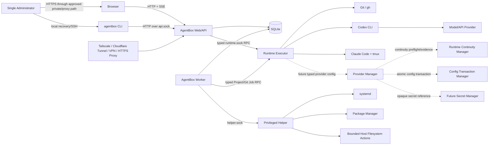
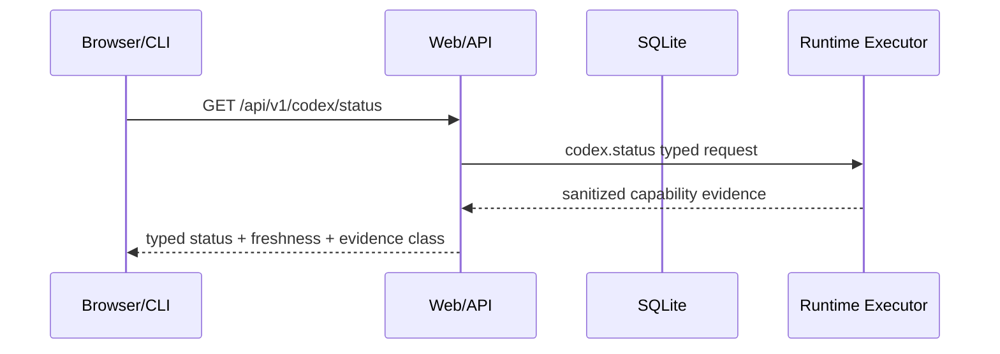
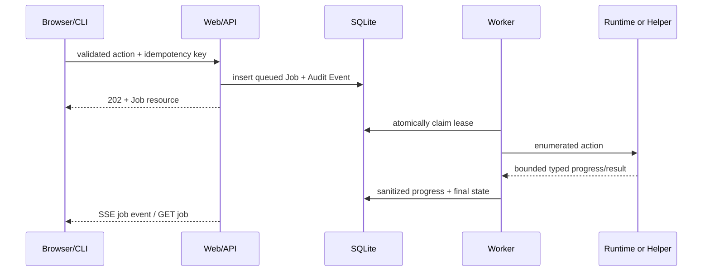
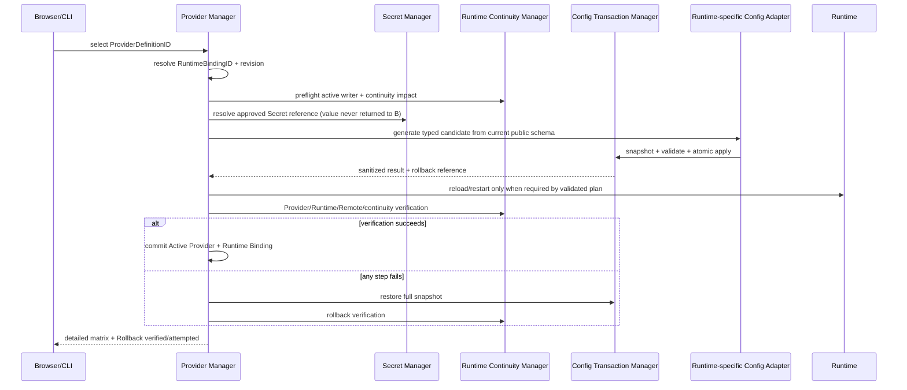
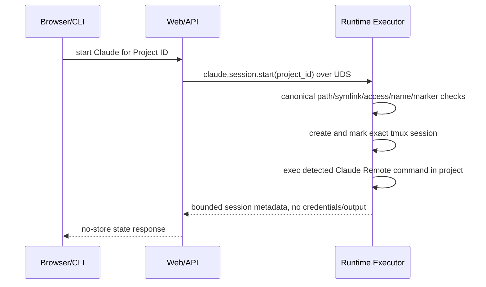

# AgentBox Architecture

Status: Approved architecture baseline
Decision authority: Accepted ADRs 0001–0008 in `docs/adr/` govern the decisions summarized here.

## Architectural Conclusions

- Deployment: native systemd, not Docker by default.
- Product mode: one server, one application administrator.
- Web/API and Worker: non-root `agentbox` identity.
- Runtime/Git/tmux: separate non-root `agentbox-runtime` identity.
- System changes: root Privileged Helper over a file-permission-protected Unix Domain Socket (UDS).
- Runtime actions: non-root Runtime Executor over a separate UDS; the Helper does not run Codex/Claude/tmux as root.
- Phase 11 Provider/continuity: future runtime-neutral Application domains use
  distinct `ProviderDefinitionID` and `RuntimeBindingID` identities, a
  Runtime Continuity Manager, a Config Transaction Manager, platform Secret
  backends, and typed Runtime adapters. They remain separate from Remote
  lifecycle and never accept arbitrary config text or raw API keys.
- Backend: Python 3.11+, FastAPI, Pydantic, SQLAlchemy, Alembic.
- Frontend: React, TypeScript, Vite; Tailwind and selected shadcn/ui components, kept minimal.
- State: SQLite in WAL mode with explicit single-host write coordination.
- Progress: SSE first; no MVP WebSocket or browser terminal.
- Long work: durable SQLite Jobs executed by a separately supervised Worker.
- Network: `127.0.0.1:8787` by default; no direct public bind.

## Phase 3 Implemented Control-Plane Foundation

Phase 3 implements only the local control-plane security foundation:

- typed configuration from `AGENTBOX_*` environment variables, an optional
  `.agentbox-dev/config.toml`, and secure defaults;
- a SQLAlchemy 2.x SQLite engine with WAL, foreign keys, a five-second busy
  timeout, and explicit short transaction scopes;
- an explicit Alembic migration for `AdminUser`, server-side `Session`, and
  `AuditEvent`; application startup never calls `create_all` or auto-migrates;
- local-TTY single-admin bootstrap with Argon2id, opaque cookie Sessions whose
  raw token is never stored, session-bound CSRF, exact Origin/Host validation,
  bounded in-process login throttling, request IDs, safe errors, and structured
  redacted logs;
- an asynchronous API login boundary that admits at most two Argon2/login work
  units by default, then runs the synchronous service through
  `asyncio.to_thread`; rate-limit rejection occurs before real/dummy verify;
- `GET /healthz`, `GET /readyz`, `GET /api/v1/meta`, and the three Phase 3 auth
  routes under `/api/v1/auth`;
- a separate Worker lifecycle that may connect to the database and clean old
  expired/revoked Sessions, but does not claim or execute Jobs;
- the original minimal React login/authenticated shell that Phase 4 has now
  replaced with the routed Web foundation described below.

Development state defaults beneath `.agentbox-dev/`, which is ignored by Git.
The production FHS locations remain the accepted deployment design, but Phase 3
does not create them, users, units, listeners, or host services.

## Phase 4 Authenticated Web Foundation

Phase 4 keeps the Phase 3 authentication protocol unchanged and adds a
browser-facing product shell:

- React Router owns `/`, `/login`, `/dashboard`, `/codex`, `/claude`,
  `/projects`, `/doctor`, `/logs`, `/settings`, and a branded fallback;
- `AuthProvider` restores authentication from `GET /api/v1/auth/me`, holds only
  safe user/session metadata and the Session-bound CSRF token in memory, and
  never persists authentication material in Web Storage;
- a single native-fetch API client supplies `credentials: include`, bounded
  request timeouts, V1 error-envelope parsing, request-ID validation, CSRF
  headers, and centralized `401` recovery;
- logout may refresh `auth/me` and retry exactly once after a `403` caused by a
  stale CSRF token; there is no unbounded retry;
- the Dashboard consumes only real `healthz`, `readyz`, `meta`, and current-user
  data. Runtime and Project cards are explicitly `Planned`;
- `GET /api/v1/doctor` was the sole Phase 4 API addition. It is authenticated,
  no-store, and read-only. Phase 4 limited it to control-plane readiness and
  safe policy fields; Phase 5 extends the same endpoint with bounded Codex
  diagnostics obtained through the Runtime Executor. It still does not inspect
  arbitrary host services;
- desktop uses a persistent sidebar, while viewports below 900 px use a compact
  header and keyboard-accessible navigation drawer.

The production Vite build emits external hashed JavaScript and CSS assets and
requires no inline script, `unsafe-inline`, or `unsafe-eval`; it is compatible
with the existing production CSP. Vite development/preview is a local tool,
not the deployment server. Static serving and proxy cache policy remain a
Phase 8 deployment responsibility.

## Phase 5 Codex Management

Phase 5 implements the first Runtime slice without changing the accepted
privilege model. `agentbox-api` sends one of four parameter-free, versioned
actions over a bounded Unix Domain Socket to a non-root `agentbox-runtime`
process. Only that Runtime Executor resolves and invokes Codex. The API has no
subprocess import, executable selector, argv field, environment map, or shell
escape hatch.

The implemented actions are `codex.status`, `codex.remote.start`,
`codex.remote.stop`, and `codex.pair`. The Runtime process serializes mutations,
applies a ten-second in-memory Pair cooldown, validates peer UID with
`SO_PEERCRED`, and accepts an exact JSON-line schema capped at 64 KiB. Its
controlled runner uses an argv array, a resolved absolute executable, stat
fingerprint revalidation, fixed Runtime HOME/cwd, an environment allowlist,
separate bounded stdout/stderr, a hard timeout, and process-group cleanup. It
does not run as root or connect to the Privileged Helper.

Codex 的 timeout 采用分层预算：单条 CLI 命令保持 8/10/30 秒硬上限，完整
status 与 mutation RPC 分别为 70/100 秒，浏览器调用为 85/130 秒。外层预算
必须大于内层最坏路径，使 Runtime 在调用方报告超时后继续执行 mutation 的
风险受控。Remote action 的历史结果不作为实时状态；幂等判断仅使用公开
status 或严格 same-UID 进程证据。

Codex installation and capabilities are observations, not database models.
Detection uses PATH resolution, public `--version`/`--help`, optional public
login status, bounded npm metadata, and strict current-UID process evidence.
Missing or changed evidence degrades to `unknown`/`unsupported`; no private
Codex file or managed-package path is an interface. Start/stop use the public
commands only. Pair output is parsed fail-closed and crosses the API once in a
no-store response; its raw buffer is never logged, audited, or persisted.

## Phase 6 Claude + tmux Session Management

Phase 6 adds a second Runtime capability without widening the Web execution
boundary. `ClaudeAdapter` reads only public CLI help/version/status behavior;
`TmuxAdapter` exposes fixed operations; `ClaudeSessionManager` binds them to a
minimal read-only `ProjectRegistry`. The API/CLI UDS request contains only a
validated `project_id`; canonical cwd resolution happens again inside Runtime.

Managed ownership requires a deterministic bounded session name and exact
versioned tmux marker. Similar, legacy, unmarked, or colliding sessions are
unmanaged and cannot be attached, captured, adopted, or stopped through
AgentBox. Runtime restart rediscovers sessions from project IDs, exact names,
markers, and bounded pane evidence rather than process-local state.

tmux owns the long-running interactive `claude remote-control` process. The
Runtime Executor owns only short fixed Claude probes and tmux management
commands. Workspace Trust remains manual; no private Claude state is parsed and
unknown output remains Unknown/Starting. See `CLAUDE_INTEGRATION.md`.

## System Context



The Browser never talks directly to the Worker, Runtime Executor, Helper, systemd, tmux, or third-party CLI. External access components are separately administered integrations, not AgentBox-owned trust anchors.

## Components

### Web/API

Runs as `agentbox` and provides:

- authentication, sessions, CSRF, request validation, and response security headers;
- `/api/v1` contracts and prebuilt React static files;
- authorization, Confirmation Challenge validation, Job creation, and read models;
- bounded SSE streams sourced from database state changes;
- no subprocess execution and no direct project or Runtime HOME access.

The process binds `127.0.0.1:8787` and a local CLI UDS. It never runs as root.

Phase 3 keeps SQLAlchemy synchronous rather than introducing an async ORM.
Login's lookup, Argon2 work, and final Session write execute off the main event
loop, and no database transaction remains open during password verification or
rehash. Logout, `me`, and readiness retain short bounded synchronous SQLite
operations; no HTTP route runs migrations or Session cleanup. This is acceptable
for the single-server foundation and must be revisited if profiling shows
contention or these request paths acquire longer work.

Codex/Claude direct lifecycle routes await bounded UDS I/O; the API still
executes no third-party process. Phase 7 network and workspace mutations are
instead queued as durable Jobs for the Worker. API-side SQLite work remains
limited to short Session, Project, Job, and Audit transactions. Pair Code and
bounded Runtime lifecycle actions intentionally remain direct ephemeral
operations because their secret/idempotency semantics differ from persistent
Jobs.

### Application Services

Application Services are a shared Python package used by Web routes, CLI local-read-only mode, and Worker handlers. They own use-case behavior and policy:

- Runtime Adapters;
- future Provider Registry/Binding Services, Runtime Continuity Manager,
  Config Transaction Manager, Secret Manager, and Runtime-specific Provider
  Config Adapters;
- Project Services;
- Git Services;
- Job Services;
- Diagnostic Services;
- Confirmation and Audit Services;
- Privileged and Runtime clients.

Routes and CLI commands translate inputs/outputs only; neither contains alternate business logic.

### Worker

Runs as `agentbox` in a separate systemd service. It leases queued Jobs from SQLite, invokes Application Services, calls only the appropriate narrow UDS, writes sanitized results, and emits progress records. Default concurrency is one on small hosts; per-resource locks prevent concurrent operations on the same Runtime, project, install, or upgrade target.

### Runtime Executor

Runs as `agentbox-runtime` and owns `/home/agentbox-runtime`, third-party CLI authentication, `/srv/agentbox/projects`, Runtime child processes, and tmux sockets. It accepts only enumerated Runtime/Project/Git actions over `/run/agentbox/runtime.sock`.

It may execute public Codex, Claude, tmux, Git, and gh commands selected by server-side adapters. It rejects raw executable paths, arbitrary argv, environment maps, working directories, tmux names, and shell strings. It has no package-manager or system-unit authority.

### Privileged Helper

Runs as root and listens only on `/run/agentbox/helper.sock`. It performs the minimal actions that genuinely require root:

- reload systemd; and
- start, stop, restart, enable, or disable the compiled exact AgentBox unit set.

Package plans, users/groups/directories, release activation, migration, backup,
update, and rollback remain local administrator/root Installer operations and
are not exposed through the runtime Helper protocol.

It does not manage arbitrary units, run user shell commands, execute Git, read Runtime credentials, generate Pair Codes, invoke Claude/tmux as root, modify SSH/firewall/tunnels, or accept caller-supplied package names.

### Runtime Adapters

Adapters translate stable AgentBox capabilities into currently observed public CLI operations. Detection evidence includes configured entrypoints, `command -v`, realpath, version/help output, exit status, process/unit evidence, and safe authentication status commands. Internal files are optional diagnostics, never required contracts.

Future Provider management is a sibling Application domain, not an extension
of Remote lifecycle state. `ProviderManager` owns ProviderDefinition metadata,
Active Provider selection, tests, and Secret references. A separate
`RuntimeBindingID` expresses stable AgentBox binding intent without becoming a
permanent alias for any current Codex provider ID. `RuntimeContinuityManager`
owns active-writer preflight and independent Runtime/Remote/thread/context/
discovery assessment; it does not infer higher continuity from a lower-level
request success.

`ConfigTransactionManager` supplies snapshot, candidate validation,
concurrent-modification detection, permission-preserving atomic replacement,
rollback, and rollback verification to Runtime-specific adapters. A
`CodexProviderConfigAdapter` may translate typed intent only after validating
the then-current public Codex CLI/config schema. It parses and preserves
unrelated settings, edits only AgentBox-controlled keys/blocks, prevents
duplicates, and rejects symlinks or unsafe ownership. The domain never embeds
Codex paths, TOML shapes, reasoning enums, wire events, or session storage
formats as permanent contracts.

### SQLite

SQLite stores metadata, password/session hashes, Runtime observations, Jobs, Audit Events, settings, diagnostics, and confirmation hashes. A future Provider model may store non-secret metadata and opaque Secret references only. SQLite stores no third-party tokens, raw API keys, Pair Codes, OAuth codes, cookies, passwords, SSH keys, complete auth files, or unbounded command output.

## Process Model

| Process | Linux identity | Persistent | Network/socket | May execute |
|---|---|---:|---|---|
| `agentbox-api` | `agentbox` | yes | loopback HTTP; `api.sock` | no third-party/system commands |
| `agentbox-worker` | `agentbox` | yes | client of runtime/helper sockets | only application handlers and fixed clients |
| `agentbox-runtime` | `agentbox-runtime` | yes | `runtime.sock` only | allowlisted Codex/Claude/tmux/Git/gh commands |
| `agentbox-helper` | root | yes/socket-activated candidate | `helper.sock` only | allowlisted system operations |
| tmux server/sessions | `agentbox-runtime` | on demand | Runtime-user tmux socket | Claude and future supported interactive Runtimes |
| third-party Runtime children | `agentbox-runtime` | on demand | as required by third party | only adapter-selected operations |

No Helper or Runtime socket listens on TCP. The two sockets use different owners/groups and schemas so a Runtime compromise does not acquire root actions.

## Permission Model: Model A vs Model B

| Criterion | Model A: non-root Runtime/projects | Model B: root owns everything |
|---|---|---|
| Least privilege | Strong: Runtime compromise is bounded to Runtime user | Weak: a CLI/plugin/repository compromise becomes root |
| Git ownership | Natural; commands and files share one UID | Root-owned files cause collaboration and `safe.directory` problems |
| Claude Trust | Scoped to Runtime user's concrete workspace | Trust and auth accumulate under `/root` |
| Credentials | Isolated in Runtime HOME from Web/API and Helper | High-value third-party auth concentrated in root HOME |
| tmux | Consistent per Runtime UID | Root socket cannot be safely exposed to non-root Web |
| Future multi-user | Evolves to one Runtime identity per owner | Requires a disruptive redesign |
| Migration from current server | Requires deliberate re-auth and project adoption | Initially easier but preserves Phase 0 risks |
| Maintenance | One extra identity/socket | Superficially simpler, operationally dangerous |

**Decision: Model A.** The MVP uses one `agentbox-runtime` user for all managed projects. Existing root Codex/Claude/tmux state remains unmanaged and is never silently migrated. A future multi-user design can allocate per-owner Runtime identities.

## Trust Boundaries

1. **Remote access boundary:** browser traffic enters through loopback forwarding, private network, tunnel, VPN, or HTTPS proxy.
2. **Web session boundary:** authentication, CSRF, Origin/Host checks, session expiry, and rate limits protect `/api/v1`.
3. **Application boundary:** typed use cases convert user intent into enumerated actions.
4. **Root boundary:** `helper.sock` uses filesystem permissions and peer credentials; every action is independently validated.
5. **Runtime boundary:** `runtime.sock` isolates project/credential access from Web/API and root Helper.
6. **Project boundary:** each Project record maps to one canonical directory beneath the configured root.
7. **Third-party boundary:** Codex, Claude, GitHub, package repositories, and tunnels can change independently and may be unavailable or malicious.
8. **Update boundary:** downloaded artifacts and database migrations cross a supply-chain and rollback boundary.
9. **Future Provider/Secret/continuity boundary:** ProviderDefinition metadata,
   Active Provider selection, Runtime Binding intent, Secret value custody,
   config transaction, Runtime lifecycle, and continuity evidence are separate
   authorities. No component mutates private session DB/JSONL/rollout state.

## Data Flows

### Read-Only Status



Phase 5 does not persist Runtime observations. Read paths run bounded public
probes on demand; a later observation cache/Job design may be added without
making third-party private files authoritative. Expensive general Doctor and
log collection operations remain future Jobs.

### Job Execution Flow



The Worker never stores raw stdout/stderr. Adapters normalize output into
bounded summaries and ephemeral diagnostic buffers. During each bounded
Runtime RPC, the Worker periodically renews the durable Job lease without
creating progress-event noise; a crashed or expired running mutation becomes
`needs_attention` and is never blindly replayed.

### Future Provider Selection Flow

This flow is planning only and has no current endpoint or command:



Provider activation follows Preflight → Snapshot → Target validation → Writer
safety → Candidate generation/validation → Atomic apply → required lifecycle
action → Provider/Runtime/Remote/continuity verification → Commit. Failure
restores original content/nonexistence, permissions, lifecycle, Active Provider,
Runtime Binding, generated profile/config, and Secret reference, then verifies
the rollback. Unverified recovery is only `Rollback attempted`, never
`Rollback successful`. Request PASS is not proof of Remote, thread resume,
context continuity, or discovery compatibility.

### Codex Pair Flow

Pairing is deliberately not a normal persistent Job result:

```mermaid
sequenceDiagram
    participant B as Authenticated Browser
    participant A as Web/API
    participant R as Runtime Executor
    participant C as Codex CLI
    B->>A: POST /api/v1/codex/pair-codes + CSRF + recent auth
    A->>R: codex_pair (bounded RPC)
    R->>C: adapter-selected public pair command
    C-->>R: temporary code
    R-->>A: secret-marked in-memory response
    A-->>B: one-time no-store response
    A->>A: discard buffer; audit metadata only
```

Controls:

- hard timeout and output-size limit;
- no Pair Code in SQLite, Job, SSE, journal, trace, exception, fixture, or Audit Event;
- response headers `Cache-Control: no-store`, `Pragma: no-cache`, and `Referrer-Policy: no-referrer`;
- one display, short in-memory TTL, overwrite/discard after delivery;
- failure or process restart requires generating a new code;
- no pairing endpoint if capability detection is Unsupported or authentication is Unauthenticated.

### Claude Session Flow



If Workspace Trust cannot be established through public evidence, state is
`needs_interaction` or `unknown` and the UI returns an exact attach instruction.
It never auto-trusts `/root` or any project. Durable Job/SSE integration remains
future work and Phase 6 uses bounded typed UDS calls.

### Project Create/Clone Flow

1. API validates name, source type, and credential-free URL syntax.
2. Project Service allocates an opaque Project ID and relative directory name; user input is not the filesystem path.
3. Worker asks Runtime Executor to open the project-root directory using descriptor-based/no-follow checks.
4. Runtime Executor creates a staging directory as `agentbox-runtime`.
5. For clone, Git runs with fixed environment, disabled interactive credential prompts, timeout, output limit, and hook/submodule policy.
6. On success the staging directory is atomically renamed into place; on uncertain failure it is quarantined and Job becomes `needs_attention`.
7. Project metadata stores a sanitized remote URL with userinfo removed.

### Installation Flow

1. Bootstrap performs read-only platform and conflict detection.
2. Installer builds a typed plan from logical dependencies and exact AgentBox version.
3. Administrator reviews dry-run, affected paths/units, downloads, and rollback boundary.
4. The administrator-invoked root Installer applies approved installation
   steps; the runtime Helper is deliberately not an installer.
5. Files install under a versioned `/opt/agentbox/releases/<version>` directory.
6. Database and configuration backups precede migration.
7. `current` switches atomically, units reload/restart in order, and loopback health checks run.
8. Failure restores the prior release/config/database when safe; uncertain system state is reported `needs_attention`.

### Upgrade Flow

Upgrade is a privileged Job with a global lifecycle lock. It downloads to staging, verifies available publisher metadata and locally recorded digest, stops acceptance of new Jobs, drains/cancels safe work, backs up SQLite/config, applies forward-compatible migrations, switches the release symlink, restarts Runtime/Worker/API/Helper in dependency order, and runs health checks. Automatic rollback is attempted only when the reverse migration/restore plan is proven safe.

## Phase 8 Production Deployment

Phase 8 implements the accepted three-identity boundary as `agentbox`
(API/Worker/data), `agentbox-runtime` (Runtime HOME/projects/tools), and a
socket-activated root Helper. A narrow `agentbox-runtime-ipc` supplementary
group provides access to `runtime.sock`; neither service identity shares the
other's secrets or writable filesystem roots.

The SQLite parent is `root:agentbox 1770`: `agentbox` can create SQLite
WAL/SHM files, while the sticky root-owned parent prevents it from replacing
root-owned receipt, transaction-journal, or backup names. `/run/agentbox` is
setgid/sticky `3770` so the two IPC identities cannot unlink one another's
socket directory entries.

Production state uses `/etc/agentbox`, `/var/lib/agentbox`, `/run/agentbox`,
`/srv/agentbox/projects`, and immutable releases below `/opt/agentbox`. The API
serves prebuilt static assets and binds only `127.0.0.1:8787`. SQLite migrations
are an explicit installer action, not an application-startup side effect.

The installer owns package/user/directory/unit/release/config/DB lifecycle and
runs only from a local administrator root context. The Helper owns only six
fixed, argument-free AgentBox systemd actions. Neither accepts caller-selected
commands, paths, packages, PIDs, signals, or unit names.

Release activation is a verified directory plus atomic relative symlink.
Upgrade takes a lifecycle lock, quiesces AgentBox, creates an online SQLite and
configuration/unit backup, migrates, activates, restarts, and verifies health,
readiness, and version. Failure restores the prior snapshot when available and
reports rollback verification separately from rollback attempt.

The transaction journal is root-only and records transaction ID, expected
path/type, existed-before state, and filesystem identity. Interrupted staged,
partially-migrated, activated, rollback-pending, and unknown states fail closed
on re-entry rather than replaying an unproven mutation.

## CLI and Service Behavior

- When the service is running, CLI uses HTTP over `/run/agentbox/api.sock` and therefore the same Application Services, Job model, confirmation policy, and error schema as Web.
- When the service is unavailable, only explicitly read-only local commands may instantiate Application Services with a `ReadOnlyExecutionContext`: local `status`, `doctor --local`, Runtime detection/version/capabilities, and project Git status for paths accessible to the caller.
- Offline mode cannot access Helper, mutate SQLite, start/stop Runtime, create/clone projects, install/update, generate Pair Codes, or modify sessions.
- CLI performs a service metadata handshake. Different API major versions fail with `VERSION_MISMATCH`; compatible minor differences use Capability fields and ignore unknown response fields.

## Failure Modes

| Failure | Required behavior |
|---|---|
| Runtime command missing | `Unavailable`, include safe install/repair plan |
| Runtime command exists but feature absent | `Unsupported`, no fallback to private implementation |
| Authentication cannot be verified | `Unauthenticated` or `Unknown`, never infer success from file presence |
| Command exits unexpectedly | `Broken`, bounded diagnostic summary and evidence timestamp |
| Helper/Runtime socket peer invalid | reject, audit security event, no action |
| Worker dies before action starts | lease expires; safe Job requeues |
| Worker dies during idempotent read | requeue with attempt limit |
| Worker dies during mutating/uncertain step | `needs_attention`; do not blindly repeat |
| SQLite busy/corrupt | bounded retry; then read-only degraded mode and recovery instruction |
| SSE disconnect | client reconnects with last event cursor; Job continues |
| Existing tmux name collision | Conflict; never attach/stop unmanaged session |
| Project path changes or becomes symlink | fail closed; Job `needs_attention` |
| Pair response lost | discard code and require regeneration |
| Upgrade health check fails | quiesce, restore safe snapshot/release, report rollback result |
| External tunnel/proxy unavailable | local service remains healthy; external integration reported unavailable |
| Provider contract/config schema changed | future config mutation fails closed; refresh public capability/schema evidence and preserve the current config |
| Provider test passes but continuity is unclear | report each Provider/Runtime/Remote/thread/context/discovery dimension independently; leave unknown levels Unknown/Not Tested |
| Provider config changes concurrently | reject stale plan; never overwrite the operator's unrelated settings |
| Provider switch fails after apply | restore the complete transaction snapshot and lifecycle, then report only `Rollback attempted` or `Rollback verified` |
| Active writer cannot be determined | require explicit turn-complete confirmation; never mutate private session files |
| Thread disappears from normal listing | report `Thread not listed`, not `Thread deleted`; offer only currently validated public recovery guidance |

## Current Host Constraints Carried Forward

- The verified host is OpenCloudOS 9.4 with systemd 255, 2 vCPU, 3.5 GiB RAM, no Swap, and no Docker.
- `8000` is occupied; the default is `127.0.0.1:8787`, subject to install-time conflict detection.
- Existing cloudflared, x-ui, xray, SSH, iptables rules, root tmux sessions, and root Runtime processes are unmanaged and must not be modified automatically.
- Existing `codex.service` is enabled but inactive and points to a missing path; it is a migration gate, not an AgentBox unit.
- Existing standalone Codex ownership at UID/GID 1001 must be resolved before creating users or executing it through a privileged path.
- Python 3.11.6 is present; therefore Python 3.11 is the MVP minimum unless Phase 2 explicitly changes the compatibility decision.

## Remaining Implementation Questions Requiring Human Approval

- whether `/srv/agentbox/projects` or `/home/agentbox-runtime/projects` should be a configurable installation choice (default remains `/srv`);
- policy for adopting existing root-owned projects and sessions;
- final Runtime command for each supported Claude version, verified by Capability Detection rather than this document;
- publisher verification mechanism available for each third-party installer/artifact;
- whether an existing Cloudflare Tunnel will be manually integrated after security review.
- future Linux restrictive-file, macOS Keychain, Windows DPAPI, WSL isolation,
  unlock/rotation/backup policy, and Runtime injection boundaries;
- public Codex config/provider identity/reload/active-writer/resume/discovery
  contracts available when Phase 11 begins;
- evidence required for every continuity level, the A/B harness, safe lifecycle
  restoration, and rollback verification during Provider activation.

## Phase 9 hardening boundary

Phase 9 does not change the accepted process or privilege architecture. It adds
version-aware unit validation, persistent pseudonymous authentication
throttling, strict IPC/schema parsing, deterministic recovery faults,
actionable diagnostics, and verified-object retention. Runtime compatibility
exceptions do not weaken API, Worker, or Helper. Phase 11 remains planning only.

## Phase 7 Project and Job Flow

`Web/CLI → API → durable Job → Worker → typed UDS action →
ProjectWorkspaceManager → GitAdapter/GitHubAdapter` is the mutation path. API
persists only controlled Project identity and bounded Job payloads; Runtime
resolves the immutable relative key beneath Project Root. Worker leases
serialize mutations per Project and interrupted work becomes `needs_attention`.
Claude continues using the same relative key internally so managed tmux identity
survives migration.

## Phase 10 release boundary

Phase 10 packages the accepted single-host architecture; it does not add a new
runtime or privilege path. A clean tracked commit, the locked dependency graph,
and a fixed `SOURCE_DATE_EPOCH` produce one allowlisted Linux x86_64 artifact.
The archive contains the application wheel and locked wheelhouse, built Web
assets, migrations, installer entry point, unit/helper assets already owned by
the Python package, release documentation, SPDX SBOM, and a canonical release
manifest. It contains no checkout metadata, development environment, user data,
configuration, credentials, source maps, or Runtime state.

`RELEASE_MANIFEST.json` binds the candidate version, source commit, platform,
migration head, file allowlist, modes, and per-file SHA-256 values. An external
`SHA256SUMS` binds the tarball, manifest, and SBOM before extraction. These
controls establish integrity, not publisher authenticity: RC artifacts are
explicitly unsigned. Installation continues through the Phase 8 typed,
transactional installer and never requires a source checkout or a production
Node/Vite process.
