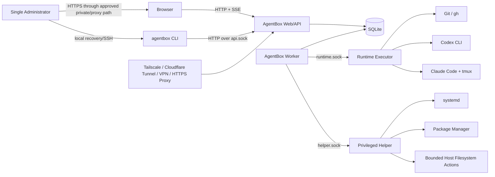
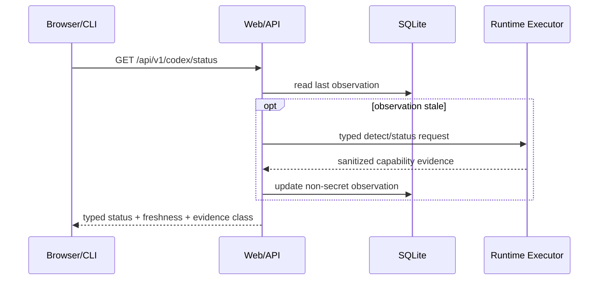
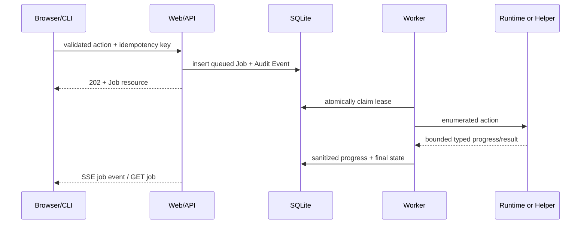
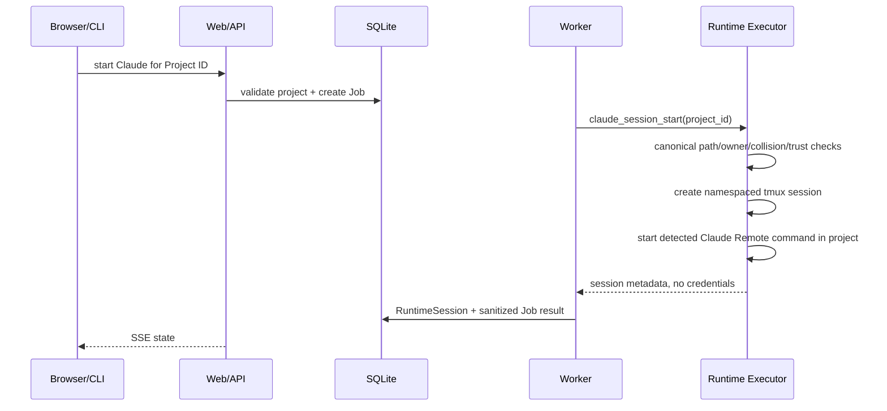

# AgentBox Architecture

Status: Approved architecture baseline
Decision authority: Accepted ADRs 0001–0008 in `docs/adr/` govern the decisions summarized here.

## Architectural Conclusions

- Deployment: native systemd, not Docker by default.
- Product mode: one server, one application administrator.
- Web/API and Worker: non-root `agentbox` identity.
- Runtime/Git/tmux: separate non-root `agentbox-runtime` identity.
- System changes: root Privileged Helper over a file-permission-protected Unix Domain Socket (UDS).
- Runtime actions: non-root Runtime Executor over a separate UDS; the Helper does not run Codex/Claude/tmux as root.
- Backend: Python 3.11+, FastAPI, Pydantic, SQLAlchemy, Alembic.
- Frontend: React, TypeScript, Vite; Tailwind and selected shadcn/ui components, kept minimal.
- State: SQLite in WAL mode with explicit single-host write coordination.
- Progress: SSE first; no MVP WebSocket or browser terminal.
- Long work: durable SQLite Jobs executed by a separately supervised Worker.
- Network: `127.0.0.1:8787` by default; no direct public bind.

## Phase 3 Implemented Control-Plane Foundation

Phase 3 implements only the local control-plane security foundation:

- typed configuration from `AGENTBOX_*` environment variables, an optional
  `.agentbox-dev/config.toml`, and secure defaults;
- a SQLAlchemy 2.x SQLite engine with WAL, foreign keys, a five-second busy
  timeout, and explicit short transaction scopes;
- an explicit Alembic migration for `AdminUser`, server-side `Session`, and
  `AuditEvent`; application startup never calls `create_all` or auto-migrates;
- local-TTY single-admin bootstrap with Argon2id, opaque cookie Sessions whose
  raw token is never stored, session-bound CSRF, exact Origin/Host validation,
  bounded in-process login throttling, request IDs, safe errors, and structured
  redacted logs;
- `GET /healthz`, `GET /readyz`, `GET /api/v1/meta`, and the three Phase 3 auth
  routes under `/api/v1/auth`;
- a separate Worker lifecycle that may connect to the database and clean old
  expired/revoked Sessions, but does not claim or execute Jobs;
- a minimal React login/authenticated shell. It is not the Phase 4 Dashboard.

Development state defaults beneath `.agentbox-dev/`, which is ignored by Git.
The production FHS locations remain the accepted deployment design, but Phase 3
does not create them, users, units, listeners, or host services.

## System Context



The Browser never talks directly to the Worker, Runtime Executor, Helper, systemd, tmux, or third-party CLI. External access components are separately administered integrations, not AgentBox-owned trust anchors.

## Components

### Web/API

Runs as `agentbox` and provides:

- authentication, sessions, CSRF, request validation, and response security headers;
- `/api/v1` contracts and prebuilt React static files;
- authorization, Confirmation Challenge validation, Job creation, and read models;
- bounded SSE streams sourced from database state changes;
- no subprocess execution and no direct project or Runtime HOME access.

The process binds `127.0.0.1:8787` and a local CLI UDS. It never runs as root.

### Application Services

Application Services are a shared Python package used by Web routes, CLI local-read-only mode, and Worker handlers. They own use-case behavior and policy:

- Runtime Adapters;
- Project Services;
- Git Services;
- Job Services;
- Diagnostic Services;
- Confirmation and Audit Services;
- Privileged and Runtime clients.

Routes and CLI commands translate inputs/outputs only; neither contains alternate business logic.

### Worker

Runs as `agentbox` in a separate systemd service. It leases queued Jobs from SQLite, invokes Application Services, calls only the appropriate narrow UDS, writes sanitized results, and emits progress records. Default concurrency is one on small hosts; per-resource locks prevent concurrent operations on the same Runtime, project, install, or upgrade target.

### Runtime Executor

Runs as `agentbox-runtime` and owns `/home/agentbox-runtime`, third-party CLI authentication, `/srv/agentbox/projects`, Runtime child processes, and tmux sockets. It accepts only enumerated Runtime/Project/Git actions over `/run/agentbox/runtime.sock`.

It may execute public Codex, Claude, tmux, Git, and gh commands selected by server-side adapters. It rejects raw executable paths, arbitrary argv, environment maps, working directories, tmux names, and shell strings. It has no package-manager or system-unit authority.

### Privileged Helper

Runs as root and listens only on `/run/agentbox/helper.sock`. It performs the minimal actions that genuinely require root:

- query/apply an approved package installation plan;
- install/activate/rollback versioned AgentBox release files;
- manage an exact allowlist of AgentBox systemd units;
- create/validate approved AgentBox users, groups, and FHS directories during installation;
- perform bounded ownership/mode transitions on known AgentBox paths;
- run host diagnostics that require privilege with redacted results.

It does not manage arbitrary units, run user shell commands, execute Git, read Runtime credentials, generate Pair Codes, invoke Claude/tmux as root, modify SSH/firewall/tunnels, or accept caller-supplied package names.

### Runtime Adapters

Adapters translate stable AgentBox capabilities into currently observed public CLI operations. Detection evidence includes configured entrypoints, `command -v`, realpath, version/help output, exit status, process/unit evidence, and safe authentication status commands. Internal files are optional diagnostics, never required contracts.

### SQLite

SQLite stores metadata, password/session hashes, Runtime observations, Jobs, Audit Events, settings, diagnostics, and confirmation hashes. It stores no third-party tokens, Pair Codes, OAuth codes, cookies, passwords, SSH keys, complete auth files, or unbounded command output.

## Process Model

| Process | Linux identity | Persistent | Network/socket | May execute |
|---|---|---:|---|---|
| `agentbox-api` | `agentbox` | yes | loopback HTTP; `api.sock` | no third-party/system commands |
| `agentbox-worker` | `agentbox` | yes | client of runtime/helper sockets | only application handlers and fixed clients |
| `agentbox-runtime` | `agentbox-runtime` | yes | `runtime.sock` only | allowlisted Codex/Claude/tmux/Git/gh commands |
| `agentbox-helper` | root | yes/socket-activated candidate | `helper.sock` only | allowlisted system operations |
| tmux server/sessions | `agentbox-runtime` | on demand | Runtime-user tmux socket | Claude and future supported interactive Runtimes |
| third-party Runtime children | `agentbox-runtime` | on demand | as required by third party | only adapter-selected operations |

No Helper or Runtime socket listens on TCP. The two sockets use different owners/groups and schemas so a Runtime compromise does not acquire root actions.

## Permission Model: Model A vs Model B

| Criterion | Model A: non-root Runtime/projects | Model B: root owns everything |
|---|---|---|
| Least privilege | Strong: Runtime compromise is bounded to Runtime user | Weak: a CLI/plugin/repository compromise becomes root |
| Git ownership | Natural; commands and files share one UID | Root-owned files cause collaboration and `safe.directory` problems |
| Claude Trust | Scoped to Runtime user's concrete workspace | Trust and auth accumulate under `/root` |
| Credentials | Isolated in Runtime HOME from Web/API and Helper | High-value third-party auth concentrated in root HOME |
| tmux | Consistent per Runtime UID | Root socket cannot be safely exposed to non-root Web |
| Future multi-user | Evolves to one Runtime identity per owner | Requires a disruptive redesign |
| Migration from current server | Requires deliberate re-auth and project adoption | Initially easier but preserves Phase 0 risks |
| Maintenance | One extra identity/socket | Superficially simpler, operationally dangerous |

**Decision: Model A.** The MVP uses one `agentbox-runtime` user for all managed projects. Existing root Codex/Claude/tmux state remains unmanaged and is never silently migrated. A future multi-user design can allocate per-owner Runtime identities.

## Trust Boundaries

1. **Remote access boundary:** browser traffic enters through loopback forwarding, private network, tunnel, VPN, or HTTPS proxy.
2. **Web session boundary:** authentication, CSRF, Origin/Host checks, session expiry, and rate limits protect `/api/v1`.
3. **Application boundary:** typed use cases convert user intent into enumerated actions.
4. **Root boundary:** `helper.sock` uses filesystem permissions and peer credentials; every action is independently validated.
5. **Runtime boundary:** `runtime.sock` isolates project/credential access from Web/API and root Helper.
6. **Project boundary:** each Project record maps to one canonical directory beneath the configured root.
7. **Third-party boundary:** Codex, Claude, GitHub, package repositories, and tunnels can change independently and may be unavailable or malicious.
8. **Update boundary:** downloaded artifacts and database migrations cross a supply-chain and rollback boundary.

## Data Flows

### Read-Only Status



Read paths have bounded refresh work. Expensive Doctor and log collection operations are Jobs.

### Job Execution Flow



The Worker never stores raw stdout/stderr. Adapters normalize output into bounded summaries and ephemeral diagnostic buffers.

### Codex Pair Flow

Pairing is deliberately not a normal persistent Job result:

```mermaid
sequenceDiagram
    participant B as Authenticated Browser
    participant A as Web/API
    participant R as Runtime Executor
    participant C as Codex CLI
    B->>A: POST pair-code + CSRF + recent auth
    A->>R: codex_pair (bounded RPC)
    R->>C: adapter-selected public pair command
    C-->>R: temporary code
    R-->>A: secret-marked in-memory response
    A-->>B: one-time no-store response
    A->>A: discard buffer; audit metadata only
```

Controls:

- hard timeout and output-size limit;
- no Pair Code in SQLite, Job, SSE, journal, trace, exception, fixture, or Audit Event;
- response headers `Cache-Control: no-store`, `Pragma: no-cache`, and `Referrer-Policy: no-referrer`;
- one display, short in-memory TTL, overwrite/discard after delivery;
- failure or process restart requires generating a new code;
- no pairing endpoint if capability detection is Unsupported or authentication is Unauthenticated.

### Claude Session Flow



If Workspace Trust cannot be detected using a stable public interface, the Job becomes `needs_attention` and returns a project-specific manual instruction. It never auto-trusts `/root` or a project-root parent.

### Project Create/Clone Flow

1. API validates name, source type, and credential-free URL syntax.
2. Project Service allocates an opaque Project ID and relative directory name; user input is not the filesystem path.
3. Worker asks Runtime Executor to open the project-root directory using descriptor-based/no-follow checks.
4. Runtime Executor creates a staging directory as `agentbox-runtime`.
5. For clone, Git runs with fixed environment, disabled interactive credential prompts, timeout, output limit, and hook/submodule policy.
6. On success the staging directory is atomically renamed into place; on uncertain failure it is quarantined and Job becomes `needs_attention`.
7. Project metadata stores a sanitized remote URL with userinfo removed.

### Installation Flow

1. Bootstrap performs read-only platform and conflict detection.
2. Installer builds a typed plan from logical dependencies and exact AgentBox version.
3. Administrator reviews dry-run, affected paths/units, downloads, and rollback boundary.
4. Helper applies approved steps with per-step preconditions and completion markers.
5. Files install under a versioned `/opt/agentbox/releases/<version>` directory.
6. Database and configuration backups precede migration.
7. `current` switches atomically, units reload/restart in order, and loopback health checks run.
8. Failure restores the prior release/config/database when safe; uncertain system state is reported `needs_attention`.

### Upgrade Flow

Upgrade is a privileged Job with a global lifecycle lock. It downloads to staging, verifies available publisher metadata and locally recorded digest, stops acceptance of new Jobs, drains/cancels safe work, backs up SQLite/config, applies forward-compatible migrations, switches the release symlink, restarts Runtime/Worker/API/Helper in dependency order, and runs health checks. Automatic rollback is attempted only when the reverse migration/restore plan is proven safe.

## CLI and Service Behavior

- When the service is running, CLI uses HTTP over `/run/agentbox/api.sock` and therefore the same Application Services, Job model, confirmation policy, and error schema as Web.
- When the service is unavailable, only explicitly read-only local commands may instantiate Application Services with a `ReadOnlyExecutionContext`: local `status`, `doctor --local`, Runtime detection/version/capabilities, and project Git status for paths accessible to the caller.
- Offline mode cannot access Helper, mutate SQLite, start/stop Runtime, create/clone projects, install/update, generate Pair Codes, or modify sessions.
- CLI performs a service metadata handshake. Different API major versions fail with `VERSION_MISMATCH`; compatible minor differences use Capability fields and ignore unknown response fields.

## Failure Modes

| Failure | Required behavior |
|---|---|
| Runtime command missing | `Unavailable`, include safe install/repair plan |
| Runtime command exists but feature absent | `Unsupported`, no fallback to private implementation |
| Authentication cannot be verified | `Unauthenticated` or `Unknown`, never infer success from file presence |
| Command exits unexpectedly | `Broken`, bounded diagnostic summary and evidence timestamp |
| Helper/Runtime socket peer invalid | reject, audit security event, no action |
| Worker dies before action starts | lease expires; safe Job requeues |
| Worker dies during idempotent read | requeue with attempt limit |
| Worker dies during mutating/uncertain step | `needs_attention`; do not blindly repeat |
| SQLite busy/corrupt | bounded retry; then read-only degraded mode and recovery instruction |
| SSE disconnect | client reconnects with last event cursor; Job continues |
| Existing tmux name collision | Conflict; never attach/stop unmanaged session |
| Project path changes or becomes symlink | fail closed; Job `needs_attention` |
| Pair response lost | discard code and require regeneration |
| Upgrade health check fails | quiesce, restore safe snapshot/release, report rollback result |
| External tunnel/proxy unavailable | local service remains healthy; external integration reported unavailable |

## Current Host Constraints Carried Forward

- The verified host is OpenCloudOS 9.4 with systemd 255, 2 vCPU, 3.5 GiB RAM, no Swap, and no Docker.
- `8000` is occupied; the default is `127.0.0.1:8787`, subject to install-time conflict detection.
- Existing cloudflared, x-ui, xray, SSH, iptables rules, root tmux sessions, and root Runtime processes are unmanaged and must not be modified automatically.
- Existing `codex.service` is enabled but inactive and points to a missing path; it is a migration gate, not an AgentBox unit.
- Existing standalone Codex ownership at UID/GID 1001 must be resolved before creating users or executing it through a privileged path.
- Python 3.11.6 is present; therefore Python 3.11 is the MVP minimum unless Phase 2 explicitly changes the compatibility decision.

## Remaining Implementation Questions Requiring Human Approval

- whether `/srv/agentbox/projects` or `/home/agentbox-runtime/projects` should be a configurable installation choice (default remains `/srv`);
- policy for adopting existing root-owned projects and sessions;
- final Runtime command for each supported Claude version, verified by Capability Detection rather than this document;
- publisher verification mechanism available for each third-party installer/artifact;
- whether an existing Cloudflare Tunnel will be manually integrated after security review.
