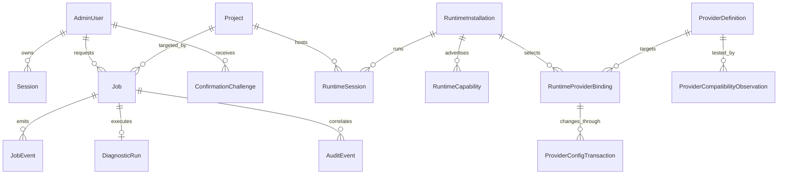

# AgentBox MVP Data Model

Status: Phase 1 logical design with the Phase 3 control-plane and Phase 7
Project/Job subset implemented. Migration `0001_control_plane_foundation`
creates `admin_users`, `sessions`, and `audit_events`; migration
`0002_project_jobs` adds `projects`, `jobs`, and `job_events`. Runtime,
Setting, Diagnostic, Confirmation, and Phase 11
Provider/Binding/compatibility/transaction tables remain future designs.
Development uses a configured path beneath `.agentbox-dev/` or a temporary
test directory; production retains the accepted
`/var/lib/agentbox/agentbox.db` policy and is not created by Phase 7.

## Database Decision

Use SQLite with SQLAlchemy and Alembic for the single-host MVP. Enable WAL mode, foreign keys, busy timeout, bounded transactions, and explicit write coordination. SQLite is not used as a distributed queue and no process shares the database over a network filesystem.

Database path: `/var/lib/agentbox/agentbox.db`, owned by `agentbox`, restrictive mode. Runtime Executor does not open it directly; Worker/API provide typed requests/results.

## General Conventions

- opaque application IDs; never reuse filesystem names or tmux names as primary keys;
- UTC timestamps and explicit revision numbers;
- enum values persisted as stable lower-case strings;
- soft state observations carry `observed_at` and freshness/confidence;
- user-supplied labels are separate from server-generated storage keys;
- summaries are bounded and sanitized before persistence;
- optimistic revision/state fingerprint for confirmation and stale-write protection;
- no generic JSON blob for privileged action arguments; Job payload is validated by versioned type schema.

## AdminUser

| Field | Purpose |
|---|---|
| `id` | opaque admin ID |
| `username_normalized` | unique single-admin login name |
| `display_name` | optional safe label |
| `password_hash` | Argon2id encoded hash only |
| `is_active` | account enabled state |
| `created_at` | creation time |
| `password_changed_at` | session-revocation boundary |
| `revision` | optimistic concurrency |

MVP enforces at most one active AdminUser. No plaintext/recoverable password is stored.

The Phase 3 physical model uses `id`, display `username`, unique normalized
username, Argon2id `password_hash`, `is_active`, `created_at`, `updated_at`, and
`last_login_at`. A SQLite partial unique index enforces at most one active row.
Display name, password-change boundary, and revision fields remain future work.

## Session

| Field | Purpose |
|---|---|
| `id` | opaque Session ID, not the cookie |
| `admin_user_id` | owner |
| `token_digest` | keyed digest of opaque browser session token |
| `created_at`, `last_seen_at` | lifecycle |
| `idle_expires_at`, `absolute_expires_at` | expiration |
| `recent_auth_until` | sensitive-action gate |
| `revoked_at`, `revoke_reason` | revocation |
| `csrf_digest` | verifier for CSRF token/secret |
| `client_class` | bounded Web/local label, no raw fingerprint |

This is an AgentBox application session verifier, not a third-party Token store. Raw session/cookie values are never persisted or audited. Migration restores revoke Sessions by default.

The Phase 3 physical model calls the keyed digest `token_hash`, stores a keyed
`csrf_hash`, has both idle and absolute expiry, revocation timestamp, and an
optional bounded client label. The raw cookie and raw CSRF value are not stored.
Restores revoking all Sessions remains a backup/restore policy for a later phase.

## Project

| Field | Purpose |
|---|---|
| `id` | opaque `prj_*` Project ID and API identity |
| `slug` | normalized bounded URL/filesystem-safe label, unique case-insensitively by normalization |
| `display_name` | bounded user-facing name, never an authorization boundary |
| `relative_path` | immutable server-derived immediate-child key, unique; never absolute |
| `source_type` | `empty`, `git_clone`, or reconciled `existing` |
| `repository_url` | validated credential-free clone identity or null |
| `default_branch` | bounded observed clone default branch or null |
| `state` | `creating`, `ready`, `error`, or `archived` |
| `archived_at` | future reversible archive timestamp; no filesystem deletion |
| `created_at`, `updated_at` | UTC lifecycle timestamps |

Canonical path is derived on every Runtime operation from the configured root
plus `relative_path` and revalidated. Absolute paths, Git observations, full
command output, workspace contents, numeric ownership, and Claude/tmux names
are not Project columns.

## RuntimeInstallation

| Field | Purpose |
|---|---|
| `id` | installation ID |
| `runtime_type` | `codex` or `claude` in MVP |
| `entrypoint` | configured/PATH-visible stable command path |
| `realpath_observed` | drift evidence only, not stable contract |
| `source_hint` | standalone/npm/package/unknown |
| `version_text_normalized` | bounded normalized version |
| `fingerprint` | non-secret executable metadata/digest policy |
| `owner_policy_state` | expected/mismatch/unknown |
| `health_state` | supported/unavailable/broken/unknown-style observation |
| `selected` | administrator-selected active candidate |
| `observed_at` | detection time |
| `revision` | plan invalidation |

No Runtime token/auth-file path/content is stored.

## RuntimeCapability

| Field | Purpose |
|---|---|
| `id` | capability observation ID |
| `runtime_installation_id` | parent |
| `name` | stable AgentBox capability enum |
| `state` | `supported`, `unsupported`, `unavailable`, `unauthenticated`, `broken`, `unknown` |
| `evidence_class` | public_help/status/managed_state/best_effort |
| `evidence_summary` | bounded and sanitized |
| `adapter_schema_version` | parser/fixture version |
| `observed_at`, `expires_at` | freshness |

Unique by installation/name/current observation policy.

## ProviderDefinition (future Phase 11 logical model)

These models are planning only; no migration or table exists. A concrete
`ProviderDefinitionID` is separate from the stable AgentBox
`RuntimeBindingID`. Neither model is merged into `RuntimeInstallation`,
`RuntimeSession`, Codex Remote state, or a private Runtime session database.

| Field | Purpose |
|---|---|
| `id` | opaque `ProviderDefinitionID` |
| `identity_schema_version` | versioned normalization/identity algorithm; decided during implementation |
| `display_name` | safe administrator label |
| `provider_type` | Official OpenAI/OpenAI-compatible/local/Runtime-native typed enum |
| `base_url_normalized` | validated non-credential identity input |
| `wire_protocol` | typed identity input; current request shape is adapter evidence, not a permanent schema |
| `model` | bounded model identifier |
| `secret_reference` | opaque platform Secret Manager reference; never the value |
| `options_schema_version` | selects Runtime/provider-specific typed options schema |
| `options` | bounded validated non-secret options only; includes capability-validated reasoning options, never arbitrary config keys |
| `status` | lifecycle status; not proof of compatibility |
| `last_tested_at` | freshness of the detailed compatibility evidence |
| `compatibility_classification` | supported/compatible/experimental/degraded/incompatible/unknown, derived from a matrix |
| `created_at`, `updated_at`, `revision` | lifecycle and stale-write protection |

A normalized base URL change normally creates a new ProviderDefinition. Secret
rotation does not change ProviderDefinition identity, model, protocol, or
Runtime Binding.

## RuntimeProviderBinding (future Phase 11 logical model)

| Field | Purpose |
|---|---|
| `id` | record ID |
| `runtime_installation_id` | Runtime whose Provider selection is managed |
| `provider_definition_id` | currently selected concrete ProviderDefinition |
| `runtime_binding_id` | opaque stable AgentBox binding intent; not a Codex ID contract |
| `adapter_type`, `adapter_schema_version` | current Runtime-specific mapping |
| `active` | explicit persisted administrator selection |
| `previous_provider_definition_id` | bounded rollback reference, subject to retention policy |
| `state` | pending/active/failed/rollback-needs-attention-style transaction state |
| `created_at`, `updated_at`, `revision` | lifecycle and stale-plan protection |

Active Provider, Runtime Binding metadata, Secret material, and generated
Runtime config remain separate authorities. Restart recovery restores the same
selection or reports failure; it never chooses a fallback Provider.

## ProviderCompatibilityObservation (future)

One bounded observation set records Network, Authentication, Model Availability,
Wire Protocol, Provider API, Runtime, Remote Control, Thread Resume, Context
Continuity, and Thread Discovery independently. Each dimension is `pass`,
`fail`, `unsupported`, `experimental`, `unknown`, or `not_tested`, with evidence
time/schema and cost/test-kind metadata. Continuity levels 0–5 are derived only
from their corresponding evidence; lower-level PASS never fills a higher level.

## ProviderConfigTransaction (future)

Transaction metadata may track target binding, expected revisions, phase,
sanitized outcome, backup reference, original-existence/mode metadata, lifecycle
intent, and `rollback_attempted_at`/`rollback_verified_at`. It never stores raw
config, Secret material, Authorization, Provider response bodies, prompts, model
output, or private Runtime/session artifacts. Protected config snapshots remain
inside the approved platform adapter boundary, not an ordinary Job result.

Raw API keys, API-key hashes/suffixes, complete Runtime config, arbitrary TOML,
Codex SQLite/session DB, JSONL, rollout, and thread metadata are prohibited
Provider-domain fields and migration targets.

## RuntimeSession

| Field | Purpose |
|---|---|
| `id` | opaque session ID |
| `runtime_type` | Claude first; Codex managed daemon may use a distinct subtype |
| `project_id` | required for Claude |
| `installation_id` | selected Runtime |
| `session_key` | server-generated tmux/managed identifier |
| `display_name` | safe UI label |
| `linux_identity` | logical `agentbox-runtime` |
| `state` | `starting`, `running`, `stopping`, `stopped`, `failed`, `unknown`, `unmanaged_conflict` |
| `managed` | AgentBox ownership flag |
| `started_at`, `stopped_at`, `observed_at` | lifecycle |
| `last_error_code`, `last_error_summary` | sanitized failure |
| `revision` | stale action protection |

No pane output, Pair Code, auth state content, full command, or environment is stored.

## Job

Required core fields:

| Field | Purpose |
|---|---|
| `id` | opaque Job ID |
| `type` | versioned allowlisted Job type |
| `status` | state enum |
| `created_at` | accepted time |
| `started_at` | first execution time |
| `finished_at` | terminal time |
| `requested_by` | AdminUser/local principal ID |
| `target_type` | project/runtime/session/system/release/diagnostic |
| `target_id` | opaque resource ID |
| `progress` | 0–100 or null with phase label |
| `result_summary` | bounded sanitized human summary |
| `error_code` | stable normalized code |
| `error_summary` | bounded sanitized summary |

Additional execution fields:

| Field | Purpose |
|---|---|
| `payload_schema_version` | validates typed payload |
| `payload_json` | bounded type-specific non-secret JSON |
| `idempotency_key_digest` | deduplicate accepted request |
| `resource_lock_key` | serialize conflicting work |
| `attempt` / `max_attempts` | retry policy |
| `lease_owner`, `lease_expires_at` | crash recovery |
| `heartbeat_at` | worker liveness |
| `request_id` | correlation |

Statuses:

- `queued`
- `running`
- `succeeded`
- `failed`
- `cancelled` (reserved state; no Phase 7 cancellation endpoint)
- `needs_attention`

Allowed transitions are explicit. Terminal states do not return to running. A new retry becomes a new Job linked by correlation, unless the same lease attempt is safely requeued by recovery rules.

Prohibited payload/result data: tokens, passwords, cookies, OAuth codes, Pair Codes, SSH keys, auth files, full environment, arbitrary command/argv/path, or raw stdout/stderr.

## JobEvent

Small bounded events support SSE replay:

| Field | Purpose |
|---|---|
| `sequence` | monotonic cursor |
| `job_id` | Job |
| `event_type` | queued/started/progress/final/heartbeat category |
| `status`, `progress`, `phase` | safe state |
| `summary` | bounded sanitized text |
| `created_at` | ordering |

Events have short retention and never contain secret results or command output.

## AuditEvent

| Field | Purpose |
|---|---|
| `id` | event ID |
| `occurred_at` | UTC time |
| `actor_type`, `actor_id` | admin/local/system |
| `action` | stable action enum |
| `target_type`, `target_id` | opaque target |
| `request_id`, `job_id` | correlation |
| `outcome`, `error_code` | result |
| `confirmation_required`, `confirmed` | confirmation metadata |
| `metadata` | strictly allowlisted non-secret small fields |

There is no raw request/response body, command output, token, Pair Code, password, cookie, public IP, or auth configuration.

Phase 3 implements the core actor/action/target/result/request-ID/timestamp
fields and `metadata_json`. Metadata is a maximum-16-field flat scalar map with
length limits, newline neutralization, and secret-key rejection. Job and
confirmation correlation fields are deferred with those models.

## Setting

| Field | Purpose |
|---|---|
| `key` | allowlisted typed key |
| `value` | non-secret typed JSON only |
| `schema_version` | validation |
| `source` | default/admin/config |
| `updated_at`, `updated_by` | auditability |
| `revision` | concurrency |

There is no generic secret setting and no Token table. Runtime credentials remain managed by third-party CLIs in Runtime HOME and are never surfaced to this model.

## DiagnosticRun

| Field | Purpose |
|---|---|
| `id` | run ID |
| `job_id` | execution Job |
| `scope` | safe enum |
| `started_at`, `finished_at` | lifecycle |
| `overall_state` | healthy/warnings/broken/unknown |
| `finding_counts` | severity counts |
| `environment_snapshot_id` | non-secret fact set reference |

Findings use a child logical structure with stable code, severity, component, sanitized evidence, remediation plan, and `requires_human_approval`. No raw log bundle is stored.

## ConfirmationChallenge

| Field | Purpose |
|---|---|
| `id` | challenge ID |
| `admin_user_id`, `session_id` | bound actor/session |
| `action` | exact action enum |
| `target_type`, `target_id` | exact target |
| `target_revision` | state fingerprint |
| `preview_digest` | binds reviewed plan |
| `verifier_digest` | hash of one-time challenge proof |
| `required_phrase_kind` | exact-name/action phrase policy |
| `created_at`, `expires_at`, `used_at` | one-time lifecycle |
| `request_id` | correlation |

The proof is treated as transient authorization material; only a digest is stored. A changed target/plan/session invalidates it.

## Relationships

## Worker and SQLite Execution Model

### Evaluation

- In-process API asyncio worker: rejected as primary; API restart/deployment would interrupt work and couple request availability to subprocess lifecycle.
- Redis/Celery/distributed queue: deferred; excessive for one host and adds operational/security dependencies.
- Separate systemd Worker with SQLite Job table: selected.

The Worker may use asyncio internally for subprocess timeouts and event handling, but it is a distinct process/service. Default concurrency is one; carefully classified independent read-only work may later increase it.

### Claiming

Worker atomically changes one eligible queued Job to running with lease owner/expiry, respecting global/resource locks and attempts. A short transaction protects the claim; the long action happens outside the transaction. Heartbeats renew leases.

### Recovery After Restart

- queued: remains eligible;
- running with an expired lease: `needs_attention`, never blind replay in Phase 7;
- Pair operation: no persistent secret result; interrupted delivery is discarded and regenerated by a new request.

### Progress and SSE

Worker writes coarse non-secret phases and percentages. While a bounded Runtime
RPC is active it renews the Job lease without emitting noisy progress rows. SSE
reads JobEvent rows and does not hold a Worker connection.

## Retention

- Jobs/Audit/Diagnostics have bounded configurable retention with safe defaults.
- Pair Codes never participate in retention.
- JobEvent retention is shorter than Job retention.
- Purge is an internal policy Job with limits; deleting backups/audit outside policy requires confirmation.
- Database maintenance checks free disk and never blocks the API indefinitely.

Phase 9 adds a bounded `login_rate_limit_buckets` table. Its key is a
pseudonymous keyed digest of the normalized account/source tuple; raw account
names and IP addresses are not stored. Each row contains only the bucket key,
window start, failure count, and expiry. Expired rows and oldest overflow rows
are removed under a fixed maximum, so restart persistence cannot become
unbounded state or a permanent lockout.

Default operational retention is 14 days for completed Jobs/JobEvents and 90
days for Audit Events. Lifecycle storage separately keeps five verified SQLite
backups and four verified releases while protecting the active and direct
rollback identities. Unknown, corrupt, or symlinked objects are retained for
operator review rather than inferred to be AgentBox-owned.

## Future PostgreSQL Boundary

Repositories depend on SQLAlchemy models/repositories and transaction abstractions, not SQLite-specific SQL in routes/services. Job claim and migration behavior is isolated. Moving to PostgreSQL is a future multi-server decision; MVP does not pretend SQLite provides multi-host leases.
