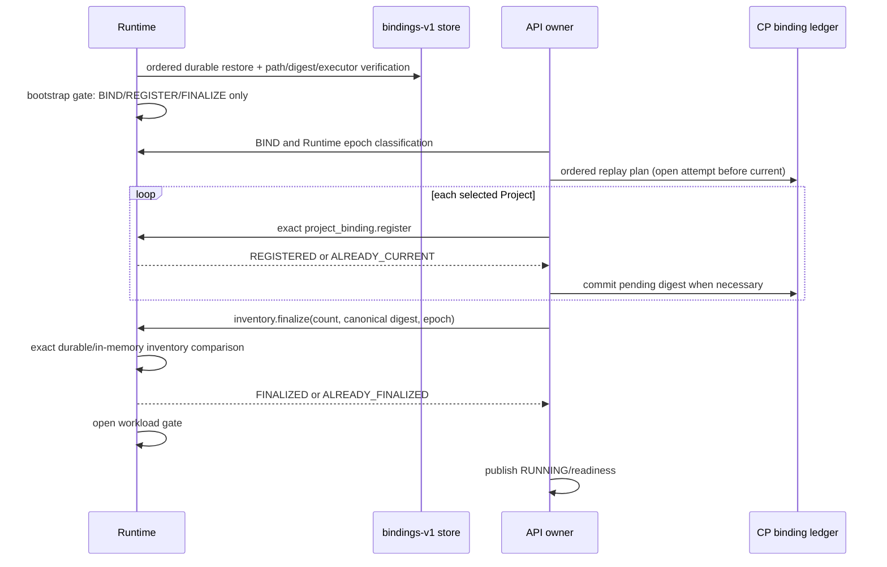

# R11 rc6 deterministic binding replay

状态：代码检查点 `9c12ab3`、CI fixture 修复 `3341c13` 与诊断 follow-up
`854cf87` 已完成本地验证、独立 Sol 复审和 PR #80 的 20/20 exact-head CI。
本文不表示 rc6、R11 或真实主机资格已经完成。

## 目标

Runtime 重启和 API authority 重建不能把“收到一条 register”当作 binding 层已恢复。
在任何 Start、ticket、Attach、stream、INPUT 或 RESIZE 变成可用之前，Control Plane
与 Runtime 必须对同一有界 Project binding inventory 达成精确确认。

## Closed commitment

`workspace.project_binding.inventory.finalize.v1` has only:

- request: `runtime_epoch`, `binding_count`, `inventory_digest`;
- response: the same fields plus `FINALIZED` or `ALREADY_FINALIZED`.

The digest uses the shared protocol projection, ordered by `project_id`, with at
most 256 records. Every record binds formal Project ID/key/revision, binding
revision/digest/predecessor, and Runtime host tuple. It rejects a missing binding
digest, duplicate Project, malformed predecessor or excess inventory. No path,
command, PID, terminal data or Secret crosses this action.

## Failure and lifecycle rules

- Runtime restores `bindings-v1` before listeners open. Store/verifier/executor
  failure leaves the workload gate closed.
- The bootstrap gate permits only BIND, REGISTER and FINALIZE. A new API authority
  clears the previous finalization and must replay again.
- An open binding attempt is replayed before the older current head. Runtime
  persistence followed by API response loss becomes reconciliation work; a later
  authority can receive `ALREADY_CURRENT`, commit the same digest and finalize.
- A `CURRENT` binding that becomes reconciliation-required atomically fences its
  matching nonterminal workspace rows and advances their revision. `STOPPING` is
  retained so generation-bound exact Stop can finish.
- Project revision/state changes atomically fence nonterminal workspaces. Start
  rechecks current binding after Runtime Start and after executable evidence;
  its final revision CAS rejects concurrent Project/binding drift.
- Ticket issuance, WebSocket admission, active relay input and browser
  publication all use the same transaction-bound Project/current-binding/host
  validation. A ticket issued before drift cannot establish or retain an
  interactive attachment.
- Runtime service installation creates `bindings-v1` as
  `agentbox-runtime:agentbox-runtime`, mode `0700`, and grants the Runtime only
  that exact `ReadWritePaths` child under `ProtectSystem=strict`.

## Local evidence

- Cross Protocol/Core/API/Runtime/relay/workspace/installer matrix: 346 passed,
  2 skipped (macOS lacks Linux `SO_PEERCRED`/pidfd and `systemd-analyze`).
- Black, Ruff, Linux-target mypy and `git diff --check` passed for the affected
  source and tests.
- A full local Python collection is unavailable because this environment lacks
  `agentbox_browser_trust`; the complete Linux CI matrix remains authoritative.
- The full installer lifecycle suite is blocked by the existing aarch64 qualified
  artifact/Runtime-compatibility gate. The new layout and deployment-asset tests
  pass; it does not constitute real systemd or host evidence.
- Two independent Sol reviews were performed. The first found two P1 and two P2;
  all were fixed and the second found no remaining P0/P1/P2 in the code scope.
- PR #80 exact head `854cf87774f3de22bd3a37bf74576dcfc29177ee` completed all
  20 checks successfully, including native, E2E, all four installer jobs,
  frontend, security, release candidate, and Backend Python 3.11/3.12/3.13.
  The initial head exposed only a missing test-fixture
  `RuntimeControl` method; `3341c13` repaired that typing contract. Two
  non-terminal Python 3.12 runner attempts were cancelled after abnormal test
  duration and are not counted as evidence. `854cf87` adds a faulthandler stack
  diagnostic without changing test assertions; its final Python 3.12 run passed
  in 4m23s.

## Remaining boundary

This increment still needs real UDS/systemd evidence and the full rc6 acceptance
set. It does not activate a host, validate real uid/gid or filesystem crash
recovery, or qualify a vendor CLI, CRX, trustd, PTY isolation or production
support. The next rc6 work is browser controller safety repair and page
composition.
