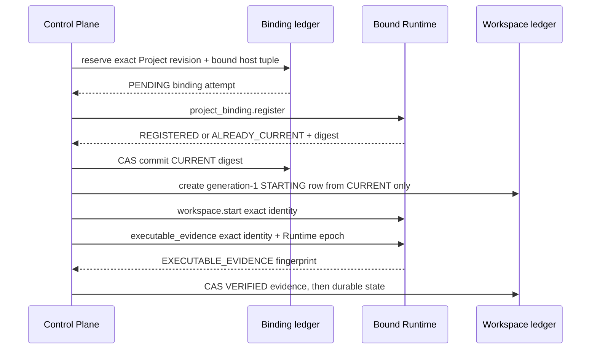

# R11 rc6 Project 首次使用与 Runtime 可执行文件证据

状态：实现检查点。代码提交 `708acd8aa9dc2af945f5664a7ba983c192affde4`
已完成本地定向验证；尚未获得该提交后的 exact-head CI、独立审查、合并或
真实主机证据。

本文件只定义 rc6-B 的已实现控制面路径。它不激活主机、不读取 Runtime HOME、
不处理 Provider Secret，也不把合成 Runtime 测试当作可用终端。

## 首次 Start 合同

对于一个 `READY` Project 和 `claude`/`codex`，没有预建 workspace 时，API 以
下列顺序执行：

`project_id`、relative key、Project revision、binding predecessor、Runtime host
identity、binding digest、workspace generation 和 executable fingerprint 都不来自
浏览器请求。浏览器只选择正式 Project、closed `AgentType` 并完成既有登录、CSRF
与 recent-auth 检查。

Runtime 主机元组必须同时满足绑定 coordinator 的已验证 attestation、binding
ledger 和 workspace row。Start 过程中的 Runtime epoch 变化、Runtime 回传的
host/identity/digest 不一致、或无法提交可执行文件证据，都会拒绝确认运行状态。

## 重试、并发与失败

- 同一首次请求重放相同的 `PENDING` binding；Runtime 只接受
  `REGISTERED` 或 `ALREADY_CURRENT`，控制面只 CAS 同一个 digest 为 `CURRENT`。
- 并发首次 Start 只能收敛到同一 binding revision 和确定性的
  `Project/AgentType` generation-1 workspace row。重复的 Runtime Start/Evidence
  只在当前同一 generation 的已验证结果上收敛，不能创造第二代 workspace。
- Runtime 注册发送后丢失响应、回传字段不匹配、Project CAS 失败或 Runtime
  host 漂移时，binding 进入 `RECONCILIATION_REQUIRED`。不会猜测 digest 或重建
  provenance。
- Start 调用或其回传不确定时，仍由该请求持有的 `STARTING` row 转为
  `UNKNOWN` / `reconciliation_required`；别的请求已经完成同一 generation 时，
  不会把它覆盖为未知。
- `RUNNING`、Attach 和 ticket issuance 都要求 `VERIFIED` evidence 的 generation
  与 Runtime epoch 正好匹配。`UNOBSERVED` 或 `STALE` 不能绕过该门槛。

可执行文件证据采用 closed control action
`workspace.workspace.executable_evidence.v1`。请求与响应要求完整 workspace
identity、binding、host tuple、Runtime epoch 与 64 个小写十六进制字符的 SHA-256
fingerprint；
Runtime 只会针对当前已启动的精确 supervisor 返回该值。

## 本地验证

- `ruff check`：10 个受影响 API、Protocol、Runtime 与测试文件通过。
- `black --check`：同一文件集通过。
- `mypy --platform linux`：8 个受影响 source/test 文件通过。
- 定向 pytest：168 passed，1 skipped。跳过项是 macOS 不具备的 Linux
  `SO_PEERCRED/pidfd` control-path 集成；该项将由 exact-head Linux CI 执行。
- 覆盖了 closed codec、Runtime registry/executor、真实 control-path 测试结构、
  首次绑定、并发首次 Start、Runtime registration 响应不匹配、host tuple 漂移、
  证据写入及停止前围栏。

这是结构化自查，rc6 所需独立 architecture/security/test review 仍待完成。完整
rc6-B 还需 startup/restart 下的 deterministic binding replay 与 migration/host
drift 组合证据；rc6-C browser controller 页面接线也尚未完成。

## 后续边界

本检查点不改变 rc7、rc8、rc9 或 R12 的顺序。下一步先推送并读取本提交后的
exact-head CI；只有 CI 终态成功后，才把它记录为已验证的 rc6 子阶段并继续
rc6 的剩余 restart/controller 组合工作。
