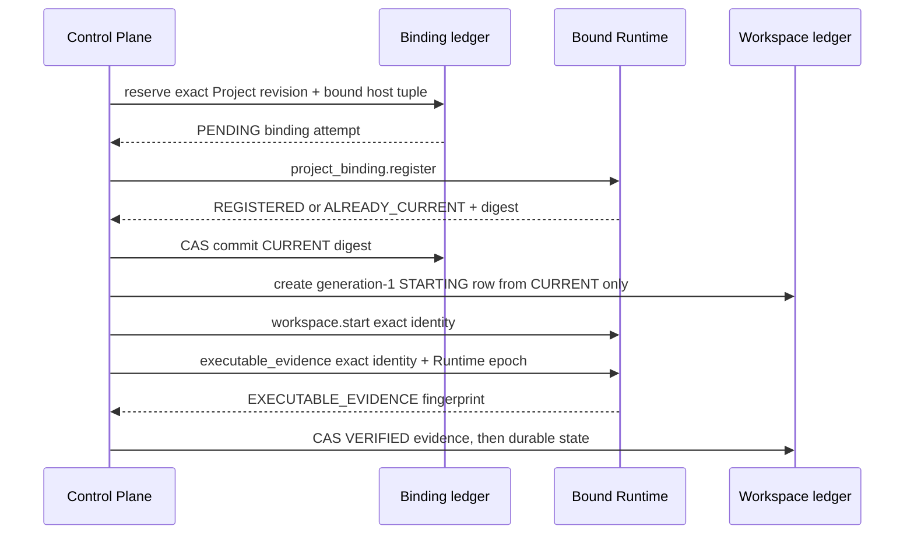

# R11 rc6 Project 首次使用与 Runtime 可执行文件证据

状态：CI 验证检查点。首次使用代码提交
`708acd8aa9dc2af945f5664a7ba983c192affde4` 的第一次 exact-head CI 有 17/20
通过、3 个 Backend Python matrix 失败；descriptor 修复 `3ba85cb` 与本文件的
`bbdd67c` exact head 已完成 20/20。随后纯文档 head `801a494` 的 Linux native
attach READY 确认未通过固定短轮询，修复 `af4d43e` 改为受同一单调 1 秒 deadline
约束的精确身份确认；其 native CI 已通过。随后 `2381171` 的 Python quality 只因
回归测试未格式化而失败，格式修复 `9d078b4` 与文档 head `4222242` 已完成新的
20/20 CI。rc6-B 的启动 replay、独立审查、完整 rc6 合并和真实主机证据仍未完成。

本文件只定义 rc6-B 的已实现控制面路径。它不激活主机、不读取 Runtime HOME、
不处理 Provider Secret，也不把合成 Runtime 测试当作可用终端。

## 首次 Start 合同

对于一个 `READY` Project 和 `claude`/`codex`，没有预建 workspace 时，API 以
下列顺序执行：

`project_id`、relative key、Project revision、binding predecessor、Runtime host
identity、binding digest、workspace generation 和 executable fingerprint 都不来自
浏览器请求。浏览器只选择正式 Project、closed `AgentType` 并完成既有登录、CSRF
与 recent-auth 检查。

Runtime 主机元组必须同时满足绑定 coordinator 的已验证 attestation、binding
ledger 和 workspace row。Start 过程中的 Runtime epoch 变化、Runtime 回传的
host/identity/digest 不一致、或无法提交可执行文件证据，都会拒绝确认运行状态。

## 重试、并发与失败

- 同一首次请求重放相同的 `PENDING` binding；Runtime 只接受
  `REGISTERED` 或 `ALREADY_CURRENT`，控制面只 CAS 同一个 digest 为 `CURRENT`。
- 并发首次 Start 只能收敛到同一 binding revision 和确定性的
  `Project/AgentType` generation-1 workspace row。重复的 Runtime Start/Evidence
  只在当前同一 generation 的已验证结果上收敛，不能创造第二代 workspace。
- Runtime 注册发送后丢失响应、回传字段不匹配、Project CAS 失败或 Runtime
  host 漂移时，binding 进入 `RECONCILIATION_REQUIRED`。不会猜测 digest 或重建
  provenance。
- Start 调用或其回传不确定时，仍由该请求持有的 `STARTING` row 转为
  `UNKNOWN` / `reconciliation_required`；别的请求已经完成同一 generation 时，
  不会把它覆盖为未知。
- `RUNNING`、Attach 和 ticket issuance 都要求 `VERIFIED` evidence 的 generation
  与 Runtime epoch 正好匹配。`UNOBSERVED` 或 `STALE` 不能绕过该门槛。

可执行文件证据采用 closed control action
`workspace.workspace.executable_evidence.v1`。请求与响应要求完整 workspace
identity、binding、host tuple、Runtime epoch 与 64 个小写十六进制字符的 SHA-256
fingerprint；
Runtime 只会针对当前已启动的精确 supervisor 返回该值。

## 本地验证

- `029378e` exact-head CI：E2E、native、release、installer、安全和其余质量
  检查通过；Python 3.11/3.12/3.13 都在
  `test_verifier_uses_descriptor_held_project_identity` 失败。根因是 Linux 允许
  删除后重用 inode，而旧 verifier 在两次登记之间释放 Project descriptor；不是
  SHA-256 碰撞，也没有把失败的 CI 写成通过。
- `3ba85cb` 将每个成功验证 `relative_key` 的目录 descriptor 交由 verifier 持有，
  上限为 256；后续登记会把 named path 与 held descriptor 比对，关闭时统一释放
  所有 owned descriptors。新的 inode-reuse 与 descriptor-capacity 回归均通过。
- 修复后的 `bbdd67c` exact-head CI 为 20/20 `SUCCESS`，包括 Linux native、E2E、
  release-candidate、installer、安全检查和 Python 3.11/3.12/3.13 Backend matrix。
- 后续 `801a494` exact head 的唯一失败是 native attach READY 的 status 71；当时
  生产代码与 `bbdd67c` 相同，其余 19 项检查通过。`af4d43e` 不依赖外层测试
  重试，也不放宽 tmux client identity，而是用 `AGENTBOX_WAW_READY_DEADLINE_MS` 的统一
  `CLOCK_MONOTONIC` deadline 限制 exec、query、PID 存活复核和 20ms 轮询。
  `2381171` 的 Linux native 已通过；portable C17 gate 与 native helper 单测通过。
- 同一 `2381171` head 的三组 Python quality 在 Black format gate 失败，唯一差异
  是 `test_waw_native_helpers.py` 的一行未按 Black 收束；`9d078b4` 只格式化该行，
  本地 Black/Ruff/pytest 已通过，随 `4222242` exact head 完成 20/20 CI。
- `ruff check`：12 个受影响 API、Protocol、Runtime 与测试文件通过。
- `black --check`：同一文件集通过。
- `mypy --platform linux`：10 个受影响 source/test 文件通过。
- 扩展定向 pytest：169 passed，1 skipped。跳过项是 macOS 不具备的 Linux
  `SO_PEERCRED/pidfd` control-path 集成；该项将由 exact-head Linux CI 执行。
- 覆盖了 closed codec、Runtime registry/executor、真实 control-path 测试结构、
  首次绑定、并发首次 Start、Runtime registration 响应不匹配、host tuple 漂移、
  证据写入及停止前围栏。

这是结构化自查，rc6 所需独立 architecture/security/test review 仍待完成。完整
rc6-B 还需 startup/restart 下的 deterministic binding replay 与 migration/host
drift 组合证据；rc6-C browser controller 页面接线也尚未完成。

## Deterministic replay 检查点

提交 `9c12ab3` 实现了本文件此前列出的 replay/finalize 规则，包括 Runtime eager
restore、API ordered replay、inventory commitment、Project/Binding drift fence 和
`bindings-v1` installer boundary。完整契约和本地验证见
[R11 rc6 binding replay](WAW_R11_RC6_BINDING_REPLAY.md)。该代码仍待 exact-head CI，
且不代表 rc6-B 或完整 rc6 已完成。

## 后续边界

本检查点不改变 rc7、rc8、rc9 或 R12 的顺序。下一步读取 `9c12ab3` 的 exact-head
结果；它通过后才继续 rc6-C browser controller 页面组合。
