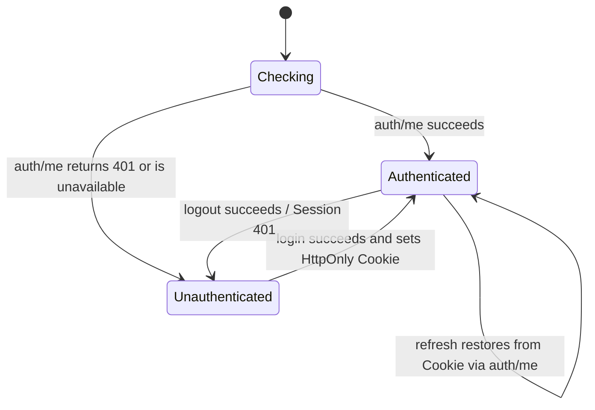

# AgentBox Web UI

Status: Phase 4 authenticated Web foundation and Phase 5 Codex page merged;
Phase 6 Claude page is implemented on its Draft review branch. Future Provider
UI is planning only.

## Product boundary

The Web UI is the daily, authenticated control surface for one AgentBox
workstation. It is not a browser IDE, Web terminal, generic Linux panel, or
source of authorization truth. Server-side services enforce every permission;
client route guards exist only to provide a coherent user experience.

Phase 4 implements the product frame and browser authentication lifecycle.
Phase 5 replaces the Codex placeholder and Phase 6 replaces the Claude
placeholder with typed API-backed surfaces. The browser never calls a Runtime
binary or socket directly. Project CRUD, Git/GitHub business operations, the
Privileged Helper, installer, systemd, host log tools, Provider Manager, and
Secret Manager remain absent.

## Route map

| Route | Authentication | Current behavior |
|---|---|---|
| `/` | resolved during auth boot | redirects to Dashboard or Login |
| `/login` | public-only | local administrator Login; authenticated users go to Dashboard |
| `/dashboard` | required | real liveness, readiness, metadata, administrator and Session expiry |
| `/codex` | required | real installation/capability/Remote state, bounded start/stop, explicit ephemeral Pair flow, diagnostics |
| `/claude` | required | real public capability/tmux summary and configured project session cards with start/stop/attach/output |
| `/projects` | required | planned-capability shell only |
| `/doctor` | required | real control-plane-only checks from `GET /api/v1/doctor` |
| `/logs` | required | not-implemented shell; no journal or file access |
| `/settings` | required | safe read-only policy from the Doctor response |
| any other path | public branded fallback | 404 with local navigation only |

There is no `next` query parameter or externally supplied redirect target.

## Authentication lifecycle

The browser never reads or stores the opaque Session token. The server sets it
as `agentbox_session`; every fetch uses `credentials: include`. `AuthProvider`
holds safe user metadata, Session ID/expiry, and the Session-bound CSRF token in
React memory. Refreshing the document clears memory and recovers through
`auth/me`. `localStorage`, `sessionStorage`, and IndexedDB are not authentication
stores.

Initial rendering remains in `checking` until recovery finishes, avoiding a
Login flash before Dashboard. A protected API `401` clears in-memory state and
causes the route guard to select Login. It does not recursively call `auth/me`.

## CSRF and logout

Logout sends `X-CSRF-Token` from the authenticated in-memory state. If the
server returns `403`, the provider may fetch `auth/me` once and retry logout once
with the refreshed token. A second failure is surfaced and is never retried.
The server remains responsible for exact Origin/Host checks and Session-bound
token validation.

## API client

One native-fetch `ApiClient` provides:

- app-relative paths and a ten-second default timeout;
- Cookie credentials on every request;
- JSON request/response conventions;
- optional CSRF header for mutations;
- V1 error-envelope parsing;
- status, stable code, bounded message, safe request ID, and Retry-After;
- centralized unauthorized recovery.

The client never accepts an absolute URL. Request IDs must match a 72-character
bounded alphanumeric/punctuation grammar before display. Non-JSON proxy failures
become a generic control-plane error. Pages do not render server objects or
exception details.

## Status semantics

The UI uses these terms consistently:

- `Healthy`: liveness endpoint returned its defined success state;
- `Ready`: all displayed control-plane readiness checks passed;
- `Not Ready`: a real readiness check failed;
- `Unavailable`: data could not be retrieved;
- `Planned`: a future capability preview with no active control;
- `Not Implemented`: the surface exists but its product capability does not.

`Online`, `Connected`, `Running`, and numeric Runtime/Project counts are not
shown without real corresponding API evidence. Codex 页面只有在 `reported` 或
strict-process `inferred` 实时证据存在时才显示 `Running`；成功 action 的历史
结果不会当作当前状态。Test Runtime fixtures enter only through explicit
application dependency injection; production code always uses the UDS client.

## Codex interaction lifecycle

The page fetches `GET /api/v1/codex/status` on entry and only on explicit
Refresh or after a completed lifecycle action; it does not poll every second.
Buttons are enabled by individual tri-state capabilities and current state.
Start/stop send no caller parameters and use the shared API client's Cookie,
CSRF, timeout, error-envelope, and `401` recovery behavior.

Pair requires an explicit button and then an explicit confirmation. The value
lives in one React state object, is not copied automatically, and is cleared on
Hide, route unmount, or after 90 seconds. Copy is a separate user action.
Neither Web Storage nor the URL, title, data attributes, console, analytics, or
page metadata receives the code. The UI distinguishes its display timeout from
an optional Runtime-reported expiry and never invents an expiry.

## Claude interaction lifecycle

The page fetches status and configured project sessions on entry/explicit
Refresh. Start/stop sends only the URL-encoded project ID plus session-bound
CSRF; there is no body, path field, tmux name, or flag input. Each mobile-first
card separately shows tmux state and Remote readiness. Unknown output or a
running pane is never labeled Connected. `needs_interaction` explains manual
terminal interaction and states that AgentBox never accepts Workspace Trust.
After manual confirmation, the user exits interactive Claude and explicitly
stops/starts the session again; the page does not retry in a loop.

Attach copy is explicit and contains only the Runtime-generated safe name; no
SSH topology or Web terminal is provided. Stop copy clarifies that the project
is not deleted. Recent output is collapsed by default, labelled Sensitive,
fetched only on Reveal, rendered as text in `pre`, and cleared on Hide/unmount.
It is never written to Web Storage. Browser traces/screenshots are disabled in
canary-bearing E2E runs.

## Responsive model

The UI is dark-first and uses neutral surfaces, subtle borders, strong heading
hierarchy, and 44-pixel primary touch targets. At 900 pixels and above, a sticky
sidebar provides primary navigation. Below 900 pixels, a compact sticky header
opens a full-height navigation drawer. Content grids collapse to one column on
small phones, then two/four columns as space permits. User-controlled IDs and
metadata wrap instead of causing horizontal scroll.

Claude runtime/session grids collapse to one column on mobile and two on wider
screens. The browser suite exercises 1280×800 desktop and 390×844 mobile layouts.
Additional layout review targets 360, 768, and 1024 pixel widths before release.

## Accessibility baseline

- semantic `main`, `nav`, `header`, sections, headings, labels, lists, and
  definition lists;
- visible keyboard focus across links, fields, drawer control, and buttons;
- labelled username/password inputs and icon-only navigation control;
- disabled pending buttons and status/alert roles;
- reduced-motion preference disables the only loading pulse animation;
- status meaning is carried by text, not color alone.

Phase 4 includes semantic and interaction smoke coverage but does not claim a
formal WCAG audit. A dedicated axe/manual screen-reader review remains a release
hardening task.

## Browser security

- no `dangerouslySetInnerHTML`, `eval`, `new Function`, remote analytics,
  remote font, or arbitrary CDN script;
- no wildcard CORS; development uses the Vite same-origin proxy;
- no external redirect facility;
- no credential, password, CSRF, Session, or secret logging;
- API auth and Doctor responses are `Cache-Control: no-store`;
- production assets are external hashed files compatible with `script-src
  'self'` and `style-src 'self'` without unsafe CSP directives;
- the static HTML contains no authenticated or user-specific state.

Phase 8 must make HTML cache behavior explicit at the static server/reverse
proxy and preserve AgentBox security headers. HSTS belongs only to an approved
HTTPS deployment, never loopback development HTTP.

## Test architecture

`pnpm e2e` creates a fresh temporary directory and random loopback ports,
generates a test-only application secret and password in memory, explicitly
runs Alembic, initializes one test admin, starts an independent API and Vite
production preview, runs Chromium, and cleans up all processes and files. It
never uses `.agentbox-dev`, real auth state, a public listener, or GitHub
Secrets. Desktop and mobile each execute the same 21 logical security and UX
scenarios (42 executions). Phase 5 covers Codex and Pair; Phase 6 adds Claude
auth protection, capability/state, start/duplicate/stop, Needs Interaction,
attach copy, explicit output/no-store/no-storage, unmanaged count-only behavior,
Unknown semantics, and mobile layout. Pair/output canaries are scanned from
temporary DB and retained artifacts; traces/screenshots are disabled.

## Future boundaries

### Providers (Phase 11 planning only)

A future authenticated `/providers` page may list Provider cards such as
Official OpenAI, OpenAI-compatible, local, and Runtime-native/built-in. Each
card shows Provider, Model, Type, Provider Status, Runtime Status, Remote Status,
Continuity Level, and Last Tested. Its detail matrix independently renders
Network, Authentication, Model Availability, Wire Protocol, Provider API,
Runtime, Remote, Thread Resume, Context Continuity, and Thread Discovery using
PASS/FAIL/UNSUPPORTED/EXPERIMENTAL/UNKNOWN/NOT_TESTED. A Runtime request can be
PASS while Discovery is FAIL; the UI never collapses partial evidence into one
green status.

Planned actions are Add, Edit, Test, Activate, Rotate Secret, and Delete.
Add/Edit use typed Provider-specific fields. Secret entry, once separately
designed, uses a dedicated transient no-echo flow and returns only masked
configured/reference state; lists, detail views, ordinary pages, errors,
browser storage, analytics, logs, and Audit metadata never receive the API key.
Delete checks active/binding/rollback references and does not implicitly delete
a Secret. Rotate Secret preserves ProviderDefinitionID, RuntimeBindingID, model,
and base URL, then shows authentication/protocol retest state.

Activate first presents a revision-bound preflight with Current Provider,
Target Provider, active-writer state, Runtime impact, Remote impact, Continuity
confidence, and Restart required. Unknown writer evidence requires explicit
turn-complete confirmation. The transaction view shows Preflight, Snapshot,
Validate, Apply, Runtime/Remote/Continuity verification, Commit, or Rollback;
recovery copy says only `Rollback attempted` or `Rollback verified` according
to evidence. `Thread not listed` is never rendered as `Thread deleted`.
Connectivity, Runtime, and Continuity tests are separate, and paid inference
requires an explicit `Run paid model test` confirmation. No Provider route or
action is implemented today.

Later phases may replace the remaining planned cards only after real versioned
APIs exist. Runtime pages must consume Capability states and must never directly
construct CLI commands. Job progress should use SSE when the durable Job service exists.
WebSocket is reserved for a future genuinely bidirectional use case and is not
justified by this application shell. Browser terminal functionality remains out
of MVP scope.
