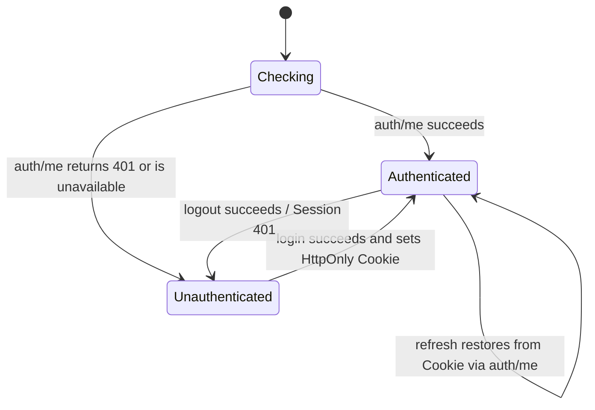

# AgentBox Web UI

Status: Phase 4 authenticated Web foundation implemented on its feature branch.

## Product boundary

The Web UI is the daily, authenticated control surface for one AgentBox
workstation. It is not a browser IDE, Web terminal, generic Linux panel, or
source of authorization truth. Server-side services enforce every permission;
client route guards exist only to provide a coherent user experience.

Phase 4 implements the product frame and browser authentication lifecycle. It
does not call Codex, Claude, tmux, Git, GitHub, the Runtime Executor, the
Privileged Helper, an installer, systemd, or host log tools.

## Route map

| Route | Authentication | Phase 4 behavior |
|---|---|---|
| `/` | resolved during auth boot | redirects to Dashboard or Login |
| `/login` | public-only | local administrator Login; authenticated users go to Dashboard |
| `/dashboard` | required | real liveness, readiness, metadata, administrator and Session expiry |
| `/codex` | required | planned-capability shell only |
| `/claude` | required | planned-capability shell only |
| `/projects` | required | planned-capability shell only |
| `/doctor` | required | real control-plane-only checks from `GET /api/v1/doctor` |
| `/logs` | required | not-implemented shell; no journal or file access |
| `/settings` | required | safe read-only policy from the Doctor response |
| any other path | public branded fallback | 404 with local navigation only |

There is no `next` query parameter or externally supplied redirect target.

## Authentication lifecycle

The browser never reads or stores the opaque Session token. The server sets it
as `agentbox_session`; every fetch uses `credentials: include`. `AuthProvider`
holds safe user metadata, Session ID/expiry, and the Session-bound CSRF token in
React memory. Refreshing the document clears memory and recovers through
`auth/me`. `localStorage`, `sessionStorage`, and IndexedDB are not authentication
stores.

Initial rendering remains in `checking` until recovery finishes, avoiding a
Login flash before Dashboard. A protected API `401` clears in-memory state and
causes the route guard to select Login. It does not recursively call `auth/me`.

## CSRF and logout

Logout sends `X-CSRF-Token` from the authenticated in-memory state. If the
server returns `403`, the provider may fetch `auth/me` once and retry logout once
with the refreshed token. A second failure is surfaced and is never retried.
The server remains responsible for exact Origin/Host checks and Session-bound
token validation.

## API client

One native-fetch `ApiClient` provides:

- app-relative paths and a ten-second default timeout;
- Cookie credentials on every request;
- JSON request/response conventions;
- optional CSRF header for mutations;
- V1 error-envelope parsing;
- status, stable code, bounded message, safe request ID, and Retry-After;
- centralized unauthorized recovery.

The client never accepts an absolute URL. Request IDs must match a 72-character
bounded alphanumeric/punctuation grammar before display. Non-JSON proxy failures
become a generic control-plane error. Pages do not render server objects or
exception details.

## Status semantics

The UI uses these terms consistently:

- `Healthy`: liveness endpoint returned its defined success state;
- `Ready`: all displayed control-plane readiness checks passed;
- `Not Ready`: a real readiness check failed;
- `Unavailable`: data could not be retrieved;
- `Planned`: a future capability preview with no active control;
- `Not Implemented`: the surface exists but its product capability does not.

`Online`, `Connected`, `Running`, and numeric Runtime/Project counts are not
shown without real corresponding API evidence. Phase 4 has no fake Runtime
fixtures in production code.

## Responsive model

The UI is dark-first and uses neutral surfaces, subtle borders, strong heading
hierarchy, and 44-pixel primary touch targets. At 900 pixels and above, a sticky
sidebar provides primary navigation. Below 900 pixels, a compact sticky header
opens a full-height navigation drawer. Content grids collapse to one column on
small phones, then two/four columns as space permits. User-controlled IDs and
metadata wrap instead of causing horizontal scroll.

The browser suite exercises 1280×800 desktop and 390×844 mobile layouts.
Additional layout review targets 360, 768, and 1024 pixel widths before release.

## Accessibility baseline

- semantic `main`, `nav`, `header`, sections, headings, labels, lists, and
  definition lists;
- visible keyboard focus across links, fields, drawer control, and buttons;
- labelled username/password inputs and icon-only navigation control;
- disabled pending buttons and status/alert roles;
- reduced-motion preference disables the only loading pulse animation;
- status meaning is carried by text, not color alone.

Phase 4 includes semantic and interaction smoke coverage but does not claim a
formal WCAG audit. A dedicated axe/manual screen-reader review remains a release
hardening task.

## Browser security

- no `dangerouslySetInnerHTML`, `eval`, `new Function`, remote analytics,
  remote font, or arbitrary CDN script;
- no wildcard CORS; development uses the Vite same-origin proxy;
- no external redirect facility;
- no credential, password, CSRF, Session, or secret logging;
- API auth and Doctor responses are `Cache-Control: no-store`;
- production assets are external hashed files compatible with `script-src
  'self'` and `style-src 'self'` without unsafe CSP directives;
- the static HTML contains no authenticated or user-specific state.

Phase 8 must make HTML cache behavior explicit at the static server/reverse
proxy and preserve AgentBox security headers. HSTS belongs only to an approved
HTTPS deployment, never loopback development HTTP.

## Test architecture

`pnpm e2e` creates a fresh temporary directory and random loopback ports,
generates a test-only application secret and password in memory, explicitly
runs Alembic, initializes one test admin, starts an independent API and Vite
production preview, runs Chromium, and cleans up all processes and files. It
never uses `.agentbox-dev`, real auth state, a public listener, or GitHub
Secrets. Desktop and mobile each execute the same ten logical security and UX
scenarios.

## Future boundaries

Phase 5+ may replace planned cards only after real versioned APIs exist. Runtime
pages must consume Capability states and must never directly construct CLI
commands. Job progress should use SSE when the durable Job service exists.
WebSocket is reserved for a future genuinely bidirectional use case and is not
justified by this application shell. Browser terminal functionality remains out
of MVP scope.
