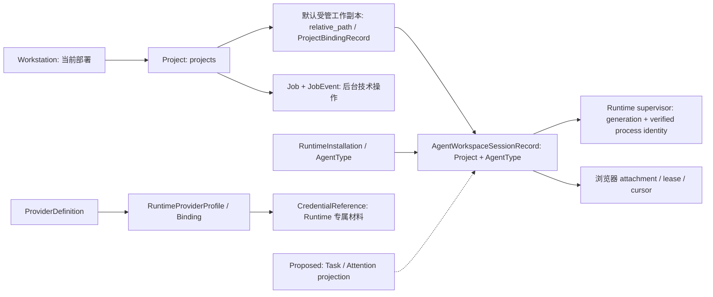

# AgentBox 私人 AI 开发工作站：增量研究与决策

状态：研究与首增量契约已完成；WEV-1 实现/验收进行中。研究建议不会自动改变 Accepted 架构或开放 R12。
研究日期：2026-09-08。面向单台 Linux 工作站、单管理员。

## 阅读路径与证据规则

- 决策者：先看核心流程断点、取舍与增量顺序。
- 开发与测试：看领域/状态映射、首增量契约、恢复矩阵与验收记录。
- 操作者：看能力限制、R12 输入和恢复条件；研究副本不是安装说明。
- 横向能力与逐项证据见 [CAPABILITY_MATRIX](CAPABILITY_MATRIX.md)。本文件不另建 Roadmap；执行入口仍是 [NEXT_ACTION](project/NEXT_ACTION.md) 和 [ROADMAP](project/ROADMAP.md)。

证据标记：D=官方文档宣称；C=固定提交的源码观察；T=读取到相关测试；R=本次实际运行。T 不等于测试通过，CI 不等于真实主机资格。Unknown 表示证据不足，不表示项目不支持。优先级为当前用户要求/治理 → 实时 Git/GitHub → 代码与运行证据 → 快照 → 研究建议。

## 审计基线与授权

本次取得的基线为 `ForceMind/agentbox` 的 `main`，commit
`b72f6ea67647d63ce26ae5610094e8aec34f7a78`。开始时工作区干净，
local main、origin/main 与 merge-base 相同；`git fetch origin --prune` exit 0。
开放 PR 只有历史 Draft [#42](https://github.com/ForceMind/agentbox/pull/42)，不在写入范围。
上述基线的 push CI 六项均为 success：Backend `34051700050`、Security
`34051700185`、Deployment `34051700096`、Frontend `34051700057`、E2E
`34051700093`、Release Candidate `34051700035`。这些是本次修改前的证据。

用户此次授权审计、指定项目研究、现有计划衔接，以及现行权限内第一个独立软件改进。
沿用日常 feature branch → CI → normal merge → exact read-back。软件决策依据
[GOVERNANCE](project/GOVERNANCE.md)；新领域/协议建议保持 Proposed。真实主机、
Provider Secret、发布和支持承诺需要具体目标与独立授权。首增量只改已有 Web
状态刷新与动作校验，不需要新 API、DB 表、Secret 或终端协议。

本轮主 Goal：完成研究、能力矩阵、依赖计划及首增量的实现/验证/审查/仓库同步。
工作分支：`codex/workstation-evolution`。没有指定 token 或时间预算；研究限定七仓，
副本在隔离临时目录，不执行第三方安装、构建、postinstall 或容器脚本。

## 核心流程的实际断点

| 步骤 | 规范与实现事实 | 用户可用性/剩余条件 |
| --- | --- | --- |
| 安全安装、初始化 | Installer 有计划/事务/校验/回滚；CLI `admin init` 检查本地 TTY | rc1 既有平台证据不自动覆盖最新 WAW；首次管理员仍本地初始化 |
| Runtime 检测、正式 Project | 已有 public CLI detection、typed UDS、Project create/clone Job | 现有受限管理流程可复用；未知能力不得当成登录/准备完成 |
| 启动受支持 Agent、连接、输入 | R11 的 controller/relay/crypto/PTY 组合已有软件与 CI 证据 | 生产 trust provider/host/executable/隔离证据缺失时仍 NOT ADMITTED；这是最短真实核心闭环的首个阻断 |
| 离开并返回浏览器 | attachment 会在隐藏时 fence；基线 status hook 只 mount/手动刷新 | 返回后仍可保留旧 Runtime 观察，这是本轮可独立修复的软件缺口 |
| 看结果与代码变化 | 有受控终端和 Git 分支/dirty/PR 状态；没有可调用的文件树/patch Diff API | 文本/计数不等于修改检查，更不等于测试通过 |
| 明天继续 | DB 保留 Project/Job/WAW 身份；重新 attach 与 CLI context resume 不同 | 服务器重启后原内存进程不复活；真实 Resume/发现/接管尚无产品验收 |

当前最多能声称“Runtime 管理和受限会话管理有软件/部分既有主机证据”。不能整体
宣称 Level 2 或 Level 3；完整新交互流尚未取得 R12 产品证据。本轮不做竞品性能排名。

这个断点不仅是“等待测主机”。具体源码观察：API `main.py` 的模块级 app/run 使用
默认 `WAWMode.DISABLED`；Runtime `server.py::_main` 构造 legacy executor，尚未选择
`build_waw_runtime_application_from_filesystem_v2`；production executor/static-key
port 的具体提供方仍只有测试实现。浏览器生成的 `WAW_TRUST_EXTENSION_ID` 是 null，
普通 MV3 包保持 inert。因此 R12 要分别闭合 production bootstrap/provider、activated
socket/隔离和受管浏览器信任安装，不能仅添加开关或把合成 harness 改成生产入口。

### R12 production bootstrap and host gates

以下是同一 R12 的实施与验收缺口，不是本轮 WEV-1 的隐含授权。每项必须在具体
目标主机、Runtime user、Project、浏览器信任和凭据范围获准后单独留证。

| 门禁 | 当前源码事实 | 完成证据与失败处理 |
| --- | --- | --- |
| 生产 API composition | `create_app()` 默认 `WAWMode.DISABLED`，模块入口未选择 production WAW 组合 | 显式、可审计的 mode/composition 与依赖验证；缺项保持未准入，不以测试 harness 或开关绕过 |
| Runtime production provider | `server.py::_main` 仍构造 legacy executor；filesystem-v2 builder 存在，concrete executor/static-key port 尚缺生产接线 | 固定 executor、Runtime 专属 key authority 和 builder 的真实组合；启动失败保持 fail-closed，并可恢复原受限管理服务 |
| 已安装的 socket 与隔离 | 软件有 typed/control/stream 组合证据，当前安装入口未激活完整 WAW 路径 | 目标主机 socket activation、peer identity、cgroup/namespace/LSM/seccomp 与断启恢复证据；不降级为任意 shell 或宽权限 |
| 受管浏览器信任安装 | 生成 extension ID 为 `null`，普通 MV3 包 inert | managed CRX identity、Native Messaging host、trustd enrollment/撤销与恢复记录；未知或失配身份拒绝终端准入 |
| 真实用户工作流 | CI/夹具不能证明已安装 CLI 可用或断电后恢复 | 明确版本的 Claude/Codex 登录、正式 Project 启动、输入 ACK、离开/返回、detach/reconnect、exact Stop、服务与主机重启验收；记录失效分类及恢复步骤，不把重启称作 Resume |

对应实现与测试入口见 [AB09](CAPABILITY_MATRIX.md#本仓证据索引)；主机条件继续使用
[现有 host gate](WAW1_HOST_GATE_CHECKLIST.md)，不另建竞争性的准入规则。

## 本仓库调用链与能力事实

- **正式项目和后台工作**：`ProjectsPage` → `useProjects` → `projects.py` 的 create/clone
  → `ProjectService`/`JobService.enqueue` → Worker `_execute_project_job` → Runtime
  `ProjectRuntimeClient` → `ProjectWorkspaceManager`/`GitAdapter`。READY 发生在 Runtime
  workspace 激活后；Job 到期进入 `needs_attention`，不会自动重放不确定副作用。
- **诊断**：`DoctorPage` → `useDoctor` → `/api/v1/doctor` → 五项 Runtime typed probes
  与 Control Plane checks。Doctor ready 是控制平面结果；不是 WAW admission。
  CLI 和 Installer 的诊断/导出已有实现，不应新建第二套 Doctor。
- **Git/PR**：Project detail → API enqueue → Worker → Runtime `GitAdapter`/
  `GitHubAdapter`。Status 是 porcelain v2 摘要；pull 限 ff-only，push 是显式 refspec，
  hooks/pager/external diff/凭据继承受约束。Stage/Commit/Files/Diff 需要另外契约。
- **备份/回滚**：Installer `apply` → `_backup_before_change` → `create_sqlite_backup`
  (SQLite backup API + integrity check + digests) → receipt-bound rollback。
  此备份不包含代码树/Runtime 凭据；迁移设计不是任意可用 Restore API。
- **权限**：Web/API/Worker 只使用固定 Runtime 操作；Helper 协议只有六种固定 systemd
  生命周期动作。Provider approval 是特定 Secret provision 事务，不能复用成 Agent
  工具审批；浏览器认证 Session 也不能重命名成 AI Session。

本次基线 R：`pytest tests/unit/test_jobs.py tests/unit/test_installer_backup.py -q`
10 passed；Web `useWorkspaceStatus.test.tsx` 9 passed。使用隔离测试夹具，不使用真实
凭据/主机。没有运行第三方产品，也没有测量其成功率、延迟或资源占用。

### 技术债、重复抽象与文档差异

| 观察 | 影响与依据 | 处理决定 |
| --- | --- | --- |
| `CURRENT_STATE`/`EXECUTION_PLAN` 混有早期“当前未提交/下一步”段落 | 容易把R11已交付误判成待做，或将旧baseline当live | 本轮加当前任务快照/历史标记；保留原证据，不逐条重写历史 |
| `KNOWN_LIMITATIONS`/旧readiness说crypto/terminal未实现，R11记录已组合 | 规范历史与实现事实时点不同 | 加2026-09-08明确更正与现行矩阵链接；生产未准入结论保持 |
| API/Runtime生产入口仍未选用已有WAW组合builder | CI组合成功不等于安装后能连CLI | R12必须列production bootstrap/provider与真实运行两类交付，不仅列测试 |
| 多个hook重复safe error/technical投影 | allowed字段与code边界并不相同，统一可能放宽安全约束 | 记录P3维护债；首增量复用workspace投影，不做全局重构 |
| Workspace与AI Session共用Project+AgentType记录 | 不支持把多任务/多workspace愿景直接映射为现有多对话产品 | 现阶段保留；新增领域仅在明确用户流程和迁移方案后Proposed |
| 首页/Logs的能力说明不是可查询的工作Activity | 用户看不到已做什么；Job进展不是任务完成比例 | 后续先投影已有可信事件，禁止终端文本推导真实进度或测试结果 |

本次不把未复现的性能猜测升级为P0。现有大型协议/适配层保留；没有以换框架、
添加第二套消息总线或删除测试来降低实现成本。

## 领域和状态映射

`sessions` 表实际为 `ControlPlaneSession`（Web 登录），不能当 AI 会话历史。
`waw_agent_workspace_sessions` 是一个 Project/AgentType 的可代次化工作区记录，
不是通用“一 Workspace 任意多对话”。Workstation 沿用现有部署 identity；Task、
Attention 和多 Worktree 没有解决首缺口，不建新表。后续扩展先做映射再提 ADR。

| 维度 | 已有来源 | 展示/恢复含义 |
| --- | --- | --- |
| 执行 | Workspace metadata + Runtime status | RUNNING/STOPPED/UNKNOWN 是进程观察，不是任务进度 |
| 客户端连接 | WAW attachment controller | CONNECTED/FENCED/DETACHED 不代替执行状态 |
| 交互 | TRUST_REQUIRED / LOGIN_REQUIRED / NEEDS_INTERACTION | 不从终端字串推断审批并发送 y/yes |
| 可恢复性 | generation/binding/epoch/cursor + vendor capability evidence | Attach/Reconnect、Resume、History 分开；unknown/unsupported 均合法 |
| 所有权 | verified Runtime process identity + exact Stop operation | 不能凭 PID/name/tmux 名认领外部实例 |
| 观察有效性 | 当前文档 lifecycle epoch、最近一次响应接收时间 | 接收时间不是服务器观察时间；不会给无依据的 TTL/健康保证 |

## 恢复矩阵

| 故障 | 可信材料与责任 | 自动/人工恢复及证据 |
| --- | --- | --- |
| 浏览器隐藏、关闭、freeze | Runtime 仍拥有进程；客户端 authority 被 fence | 返回只读重取状态，用户显式 Connect；本轮补事件覆盖 |
| 网络断开/慢客户端 | 传输 ACK、generation、bounded cursor；socket write 不等于执行 | fail-closed + bounded output/背压；不自动重发输入，不保证无限历史 |
| API/Runtime 重启 | durable epoch/binding/cleanup ledger；旧 channel key 不再权威 | R11 classification/replay 软件证据；真实服务重启资格依赖 R12 |
| Worker 重启/lease 到期/Git 中断 | Job ledger 是操作记录，不证明外部副作用完成 | `recover_expired` → needs_attention；不自动重新 push/clone |
| 服务器 reboot | DB 历史/元数据可能保留，原 Process 已不存在 | 重新检测所有权与平台；不自动 Resume/Start；R12 未验证 |
| Agent 崩溃、孤儿、PTY 丢失 | exact generation/process/cgroup/cleanup evidence | unknown/reconciliation_required；不得 pkill 或接管外部进程 |
| 磁盘满/升级中断/DB 异常 | Installer journal、verified backup、receipt/current link | 隔离夹具已有恢复测试；不可用时保留失败证据并人工恢复，不做破坏性 down migration |

## 拟吸收项与实施顺序

首选原则是“先证明当前状态，再允许后续动作”。七仓研究的固定源码证据与完整
结论在后续研究节记录。所有实现采用本仓库原创代码，不复制第三方源码。

| 增量 | 用户问题与交付 | 前置依赖/授权 | 决策与停止条件 |
| --- | --- | --- | --- |
| WEV-1 | 返回 Workspace 后旧观察不可操作；一次只读重新确认 | 现有 Web/runtime status 契约 | 现在改善；不涉及 host 启用，范围见下一节 |
| R12 | 完成首次真实 CLI → 离开 → 回连 → exact Stop/重启恢复验收 | 具体 Linux 目标、受管浏览器、信任/密钥/CLI/隔离与恢复授权 | 首要产品阻断；证据缺失保持 NOT ADMITTED |
| WEV-2 | 首页先呈现 Needs Attention/Active Work/Recent Projects | 明确哪些现有 Job/Runtime/API 观察可用、有界读取与过期契约 | Proposed，先只做来源可核实的投影，不做新事件平台 |
| WEV-3 | 查看代码变化，知道哪些结果可检查 | 只读 Project-scoped Files/Diff 新契约，路径/符号链接/编码/敏感信息/配额 | Proposed；先摘要/patch，不开放 arbitrary FS，不新增 Stage/Commit |
| WEV-4 | 已有 CLI 会话发现与继续 | vendor version/capability、允许用户/路径、History/Resume/Adopt 分离 | 后续；发现不等于接管，不能冒用 Provider approval |
| WEV-5 | 手机待办/结构化审批 | 站内 Attention 去重/期限；受信 Runtime approval 协议 | 后续；不推断终端提示，不自动通知外部渠道 |
| Later | 轻量 Task、任务级 Worktree、PWA/push | Session 的目标表达确有缺口及成本/权限证据 | 按需；不引入企业、多租户、商城、Kubernetes 或无界调度 |

## WEV-1 实施契约

- **触发**：hidden/pagehide/freeze/offline 使本页 Runtime observation 失效；visible、
  pageshow 恢复或 online 在页面可见时重新取 status。初次 pageshow/重复事件不制造请求风暴。
- **状态**：失效后保留必要 Project 选择，但不保留可操作的 loaded snapshot；
  GET 带 AbortController/request generation，旧响应不得复活。请求沿用已有超时，
  single-flight，无后台轮询/持久存储、无任意 TTL。
- **动作**：Start/Stop/Connect/Reconnect 只在当前 lifecycle epoch 的 identity 一致且
  Runtime evidence 可用时评估；旧 Stop dialog 永久撤销，新 GET 不使旧确认再次出现。
  Start/Stop 还同时校验 metadata row 与 fresh Runtime state 的原有动作允许集；
  同 generation 的状态分歧不能让旧 row 单独授权 POST。
  隐藏不等于 Agent stopped；返回不会产生 Start/Resume/Attachment POST。
- **文案**：沿用首浏览器语言契约和 typed catalogs，显示状态刷新/不可用及本地接收时间，
  不暴露 server prose、凭据或终端数据。
- **所有权**：Sol 执行 `useWorkspaceStatus`/`useWorkspaceController`/Workspace page 与
  直接单测/catalog；主代理负责 E2E、研究/文档、版本与 GitHub；独立 Sol 只读复审。
  三个研究/规划子任务不改实现。并发不超过环境四槽，不递归派工。
- **验证**：先用失败用例复现隐藏/返回保留旧观察；再测晚响应、scope 切换、unmount、
  offline/online、重复事件、Stop dialog 不恢复、动作无 POST；复用 WAW 生命周期与
  中英文/桌面移动 E2E，完整 Linux CI 才能合并。
- **版本**：沿用下一候选 `0.3.0rc10` / `0.3.0-rc.10` / MV3 `0.3.0.10`，不创建 tag/Release。
  release gate 仅加入该明确候选，历史 rc8/rc9 结果语义不变，未知版本继续拒绝。
- **回退**：无 schema/存储变化；Git revert 本增量经同样 CI 回退。旧版存在返回状态陈旧
  行为，临时恢复方式是刷新整页并重新核对。若必须改 API、自动 Resume/Start、服务器
  时间权威、Secret 或 host 激活，停止相关实现并提交补充方案。

## 验收进度

| 阶段 | 状态 | 证据/下一步 |
| --- | --- | --- |
| A: 实时基线与本仓审计 | 已完成 | 基线 Git/六项 push CI；10 个 Job/backup 与9个status单测；真实host未运行 |
| A: 七仓研究 | 已完成 | 七仓固定 commit、license/Unknown、调用链与测试观察；第三方未运行 |
| B: 研究/能力矩阵/依赖决策 | 已完成 | WEV-1 改善已接受的恢复契约；其他产品建议保持 Proposed |
| C: WEV-1 | 待验证 | 实现、聚焦回归与独立审查通过；等待当前提交 CI/合并 |
| D: CI、审查、合并、回读 | 进行中 | 本地集成验收通过；提交与当前提交 CI 待完成 |
| E: 后续增量 | 未开始 | 仅在前置契约与权限满足时执行；R12单独列阻碍 |

### 本轮验证与审查记录

- 研究/计划阶段已提交并推送 `418bc678a3fdf78e9df66060d785c6cf9c01e7b5`；
  该 feature push 本身未触发 PR CI，不作为实现验证证据。
- 基线追加事件负例为 9 pass / 2 fail，复现 hidden 保留 loaded、返回不发新 GET。
  修复后 status 18、page 18、最终 controller 24 项通过；controller 包括 offline
  同一事件轮次调用旧 input handler 无调用/无 POST，以及同 identity 的双向状态分歧。
- Mac 第一次完整 Web run 为 1097 pass / 9 fail，并有超时清理产生的 1 个 rejection；
  该运行不算通过。当时有多个测试进程并行、可用内存较低。未改测试时限或断言，
  以 `vitest run src/App.test.tsx src/features/workspace/terminalModel.test.ts
  src/features/workspace/terminalScheduler.test.ts
  src/features/workspace/wawBrowserLifecycle.rc7.test.ts --maxWorkers=1` 重跑全部四个
  失败文件，92/92 pass、exit 0。完整 Linux CI 仍是合并前必需证据。
- release-candidate/gate 单测 48 pass；extension version checks 2 pass，typecheck
  pass；Web typecheck、完整 ESLint/Prettier 和 source-boundary check 均 exit 0。
- 状态分歧修复后 `node scripts/run-e2e.mjs` 完整 Chromium matrix 为
  96 pass / 28 expected skip、exit 0；skip 沿用既有矩阵去重，新 WEV-1 四个
  locale/viewport cases 均执行，production bundle 的 test-only marker 扫描通过。
  浏览器 lifecycle 事件是模拟派发，不证明真实 OS
  后台、BFCache、冻结或网络切换已取得产品资格。
- 实际渲染自查：使用正常 production build 和仅有非敏感合成 metadata 的独立
  Playwright context，核对中英文 × desktop/mobile × fresh/stale 共八张页面。
  接收时间、本地失效提示与技术字段可读，未见新增遮挡或横向溢出。临时视觉夹具
  首次因多余 envelope 字段被严格 parser 拒绝，修正夹具后完成；未修改产品 parser，
  未采集真实终端、Pair Code 或凭据，未向仓库加入截图/测试开关。
- 独立文档审查：测试索引、R12 入口和 D/C/T/R 标签问题已整改复核关闭。
  独立 Architecture/Test 审查发现 row/Runtime state 分歧，已先复现两例失败再修复；
  最终审查通过。独立 Security 的 captured offline input 覆盖缺口已补齐，最终
  P0/P1/P2 均为 0。审查与本地集成测试分别记录，不代替 CI/真实主机证据。

| 派工职责 | 实际指定模型/强度 | 写入边界 |
| --- | --- | --- |
| 完整增量规划 | gpt-5.6-sol / ultra | 只读本仓与方案分解 |
| 三个最接近产品的源码研究 | gpt-5.6-sol / high | 隔离研究报告，不写实现 |
| 其余四仓研究 | gpt-5.6-terra / medium | 隔离研究报告，不写实现 |
| WEV-1 状态与交互实现 | gpt-5.6-sol / high | status/controller/page/catalog 与直接单测 |
| 版本与 release gate | gpt-5.6-terra / medium | 统一 rc10 版本与对应断言 |
| 研究文档独立复核 | gpt-5.6-terra / high | 只读 |
| Architecture/Test、Security 独立复核 | gpt-5.6-sol / high | 两个独立只读角色 |
| 总协调与集成 | 当前主智能体 | E2E、文档、版本集成、GitHub 与验收回读 |

## 指定项目研究：会话与恢复

以下三仓深入状态、恢复、权限和已有会话边界；D/C/T 均是静态证据，本次没有启动第三方产品或运行其测试。没有实测到的行为不作产品安全保证。

### A–C 上游快照

| 项目 | 实际访问 URL | 默认分支与本次 exact commit | 最新 Release | License | 活动状态（研究时） |
|---|---|---|---|---|---|
| CloudCLI / Claude Code UI | https://github.com/siteboon/claudecodeui | `main` @ [`7015ffc8447b2de228f3d942585d29f4a9aeb955`](https://github.com/siteboon/claudecodeui/commit/7015ffc8447b2de228f3d942585d29f4a9aeb955) | [`v1.37.2`](https://github.com/siteboon/claudecodeui/releases/tag/v1.37.2), tag commit `677b7ba43695d5624d1a981c62f87fa086187991`, 2026-08-18 | `AGPL-3.0-or-later`；根 `LICENSE` 与 `package.json` 一致 | 未归档；GitHub `pushedAt=2026-09-07T19:58:46Z` |
| HAPI | https://github.com/tiann/hapi | `main` @ [`3873e58496b01ade66271ad70f2cf4c24d55d90f`](https://github.com/tiann/hapi/commit/3873e58496b01ade66271ad70f2cf4c24d55d90f) | [`v0.29.0`](https://github.com/tiann/hapi/releases/tag/v0.29.0), tag commit `240ab2f0535eadbb0a3f51b287c7ed04f405f34a`, 2026-08-19 | 根 `LICENSE` 为 `AGPL-3.0` | 未归档；GitHub `pushedAt=2026-09-06T06:20:19Z` |
| Yep Anywhere | https://github.com/kzahel/yepanywhere | `main` @ [`babc350c02eae3340e7602244b85aa92fc7dadcd`](https://github.com/kzahel/yepanywhere/commit/babc350c02eae3340e7602244b85aa92fc7dadcd) | [`v0.8.1`](https://github.com/kzahel/yepanywhere/releases/tag/v0.8.1), tag commit `2fb6557234b67ea4f806c9df39b919e2e950c7fa`, 2026-09-05 | **不确定**：README 第 196–198 行宣称 MIT，但仓库根没有 `LICENSE`，GitHub `licenseInfo=null`。在明确复用代码前必须向上游确认并取得可分发的许可证文本 | 未归档；GitHub `pushedAt=2026-09-07T20:42:59Z` |

以上活跃度只证明近期有提交/Release，不能证明生产成熟、安全审计或稳定支持。

### A–C 核心机制比较

| 维度 | CloudCLI | HAPI | Yep Anywhere | 对 AgentBox 的判断 |
|---|---|---|---|---|
| 状态模型 | SQLite 会话索引；live run、PTY、approval 在 Web 服务进程内 Map 中 | Hub SQLite 持久化 Session/Message；CLI 以 keepalive 上报 `thinking/mode/runtime`；`metadata`/`agentState` 有版本水位 | Provider transcript/index 持久；Supervisor `Process` 与 `self/external/none` ownership；可选 provider host 独立持有 live worker | **改善现有实现**：保留 AgentBox 既有多维状态，增加 freshness/source/observedAt，而非复制单一 enum |
| 浏览器断线/返回 | WebSocket close 后固定 3 秒重连；重连事件触发项目静默刷新、chat REST tail + `lastSeq` replay。没有看到 visibility/heartbeat stale fence | SSE 以 cursor 判定 `resume: ok|gap`；前台返回 45 秒 stale 检查，平时 90 秒 watchdog；gap 时 REST 全量重取 | `ConnectionManager` 单一重连驱动、heartbeat、visibility ping/pong；前台恢复先发 `refresh`，再检查连接；session stream 有 last-event-id 和 inactivity timer | **现在吸收**：浏览器返回先让状态失效并只读 revalidate；不得自动 Resume/Connect |
| Existing Session Discovery | 启动扫描 `~/.claude/projects`、`~/.codex/sessions` 等并写 SQLite；历史和运行 ownership 区分不足 | `hapi resume` 列的是 Hub 已管理且绑定 machine/path 的 resumable Session；不是通用 provider-store adopt | 从 provider transcript 建全局 catalog；file activity 推断 external；列表叠加 `self/external/none` | **后续吸收**：只在正式 Project、授权 Runtime user、provider 元数据接口内发现；发现默认只读 |
| Attach / Resume / Adopt | `chat.subscribe` 只 attach CloudCLI 当前进程内 run；Provider `resume` 会创建/继续 provider 调用；PTY reconnect 只在同一服务进程 | active remote → local 用显式 handoff，结束原 remote wrapper 后以同 HAPI row + native id 恢复；runner resume 传 provider-native id 与 HAPI id | provider host 可 claim 同一 worker 并 attach 新 Hono generation；普通 transcript Resume 会启动 provider session；没有成熟的通用 Adopt ownership transfer | **保持分离**：Reconnect/Attach、Resume、History、Adopt、Stop 必须是不同 capability |
| Permission | 只有 Claude SDK 声明支持结构化 request；随机 requestId、超时/abort、pending replay | 结构化 request 写入 versioned `agentState.requests`，Hub 路由复核 active+requestId 后 RPC 回 CLI；resolver 在 CLI 内存 | provider worker 持有 pending approval，Hono reattach 时重放；无 controller 的辅助 turn 直接 deny 并返回 `provider-approval-required` | **后续吸收**：只接 Runtime adapter 的结构化 approval；绑定 Session/代次/requestId/TTL/一次消费 |
| Files / Diff | UI 功能完整但包含写、删除、stage、commit、shell；project id 转路径后执行固定 git argv | Hub 通过 session-scoped CLI RPC 读文件/运行固定 git argv；也有通用 terminal/write | Project-scoped 文件读取有 Linux descriptor + `O_NOFOLLOW`，大小/编码限制；Git 通过固定 argv、超时、并发 busy 状态 | **后续吸收**：先只读 typed Files/Diff；借鉴 descriptor-bound path 和有界输出，拒绝 shell/write/commit 越权移植 |
| 移动端 | 响应式浏览器 UI；README 宣称 mobile | PWA；原生 iOS/Android 仍在开发。PWA 文档明确 offline action 不排队 | 响应式浏览器是完整体验；Android 开发中、iOS 后续，README 明确均未发布 | **P2 后续吸收**：优先 Web 内 Attention/审批/简短输入；不宣称后台通知必达 |

### A. CloudCLI / Claude Code UI

#### 3.1 从打开 Project 到检查修改

**[D 文档宣称]** README 将产品描述为 desktop/mobile UI，列出 File Explorer、Git Explorer（view/stage/commit/switch branch）、Session resume 和 shell terminal；自托管启动后“自动发现现有 sessions”。证据：[docs/README.md#L55-L66](https://github.com/siteboon/claudecodeui/blob/7015ffc8447b2de228f3d942585d29f4a9aeb955/docs/README.md#L55-L66)、[docs/README.md#L94-L96](https://github.com/siteboon/claudecodeui/blob/7015ffc8447b2de228f3d942585d29f4a9aeb955/docs/README.md#L94-L96)。

**[C 代码观察]** 页面侧 Project/Session 由 provider transcript 索引组成，工作区再提供 Chat、File Tree、Code Editor、Git Panel。File Tree 通过 DB `projectId` 解析 root；Git 路由同样从 DB 解析路径并以 `spawn(command,args,{shell:false})` 运行固定 `git` 参数，而不是字符串 shell：[file-tree.service.ts#L175-L189](https://github.com/siteboon/claudecodeui/blob/7015ffc8447b2de228f3d942585d29f4a9aeb955/server/modules/file-tree/file-tree.service.ts#L175-L189)、[git.routes.ts#L31-L65](https://github.com/siteboon/claudecodeui/blob/7015ffc8447b2de228f3d942585d29f4a9aeb955/server/modules/git/git.routes.ts#L31-L65)、[git.routes.ts#L123-L138](https://github.com/siteboon/claudecodeui/blob/7015ffc8447b2de228f3d942585d29f4a9aeb955/server/modules/git/git.routes.ts#L123-L138)。

边界不适合原样移植：CloudCLI 的 File Tree 暴露 save/create/rename/delete/upload，Git 暴露 stage/commit，另有完整 shell。它解决的是 Web IDE，而 AgentBox 明确不能成为 generic shell/filesystem gateway。

#### 3.2 端到端调用链：聊天发送、断线、重连

1. Browser 通过 `/ws` 发送 `chat.send {sessionId, content, options}`。
2. `handleChatSend` 从 DB 解析 session 的 provider/project path，拒绝让 browser 提供 provider-native id；注册 `ChatRun` 后调用 provider runtime。
3. `ChatSessionWriter` 把 provider-native session id 映射成稳定 app session id，每条 live event 加单调 `seq` 并存入每 run 最多 5000 条的内存 buffer。
4. Browser socket 断开不直接终止 provider run；socket 重建后产生 `websocket_reconnected`，chat 先读 persisted tail，再发 `chat.subscribe {sessionId,lastSeq}`。
5. Server 回 `chat_subscribed`，携带 authoritative `isProcessing` 和 pending permissions；运行中则 attach 新 socket 并 replay `seq > lastSeq`；buffer 不足时 client 依赖 REST history。

证据：[websocket README#L114-L144](https://github.com/siteboon/claudecodeui/blob/7015ffc8447b2de228f3d942585d29f4a9aeb955/server/modules/websocket/README.md#L114-L144)、[chat-run-registry.service.ts#L38-L60](https://github.com/siteboon/claudecodeui/blob/7015ffc8447b2de228f3d942585d29f4a9aeb955/server/modules/websocket/services/chat-run-registry.service.ts#L38-L60)、[chat-run-registry.service.ts#L236-L271](https://github.com/siteboon/claudecodeui/blob/7015ffc8447b2de228f3d942585d29f4a9aeb955/server/modules/websocket/services/chat-run-registry.service.ts#L236-L271)、[ChatInterface.tsx#L259-L274](https://github.com/siteboon/claudecodeui/blob/7015ffc8447b2de228f3d942585d29f4a9aeb955/src/modules/chat/ChatInterface.tsx#L259-L274)。

#### 3.3 状态、恢复与 freshness

- **[C 代码观察]** `runs` 是服务进程内 Map，状态只有 `running|completed`；completed run 仅保留 5 分钟，buffer 最多 5000 条。服务重启后 live 状态和 replay buffer 消失，不能视为重启恢复。[chat-run-registry.service.ts#L10-L60](https://github.com/siteboon/claudecodeui/blob/7015ffc8447b2de228f3d942585d29f4a9aeb955/server/modules/websocket/services/chat-run-registry.service.ts#L10-L60)
- **[C 代码观察]** WebSocket 采用固定 3 秒重连；没有在该 provider 中看到 `visibilitychange`、heartbeat stale TTL 或 browser-return 主动探测。因此睡眠设备上“socket 看似仍 open、数据实际已过期”未被这一层直接解决。[WebSocketContext.tsx#L87-L126](https://github.com/siteboon/claudecodeui/blob/7015ffc8447b2de228f3d942585d29f4a9aeb955/src/shared/context/WebSocketContext.tsx#L87-L126)
- **[C 代码观察]** 一旦真的发生 WebSocket reconnect，Project list 会静默全量刷新，chat 会 tail refresh + subscribe replay；这是 AgentBox browser-return 方案可复用的“event-bound invalidation + readback”形状，但触发条件需要比 CloudCLI 更完整。[useProjectsState.ts#L705-L717](https://github.com/siteboon/claudecodeui/blob/7015ffc8447b2de228f3d942585d29f4a9aeb955/src/modules/project-workspace/hooks/useProjectsState.ts#L705-L717)
- **[C 代码观察]** Shell PTY 以 `<projectPath>_<sessionId>` 存在服务进程内 Map，断线缓存最多 5000 chunks，超时后 kill；旧 socket 的 late close 不会误 detach 新 socket。但 service restart 没有复原此 Map。[shell-websocket.service.ts#L352-L380](https://github.com/siteboon/claudecodeui/blob/7015ffc8447b2de228f3d942585d29f4a9aeb955/server/modules/websocket/services/shell-websocket.service.ts#L352-L380)、[shell-websocket.service.ts#L587-L617](https://github.com/siteboon/claudecodeui/blob/7015ffc8447b2de228f3d942585d29f4a9aeb955/server/modules/websocket/services/shell-websocket.service.ts#L587-L617)。

#### 3.4 Existing session、权限、Files/Diff 失败流

- **发现**：启动时固定扫描当前 OS user 的 `~/.claude/projects`、`~/.cursor/projects`、`~/.codex/sessions`、OpenCode store；同步成功后更新 cursor，provider 失败时不前移 cursor、不 prune，以避免把暂时不可读误当删除。[sessions-watcher.service.ts#L13-L30](https://github.com/siteboon/claudecodeui/blob/7015ffc8447b2de228f3d942585d29f4a9aeb955/server/modules/providers/services/sessions-watcher.service.ts#L13-L30)、[session-synchronizer.service.ts#L90-L117](https://github.com/siteboon/claudecodeui/blob/7015ffc8447b2de228f3d942585d29f4a9aeb955/server/modules/providers/services/session-synchronizer.service.ts#L90-L117)。这是 history discovery，不是已证明的 live-process adopt。
- **Resume**：runtime 在需要时用 app id 查询 provider-native id，并设置 SDK/CLI resume 参数；这会创建或继续 provider runtime，不等于 attach 一个 CloudCLI 之外的现有进程。
- **权限**：capability matrix 明确只有 Claude 支持 interactive permission request；requestId 随机生成，普通审批默认 55 秒 timeout，可在重连 subscribe 中重放 pending，resolution 删除 resolver。[provider-capabilities.service.ts#L39-L89](https://github.com/siteboon/claudecodeui/blob/7015ffc8447b2de228f3d942585d29f4a9aeb955/server/modules/providers/services/provider-capabilities.service.ts#L39-L89)、[claude-runtime.provider.js#L41-L53](https://github.com/siteboon/claudecodeui/blob/7015ffc8447b2de228f3d942585d29f4a9aeb955/server/modules/providers/list/claude/claude-runtime.provider.js#L41-L53)、[claude-runtime.provider.js#L121-L182](https://github.com/siteboon/claudecodeui/blob/7015ffc8447b2de228f3d942585d29f4a9aeb955/server/modules/providers/list/claude/claude-runtime.provider.js#L121-L182)。
- **Stop**：`chat.abort` 只允许 registry 中当前 running run；runtime 返回 false 时 complete 仍以 `aborted:true, exitCode:1` 结束 UI 状态。它没有 PID-name kill，但 registry 是进程内 ownership，重启后无法 stop 遗留 runtime。[chat-websocket.service.ts#L410-L438](https://github.com/siteboon/claudecodeui/blob/7015ffc8447b2de228f3d942585d29f4a9aeb955/server/modules/websocket/services/chat-websocket.service.ts#L410-L438)
- **Files**：树有 10,000 entries cap，lexical traversal 被拒；但 read/write 使用 path.resolve containment，没有 descriptor/realpath 绑定，不能据此宣称 symlink race 安全。[file-tree.service.ts#L36-L40](https://github.com/siteboon/claudecodeui/blob/7015ffc8447b2de228f3d942585d29f4a9aeb955/server/modules/file-tree/file-tree.service.ts#L36-L40)、[file-tree.service.ts#L91-L102](https://github.com/siteboon/claudecodeui/blob/7015ffc8447b2de228f3d942585d29f4a9aeb955/server/modules/file-tree/file-tree.service.ts#L91-L102)、[file-tree.service.ts#L410-L451](https://github.com/siteboon/claudecodeui/blob/7015ffc8447b2de228f3d942585d29f4a9aeb955/server/modules/file-tree/file-tree.service.ts#L410-L451)。

**[T 测试覆盖]** 存在 run seq/replay/concurrent-send、socket replacement、permission replay、project reconnect refresh、file traversal/cap 和 Git parser 测试，例如 [chat-run-registry.test.ts#L48-L280](https://github.com/siteboon/claudecodeui/blob/7015ffc8447b2de228f3d942585d29f4a9aeb955/server/modules/websocket/tests/chat-run-registry.test.ts#L48-L280)、[projectsStateSelectionSync.test.ts#L186-L209](https://github.com/siteboon/claudecodeui/blob/7015ffc8447b2de228f3d942585d29f4a9aeb955/src/modules/project-workspace/tests/projectsStateSelectionSync.test.ts#L186-L209)。**[R 本次运行]** 未运行这些测试。

### B. HAPI

#### 4.1 架构与端到端调用链

**[D 文档宣称]** HAPI 由 CLI+Agent、Hub+SQLite+REST、Web/PWA 构成；CLI↔Hub 用 Socket.IO，Hub↔Web 用 REST+SSE。Hub 保留 sessions/messages，Web 支持权限、文件、diff、terminal 与 remote spawn。[how-it-works.md#L46-L88](https://github.com/tiann/hapi/blob/3873e58496b01ade66271ad70f2cf4c24d55d90f/docs/guide/how-it-works.md#L46-L88)

端到端主链：

1. CLI 创建/复用 Hub Session row，写入 machineId、workingDirectory、provider native session id 等 metadata，并连接 `/cli` Socket.IO session-scoped socket。
2. Web 通过 REST 写入 user message；Hub 持久化并通过 Socket.IO `update/new-message` 交给该 Session CLI。
3. CLI `IncomingMessageFilter` 先按 message id 去重、无 id 时按 seq 去重，再进入 agent queue；消费后回 `messages-consumed` ACK。
4. Provider output 由 CLI 转成 message 发回 Hub，Hub 写 SQLite 并通过 SSE 推给 Web。
5. CLI socket 中断后自动重连；重连标记 `needsBackfill`，以 REST `/cli/sessions/:id/messages?afterSeq=` 分页补漏，id/seq 去重后再交 queue。

代码证据：[sessionFactory.ts#L199-L245](https://github.com/tiann/hapi/blob/3873e58496b01ade66271ad70f2cf4c24d55d90f/cli/src/agent/sessionFactory.ts#L199-L245)、[apiSession.ts#L303-L355](https://github.com/tiann/hapi/blob/3873e58496b01ade66271ad70f2cf4c24d55d90f/cli/src/api/apiSession.ts#L303-L355)、[apiSession.ts#L771-L878](https://github.com/tiann/hapi/blob/3873e58496b01ade66271ad70f2cf4c24d55d90f/cli/src/api/apiSession.ts#L771-L878)、[apiSession.ts#L1216-L1255](https://github.com/tiann/hapi/blob/3873e58496b01ade66271ad70f2cf4c24d55d90f/cli/src/api/apiSession.ts#L1216-L1255)。

#### 4.2 浏览器返回、断线连续性与版本水位

这是三个项目中最直接支撑 AgentBox 当前“browser return 只读刷新”方向的实现。

- SSE event id 带 process epoch、seq、namespace tag；Hub 只保留 256 events / 2 MiB replay ring。新连接先收到 `connection-changed {resume:ok|gap}`，再 replay，最后 live；replay 期间新事件 server-side 排队保持顺序。[sse.md#L48-L79](https://github.com/tiann/hapi/blob/3873e58496b01ade66271ad70f2cf4c24d55d90f/docs/api/client-contract/sse.md#L48-L79)
- `ok` 表示可证明连续，client 可以跳过 REST；`gap` 包括首次连接、hub restart、namespace 变化、cursor 超界、ring evict，client 必须重取 session list/detail/message tail/queued state。[sse.md#L74-L85](https://github.com/tiann/hapi/blob/3873e58496b01ade66271ad70f2cf4c24d55d90f/docs/api/client-contract/sse.md#L74-L85)
- Web reference client：30 秒 heartbeat，90 秒 stale，visibility 返回时 45 秒即主动重建，10 秒 connect timeout；hidden 时延后重试，visible 立即恢复。[useSSE.ts#L81-L100](https://github.com/tiann/hapi/blob/3873e58496b01ade66271ad70f2cf4c24d55d90f/web/src/hooks/useSSE.ts#L81-L100)、[useSSE.ts#L819-L897](https://github.com/tiann/hapi/blob/3873e58496b01ade66271ad70f2cf4c24d55d90f/web/src/hooks/useSSE.ts#L819-L897)
- 只有 server handshake 知道 `resume:'ok'`，所以 client 不在 EventSource `open` 就宣称数据连续；`gap` 会走 caller 的 REST resync。[useSSE.ts#L645-L667](https://github.com/tiann/hapi/blob/3873e58496b01ade66271ad70f2cf4c24d55d90f/web/src/hooks/useSSE.ts#L645-L667)
- `metadata/agentState/todos/teamState` patch 只接受严格更大 version，防止双 SSE 连接乱序导致 resolved approval 复活或 native resume id 回退；无法解析 patch 时回退 REST refetch。[sse.md#L157-L180](https://github.com/tiann/hapi/blob/3873e58496b01ade66271ad70f2cf4c24d55d90f/docs/api/client-contract/sse.md#L157-L180)

本轮适配采用更保守的事件边界：隐藏/离线时已撤销 observation；返回后单飞只读 GET，客户端接收时间只作说明，失败不恢复旧 loaded。上游 heartbeat/TTL 常数不移植，旧详情缓存也不作为动作依据。

#### 4.3 Resume、handoff、runner ownership

- `hapi resume` 只列 Hub 已知、与当前 machineId 匹配且 path 存在的 resumable session；active+remote 时先 `handoffSessionToLocal`，等 remote wrapper archive/exit，再以同 HAPI session row 和 provider-native id 启动 local wrapper。[resume.ts#L213-L275](https://github.com/tiann/hapi/blob/3873e58496b01ade66271ad70f2cf4c24d55d90f/cli/src/commands/resume.ts#L213-L275)
- handoff RPC 明确写 `SessionEndReason='handoff'` 后 cleanup/exit，不是两个 writer 同时控制。[localHandoff.ts#L17-L28](https://github.com/tiann/hapi/blob/3873e58496b01ade66271ad70f2cf4c24d55d90f/cli/src/agent/localHandoff.ts#L17-L28)
- Runner 允许 `--workspace-root`，spawn 前后两次验证目录仍在 root，降低 mkdir/symlink swap 逃逸；spawn 子进程 detached 以便 runner 重启不杀 session。[run.ts#L496-L579](https://github.com/tiann/hapi/blob/3873e58496b01ade66271ad70f2cf4c24d55d90f/cli/src/runner/run.ts#L496-L579)、[run.ts#L696-L704](https://github.com/tiann/hapi/blob/3873e58496b01ade66271ad70f2cf4c24d55d90f/cli/src/runner/run.ts#L696-L704)
- Stop 对 tracked child 先终止 process tree，再最多等 5 秒确认；跨 runner restart 的 fallback record 用 process start marker 防 PID reuse，无法证明 gone 时返回 `still_alive`，不会假报 stop。[run.ts#L939-L1050](https://github.com/tiann/hapi/blob/3873e58496b01ade66271ad70f2cf4c24d55d90f/cli/src/runner/run.ts#L939-L1050)
- 风险/不适配：HAPI 的目标包含远程任意 Terminal；runner spawn 还接受 token 并临时写 `CODEX_HOME/auth.json` 或传 `CLAUDE_CODE_OAUTH_TOKEN`。这与 AgentBox “Web/API 不读取 Secret、不把 plaintext Secret 发给 Provider、无 generic shell gateway”冲突，必须拒绝移植。[run.ts#L640-L662](https://github.com/tiann/hapi/blob/3873e58496b01ade66271ad70f2cf4c24d55d90f/cli/src/runner/run.ts#L640-L662)

#### 4.4 权限、Files/Diff、失败流

- Pending permission 存入 `agentState.requests[id]`，完成后原子搬到 `completedRequests[id]`，包含 status/reason/mode/decision；Hub approve route 先要求 Session active、requestId 仍存在、mode 属于 provider flavor，然后 RPC 到确切 session socket。[BasePermissionHandler.ts#L173-L220](https://github.com/tiann/hapi/blob/3873e58496b01ade66271ad70f2cf4c24d55d90f/cli/src/modules/common/permission/BasePermissionHandler.ts#L173-L220)、[permissions.ts#L29-L68](https://github.com/tiann/hapi/blob/3873e58496b01ade66271ad70f2cf4c24d55d90f/hub/src/web/routes/permissions.ts#L29-L68)
- Resolver 本身在 CLI `pendingRequests` Map 中；CLI 进程退出后 Hub 虽可能保留状态，无法继续批准，必须依赖生命周期清理/version update。未看到 route-level TTL，因此 AgentBox 仍需明确 expiry 与 generation fence。
- Files/Git 位于 Session CLI RPC handler，而非 Hub 本机直接读取；Git 只运行固定 `git status/diff` argv、默认 10 秒 timeout。[git.ts#L48-L127](https://github.com/tiann/hapi/blob/3873e58496b01ade66271ad70f2cf4c24d55d90f/cli/src/modules/common/handlers/git.ts#L48-L127)
- 路径 guard 只做 lexical `resolve` containment；目录树会跳过 symlink，但单文件 read/write 没有 realpath/descriptor binding。另 `writeFile` 在通过 validation 后对 `data.path` 而不是 resolved path 调用 read/write，依赖进程 cwd，不能作为 AgentBox 安全路径实现来源。[pathSecurity.ts#L14-L32](https://github.com/tiann/hapi/blob/3873e58496b01ade66271ad70f2cf4c24d55d90f/cli/src/modules/common/pathSecurity.ts#L14-L32)、[files.ts#L83-L124](https://github.com/tiann/hapi/blob/3873e58496b01ade66271ad70f2cf4c24d55d90f/cli/src/modules/common/handlers/files.ts#L83-L124)。

**[T 测试覆盖]** SSE replay/gap、移动 suspend/resume、version patch、Socket backfill、permission mode、workspace symlink、resume args、spawn dedupe/process generation 均有测试，例如 [events.replay.test.ts#L76-L140](https://github.com/tiann/hapi/blob/3873e58496b01ade66271ad70f2cf4c24d55d90f/hub/src/web/routes/events.replay.test.ts#L76-L140)、[useSSE.test.ts#L62-L187](https://github.com/tiann/hapi/blob/3873e58496b01ade66271ad70f2cf4c24d55d90f/web/src/hooks/useSSE.test.ts#L62-L187)、[buildCliArgs.test.ts#L385-L511](https://github.com/tiann/hapi/blob/3873e58496b01ade66271ad70f2cf4c24d55d90f/cli/src/runner/buildCliArgs.test.ts#L385-L511)。**[R 本次运行]** 未运行。

### C. Yep Anywhere

#### 5.1 产品边界、端到端调用链

**[D 文档宣称]** README 声称发现并 resume Claude/Codex CLI、VS Code、first-party desktop sessions；支持 mobile approvals、Files/Diff/blame、push、relay。README 同时明确响应式 Web 是当前完整移动体验，Android 正在开发、iOS 后续，两者均未发布。[README.md#L25-L43](https://github.com/kzahel/yepanywhere/blob/babc350c02eae3340e7602244b85aa92fc7dadcd/README.md#L25-L43)、[README.md#L106-L114](https://github.com/kzahel/yepanywhere/blob/babc350c02eae3340e7602244b85aa92fc7dadcd/README.md#L106-L114)

关键调用链（existing session → live worker → browser）：

1. Project/provider scanner 枚举 native transcript，`SessionIndexService` 以 mtime/size 建持久 summary index；索引 row 默认 `ownership:{owner:'none'}`。
2. Provider transcript file-change 进入 `ExternalSessionTracker`：若 Supervisor 有 Process 则 self；否则在 abort grace 外标 external，读 bounded summary 并发 `session-created/session-updated/status-changed`。
3. `GET global sessions` 将 transcript row、metadata、Supervisor Process 和 ExternalTracker 叠加成 `self|external|none`。
4. `none` session 的 Resume route 重新解析 native identity/project/provider，校验 settled sandbox，调用 `Supervisor.resumeSession`；同 session 的 activation 通过 per-session coordinator 串行。
5. 如 provider host 可用，start/resume 先 `claim(providerSessionId)`，没有 incumbent 才 `launch`，然后 Hono 用 generation+token attach 同一 worker，完成 `confirmAttach`。
6. Session subscription 先注册 listener，再读取 current state，发 `connected` snapshot、15–30 秒消息 replay 和 current streaming catch-up，随后 live events。

证据：[SessionIndexService.ts#L1768-L1837](https://github.com/kzahel/yepanywhere/blob/babc350c02eae3340e7602244b85aa92fc7dadcd/packages/server/src/indexes/SessionIndexService.ts#L1768-L1837)、[ExternalSessionTracker.ts#L436-L477](https://github.com/kzahel/yepanywhere/blob/babc350c02eae3340e7602244b85aa92fc7dadcd/packages/server/src/supervisor/ExternalSessionTracker.ts#L436-L477)、[global-sessions.ts#L567-L617](https://github.com/kzahel/yepanywhere/blob/babc350c02eae3340e7602244b85aa92fc7dadcd/packages/server/src/routes/global-sessions.ts#L567-L617)、[provider-runtime-host.ts#L476-L518](https://github.com/kzahel/yepanywhere/blob/babc350c02eae3340e7602244b85aa92fc7dadcd/packages/server/src/sdk/providers/provider-runtime-host.ts#L476-L518)、[subscriptions.ts#L503-L560](https://github.com/kzahel/yepanywhere/blob/babc350c02eae3340e7602244b85aa92fc7dadcd/packages/server/src/subscriptions.ts#L503-L560)。

#### 5.2 状态与断线恢复

- `SessionOwnership = none | self{processId,permissionMode,modeVersion} | external`，而 Process state 另有 `in-turn/waiting-input/idle`；这是“ownership 与 execution 分维度”的好例子。[types.ts#L58-L70](https://github.com/kzahel/yepanywhere/blob/babc350c02eae3340e7602244b85aa92fc7dadcd/packages/server/src/supervisor/types.ts#L58-L70)
- Session index durable，支持 watcher dirty、incremental update、TTL backstop；已有可用索引时 stale-while-revalidate，后台变化再发 bus event，避免 browser first view 被全盘 walk 阻塞。[SessionIndexService.ts#L1867-L1913](https://github.com/kzahel/yepanywhere/blob/babc350c02eae3340e7602244b85aa92fc7dadcd/packages/server/src/indexes/SessionIndexService.ts#L1867-L1913)
- `ConnectionManager` 集中 `connected|reconnecting|disconnected`、heartbeat stale、backoff、in-flight reconnect dedupe；browser visible 时先发 `visibilityRestored` 让 consumers 并行刷新，再 ping/pong，失败才 reconnect。[ConnectionManager.ts#L304-L353](https://github.com/kzahel/yepanywhere/blob/babc350c02eae3340e7602244b85aa92fc7dadcd/packages/client/src/lib/connection/ConnectionManager.ts#L304-L353)、[ConnectionManager.ts#L539-L599](https://github.com/kzahel/yepanywhere/blob/babc350c02eae3340e7602244b85aa92fc7dadcd/packages/client/src/lib/connection/ConnectionManager.ts#L539-L599)
- `ManagedStream` 独立表示 waiting/subscribing/open/retrying/terminal/closed，保留 lastEventId、75 秒 inactivity timeout，拒绝把 transport ready 当作 stream data current。[ManagedStream.ts#L5-L25](https://github.com/kzahel/yepanywhere/blob/babc350c02eae3340e7602244b85aa92fc7dadcd/packages/client/src/lib/transport/ManagedStream.ts#L5-L25)、[ManagedStream.ts#L269-L327](https://github.com/kzahel/yepanywhere/blob/babc350c02eae3340e7602244b85aa92fc7dadcd/packages/client/src/lib/transport/ManagedStream.ts#L269-L327)
- 前台返回的 `refresh` 是 opt-in：settings 等低变化 read hook 静默重取且 unchanged 不更新；Global Session feed 当前只把 `reconnect` 列为 revalidation event，不直接监听 `refresh`。因此不能泛化为“Yep 所有状态在 browser return 都已 fresh”。[useBackgroundRevalidation.ts#L35-L46](https://github.com/kzahel/yepanywhere/blob/babc350c02eae3340e7602244b85aa92fc7dadcd/packages/client/src/hooks/useBackgroundRevalidation.ts#L35-L46)、[useGlobalSessionsFeed.ts#L52-L62](https://github.com/kzahel/yepanywhere/blob/babc350c02eae3340e7602244b85aa92fc7dadcd/packages/client/src/hooks/useGlobalSessionsFeed.ts#L52-L62)

#### 5.3 Provider host：真正的 attach 与 reload replay

这是三者中最明确把 Web 服务生命周期与 provider worker 生命周期分开的实现，但公开文档将它限定为 Linux/source-checkout experimental，不能据此宣称跨平台成熟。

- host/worker 通过 mode 0700 runtime dir、mode 0600 token/socket、Unix socket 与 Hono generation fence；每个 worker 只允许一个 active controller generation。[provider-host-api.md#L56-L104](https://github.com/kzahel/yepanywhere/blob/babc350c02eae3340e7602244b85aa92fc7dadcd/topics/provider-host-api.md#L56-L104)
- Worker owner 保留 sequenced provider events 与 pending approvals；Hono reattach 时先发 attached snapshot，再 replay unacked events 和 approvals。ACK 只在 Hono iterator 消费下一条时回 worker，避免未消费 suffix 被静默丢掉。[provider-session-owner.ts#L266-L303](https://github.com/kzahel/yepanywhere/blob/babc350c02eae3340e7602244b85aa92fc7dadcd/packages/server/src/sdk/providers/provider-session-owner.ts#L266-L303)、[provider-runtime-host.ts#L856-L880](https://github.com/kzahel/yepanywhere/blob/babc350c02eae3340e7602244b85aa92fc7dadcd/packages/server/src/sdk/providers/provider-runtime-host.ts#L856-L880)
- replay buffer 上限 10,000 events / 64 MiB，超过即 fail/terminate，不承诺无限历史。[provider-session-owner.ts#L429-L464](https://github.com/kzahel/yepanywhere/blob/babc350c02eae3340e7602244b85aa92fc7dadcd/packages/server/src/sdk/providers/provider-session-owner.ts#L429-L464)
- SIGHUP 只在 hosted runtime、queue empty、无 volatile deferred messages 时 detach；新 Hono 启动枚举 retained runtimes 后 `reactivateSession`，否则 abort。[index.ts#L268-L299](https://github.com/kzahel/yepanywhere/blob/babc350c02eae3340e7602244b85aa92fc7dadcd/packages/server/src/index.ts#L268-L299)、[index.ts#L1098-L1129](https://github.com/kzahel/yepanywhere/blob/babc350c02eae3340e7602244b85aa92fc7dadcd/packages/server/src/index.ts#L1098-L1129)
- Approval 随 worker 生存；reattach 可重放。辅助 turn 无 Hono approval controller 时 fail closed 为 deny + `provider-approval-required`，不会向 provider 猜测 `yes`。[provider-session-owner.ts#L890-L950](https://github.com/kzahel/yepanywhere/blob/babc350c02eae3340e7602244b85aa92fc7dadcd/packages/server/src/sdk/providers/provider-session-owner.ts#L890-L950)

#### 5.4 Discovery 与 Adopt 的实际边界

- External detection 依据 transcript file change + “Supervisor 当前没有相同 session Process”，并在 30 秒无变化后 decay 回 `none`。它是 activity heuristic，不是 provider process identity 或 ownership transfer proof。[ExternalSessionTracker.ts#L84-L100](https://github.com/kzahel/yepanywhere/blob/babc350c02eae3340e7602244b85aa92fc7dadcd/packages/server/src/supervisor/ExternalSessionTracker.ts#L84-L100)、[ExternalSessionTracker.ts#L715-L797](https://github.com/kzahel/yepanywhere/blob/babc350c02eae3340e7602244b85aa92fc7dadcd/packages/server/src/supervisor/ExternalSessionTracker.ts#L715-L797)
- UI 对 external 显示不可 dismiss 警告并隐藏 slash/fork 等部分控制，但 composer 文案仍为“send at your own risk”。[ExternalSessionWarning.tsx#L5-L49](https://github.com/kzahel/yepanywhere/blob/babc350c02eae3340e7602244b85aa92fc7dadcd/packages/client/src/components/ExternalSessionWarning.tsx#L5-L49)、[SessionPage.tsx#L1100-L1107](https://github.com/kzahel/yepanywhere/blob/babc350c02eae3340e7602244b85aa92fc7dadcd/packages/client/src/pages/SessionPage.tsx#L1100-L1107)
- 更关键的负面证据：composer 只在 `owner==='none'` 走 Resume，其余（含 external）先走 `queueMessage`；若返回 404/No active process，client 自动改走 `resumeSession`。Server resume route 没有看到基于 ExternalTracker 的 authoritative block。因此它不构成安全 Adopt；在 activity heuristic 过期或 external 路径下仍可能创建第二 writer。[SessionPage.tsx#L2373-L2441](https://github.com/kzahel/yepanywhere/blob/babc350c02eae3340e7602244b85aa92fc7dadcd/packages/client/src/pages/SessionPage.tsx#L2373-L2441)、[SessionPage.tsx#L2495-L2519](https://github.com/kzahel/yepanywhere/blob/babc350c02eae3340e7602244b85aa92fc7dadcd/packages/client/src/pages/SessionPage.tsx#L2495-L2519)。AgentBox 必须比此更严格：Discovered External Session 默认只读；无法证明 lifecycle ownership 时无 Attach/Stop/Resume/Adopt 控件。

#### 5.5 Files/Diff 与失败流

- Linux strict project file read 从 canonical root directory fd 开始，逐 path component `O_NOFOLLOW`，比较 dev/ino，最终返回已绑定 FileHandle；大小超过上限返回 null。这个机制比 lexical prefix 更接近 AgentBox Files v1 的安全要求。[projectFileAccess.ts#L49-L112](https://github.com/kzahel/yepanywhere/blob/babc350c02eae3340e7602244b85aa92fc7dadcd/packages/server/src/utils/projectFileAccess.ts#L49-L112)、[projectFileAccess.ts#L114-L130](https://github.com/kzahel/yepanywhere/blob/babc350c02eae3340e7602244b85aa92fc7dadcd/packages/server/src/utils/projectFileAccess.ts#L114-L130)
- Files endpoint以 projectId 找正式 project，strict 模式失败即 404；文本 inline 最大 1 MiB，较大文件只取 targeted window；返回 metadata/truncated，不假装完整。[files.ts#L921-L982](https://github.com/kzahel/yepanywhere/blob/babc350c02eae3340e7602244b85aa92fc7dadcd/packages/server/src/routes/files.ts#L921-L982)、[files.ts#L1009-L1044](https://github.com/kzahel/yepanywhere/blob/babc350c02eae3340e7602244b85aa92fc7dadcd/packages/server/src/routes/files.ts#L1009-L1044)
- Git status/diff 通过 fixed args、timeout、binary/large diff guards；remote check 是显式 POST，项目级 busy set 防并发 fetch。AgentBox 可吸收“观察本地 status 与显式 remote check 分开”的语义，不照搬直接 server spawn Git 的部署边界。[git-status.ts#L204-L260](https://github.com/kzahel/yepanywhere/blob/babc350c02eae3340e7602244b85aa92fc7dadcd/packages/server/src/routes/git-status.ts#L204-L260)

**[T 测试覆盖]** ConnectionManager 有 server restart、stale、sleep/wake ping timeout、快速 tab switch、double reconnect dedupe、auth terminal failure；provider host 测试涵盖 private descriptor、bounded turn、cursor resume、stale host recovery、second-live-runtime refusal、PID identity change、same-worker reattach、approval cancellation。文件/index/Git 也有独立测试。[ConnectionManager.integration.test.ts#L56-L340](https://github.com/kzahel/yepanywhere/blob/babc350c02eae3340e7602244b85aa92fc7dadcd/packages/client/src/lib/connection/__tests__/ConnectionManager.integration.test.ts#L56-L340)、[provider-runtime-host.test.ts#L1313-L1399](https://github.com/kzahel/yepanywhere/blob/babc350c02eae3340e7602244b85aa92fc7dadcd/packages/server/test/sdk/providers/provider-runtime-host.test.ts#L1313-L1399)、[provider-runtime-host.test.ts#L1726-L1849](https://github.com/kzahel/yepanywhere/blob/babc350c02eae3340e7602244b85aa92fc7dadcd/packages/server/test/sdk/providers/provider-runtime-host.test.ts#L1726-L1849)。**[R 本次运行]** 未运行。

## 指定项目研究：工作站与跨设备架构

### 研究许可范围

根目录许可证分别为 Codexia MIT、Happy MIT、madarco/agentbox MIT、Coder AGPL-3.0；这是 GitHub 元数据及可见根文件的结论。没有逐一完成各仓库所有 vendor、generated、子模块或未来提交的许可证清单，故任何子目录的复用许可为 `Unknown`，须在实际复用前单独核对来源、NOTICE、版权与分发义务。许可证不构成安全、质量或兼容性证明；本研究只提炼设计模式，不复制代码。

### D. Codexia

| 项目 | 固定事实 |
| --- | --- |
| 实际访问 URL | <https://github.com/milisp/codexia> |
| default branch / exact commit | `master` / [`b74d21e63d8fa61ca68e8a3af61d32c110d99502`](https://github.com/milisp/codexia/commit/b74d21e63d8fa61ca68e8a3af61d32c110d99502) |
| 许可证 | 根目录 `LICENSE`：MIT |
| 活动、归档、release | [外部元数据观察] GitHub API：未归档；push `2026-09-07T16:26:36Z`；latest release [`v0.50.1`](https://github.com/milisp/codexia/releases/tag/v0.50.1)，`2026-09-07T16:32:05Z` |

**[C 代码观察]**的最小调用链是：`AcpManager::start` 为一次启动生成 `connection_id`，调用 `AcpClient::spawn`，再尝试 `client.new_session(cwd)` 并把 `sessionId` 返回给 UI；后续 `prompt/cancel` 以 live `connection_id` 查找 client，而 `load_session` 明确要求 Agent 宣称 `agentCapabilities.loadSession`。见固定源码 [`crates/acp/src/state.rs#L39-L120`](https://github.com/milisp/codexia/blob/b74d21e63d8fa61ca68e8a3af61d32c110d99502/crates/acp/src/state.rs#L39-L120)。这是一条可采纳的组织原则：**持久的 Session 标识不等于仍存活的连接/进程，Resume 必须受 Runtime capability 限制**。

任务/工作区方面，自动化任务可选择项目目录或 per-task linked Git worktree；worktree 操作先以路径锁串行化，并检查 `.git/worktrees/*/gitdir` 是否确实指向目标路径，见 [`crates/git/src/worktree.rs#L10-L110`](https://github.com/milisp/codexia/blob/b74d21e63d8fa61ca68e8a3af61d32c110d99502/crates/git/src/worktree.rs#L10-L110)。**[C 代码观察]**同时发现其清理例程会强制移除 worktree 和元数据（[`#L116-L150`](https://github.com/milisp/codexia/blob/b74d21e63d8fa61ca68e8a3af61d32c110d99502/crates/git/src/worktree.rs#L116-L150)）；这不符合本项目禁止自动清理用户工作区的边界，不能照搬。

**[T 测试文件观察]** 相关路径：`crates/git/src/tests.rs`、`src/lib/pairing.test.ts`、`src/services/apiAdapt/routes.test.ts`。**[R 本次运行]** 未运行。

权衡：可在 AgentBox 后续 Proposed 设计中采用“Project/Workspace/Session 与 live Process/connection 分层、由 capability 决定 Resume”；不应因为任务隔离需求默认创建 worktree，更不应采纳其强制清理路径。

### E. Happy

| 项目 | 固定事实 |
| --- | --- |
| 实际访问 URL | <https://github.com/slopus/happy> |
| default branch / exact commit | `main` / [`ac64b9b4677870f7b7a9eacfd0780959229717f1`](https://github.com/slopus/happy/commit/ac64b9b4677870f7b7a9eacfd0780959229717f1) |
| 许可证 | GitHub API：MIT；未逐项核验子目录许可 |
| 活动、归档、release | [外部元数据观察] GitHub API：未归档；push `2026-09-07T07:23:56Z`；latest release [`cli-1.2.3`](https://github.com/slopus/happy/releases/tag/cli-1.2.3)，`2026-09-05T10:11:46Z` |

**[C 代码观察]**到 CLI、Server、Client 的目录分工：`packages/happy-cli`、`packages/happy-server`、`packages/happy-app`。其 CLI 端加密辅助把临时公钥、nonce 与密文打包为一个 blob（[`packages/happy-cli/src/api/encryption.ts#L62-L78`](https://github.com/slopus/happy/blob/ac64b9b4677870f7b7a9eacfd0780959229717f1/packages/happy-cli/src/api/encryption.ts#L62-L78)）；同文件也包含 secretbox/AES-GCM 编解码。它证明项目存在加密实现，**不**证明端到端威胁模型、密钥保管、服务端不可解密性或部署安全均已验证。

**[C 代码观察]** 远程审批的关键调用链是：Claude SDK 的 `canCallTool` 回调 → `PermissionHandler.handleToolCall` → 用 `agentID:toolUseID` 生成请求 ID → pending map 等待具体响应或 abort；`AskUserQuestion` 与 `ExitPlanMode` 强制走审批，其他工具依模式和结构化 descriptor 决定是否允许，见 [`packages/happy-cli/src/claude/utils/permissionHandler.ts#L156-L240`](https://github.com/slopus/happy/blob/ac64b9b4677870f7b7a9eacfd0780959229717f1/packages/happy-cli/src/claude/utils/permissionHandler.ts#L156-L240)。这是比“从终端文本猜 yes/no”更可取的模式，但其 `allowedBashPrefixes` 等策略不应直接移植到 AgentBox。

**[T 测试文件观察]** 相关路径：`packages/happy-cli/src/api/encryption.test.ts`、`packages/happy-cli/src/claude/utils/permissionHandler.test.ts`、`packages/happy-cli/src/claude/claudeRemote.test.ts`、`packages/happy-server/sources/app/api/routes/v3SessionRoutes.test.ts`、`packages/happy-app/sources/sync/encryption/encryptor.appspec.ts`。**[R 本次运行]** 未运行。

权衡：可在 Proposed 方案保留“只能从受信 Runtime adapter 接收、绑定运行代次/请求 ID、可取消且一次性消费的结构化 ApprovalRequest”；不能把 Happy 的实现或加密声明当作 AgentBox 现有 WAW、Provider Secret 或浏览器信任边界的替代品。

### F. madarco/agentbox（同名项目）

| 项目 | 固定事实 |
| --- | --- |
| 实际访问 URL | <https://github.com/madarco/agentbox> |
| default branch / exact commit | `main` / [`53e5f8afac5b68cb17dadf4612887e513c94f489`](https://github.com/madarco/agentbox/commit/53e5f8afac5b68cb17dadf4612887e513c94f489) |
| 许可证 | 根目录 `LICENSE`：MIT |
| 活动、归档、release | [外部元数据观察] GitHub API：未归档；push `2026-09-07T18:23:37Z`；latest release [`tray-latest`](https://github.com/madarco/agentbox/releases/tag/tray-latest)，`2026-09-05T16:43:49Z` |

**[D 文档宣称]**：这是面向多个隔离“box”的 npm CLI/Hub，覆盖本地 Docker、remote-docker 与多个云 provider，并把 checkpoint 描述为 docker commit 或 provider snapshot；README 还列出持久 shell、detach/attach、pause/unpause。**[C 代码观察]** 调用链：`<agent> start/attach` 进入 `startOrAttach`；若 tmux session 已运行，只 attach；否则检查 box 状态，按 paused/stopped 做 unpause/start 后再启动/attach（[`apps/cli/src/agents/command/start-attach.ts#L1-L8`](https://github.com/madarco/agentbox/blob/53e5f8afac5b68cb17dadf4612887e513c94f489/apps/cli/src/agents/command/start-attach.ts#L1-L8)、[`#L85-L147`](https://github.com/madarco/agentbox/blob/53e5f8afac5b68cb17dadf4612887e513c94f489/apps/cli/src/agents/command/start-attach.ts#L85-L147)）。Checkpoint 经 Hub API 的 `POST /boxes/{id}/checkpoint` 创建、经 `/checkpoints` 枚举（[`apps/cli/src/control-plane/hub-api-client.ts#L701-L733`](https://github.com/madarco/agentbox/blob/53e5f8afac5b68cb17dadf4612887e513c94f489/apps/cli/src/control-plane/hub-api-client.ts#L701-L733)）。

**[T 测试文件观察]** 相关路径：`packages/sandbox-docker/test/checkpoint.test.ts`、`packages/sandbox-docker/test/checkpoint-manifest-schema.test.ts`、`packages/sandbox-cloud/test/checkpoint.test.ts`、`packages/sandbox-cloud/test/attach-no-tty.test.ts`、`packages/sandbox-remote-docker/test/build-attach.test.ts`。**[R 本次运行]** 未运行。

同名不代表同一产品或可替换关系。此项目以 box/container/VM 及可复制的 Host 配置为中心，包含通用 `shell`、Docker/provider 操作和多云 Secret/SSH 处理；当前 ForceMind/agentbox 是 Web 控制面、fixed allowlisted Runtime action、Root Helper 与 Provider Secret authority 分离的个人 Linux 工作站。命名会造成用户、搜索、Issue 和安全假设混淆风险，但本研究不建议擅自改名。

权衡：可吸收“Attach 前将已有运行、暂停、停止明确分流；checkpoint 是独立、可枚举资产”的模型，前提是 AgentBox 用自己的 pidfd/epoch/lease 与项目边界验证。不得采纳泛化 shell、把凭据同步进容器 volume、或将 provider snapshot 说成 Agent 会话可恢复的等价物。

### G. Coder

| 项目 | 固定事实 |
| --- | --- |
| 实际访问 URL | <https://github.com/coder/coder> |
| default branch / exact commit | `main` / [`93089d447f3337e325f3f675fe6b3da781c1df39`](https://github.com/coder/coder/commit/93089d447f3337e325f3f675fe6b3da781c1df39) |
| 许可证 | GitHub API：AGPL-3.0；未逐项核验子目录/Enterprise 相关材料范围 |
| 活动、归档、release | [外部元数据观察] GitHub API：未归档；push `2026-09-08T02:43:45Z`；latest release [`v2.36.4`](https://github.com/coder/coder/releases/tag/v2.36.4)，`2026-09-01T05:07:25Z` |

**[C 代码观察]**的关键链路是：workspace 创建 API 校验 template/version 选择和权限 → 由 `wsbuilder.New(workspace, WorkspaceTransitionStart, ...)` 构造启动 build → 转换为 API build 响应（[`coderd/workspaces.go#L434-L503`](https://github.com/coder/coder/blob/93089d447f3337e325f3f675fe6b3da781c1df39/coderd/workspaces.go#L434-L503)、[`#L541-L837`](https://github.com/coder/coder/blob/93089d447f3337e325f3f675fe6b3da781c1df39/coderd/workspaces.go#L541-L837)）。后续 build API 接收显式 transition，并在内部路径处理状态、previous build 与 orchestration；它同时写入 background audit（[`coderd/workspacebuilds.go#L333-L521`](https://github.com/coder/coder/blob/93089d447f3337e325f3f675fe6b3da781c1df39/coderd/workspacebuilds.go#L333-L521)）。审计读取路径查询、分页并转换数据库记录，见 [`coderd/audit.go#L46-L107`](https://github.com/coder/coder/blob/93089d447f3337e325f3f675fe6b3da781c1df39/coderd/audit.go#L46-L107)。

**[T 测试文件观察]** 相关路径：`coderd/workspaces_test.go`、`coderd/workspacebuilds_test.go`、`coderd/workspaceagents_test.go`、`coderd/templates_test.go`、`coderd/audit_test.go`、`coderd/authorize_test.go`。**[R 本次运行]** 未运行。

适合单人工作站的部分：正式 Project 的受控 Runtime profile（借鉴 template 的版本化输入思想）、可审计的明确 lifecycle transition、对 Workspace Agent 状态和最后观察时间的模型。现在不适合吸收：组织/多租户/RBAC、provisioner fleet、企业认证集成、复杂模板生态与资源调度。这些解决企业多用户供应面的问题，会扩大 AgentBox 的攻击面、部署和恢复成本。
