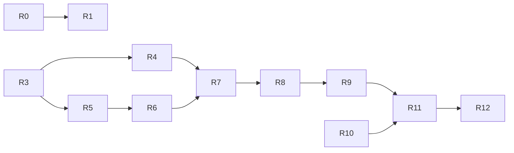

# Remaining development plan — 2026-09-03

## Goal and completion standard

目标用户是管理服务器与正式 Project 的管理员。最终交付路径是：登录 →
选择 `READY` Project 与 Claude/Codex → Start → 验证 Runtime 信任并 Connect →
input/output/resize → detach/reconnect → exact Stop，保留 Project 与 Git 修改。

Owner 最新要求重新评估剩余开发、制定目标、持续多智能体并行执行，并指定
复杂问题使用 `gpt-5.6-sol`，普通问题使用 `gpt-5.6-terra`。每阶段继续遵守
`feature branch → exact-head CI → merge → exact read-back`，同步 GitHub 和文档。

完成分为两个可验证层次，不能混淆：

- **Software completion**：所有计划中的实现已经实际接通；受控测试执行完整
  流程及失败/取消/撤销/重启/并发场景；没有用简化协议或默认成功值替代真实
  实现；适用的独立审查、完整 Linux CI 和 merge read-back 已通过。
- **Product qualification**：在明确授权的真实目标上证明 CLI、PTY、隔离、
  Runtime key custody、信任配置、真实浏览器、重启恢复和运营边界。未获得
  这些证据时，不能将软件测试升级为生产能力或把整个目标标为完成。

Mac 是当前开发平台。缺少真实 Linux 目标不阻止独立的软件实现、诊断或测试。
实际 host 激活、真实 key/Provider Secret 操作、架构决策和生产发布仍服从
[GOVERNANCE.md](GOVERNANCE.md) 的明确授权边界。

## Verified baseline and reachable behavior

本轮开始时工作区干净，`main = origin/main = HEAD = merge-base`：
`dfb5eb796f8745ee10cd2a9cefe0cdd15de057a9`。六个 exact-main workflow 均 SUCCESS。
仅历史 Draft PR #42 打开，不在本轮写入范围内。当前证据不以旧 snapshot 替代。

| 用户能力 | 已有实现与证据 | 剩余内容 |
| --- | --- | --- |
| Project 选择与状态 | Workspace 页面、正式 Project API、metadata controller 与 E2E | 保持既有功能；不得将 metadata ready 当作 terminal admitted |
| Start / exact Stop | Project-scoped HTTP、typed Runtime lifecycle、exact supervisor binding | 正式 interactive CLI profile、生产 Runtime factory 与 host qualification |
| Connect | ticket/authority 与 handler seam 存在；当前页面按钮 disabled，WS 无 handler 返回 1013 | 信任验证、分阶段准入、真正 Runtime stream 与 API relay |
| input/output/resize | supervisor、固定 Noise core 和 synthetic stream 测试已完成 | 完整 wire schemas、AWCE application crypto、PTY adapter、真实 browser controller |
| detach/reconnect | lease/recovery/core fencing 与 fresh-key 基础已完成 | socket/PTY 正向 cleanup、fresh admission、ring re-encryption 与 UI 恢复接线 |
| 输出安全 | 有协议/安全设计及 bounded core | 浏览器 VT/UTF-8 tokenizer、危险控制序列处理、真实交互验证 |
| Runtime/API restart | durable epoch/generation/cgroup metadata 基础 | 实际进程恢复、quarantine/cleanup、host reboot evidence |

入口事实：`apps/api/src/agentbox_api/main.py` 尚未提供真实 stream handler；
`WorkspacePage.tsx` 的连接/重连/断开按钮仍关闭；`waw_bootstrap.py` 构造 control
server，但没有 stream server。已有 core 类不等于可访问的终端功能。

## Confirmed issue and unresolved observations

- **P1 AUTH-CAPACITY-CANCEL**：已在纯内存 Event barrier 实验中复现：
  `max_concurrency=1`，取消第一个 login await 后线程仍在运行，第二个 worker
  提前开始，峰值达到 2。R0 已修复为按实际 worker completion 释放共享 login /
  reauthentication capacity，并通过确定性取消/失败回归和完整CI。
- **AUTH-MAC-LATENCY**：此前 Mac 全量 E2E 为 56 passed / 4 timeout；新 native
  crypto 两例通过，Linux PR #66 全量 60 passed。没有证据将这四次 timeout
  归因于上述取消缺陷。Argon2 不在登录写事务内，E2E 使用低成本参数。应先
  测量请求/线程池/SQLite lock/event-loop/浏览器阶段耗时，保留原断言。
- **AUTH-SESSION-CLOCK**：同步 authenticate 可能阻塞 event loop；事务时间
  可能在 SQLite 实际拿锁前固定。这些是独立待验证风险，未经复现不写成已
  确认缺陷，不与取消修复混合。

## Plan and dependencies

状态只使用：未开始、进行中、待验证、审查未通过、已完成。完成包括相应
测试、适用审查、CI、合并与回读；表中设计目标不代表已实现能力。

| Slice | 当前状态 | 具体交付 / ownership | 验收和依赖 |
| --- | --- | --- | --- |
| R0 plan + AUTH-CAPACITY-CANCEL | 已完成 | `auth.py` 与 executor tests；主智能体维护计划、安全文档与 GitHub | 已有 barrier 复现；取消等待/执行、共享 gate、成功/异常/提交失败、ContextVar；不得提前释放或遗留未消费异常 |
| R1 opaque AWCE codecs | 已完成 | Python `awce.py` / Web `awce.ts` 与边界测试 | 现有明确 44-byte header、精确长度、uint64/BigInt、高位与尾随拒绝、双语言固定向量；无 crypto/authentication 声明，不依赖未决 AAD |
| R2 login latency evidence | 已完成 | 有限诊断 harness / metadata-only evidence | 分离 HTTP、admission、Argon2、SQLite 与 browser 延迟；不打印 credential/body/header，不放宽断言；仅修实际复现问题 |
| R3 complete protocol clarification | 已完成 | 完整补充已独立审查；Owner 已明确委托软件决策，Coding Agent 已接受该完整合同 | 委托与接受记录随阶段CI/merge交付；不把接受合同视为实现完成 |
| R4 application crypto | 已完成 | `waw_crypto_profile.py`、Web profile、shared vectors/interop | R3；canonical context、confirmation n=0、AWCE n=1、完整 AAD/context mutation、fresh reconnect、destroy/cancel |
| R5 full wire schemas | 已完成 | Python/Web direction-specific codecs；复用 ABWS framing | R3；27 frame types、四条 leg、严格字段与 decimal strings、唯一合法 retry；可与 R4 并行 |
| R6 staged attachment authority | 已完成 | authority + admission coordinator + tests | R5；burn/reserve→prepared→commit→queue release→active；pending/writer caps、撤销/过期/cleanup，禁止提前 active |
| R7 Runtime encrypted stream | 已完成 | Runtime stream session/server 与有限 executor integration | PR #76 已经 19/19 exact-head CI、正常合并与精确回读；真实 host 证据仍属 R12 |
| R8 API ciphertext relay | 已完成 | API stream relay/raw transport/auth integration | PR #77 已经独立复审、19/19 exact-head CI、正常合并、精确回读与六组 post-main SUCCESS；API 无 channel key/plaintext |
| R9 browser trust + terminal | 待CI/合并 | trust consumer、受管Chromium/Native Messaging/trustd provider core、bounded terminal model、Workspace双语边界 | 121 trust、185 terminal、915 Web、64 E2E、provider/extension/bundle gates与独立复审通过；首个浏览器语言为中文时`zh-CN`，其余English；真实安装与controller全链路仍属R11/R12 |
| R10 fixed interactive process | 进行中 | 固定 runtime profile/bootstrap/bridge/attach；installer 模板 | 与 R4–R9 可独立推进已明确部分；须明确 AgentType launch records、vendor state roots、retention/telemetry、official login / Project Trust；正式 argv/env/隔离/legacy conflict、positive cleanup，禁止把 legacy tmux 改名冒充完成 |
| R11 software integration | 未开始 | 全链路故障注入、E2E、artifact 与操作文档 | R4–R10；真实软件组件组合、无持久 payload/key、audit/commit/queue/exit/revoke/cancel 矩阵、CI和独立审查 |
| R12 host + product acceptance | 未开始 | 授权目标的运行证据、恢复与上线记录 | R11 与 host/real-key 授权；systemd/socket/proc/cgroup/namespace/LSM/seccomp/CLI/login/reboot 与支持范围逐项验证 |

R0 已由 PR #67 合并：head `31a0bc9f38a5c2891a4b9d2bb403a09175579a98`，
19/19 checks SUCCESS；实际 merge `d9c26b9eb26664368c384805d1138a5349b92b60`。
R1 的 Python 44 / Web 38 cases 与双向互通通过，独立 sol 审查 PASS；PR #68
head `0dccb2a71ea38259f1e76e2b268961c213bc98e1`，19/19 SUCCESS，实际 merge
`3ebb3e938a03d067ea7df66b6746b9675637e65b`。
R2 两轮小样本未复现旧超时；独立审查发现异常日志、空测量通过和计时标签问题，
修复后 21 回归与 4/4 Chromium diagnostic 通过，独立 sol 复审 PASS；
默认完整本机 E2E 60 passed (37.2s)。PR #70 head
`eca03e47849b12449bb2ab4aec8dfdc001ef13dd`，19/19 SUCCESS，实际 merge
`f7ef3c936529b19838cd087dc9e232397f1e304d`；CI另执行21回归及60E2E全部通过。
R9.1 browser tokenizer core 修复独立审查两个P2及同根因ESC re-entry，113 tests
与133独立负例通过，复审PASS；PR #71 head
`a57764ae0e1f3fc962bc4d52e3610373ef4226ff` 经19/19 SUCCESS合并，实际 merge
`3f2e3a2de4b0482629f5f9a296d5db757f989876`。完整controller/trust/renderer未接通；
logical-line deadline duration和post-limit controller recovery仍需明确契约，
详见[tokenizer foundation](../WAW_BROWSER_TOKENIZER.md)。
R10.1 executable verifier 已通过独立 sol 审查，80 passed / 1 native Linux skip，
PR #69 head `9147cace5b554205dfecc20cf8bfb643d4c46761` 经19/19 SUCCESS合并，
实际 merge `9529da6d5c110b7a09d5972dfa0db5e012727451`；完整 CLI launch/retention profile 仍未冻结，详见
[assessment](../WAW_INTERACTIVE_PROFILE_ASSESSMENT.md)，不得把该基础视为执行接线完成。

R2 是独立测量工作；不把未知原因当作其它 slice 的通用阻断。R1 是纯 framing，
不能因为其编解码成功而跳过 R3/R4 的加密、身份和准入验证。

## Contract decisions that must be consolidated

原三项字节补充不足以完整冻结实际 wire，已扩充为
[完整协议补充提案](WAW_ENCRYPTED_STREAM_DECISION.md)，并通过独立 sol 审查。
下列冲突已在完整补充中解决；Owner 最新明确委托软件决策后，Coding Agent
已接受该合同用于实现。此前等待 Owner acceptance 的状态已被本次授权取代：

1. KEY_INIT/ATTEST 的扁平 `AdmissionTuple` 与后文 `HandshakeContext` 字段集合
   不一致（`mode` / `protocol_id`）；需逐帧冻结 exact keys 与 context 派生规则。
2. KEY_CONFIRM/ACK 缺少 ciphertext 字段名、hash wire encoding 和明确的
   `protocol_version`；确认密文应是固定 48 bytes 的 canonical encoding。
3. API 无 channel key，不能宣称解密验证 browser canary；必须明确 Runtime
   confirmation 与 browser 本地验证/ADMITTED gate，或批准额外回执及序号变化。
4. Runtime 不知道 API 重写前的 browser hop，internal ACK 不能凭空返回它；
   需明确 Runtime ACK 与 API bounded mapping 的职责及 schema。
5. API input quota/drop 的 ACK/重试表述与“丢弃任何 ciphertext 即关闭”冲突；
   必须统一并区分 API rejection 与 Runtime 已解密后的 rejection。
6. AWCE 49152-byte 协议最大值与 HELLO 的 input 16384/output 32768 有效限额
   分层不清；需要明确每层 enforce 的上限。
7. pin schema 的 dash/dot literal 与签名 fixture 不一致；root/pin revision
   的 uint64 范围与 JCS JSON Number 安全范围需同时冻结，不能擅自重签未知 key。

当前 `waw_stream_bridge.py` 和 `waw_noise_contract.py` 保留 synthetic contract
用途。它们的简化 ACK/GAP、client STATE/CLOSE、提前 ActiveAttachment 和 sequence
空间不得直接用于真实 wire。现有 Noise core 与 supervisor 可复用，不重写。

## Model and ownership policy

| 任务性质 | 模型 | 责任 |
| --- | --- | --- |
| 架构、crypto/admission、并发取消、恢复、安全边界与复杂根因 | `gpt-5.6-sol` | 制定/审查精确契约、处理复杂实现与确定性复现 |
| 已冻结的 codec、常规接口/UI实现、fixtures、日常验证 | `gpt-5.6-terra` | 按明确 ownership 实施与测试；发现新安全/状态歧义立即交回 sol |
| 独立安全/架构审查 | 独立 `gpt-5.6-sol` | 只读，不修改被审实现；PASS 是质量证据，不代替 Owner 授权 |
| 集成、计划、文档与阶段交付 | 主智能体 | 维护依赖/范围/证据，保护并发编辑，执行正常 PR/CI/merge/read-back |

遵守实际并发上限；槽位不足时顺序调度，不虚构已启用的 agent。不并行写同一
文件。简单任务不因模型升级而扩大范围；复杂问题不为了节省成本降低验证标准。

## Delivery and stop rules

每阶段先 live revalidate，按 ownership 实施，运行必要验证、独立审查，再更新
`CURRENT_STATE` / `NEXT_ACTION` / 本计划 / 相关契约并提交 GitHub。只合并所有
exact-head checks terminal SUCCESS 的 PR；实际 merge SHA 从 read-back 获取。
禁止 force push、history rewrite、admin bypass 或用未运行测试伪造完成。

整体目标仅在软件和适用产品验收均完成时结束；未知/缺少授权证据的项目继续
保持未开始或待验证。遇到真实外部条件时，先完成不依赖它的授权工作，再给出
明确证据、影响和恢复条件。不得以无限整理替代功能交付或重复扫描已验证部分。

## Current resumption point

R0/R1/R2/R9.1/R10.1 已完成适用实现、独立审查、CI、合并和回读。Owner 最新
明确要求继续并委托目标、计划与软件决策；Coding Agent 已接受独立审查通过的
完整 R3 协议补充。Python/Web R4 实现已通过独立审查、560 Python 回归、148 Web测试、
双角色互通和62 native/既有E2E，并由PR #73合并。R5完整wire及性能修复
以279 Python / 274 Web、独立复审和双语言互通通过，并由PR #74合并；R6 staged
authority与coordinator已复审通过，R7实际Runtime加密流正在实现。后续软件合同由 Coding Agent 决策、记录理由并审查，
不再等待重复的软件 Owner gate。真实 host、生产 key/Secret 与发布的具体范围
和真实证据仍保留；完整产品尚未完成。

R3/R4 已由 PR #73 合并：head `df943ecbf37b6c748dc1af73f4270017a3d9f6dc`，19/19
SUCCESS，实际 merge `e4a6ecd0bc28de8b3895453cf9160f9a8d4e0064`。R5 完整 schema/
trace/互通与性能修复已复审通过，Python279/Web274及组合496回归通过，待CI。
R6 四项准入/发布/清理审查问题已修复并复审通过，待独立交付；R7 Runtime
实际加密流实现已启动。R6 authority slot expiry 不替代 R7/R8 的30s stale、60s
grace、15min idle、8h absolute及10s Runtime health要求。

R5 已由 PR #74 交付：head `62d04adbfa775f3a14ab678c485093f15b1039ed`，19/19 SUCCESS；实际 merge `3b11ebf0b3442c111586fc08df9f6a5a4abb3db6`。R6 四项审查缺陷全部关闭，并由 PR #75 交付：head `679b2f71ec5917ead7695c3b20cb1118cb46cc76`，19/19 SUCCESS；实际 merge `a27621faca0e0d04b529b51993f98138496a75b5`。R7/R8 正并行开发实际网络与加密流接线。
