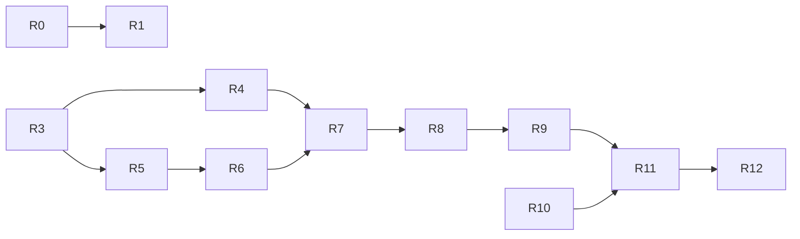

# Remaining development plan — 2026-09-03

## Goal and completion standard

目标用户是管理服务器与正式 Project 的管理员。最终交付路径是：登录 →
选择 `READY` Project 与 Claude/Codex → Start → 验证 Runtime 信任并 Connect →
input/output/resize → detach/reconnect → exact Stop，保留 Project 与 Git 修改。

Owner 最新要求重新评估剩余开发、制定目标、持续多智能体并行执行，并指定
复杂问题使用 `gpt-5.6-sol`，普通问题使用 `gpt-5.6-terra`。每阶段继续遵守
`feature branch → exact-head CI → merge → exact read-back`，同步 GitHub 和文档。

完成分为两个可验证层次，不能混淆：

- **Software completion**：所有计划中的实现已经实际接通；受控测试执行完整
  流程及失败/取消/撤销/重启/并发场景；没有用简化协议或默认成功值替代真实
  实现；适用的独立审查、完整 Linux CI 和 merge read-back 已通过。
- **Product qualification**：在明确授权的真实目标上证明 CLI、PTY、隔离、
  Runtime key custody、信任配置、真实浏览器、重启恢复和运营边界。未获得
  这些证据时，不能将软件测试升级为生产能力或把整个目标标为完成。

Mac 是当前开发平台。缺少真实 Linux 目标不阻止独立的软件实现、诊断或测试。
实际 host 激活、真实 key/Provider Secret 操作、架构决策和生产发布仍服从
[GOVERNANCE.md](GOVERNANCE.md) 的明确授权边界。

## 2026-09-05 execution rebaseline

当前执行目标是完成 R11 软件交付。详细、可验收的 work-unit 计划见
[WAW R11 execution plan](../WAW_R11_EXECUTION_PLAN.md)。它将 rc6 拆为 API
process ownership、Project binding persistence/first-use provisioning 与 browser
controller 三项；三项完成后才进入 rc7 failure matrix、rc8 artifact rehearsal 和
rc9 full bilingual UI。

Live evidence at this rebaseline: `main`/`origin/main` are
`341a69bf855f48f90cbecfb5c6872c3bf8c28360`; Draft PR #80 head
`e45a456eaaa1a43d5be61711dd6ce02962035c43` completed 20/20 checks. Current
uncommitted continuation is not covered by that CI and remains implementation
work until its own review and exact-head run complete.

The initial rc9 catalog/known-error foundation is commit `184781c...` on the
active Draft PR and completed 20/20 exact-head checks. It is a prerequisite for,
not completion of, the full route/state migration and bilingual visual E2E.

The local rc6-B checkpoint `708acd8...` now creates a first workspace only after
a typed Project binding and exact Runtime executable evidence. Its first CI head
`029378e...` failed 3 Backend Python jobs because Linux reused an inode after
the verifier released its Project descriptor. Repair `3ba85cb...` retains a
bounded descriptor per verified key; its `bbdd67c...` exact head completed 20/20
checks. Later native READY timing failure is fixed in `af4d43e...` and native CI
passed; format repair `9d078b4...` completed in `4222242...` 20/20 CI. Independent
review and browser page composition are still pending. Commit `9c12ab3...`
implements startup/restart binding replay and inventory finalization, with 346
targeted passes and two environment skips locally; final exact head `854cf87...`
completed 20/20 CI.
Controller safety commit `ea0ac84...` also completed independent Sol review and
20/20 CI; the real terminal surface and page composition remain pending.
See [R11 rc6 first use](../WAW_R11_RC6_FIRST_USE.md).

## Verified baseline and reachable behavior

最新 live preflight 已 fetch：local `main` 与 `origin/main` 均为 R10 merge
`341a69bf855f48f90cbecfb5c6872c3bf8c28360`；R11 branch 从该提交创建。
PR #79 final head `0d9e7c7...` 的 20/20 exact-head checks、正常 merge、精确
父提交回读、六组 post-main workflows 和 dynamic Dependency Graph 均成功。
历史 Draft PR #42 不在本轮范围。

| 用户能力 | 已有实现与证据 | 剩余内容 |
| --- | --- | --- |
| Project 选择与状态 | Workspace 页面、正式 Project API、metadata controller 与 E2E | 保持既有功能；不得将 metadata ready 当作 terminal admitted |
| Start / exact Stop | Project-scoped API、typed Runtime lifecycle，以及经 Linux exact-head CI 验证并合并的 fixed profile/descriptor/cgroup/native process chain | R11 controller；R12 real vendor/host qualification |
| Connect | R6 staged authority、R7 Runtime encrypted stream、R8 API ciphertext relay、R9 trust provider core | R11 browser/API controller composition；R12 real CRX/trustd/host evidence |
| input/output/resize | 完整 wire/application crypto、Runtime relay、bounded browser tokenizer/model 与 R10 PTY/WBR transport | R11 将真实软件组件接入用户流程并故障注入；R12真实 CLI 验证 |
| detach/reconnect | fresh admission、lease/recovery、Runtime stream 与 R10 attach/cleanup 软件 | R11 controller/UI 恢复接线；R12 reboot/host evidence |
| 输出安全 | 固定加密协议、API opaque relay、VT/UTF-8 tokenizer 和 bounded terminal model | R11 renderer/controller integration 与端到端 failure matrix |
| Runtime/API restart | durable epoch/generation、quarantine、cleanup 与 local process/cgroup implementation | R11组合回归；R12实际 systemd/socket/cgroup/reboot 验证 |

入口事实：Runtime encrypted server 与 API opaque relay 已由 R7/R8 交付，R9
交付 browser trust/terminal core，R10 fixed process candidate 本地完成；
`WorkspacePage.tsx` 尚未将连接/重连/断开接入完整 controller。因此现有 core
仍不等于用户可访问的真实终端，R11 才完成软件组合。

## Confirmed issue and unresolved observations

- **P1 AUTH-CAPACITY-CANCEL**：已在纯内存 Event barrier 实验中复现：
  `max_concurrency=1`，取消第一个 login await 后线程仍在运行，第二个 worker
  提前开始，峰值达到 2。R0 已修复为按实际 worker completion 释放共享 login /
  reauthentication capacity，并通过确定性取消/失败回归和完整CI。
- **AUTH-MAC-LATENCY**：此前 Mac 全量 E2E 为 56 passed / 4 timeout；新 native
  crypto 两例通过，Linux PR #66 全量 60 passed。没有证据将这四次 timeout
  归因于上述取消缺陷。Argon2 不在登录写事务内，E2E 使用低成本参数。应先
  测量请求/线程池/SQLite lock/event-loop/浏览器阶段耗时，保留原断言。
- **AUTH-SESSION-CLOCK**：同步 authenticate 可能阻塞 event loop；事务时间
  可能在 SQLite 实际拿锁前固定。这些是独立待验证风险，未经复现不写成已
  确认缺陷，不与取消修复混合。

## Plan and dependencies

状态只使用：未开始、进行中、待验证、审查未通过、已完成。完成包括相应
测试、适用审查、CI、合并与回读；表中设计目标不代表已实现能力。

| Slice | 当前状态 | 具体交付 / ownership | 验收和依赖 |
| --- | --- | --- | --- |
| R0 plan + AUTH-CAPACITY-CANCEL | 已完成 | `auth.py` 与 executor tests；主智能体维护计划、安全文档与 GitHub | 已有 barrier 复现；取消等待/执行、共享 gate、成功/异常/提交失败、ContextVar；不得提前释放或遗留未消费异常 |
| R1 opaque AWCE codecs | 已完成 | Python `awce.py` / Web `awce.ts` 与边界测试 | 现有明确 44-byte header、精确长度、uint64/BigInt、高位与尾随拒绝、双语言固定向量；无 crypto/authentication 声明，不依赖未决 AAD |
| R2 login latency evidence | 已完成 | 有限诊断 harness / metadata-only evidence | 分离 HTTP、admission、Argon2、SQLite 与 browser 延迟；不打印 credential/body/header，不放宽断言；仅修实际复现问题 |
| R3 complete protocol clarification | 已完成 | 完整补充已独立审查；Owner 已明确委托软件决策，Coding Agent 已接受该完整合同 | 委托与接受记录随阶段CI/merge交付；不把接受合同视为实现完成 |
| R4 application crypto | 已完成 | `waw_crypto_profile.py`、Web profile、shared vectors/interop | R3；canonical context、confirmation n=0、AWCE n=1、完整 AAD/context mutation、fresh reconnect、destroy/cancel |
| R5 full wire schemas | 已完成 | Python/Web direction-specific codecs；复用 ABWS framing | R3；27 frame types、四条 leg、严格字段与 decimal strings、唯一合法 retry；可与 R4 并行 |
| R6 staged attachment authority | 已完成 | authority + admission coordinator + tests | R5；burn/reserve→prepared→commit→queue release→active；pending/writer caps、撤销/过期/cleanup，禁止提前 active |
| R7 Runtime encrypted stream | 已完成 | Runtime stream session/server 与有限 executor integration | PR #76 已经 19/19 exact-head CI、正常合并与精确回读；真实 host 证据仍属 R12 |
| R8 API ciphertext relay | 已完成 | API stream relay/raw transport/auth integration | PR #77 已经独立复审、19/19 exact-head CI、正常合并、精确回读与六组 post-main SUCCESS；API 无 channel key/plaintext |
| R9 browser trust + terminal | 已完成 | trust consumer、受管Chromium/Native Messaging/trustd provider core、bounded terminal model、Workspace双语边界 | PR #78经121 trust、185 terminal、915 Web、64 E2E、独立复审和19/19 exact-head CI合并为`15a4632f...`；真实安装与controller全链路仍属R11/R12 |
| R10 fixed interactive process | 已完成 | 固定 runtime profile/bootstrap/bridge/attach；installer 模板 | PR #79 final head `0d9e7c7...` 经20/20 CI、正常合并`341a69bf...`、精确回读、六组post-main和Dependency Graph SUCCESS。真实 vendor/host 证据仍属 R12 |
| R11 software integration | 进行中 | 全链路 controller、故障注入、E2E、artifact、操作文档与全页面双语 | R4–R10；API public anchor、同一Runtime peer/pidfd与durable epoch 已在 rc6 组合；redraw `f37f92d9...` 与 `WAWRuntimeApplication` `628e9c00...` 均完成20/20 exact-head CI。`708acd8...` 的 first-use CI 暴露 inode reuse，`3ba85cb...`/`bbdd67c...` 已由20/20修复验证，`af4d43e...`/`9d078b4...` 的 native/format follow-up 也已由 `4222242...` 20/20验证。`9c12ab3...` replay 已由 `854cf87...` 20/20验证，`ea0ac84...` controller safety 也已独立审查及20/20验证；bounded DOM terminal、browser 页面接线、完整 rc6 独立审查和其余验收仍待完成。production main、real key/provider和host仍关闭。无持久payload/key，覆盖audit/commit/queue/exit/revoke/cancel矩阵、CI和独立审查 |
| R12 host + product acceptance | 未开始 | 授权目标的运行证据、恢复与上线记录 | R11 与 host/real-key 授权；systemd/socket/proc/cgroup/namespace/LSM/seccomp/CLI/login/reboot 与支持范围逐项验证 |

API singleton 的当前未提交基础已实现 `AttachmentAuthority.begin_shutdown()`：
pending ticket 会 burn，active/staged cleanup obligation 会跨 `invalidate_all()`
保留，只有 exact Runtime cleanup 与 durable Audit ACK 才能达到 clean。66 项
focused tests 与独立 Sol/xhigh 审查通过；下一项为 process lock 及单一
bind/control/relay lifespan owner。

R0 已由 PR #67 合并：head `31a0bc9f38a5c2891a4b9d2bb403a09175579a98`，
19/19 checks SUCCESS；实际 merge `d9c26b9eb26664368c384805d1138a5349b92b60`。
R1 的 Python 44 / Web 38 cases 与双向互通通过，独立 sol 审查 PASS；PR #68
head `0dccb2a71ea38259f1e76e2b268961c213bc98e1`，19/19 SUCCESS，实际 merge
`3ebb3e938a03d067ea7df66b6746b9675637e65b`。
R2 两轮小样本未复现旧超时；独立审查发现异常日志、空测量通过和计时标签问题，
修复后 21 回归与 4/4 Chromium diagnostic 通过，独立 sol 复审 PASS；
默认完整本机 E2E 60 passed (37.2s)。PR #70 head
`eca03e47849b12449bb2ab4aec8dfdc001ef13dd`，19/19 SUCCESS，实际 merge
`f7ef3c936529b19838cd087dc9e232397f1e304d`；CI另执行21回归及60E2E全部通过。
R9.1 browser tokenizer core 修复独立审查两个P2及同根因ESC re-entry，113 tests
与133独立负例通过，复审PASS；PR #71 head
`a57764ae0e1f3fc962bc4d52e3610373ef4226ff` 经19/19 SUCCESS合并，实际 merge
`3f2e3a2de4b0482629f5f9a296d5db757f989876`。完整controller/trust/renderer未接通；
logical-line deadline duration和post-limit controller recovery仍需明确契约，
详见[tokenizer foundation](../WAW_BROWSER_TOKENIZER.md)。
R10.1 executable verifier 已通过独立 sol 审查，80 passed / 1 native Linux skip，
PR #69 head `9147cace5b554205dfecc20cf8bfb643d4c46761` 经19/19 SUCCESS合并，
实际 merge `9529da6d5c110b7a09d5972dfa0db5e012727451`；完整 CLI launch/retention profile 仍未冻结，详见
[assessment](../WAW_INTERACTIVE_PROFILE_ASSESSMENT.md)，不得把该基础视为执行接线完成。

R10/rc5 exact-head 候选已完成：manifest v2、exact-six executable、exact-two profile、
七个 descriptor role、64-byte WBR、三个 native helper、pre-birth cgroup、真实
tmux attach READY 检查、Runtime composition、qualified vendor probe、local TTY
login seam、WAW/legacy conflict coordinator 与 inert policy assets 已实现。聚焦
PR #79 implementation head `6083e6e...` 的 Python 3.13 回归为
`3428 passed / 43 skipped`，Linux native normal/sanitizer 分别为 `66`/`24`
passed；Web `915`、extension `6`、Chromium E2E `64`、release validation `143`
及 `238` 个文档链接均通过。20/20 exact-head checks 全部成功，独立 Sol 复审
无 P0/P1/P2。最终文档 head 仍需 CI、正常合并和回读；不能升级为 host
qualification。

R2 是独立测量工作；不把未知原因当作其它 slice 的通用阻断。R1 是纯 framing，
不能因为其编解码成功而跳过 R3/R4 的加密、身份和准入验证。

## Contract decisions that must be consolidated

原三项字节补充不足以完整冻结实际 wire，已扩充为
[完整协议补充提案](WAW_ENCRYPTED_STREAM_DECISION.md)，并通过独立 sol 审查。
下列冲突已在完整补充中解决；Owner 最新明确委托软件决策后，Coding Agent
已接受该合同用于实现。此前等待 Owner acceptance 的状态已被本次授权取代：

1. KEY_INIT/ATTEST 的扁平 `AdmissionTuple` 与后文 `HandshakeContext` 字段集合
   不一致（`mode` / `protocol_id`）；需逐帧冻结 exact keys 与 context 派生规则。
2. KEY_CONFIRM/ACK 缺少 ciphertext 字段名、hash wire encoding 和明确的
   `protocol_version`；确认密文应是固定 48 bytes 的 canonical encoding。
3. API 无 channel key，不能宣称解密验证 browser canary；必须明确 Runtime
   confirmation 与 browser 本地验证/ADMITTED gate，或批准额外回执及序号变化。
4. Runtime 不知道 API 重写前的 browser hop，internal ACK 不能凭空返回它；
   需明确 Runtime ACK 与 API bounded mapping 的职责及 schema。
5. API input quota/drop 的 ACK/重试表述与“丢弃任何 ciphertext 即关闭”冲突；
   必须统一并区分 API rejection 与 Runtime 已解密后的 rejection。
6. AWCE 49152-byte 协议最大值与 HELLO 的 input 16384/output 32768 有效限额
   分层不清；需要明确每层 enforce 的上限。
7. pin schema 的 dash/dot literal 与签名 fixture 不一致；root/pin revision
   的 uint64 范围与 JCS JSON Number 安全范围需同时冻结，不能擅自重签未知 key。

当前 `waw_stream_bridge.py` 和 `waw_noise_contract.py` 保留 synthetic contract
用途。它们的简化 ACK/GAP、client STATE/CLOSE、提前 ActiveAttachment 和 sequence
空间不得直接用于真实 wire。现有 Noise core 与 supervisor 可复用，不重写。

## Model and ownership policy

| 任务性质 | 模型 | 责任 |
| --- | --- | --- |
| 架构、crypto/admission、并发取消、恢复、安全边界与复杂根因 | `gpt-5.6-sol` | 制定/审查精确契约、处理复杂实现与确定性复现 |
| 已冻结的 codec、常规接口/UI实现、fixtures、日常验证 | `gpt-5.6-terra` | 按明确 ownership 实施与测试；发现新安全/状态歧义立即交回 sol |
| 独立安全/架构审查 | 独立 `gpt-5.6-sol` | 只读，不修改被审实现；PASS 是质量证据，不代替 Owner 授权 |
| 集成、计划、文档与阶段交付 | 主智能体 | 维护依赖/范围/证据，保护并发编辑，执行正常 PR/CI/merge/read-back |

遵守实际并发上限；槽位不足时顺序调度，不虚构已启用的 agent。不并行写同一
文件。简单任务不因模型升级而扩大范围；复杂问题不为了节省成本降低验证标准。

## Delivery and stop rules

每阶段先 live revalidate，按 ownership 实施，运行必要验证、独立审查，再更新
`CURRENT_STATE` / `NEXT_ACTION` / 本计划 / 相关契约并提交 GitHub。只合并所有
exact-head checks terminal SUCCESS 的 PR；实际 merge SHA 从 read-back 获取。
禁止 force push、history rewrite、admin bypass 或用未运行测试伪造完成。

整体目标仅在软件和适用产品验收均完成时结束；未知/缺少授权证据的项目继续
保持未开始或待验证。遇到真实外部条件时，先完成不依赖它的授权工作，再给出
明确证据、影响和恢复条件。不得以无限整理替代功能交付或重复扫描已验证部分。

## Current resumption point

R0–R9 已完成适用实现、独立审查、exact-head CI、正常合并和精确回读。
R10/rc5 已由 PR #79 完成 exact-head CI、正常合并、精确回读及 post-main。
现在执行 R11/rc6–rc9：组合 browser/API/Runtime controller，覆盖
failure/cancel/revoke/restart/cleanup 矩阵，完成 artifact/operation rehearsal，
并把全站用户界面迁移为按浏览器首选语言选择的 `zh-CN`/English。R12 继续保留
真实 CRX/trustd/vendor CLI/PTY/isolation/reboot 与生产支持边界的授权目标证据。
